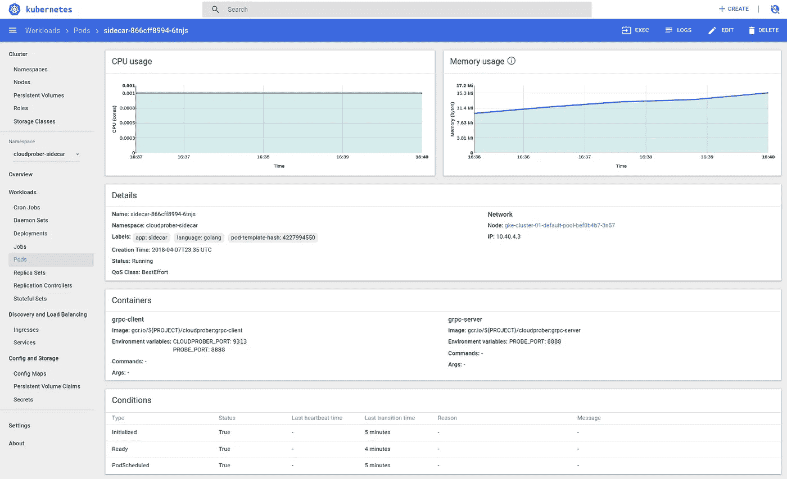
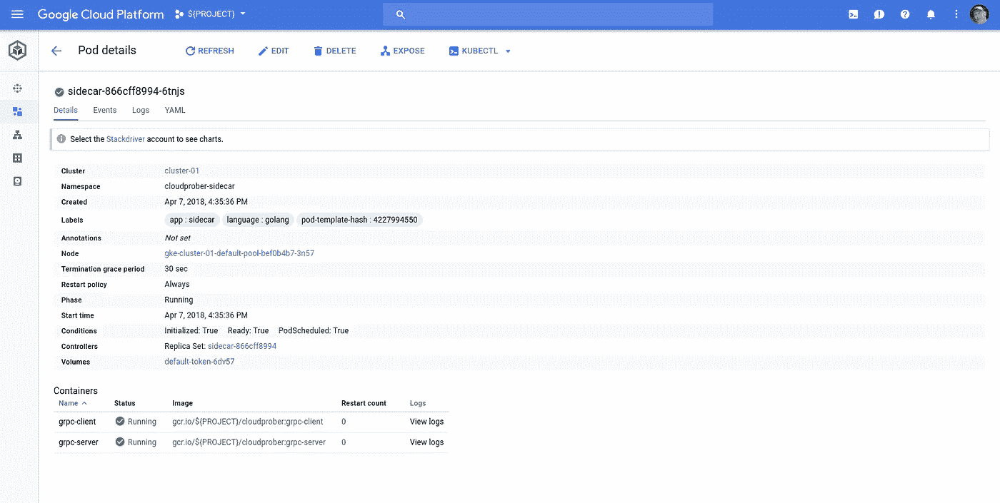
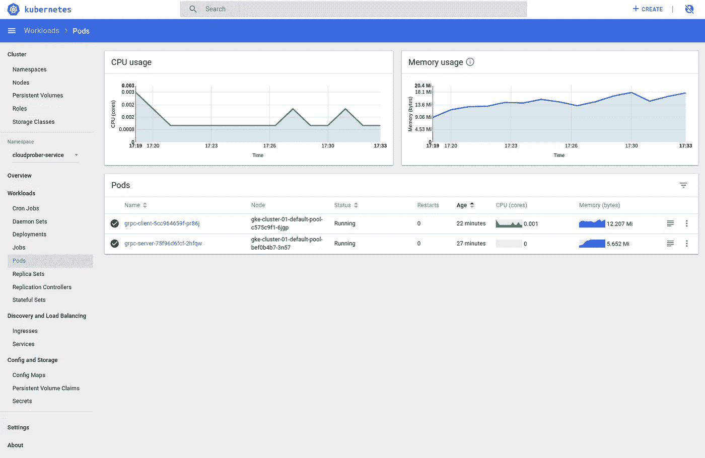
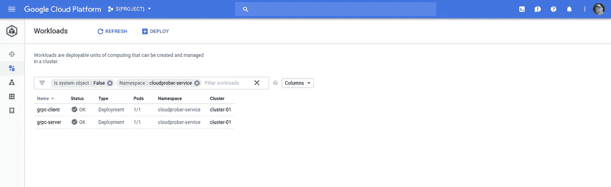
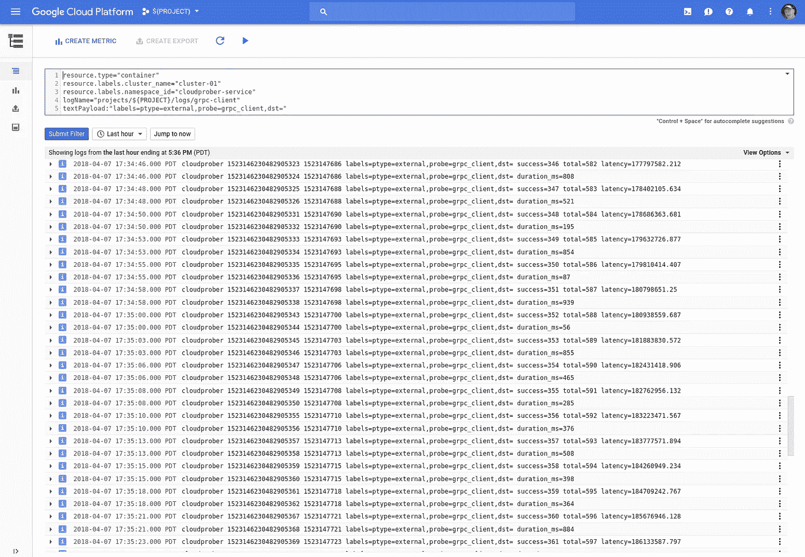

# 云探测器:gRPC 探测器和 Kubernetes

> 原文：<https://medium.com/google-cloud/cloudprober-grpc-probes-kubernetes-b8c2708cb3ab?source=collection_archive---------0----------------------->

我为[cloud proper](https://cloudprober.org/)编写了一个简单的基于 gRPC 的扩展。Cloudprober 创建了一个探针“代理”,它通过 [gRPC](https://grpc.io) 与探针进行通信。

将 Cloudprober 部署到 Kubernetes 的一个挑战是，Cloudprober 会产生探测进程，并使用 stdin/stdout 与它们通信。在容器化 Cloudprober 时，这种紧密耦合带来了挑战。最简单的解决方案是将 Cloudprober 与一个探测器封装在一起，但这可能会受到限制。

在错误地尝试使用管道将容器化的 cloud probe 与容器化的 probe 连接起来之后，我意识到一个好的解决方案是使用 gRPC 并利用 cloud probe 已经定义的 protobufs。

## 设置

请跟随云探测器[入门](https://cloudprober.org/getting-started/)。在本文的后面，您可以将解决方案部署到 Kubernetes。我假设您能够部署自己的集群。

## 密码

让我们从 probeserver.proto 开始:

Cloudprober 的 [serverutils](https://github.com/google/cloudprober/blob/master/probes/external/serverutils/serverutils.go) 定义了一个`Serve`函数，它接受`ProbeRequest`并返回`ProbeReplies`。这是 Cloudprober 与其产生的探针(本地)进行交互的机制。我们将修改该签名，以反映 gRPC 服务器接收`ProbeRequest`消息并返回`ProbeReply`消息。

> **NB** 这个`proto`导入了 Cloudprober 的`serverutils`定义的`proto`。您将需要在本地拥有 Cloudprober 源代码(或者至少是`server.proto`)，并且应该可以在下面定义的`proto_path`上访问它。此外，保留双目录的`probeserver/probeserver/probeserver.proto` gRPC 在这方面有点“挑战性”。

要生成 Golang:

```
protoc \
--proto_path=${GOPATH}/src \
-I=probeserver/ \
probeserver/probeserver.proto \
--go_out=plugins=grpc:probeserver
```

为了保持一致性，我建议您也创建`probeserver/client`和`probeserver/server`目录。

客户`main.go`来了:

> 用你的 GitHub 帐号 ID 替换`{YOUR_GITHUB_ACCOUNT}`。

我在这里包含了许多`log.Print`语句。请随意清除这些。这段代码摘自 gRPC 的“Hello World”示例。如果有更好的实现方法，请告诉我。

这段代码表示一个 Cloudprober 探针的通用代理，并使用 gRPC 与探针通信。它使用 Protobuf 生成的代码与服务器通信。`PROBE_HOST`和`PROBE_PORT`默认为`localhost`和`50051`。当我们将应用程序容器化并在 Kubernetes 上运行时，我们将使用这些。

代码获取 Cloudprober 提供的`ProbeRequest`，并将其转发给远程 gRPC 服务器(也称为`ProbeRequest`)。它从 gRPC 服务器获取`ProbeReply`，从中创建一个新的`ProbeReply`，并将新的`ProbeReply`传递回 Cloudprober。

服务器`main.go`在这里:

> 用你的 GitHub 帐号 ID 替换`*{YOUR_GITHUB_ACCOUNT}*`。

服务器代表一个名为`probe`的探测器的具体实现。它使用 Protobuf 生成的代码与服务器通信。`PROBE_PORT`默认为`50051`。当我们将代码部署到 Kubernetes 时，我们将使用它。

就好像我们在为 Cloudprober 开发一个常规的(服务器)探测器一样，服务器实现了一个`probe`。该探头随机休眠一段时间，然后返回该延迟作为探头的测量值`duration_ms`。

与为 Cloudprober 开发常规探针不同，我们不使用`serverutils.Serve`调用`probe`，而是使用 gRPC 服务`Probe`的`Serve`方法。您可能还记得，`Serve`接受一个`ProbeRequest`调用我们的探测器(`probe`)，并将结果作为`ProbeReply`返回。

好的。

## 本地测试

要运行客户端，我们需要一个 cloudprober.local.cfg:

将该文件放在`probeserver/client`目录中——假设您已经按照其网站上的说明安装并构建了 Cloudprober 您可以运行客户端:

```
cloudprober --config_file=./cloudprober.local.cfg --logtostderr
```

要从另一个终端会话运行探测器(服务器)，请切换到`probeserver/server`目录并运行:

```
go run main.go
```

为了测试`PROBE_PORT`，给两个命令加上相同设置的前缀**,例如**

```
PROBE_PORT=9999 go run main.go
```

您将看到许多行输出，但是对于客户端来说，关键行的形式如下:

```
cloudprober probe=grpc_probe,dst= success=1 total=31 latency=...
cloudprober probe=grpc_probe,dst= duration_ms=541
```

这些反映了在`cloudprober.local.cfg`文件中提供的探测器名称`grpc_probe`，请求成功(`success`，远程探测器的随机休眠(在本例中)为 541 毫秒。你们的价值观会不一样。

对于服务器，您将看到匹配的输出:

```
[Serve] request=request_id:31 time_limit:2500 ; reply=<nil>
[Serve] Probe replies: duration_ms 541
[Serve] request=request_id:31 time_limit:2500 ; reply=request_id:31 payload:"duration_ms 541"
```

当`Cloudprober`运行时，它在`9313`上暴露了一个普罗米修斯端点。你可以通过卷曲或浏览`localhost:9313/metrics`来观察。在其他措施中(！)，您还应该看到“持续时间 _ 毫秒”指标:

```
#TYPE success counter
success{ptype="external",probe="grpc_probe",dst=""} 31 1523142921115
#TYPE total counter
total{ptype="external",probe="grpc_probe",dst=""} 32 1523142921115
#TYPE latency counter
latency{ptype="external",probe="grpc_probe",dst=""} 2880611.175 1523142921115
#TYPE duration_ms counter
duration_ms{ptype="external",probe="grpc_probe",dst=""} 541 1523142921115
```

## 用集装箱装

为了部署到 Kubernetes，我们需要用 gRPC 代理和一个探测器来封装 Cloudprober。对于后者，我们将使用上面的测试探针。

创建最佳 Golang 容器有多种方法。我喜欢 Nick 的[方法](https://blog.codeship.com/building-minimal-docker-containers-for-go-applications/)，构建静态二进制和`FROM scratch`。我也一直喜欢和使用[哑初始化](https://github.com/Yelp/dumb-init)。不要忘了如果你也沿着这条路去抓你机器的`ca-certificates.crt`。

这是客户的档案:

> **NB**docker file 引用了不同的`cloudprober.docker.cfg`来补偿二进制的使用和路径的变化。这是文件:

我假设你已经创建了名为`gcr.io/${PROJECT}/cloudprober:grpc-client`和`gcr.io/${PROJECT}/cloudprober:grpc-server`的容器。

很抱歉把“_”和“-”换成了您的名字，但是对于 Kubernetes 命名，我们更喜欢用“-”来表示容器。

## 容器测试

> 测量两次，切割一次…

现在让我们重新测试一下，客户机和服务器都是容器化的。为了确保安全，让我们使用不同的端口:

```
PROBE_PORT=7777
```

对于客户:

```
docker run \
--interactive \
--rm \
--net=host \
--env=PROBE_PORT=${PROBE_PORT} \
gcr.io/${PROJECT}/cloudprober:grpc-client
```

对于服务器:

```
docker run \ 
--interactive \
--tty \ 
--rm \
--publish=${PROBE_PORT}:${PROBE_PORT} \
--env=PROBE_PORT=${PROBE_PORT} \
gcr.io/${PROJECT}/cloudprober:grpc-server
```

如果一切正常，您应该会看到与之前类似的结果。应该能行。因为客户端`--net=host`您应该能够像以前一样为客户端卷曲 Prometheus 端点。

## [容器]注册表

我假设你的容器叫做`cloudprober:grpc_client`和`cloudprober:grpc_server`。如果您使用的是 Kubernetes 引擎，我建议您将这些推送到与您的集群在同一个项目中的 T21 容器寄存器。无论如何，将它们推送到您的群集可以访问它们的代表处。

## 库伯内特，库伯内特，库伯内特

该探测器可以作为侧车(与 Cloudprober 一起)部署，也可以作为服务独立运行。

让我们双管齐下:

*边车*

两个集装箱都在一个箱子里。为了简单起见，我们也将连接保留为默认的`PROBE_PORT`。对于笑声，你可以想出如何在边车中使用不同的`PROBE_PORT`。

我们将需要一个 deployment.yaml，并且——我将避免我习惯性的懒惰——我们将部署到它自己的名称空间`sidecar`。

```
kubectl create namespace cloudprober-sidecar
```

这里有一个您需要替换的部署文件`${PROJECT}:`

然后:

```
kubectl apply --filename=deployment.sidecar.yaml
```

你应该有一个`deployment`，和一个`pod`，有两个容器`grpc-client`和`grpc-server`。这是 Kubernetes dashie:



Kubernetes 仪表板

和云控制台:



云控制台

并且，您可以检查日志:

```
SIDECAR_POD=$(\
  kubectl get pods \
  --namespace=cloudprober-sidecar \
  --output=jsonpath="{.items[0].metadata.name}")kubectl logs pods/${SIDECAR_POD} grpc-client \
--namespace=cloudprober-sidecarkubectl logs pods/${SIDECAR_POD} grpc-server \
--namespace=cloudprober-sidecar
```

您还可以查看普罗米修斯指标端点:

```
NODE_HOST=$(\
  kubectl get nodes \
  --output=jsonpath="{.items[0].metadata.name}")SIDECAR_PORT=$(\
  kubectl get services/sidecar \
  --namespace=cloudprober-sidecar \
  --output=jsonpath="{.spec.ports[0].nodePort}")gcloud compute ssh ${NODE_HOST} \
--project=${PROJECT} \
--ssh-flag="-L ${SIDECAR_PORT}:localhost:${SIDECAR_PORT}"
```

> 你可能注意到了，事实上，我在边车里使用了不同的`PROBE_PORT`;-)

您可以在`localhost:${SIDECAR_PORT}/metrics`上找到指标端点。

*服务*

```
kubectl create namespace cloudprober-service
```

这里有一个部署文件，你需要替换`${PROJECT}:`

部署使用:

```
kubectl apply --filename=deployment.service.yaml
```

这个比较复杂。分别展开`grpc-client`和`grpc-server`。每个都有相关联的服务。`grpc-client`通过 Kubernetes DNS 名称`grpc-server.cloudprober-service.svc.default.cluster.local`访问`grpc-server`。我们再次将 gRPC 绑定到端口`8888`，而不是它的默认端口。

这是 Kubernetes dashie:



Kubernetes 仪表板



云控制台

这次让我们使用云日志记录:



谷歌云控制台:日志记录

此外，您将看到一个技巧，即使用云控制台起草一个过滤器，然后可以在命令行中使用:

```
FILTER="resource.type=\"container\" "\
"resource.labels.cluster_name=\"${CLUSTER}\" "\
"resource.labels.namespace_id=\"cloudprober-service\" "\
"logName=\"projects/${PROJECT}/logs/grpc-client\" "\
"textPayload:\"labels=ptype=external,probe=grpc_client,dst=\""gcloud logging read "${FILTER}" \
--project=$PROJECT \
--format=json \
| jq .[].textPayload
```

使用上面的`NODE_HOST`和`SIDECAR_PORT`，您可以使用以下命令添加`SERVICE_PORT`:

```
SERVICE_PORT=$(\
  kubectl get services/grpc-client \
  --namespace=cloudprober-service \
  --output=jsonpath="{.spec.ports[0].nodePort}")gcloud compute ssh ${NODE_HOST} \
--project=${PROJECT} \
--ssh-flag="-L ${SIDECAR_PORT}:localhost:${SIDECAR_PORT}" \
--ssh-flag="-L ${SERVICE_PORT}:localhost:${SERVICE_PORT}"
```

并通过`localhost:${SERVICE_PORT}`访问该服务的度量端点。

## 结论

Cloudprober 很整洁。事实上——虽然我希望它有用——我不清楚这些对其他人是否有用。如果有用的话，我认为正确的下一步应该是将代理代码放入 Cloudprober 本身，这样另一个`external_probe` `mode`可能就是`PROXY`，并且包含一些类似于这里概述的 gRPC 客户端代码。

反馈和建议**永远**欢迎。

仅此而已！