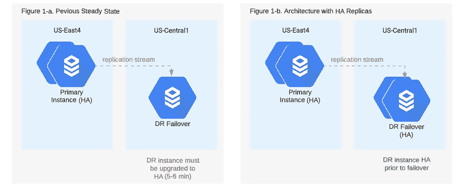
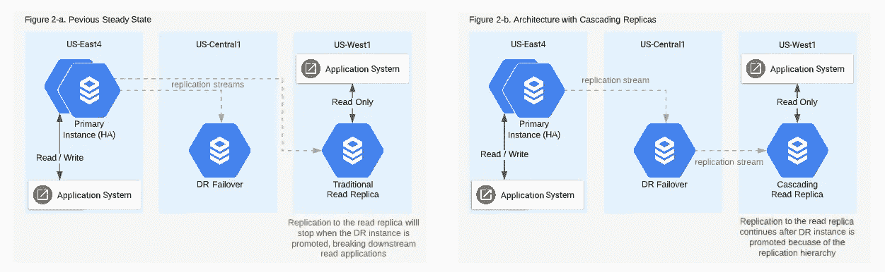
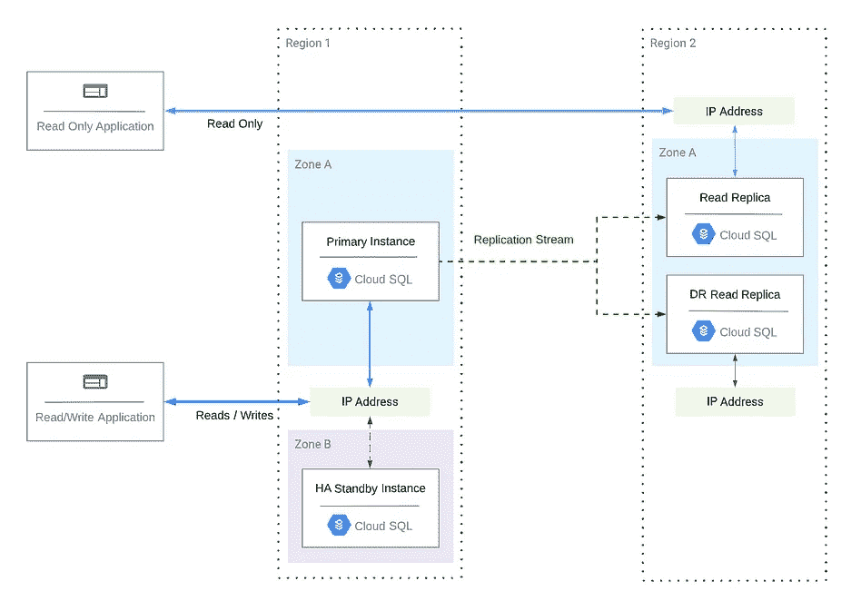
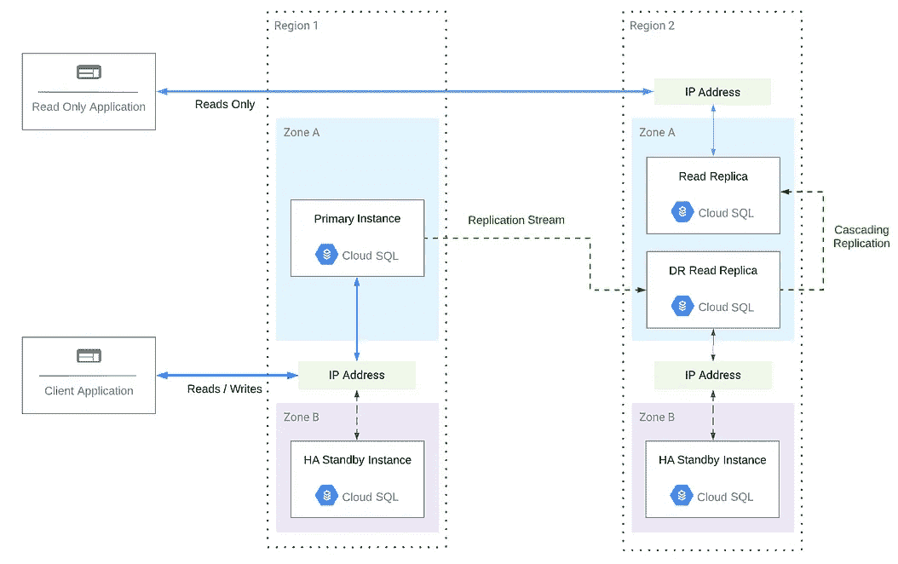
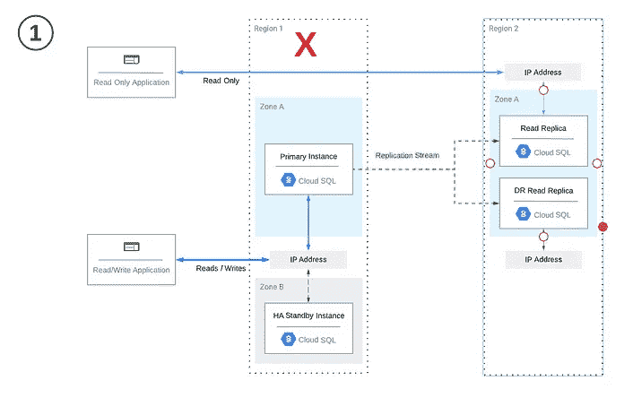
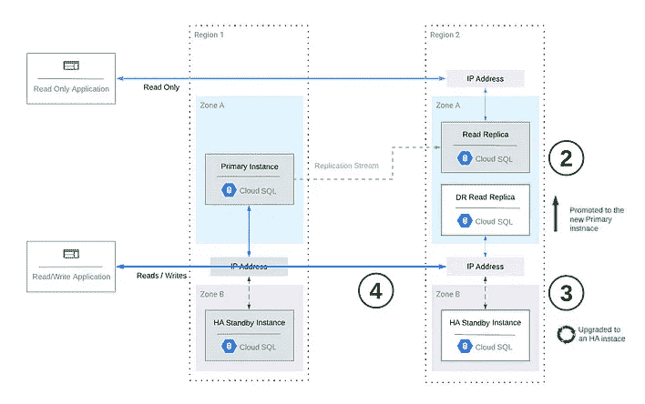
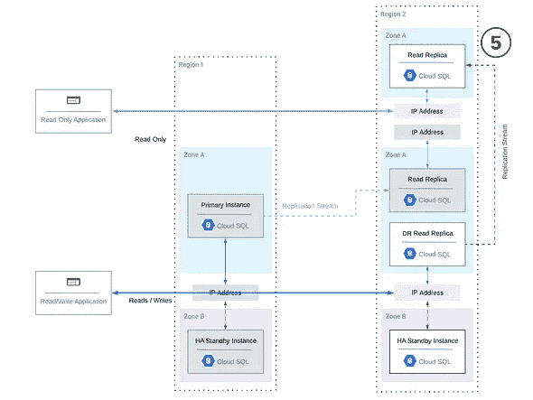
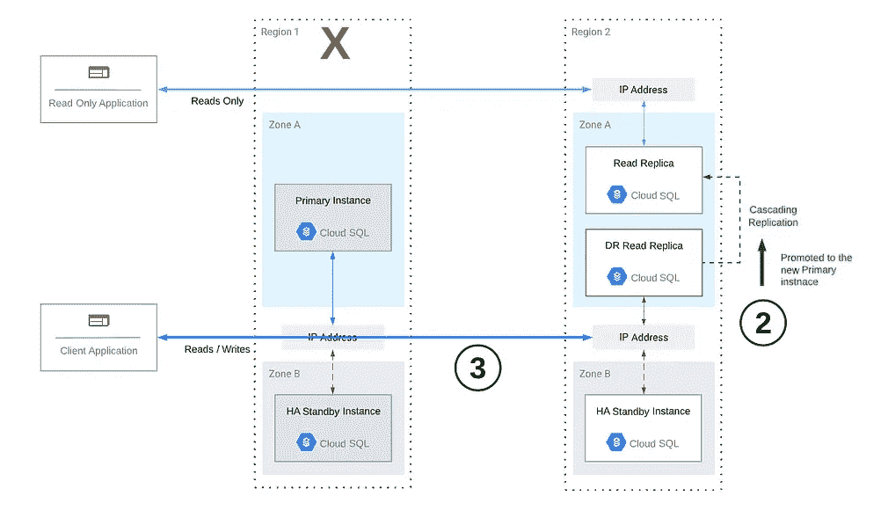

# CloudSQL:跨区域 HA 变得更加容易……而且速度更快了！

> 原文：<https://medium.com/google-cloud/cloudsql-cross-region-ha-just-got-easier-and-whole-lot-faster-4f94c7dcc71d?source=collection_archive---------0----------------------->

# **TL；博士**

**本文作为我 2020 年 4 月** [**帖子**](/google-cloud/cloud-sql-recovering-from-regional-failure-in-10-minutes-or-less-mysql-fc055540a8f0) **的更新。它描述了如何整合两种新的云 SQL 功能，HA 副本和级联复制，以更好地构建跨区域高可用性。我还提供了一个** [**更新的自动化脚本**](https://github.com/wapfel20/cloudsql_cross-region_failover_2022) **，以便于在事件期间的故障转移过程。我的测试表明，这些更新将使您能够比我以前的方法更快地从 5X 的区域性事件中恢复，换句话说，在 2 分钟或更短的时间内！试试看！**

# **简介**

在 2020 年 4 月，我写了一篇[文章](/google-cloud/cloud-sql-recovering-from-regional-failure-in-10-minutes-or-less-mysql-fc055540a8f0)解释如何为跨区域高可用性设计云 SQL 实例，以及如何以自动化和可控的方式编排跨区域故障转移。我最初的主张是，有了正确的云 SQL 架构和自动化，您可以在启动切换程序的 10 分钟内，从不同 GCP 地区的区域性中断中完全恢复。

然而，谷歌最近悄悄地推出了两个强大的云 SQL 新特性，这使得我文章中的说法无效...这些新功能进一步简化了跨区域故障转移过程，我的测试表明，它们已经将故障转移时间从 10 分钟减少到**仅仅** **2 分钟或更少！**

*注意:与我之前的蓝图相比，本文主要关注新特性和更新的跨区域架构。请阅读我以前的文章，以了解云 SQL 的原生高可用性的限制以及为什么跨区域 HA 很重要，并获得评估何时实际启动跨区域故障转移的框架。*

# 快速重温云 SQL 的原生高可用性

在我的上一篇文章中，我提供了 Cloud SQL 的高可用性特性和架构的详细概述。概括一下:

*   **是的—** 云 SQL 确实具有原生的高可用性特性。云 SQL 提供了在创建时部署高可用性实例的选项。Google 将管理该实例的复制和故障转移，无需您进行任何交互，也不会影响您的应用程序。相当甜蜜！你可以在谷歌的文档[中看到这种故障转移是如何工作的。](https://cloud.google.com/sql/docs/mysql/high-availability#failover-overview)
*   **但是—** 高可用性架构是区域性的，而不是区域性的。这意味着，如果整个区域受到中断的影响，那么数据库的两个实例都会随之中断。

因此，对于任务关键型云 SQL 工作负载，我建议您设计跨 GCP 地区的故障能力。区域性停机并不经常发生，但一旦发生，您将在几分钟内恢复运行，而您的竞争对手却无所事事。

# 黑仔的新功能改进了跨区域故障切换

2022 年夏天，Cloud SQL 悄悄推出了 2 个非常重要的特性，用于提高 MySQL 和 PostgresSQL 工作负载的高可用性: **HA 副本&级联复制**。

**黑仔功能#1 —高可用性副本**

此功能允许您将云 SQL 读取副本配置为高可用性实例。与主 h a 实例一样，Google 将管理实例的分区复制和故障转移，而无需更改其 IP。

*   **为什么如此重要:**在灾难恢复故障转移到另一个区域后，新的主实例(即提升的副本)需要启用高可用性，以匹配原始集群拓扑。**在我最初的文章中，这个过程占用了 10 分钟故障转移时间中的 5-6 分钟！**通过在故障切换之前为故障切换副本配置高可用性，您可以从故障切换过程中消除这一过程和停机时间。
*   **如何使用该功能:**您可以在创建期间或之后，在云控制台中对读取副本启用此设置，方式与您对主实例的方式相同。

传统副本与高可用性副本的比较

**黑仔功能 2 —级联复制**

此功能允许您向任何现有复制副本添加读取复制副本，实质上是让一个读取复制副本充当另一个读取复制副本的复制源。换句话说，它允许副本以菊花链形式连接在一起，以用于复制目的。

*   **为什么如此重要:**在此功能之前，所有读取复制副本都依赖于主实例进行复制。因此，在执行区域故障切换(孤立原始主实例)后，需要重新创建跨区域复制副本之外的任何其他读取复制副本，并且访问这些复制副本的任何应用程序都需要使用新的连接字符串进行更新。现在，您可以将下游复制副本配置为“级联”跨区域读取复制副本，以便在跨区域故障切换后复制保持不变。
*   **如何使用该功能:**您可以创建级联副本，方法是在云控制台中导航到您的跨区域灾难恢复读取副本，在左侧菜单中选择“读取副本”，然后选择“创建读取副本”

使用传统副本与级联副本比较跨区域故障切换对下游副本的影响

# 将这些新功能整合到现有架构中

当我写第一篇文章时，我使用了一个通用的云 SQL 架构，包含以下组件:

*   用于读/写的支持高可用性的云 SQL 主实例
*   下游只读应用程序的独立区域中的读取副本*(注意:此副本可以在所示的灾难恢复区域中，也可以在独立区域中，但由于级联复制的限制，它不能驻留在原始主区域中。)*
*   用于灾难恢复的跨区域读取副本

方便的是，新的云 SQL 特性可以在不对架构进行任何重大更改的情况下集成。下面我们一起来看看这两种架构——注意细微的差别。

面向云 SQL 的传统跨区域灾难恢复体系结构(左)与采用高可用性和级联副本的新灾难恢复体系结构(右)

为了实现右侧的更新架构，我简单地做了以下工作:

1.  我将现有的灾难恢复读取副本更新为高可用性实例(使用 HA 读取副本功能)。
2.  我将只读应用程序的读取复制副本重新创建为灾难恢复读取复制副本的级联复制副本，请注意与旧体系结构相比，新体系结构中复制流程的变化。

# 新功能正在发挥作用

您可能想知道这个过程实际上是什么样子，以及这些新功能如何加快恢复速度—让我们通过一个区域性故障切换场景来揭示答案！

作为基线，让我们先熟悉一下在高可用性和级联副本之前跨区域故障切换过程是如何工作的:

1.  区域 1 受到云 SQL 中断的影响，该中断使主实例离线。
2.  在故障切换期间，灾难恢复复制副本被提升为主副本，这将中断从原始主实例的复制—**(1–2 分钟)。**
3.  然后，灾难恢复实例配置为高可用性，这需要重新启动—**(5–6 分钟)**。
4.  完成后，读/写应用程序会更新以连接到灾难恢复实例，从而完成我们的转换。
5.  由于原始主实例不再是新写入的源，因此必须为我们的只读应用程序创建一个连接到灾难恢复实例的新读取复制副本—**(3–5 分钟)。**完成后，只读应用程序将被更新以查询新副本。

**总恢复时间:9–13 分钟**

现在我们有了一个基准，让我们看看如何将高可用性和级联副本整合到我们的体系结构中，从而大大简化我们的切换并缩短我们的恢复时间。下面是与上面相同的场景，但是使用了我们更新的架构:

1.  区域 1 受到云 SQL 中断的影响，该中断使主实例离线。
2.  在故障切换期间，灾难恢复复制副本被提升为主副本，这将中断从原始主实例的复制—**(1–2 分钟)**。
3.  由于灾难恢复实例已经通过 HA 复制副本功能进行了高可用性配置，因此不再需要升级和重新启动它。因此，读/写应用程序可以在升级后立即连接到灾难恢复实例。

最后，由于我们的只读应用程序的读取复制副本已经配置为灾难恢复实例的级联复制副本，它已经将该实例用作复制源。因此，复制流程不会因灾难恢复实例升级为主实例而中断，它将在故障切换后继续将未来的写入复制到新的主实例，而无需干预。

**总恢复时间:1–2 分钟**

# 不要忘记自动化！

除了整合新的云 SQL 特性之外，您还必须具备一定的自动化能力，以便有效地促进转换过程，从而实现 2 分钟或更短时间的恢复基准。停机是压力很大的情况。自动化不仅有助于加快故障转移过程，还有助于防止代价高昂的错误和失误。

至少，这种自动化应该处理 DR 实例的升级，提供其连接详细信息，并在主区域中重新创建一个副本，以备您想要移回时使用。然而，您的自动化还可以结合 RTO 和 RPO 策略来自动触发故障切换，然后利用您的应用程序管道来自动更新连接字符串——这将是非常美妙的！

> 幸运的是，我已经[编写了一个自动化脚本](https://github.com/wapfel20/cloudsql_cross-region_failover_2022)，您可以以此为起点！我还包含了第二个脚本，帮助您在准备好之后回切到主区域。我强烈建议您经常测试这些脚本，并在测试环境中运行实践场景，以改进您的执行和恢复时间。

# 结论

Cloud SQL 最近为 MySQL 和 Postgres 推出了两个令人兴奋的新功能，使跨区域故障转移变得更快、更容易！通过将这些功能(高可用性副本和级联副本)整合到您的云 SQL 架构中，并增加一点自动化，您现在可以将区域灾难中的故障切换时间减少到 2 分钟或更少。

我强烈建议您针对高优先级云 SQL 工作负载重新审视您的架构和故障转移计划，以纳入这两项新功能和我的[更新自动化脚本](https://github.com/wapfel20/cloudsql_cross-region_failover_2022)，这样您就可以确保在客户需要您的时候，而您的竞争对手却无所作为。