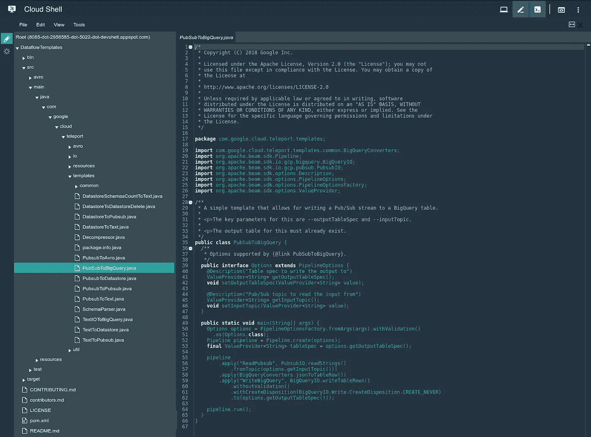
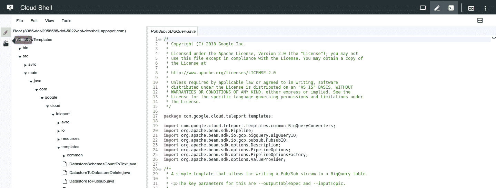
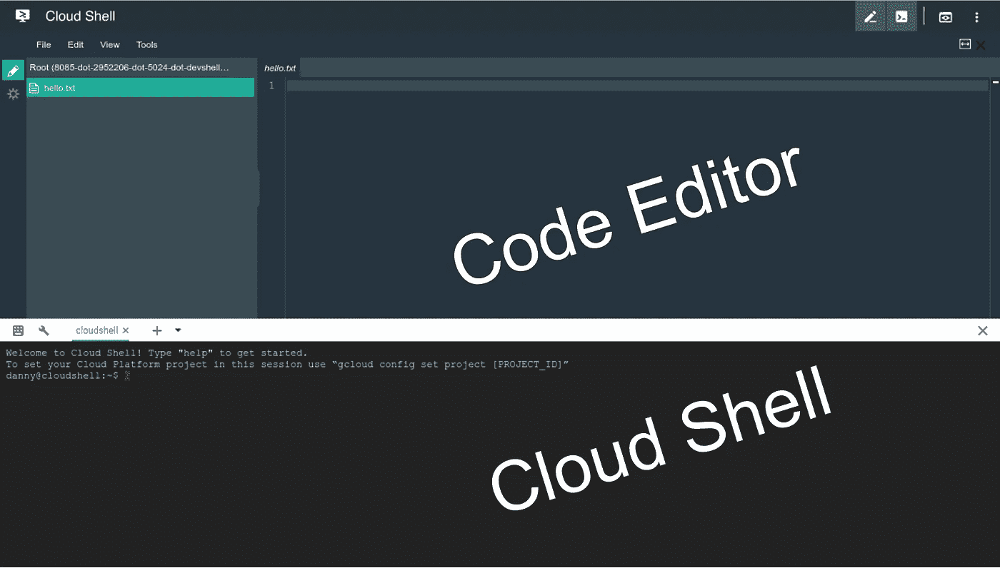
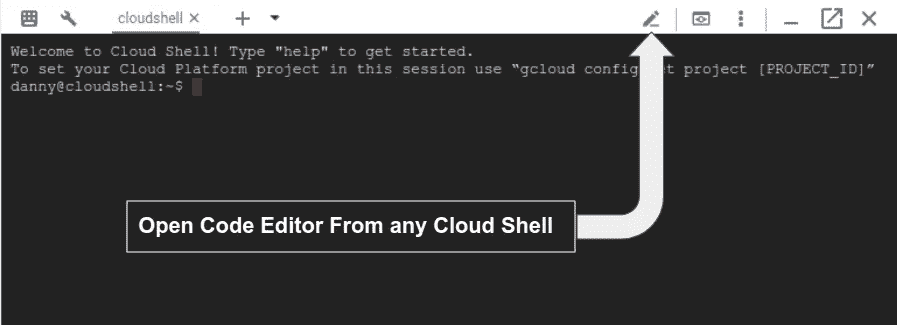

# 在 Web 浏览器中编写 Apache Beam 代码，并在云数据流中运行它

> 原文：<https://medium.com/google-cloud/coding-apache-beam-in-your-web-browser-and-running-it-in-cloud-dataflow-c41c275d42c8?source=collection_archive---------2----------------------->

**更新:代码编辑器现在是基于** [**月食的【忒伊亚】**](http://theia-ide.org/) **，而不是** [**猎户座**](https://github.com/eclipse/orion.client) **。截屏和编辑器设置在这篇文章中看起来略有不同(因为它们是基于 Orion 的)，但所有的命令/指令都是一样的。**

# 您的网络浏览器隐藏了一个秘密

大多数开发人员都有一个用于开发 Apache Beam 代码的 [IDE](https://wikipedia.org/wiki/Integrated_development_environment) (集成开发环境)，他们将这些代码本地安装在他们的笔记本电脑/台式机上(比如 Python 的[**py charm**](/google-cloud/python-development-environments-for-apache-beam-on-google-cloud-platform-b6f276b344df)或 Java 的[**IntelliJ**](/google-cloud/setting-up-a-java-development-environment-for-apache-beam-on-google-cloud-platform-ec0c6c9fbb39))。但是，如果您使用的计算机不支持您选择的 IDE，或者您使用的是别人的计算机，会发生什么情况呢？谷歌已经覆盖了你！谷歌的[云壳](https://cloud.google.com/shell/docs/features)自带内置的[代码编辑器](https://console.cloud.google.com/cloudshell/editor)用于开发/修改代码(基于 [Eclipse 的 Orion](https://github.com/eclipse/orion.client) )。它的功能不如 IDE 全面，但确实比使用 Vim 或 Emacs 来编辑代码要好！是的，是的，我知道这些对某些人来说是激烈的言辞，但我是在和那些同意我的人说话(也就是大多数人😜).

✌️ *这里有一个* *和平提供给 Vim 和 Emacs 用户的提示，代码编辑器通过改变* ***设置>编辑器设置>键>键绑定来支持你的键绑定。***



代码编辑器(以深色主题显示)

## 🔆 😎 🔆如果你不喜欢明亮的光线照在你的脸上，那么将代码编辑器切换到黑暗主题

只需转到代码编辑器设置，将**编辑器主题**和 **IDE 主题**类别都改为深色主题(如下图 gif 所示)。



将代码编辑器设置为深色主题

# 那么我如何使用云数据流的[代码编辑器](https://console.cloud.google.com/cloudshell/editor)？

很高兴你问了！为了简单起见，我们不会从头开始创建 Apache Beam 管道。您将使用代码编辑器来修改 Google 为您提供的一个[开源数据流模板](https://github.com/GoogleCloudPlatform/DataflowTemplates)。具体来说，您将修改 Cloud Pub/Sub to BigQuery 模板([PubSubToBigQuery.java](https://github.com/GoogleCloudPlatform/DataflowTemplates/blob/master/src/main/java/com/google/cloud/teleport/templates/PubSubToBigQuery.java))，将一个 Pub/Sub 订阅作为输入，而不是一个 Pub/Sub 主题。

## 你要做的事情的摘要:

*   将 GitHub DataflowTemplates repo 克隆到您的云 Shell `**$HOME**` 目录* **(参见下面的注释)**
*   使用代码编辑器将云发布/订阅修改为 BigQuery 模板
*   使用 Maven 构建修改后的模板，并将其存放在云存储中
*   使用您定制的模板在云数据流中运行作业

***注意:**由于代码编辑器是 Cloud Shell 内置的一个特性，所以您想要在代码编辑器中修改的任何代码都必须首先存在于 Cloud Shell 的[空闲 5 GB 持久磁盘存储](https://cloud.google.com/shell/docs/features#persistent_disk_storage)(这被挂载为您的`**$HOME**`目录)。如果不定期访问云壳，`**$HOME**`目录持久存储可能会被回收。在此之前，您将收到一封电子邮件通知。启动云外壳会话将阻止其删除。

# 设置代码编辑器

## 1.打开[代码编辑器](https://console.cloud.google.com/cloudshell/editor)

你可以使用[直接链接](https://console.cloud.google.com/cloudshell/editor)导航到一个上半部分是代码编辑器，下半部分是云壳的页面。您将使用 shell 来执行以下步骤中的所有命令。



云外壳/代码编辑器

您也可以直接从任何云 shell 实例中打开代码编辑器。



云壳的编辑器按钮

## 2.*为这个示例*启用必要的 API，并在您的云 shell 主目录中克隆[GitHub dataflow templates](https://github.com/GoogleCloudPlatform/DataflowTemplates)repo

*   [**点击此帮助链接**](https://console.cloud.google.com/flows/enableapi?apiid=dataflow,compute_component,logging,storage_component,storage_api,bigquery,pubsub) 批量启用所有必需的 API:数据流—计算引擎—日志—云存储—云存储 JSON — BigQuery — PubSub
*   [**点击这个助手链接**](https://console.cloud.google.com/cloudshell/open?git_repo=https%3A%2F%2Fgithub.com%2FGoogleCloudPlatform%2FDataflowTemplates&page=shell) 在您的云 shell 主目录中自动克隆 GitHub 数据流模板 repo

```
# Set env variables
gcloud config set project **[YOUR_PROJECT_ID]**# Clone DataflowTemplates repo
cd ~ && git clone [https://github.com/GoogleCloudPlatform/DataflowTemplates.git](https://github.com/GoogleCloudPlatform/DataflowTemplates.git)
```

*🔑Point❗️:确保你在“gcloud config set project”命令中使用的同一个项目中启用了 API。*

## 3.在[代码编辑器](https://console.cloud.google.com/cloudshell/editor)中打开 PubSubToBigQuery.java 文件

您将在下一节中编辑该文件

```
cloudshell edit ~/DataflowTemplates/src/main/java/com/google/cloud/teleport/templates/PubSubToBigQuery.java
```

# 将云发布/订阅修改为大查询模板

## 1.首先将输入值 provider 变量从 topic 改为 subscription

(下面以粗体显示的更改)

替换第 141–144 行:

```
[@Description](http://twitter.com/Description)("Pub/Sub **topic** to read the input from")
ValueProvider<String> **getInputTopic**();void **setInputTopic**(ValueProvider<String> value);
```

使用:

```
// Modified Template input parameter [@Description](http://twitter.com/Description)("Pub/Sub **subscription** to read the input from")
ValueProvider<String> **getInputSubscription**();
void **setInputSubscription**(ValueProvider<String> value);
```

## 2.然后在管道的第一个应用方法中更改其用法

(下面以粗体显示的更改)

替换第 202–204 行:

```
.apply("ReadPubsubMessages",PubsubIO.readMessagesWithAttributes().**fromTopic**(options.**getInputTopic**()))
```

使用:

```
.apply("ReadPubsubMessages",PubsubIO.readMessagesWithAttributes().**fromSubscription**(options.**getInputSubscription**()))
```

# 构建并运行修改后的云发布/订阅到大查询模板

## 1.创建一个云存储桶，用于暂存和运行数据流模板

您正在创建一个[区域](https://cloud.google.com/storage/docs/storage-classes#regional)桶，以便为数据流管道中常见的数据密集型计算获得更好的性能。

```
BUCKET_NAME=gs://**[YOUR_STORAGE_BUCKET]**
gsutil mb -c regional -l us-central1 $BUCKET_NAME
```

**注意:**如果没有指定，us-central1 是数据流作业的默认区域。为了获得最佳性能并避免网络出口费用，请将数据流作业与正在处理的数据放在同一区域。

## 2.使用 Cloud Shell 的内置 Maven 工具来构建 PubSubToBigQuery.java 代码，该代码反过来也会在 Google 云存储中创建和存储一个数据流模板文件

**注意:**产生的数据流模板文件存储在由`--templateLocation`标志指定的位置。

```
cd ~/DataflowTemplates && mvn compile exec:java \
-Dexec.mainClass=com.google.cloud.teleport.templates.PubSubToBigQuery \
-Dexec.cleanupDaemonThreads=false \
-Dexec.args=" \
--project=${GOOGLE_CLOUD_PROJECT} \
--stagingLocation=${BUCKET_NAME}/staging \
--tempLocation=${BUCKET_NAME}/temp \
--templateLocation=${BUCKET_NAME}/template \
--runner=DataflowRunner"
```

## 3.创建一个发布/订阅订阅和 BigQuery 数据集，用于您新修改的数据流模板

```
[gcloud pubsub topics create](https://cloud.google.com/sdk/gcloud/reference/pubsub/topics/create) test_topic && \SUBSCRIPTION=$([gcloud pubsub subscriptions create](https://cloud.google.com/sdk/gcloud/reference/pubsub/subscriptions/create) test_subscription --topic=test_topic --format="value(name)") && \bq mk pubsub_to_bigquery_dataset
```

## 4.最后，使用您在步骤 2 中创建的模板文件运行数据流作业

您可以在[数据流页面](https://console.cloud.google.com/dataflow)中查看您的流式作业

```
# Job Names must be unique for every run
JOB_NAME=pubsub-to-bigquery-$USER-`date +"%Y%m%d-%H%M%S%z"` && \# Run Dataflow job and store job id for easy cleanup after
JOB_ID=$( \
gcloud dataflow jobs run ${JOB_NAME} \
--gcs-location=${BUCKET_NAME}/template \
--parameters \
"inputSubscription=${SUBSCRIPTION},outputTableSpec=${GOOGLE_CLOUD_PROJECT}:pubsub_to_bigquery_dataset.pubsub_to_bigquery_output,outputDeadletterTable=${GOOGLE_CLOUD_PROJECT}:pubsub_to_bigquery_dataset.pubsub_to_bigquery_deadletter" \
--format="value(id)")
```

# 清理以避免重复计费！

```
gcloud dataflow jobs cancel $JOB_ID
gcloud pubsub subscriptions delete $SUBSCRIPTION
gcloud pubsub topics delete test_topic
bq rm -r -f -d $GOOGLE_CLOUD_PROJECT:pubsub_to_bigquery_dataset
```