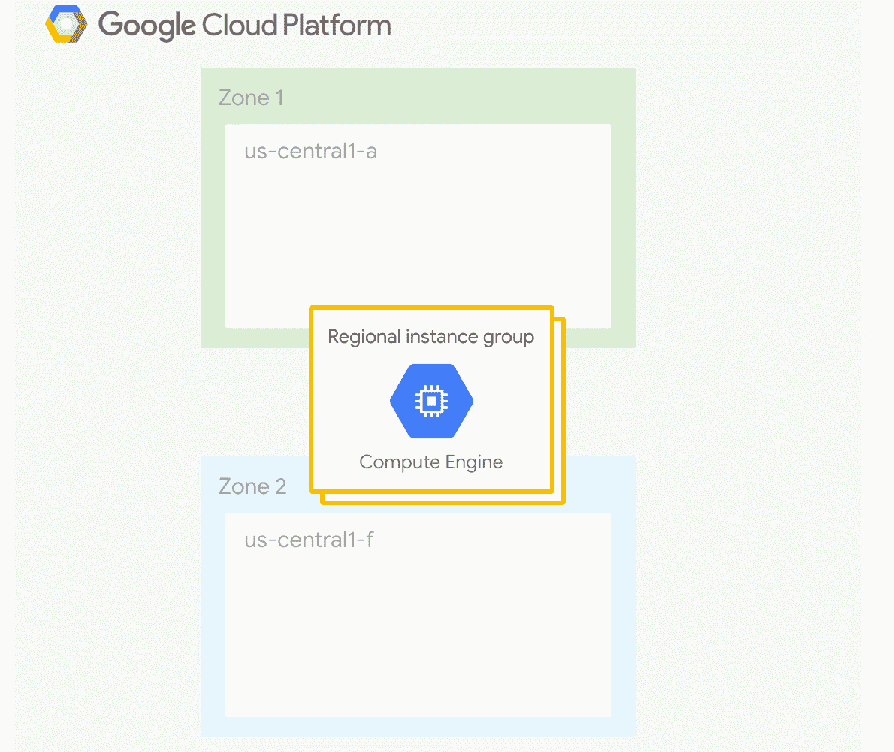
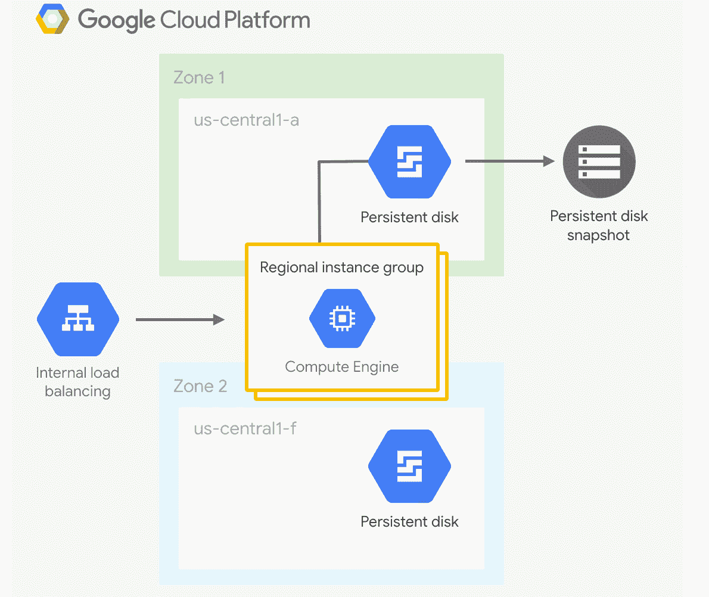

# Google 云中应用程序的冷灾难恢复

> 原文：<https://medium.com/google-cloud/cold-disaster-recovery-for-applications-in-google-cloud-5edeb32f2fc6?source=collection_archive---------0----------------------->

## 在云中烹饪

# 介绍

***【在云端做饭】*** 是一个博客和视频系列，帮助企业和开发者在 Google Cloud 上构建商业解决方案。在这第二个迷你系列中，我将介绍 Google Cloud 上的灾难恢复。当你在网上时，灾难可能很难处理。在接下来的几篇博客中，我们将详细阐述如何应对地震、停电、洪水、火灾等灾害。如果你对之前的迷你系列感兴趣，请查看[的这个](/google-cloud/hosting-web-applications-on-google-cloud-an-overview-46f5605eb3a6)。

这是这个系列的计划。

1.  [灾难恢复概述](/google-cloud/hosting-web-applications-on-google-cloud-an-overview-87d0962931a3)
2.  [基于 Google Cloud 的本地应用冷灾难恢复](/@pvergadia/cold-disaster-recovery-on-google-cloud-for-applications-running-on-premises-114b31933d02)
3.  [针对内部部署应用的 Google Cloud 热灾难恢复](/google-cloud/warm-disaster-recovery-on-google-cloud-for-applications-running-on-premises-7428b0f7db72)
4.  [基于 Google Cloud 的内部应用热灾难恢复](/google-cloud/hot-disaster-recovery-on-google-cloud-for-applications-running-on-premises-da7048d1a57b)
5.  Google Cloud 中应用程序的冷灾难恢复(本文)
6.  Google 云中应用程序的热灾难恢复
7.  Google 云中应用程序的热灾难恢复
8.  Google Cloud 上的数据灾难恢复:第 1 部分
9.  Google Cloud 上的数据灾难恢复:第 2 部分

在本文中，您将学习为部署在 Google Cloud 中的应用程序设置一个 Cold DR 模式。所以，继续读下去吧！

# 你会学到什么

*   Google Cloud 应用程序的冷灾难恢复模式，带示例。
*   灾难来袭前需要采取的步骤。
*   灾难发生时需要采取的步骤。
*   默认高可用性(HA)是如何工作的？
*   灾难发生后需要采取的步骤。

# 先决条件

*   谷歌云的基本概念和结构，这样你就可以识别产品的名称。
*   阅读[概述文章](/google-cloud/hosting-web-applications-on-google-cloud-an-overview-87d0962931a3)了解灾难恢复的相关定义。

# 看看这个视频

部署在 Google 云上的应用程序的冷灾难恢复模式

# 让我们用一个例子来学习冷 DR 模式

Mane-street-Art 已经迁移到谷歌云，但是他们仍然需要一个灾难恢复计划。他们希望使用一台可恢复的应用服务器来设置冷灾难恢复模式。根据您的体系结构，只有一个可恢复的服务器可能工作，也可能不工作，但请将此作为一个示例。

在任何灾难恢复模式中，您都需要了解在灾难发生前需要采取什么步骤，灾难发生时会发生什么，以及灾难过去后需要发生什么。

# 冷灾难恢复模式—它是如何工作的？

## 灾难来袭前应采取的步骤:

*   创建一个 VPC 网络
*   创建使用应用程序服务配置的自定义图像。作为图像的一部分。
*   确保为正在处理的数据连接一个永久磁盘。
*   从连接的永久磁盘创建快照。
*   配置一个启动脚本，从最新快照创建一个永久磁盘，并装载该磁盘。
*   然后从我们刚刚创建的图像创建一个实例模板

*   使用此实例模板，配置目标大小为 1 的区域托管实例组。
*   确保在托管实例组(MIG)上配置了健康检查
*   使用区域托管实例组配置内部负载平衡
*   配置一个计划任务来创建持久性磁盘的常规快照。

## 灾难来袭时应采取的措施:

*   Mane-street-art 不需要启动任何故障转移步骤，因为它们会自动发生。这是 Google cloud 中可用的默认 HA 特性中最好的部分。

## 默认高可用性是如何工作的？

*   **负载平衡器**确保即使在需要替换实例时，也使用相同的 IP 地址作为应用服务器的前端。
*   **实例模板**和**定制图像**确保替换实例的配置与被替换的实例相同。
*   Mane-street-art 的 RPO 将由拍摄的最后一张快照决定。拍摄快照的频率越高，RPO 值就越小。

*   **区域托管实例组**提供了深度 HA。它提供了在应用程序、实例或区域级别对故障做出反应的机制。如果发生任何一种情况，您都不必手动干预。将目标大小设置为 1 可以确保只运行一个实例。
*   **永久磁盘**是分区的，因此需要快照，以便在分区故障时重新创建磁盘。但是，快照也可以跨区域使用，这允许您将磁盘恢复到不同的区域，就像将它恢复到相同的区域一样容易。
*   如果某个区域出现故障，区域实例组将在同一区域的不同区域中启动一个替换实例。从最新快照创建新的持久磁盘，并将其附加到新实例

*   您可以使用区域性持久磁盘而不是区域磁盘，这将非常好，因为您不必使用快照来恢复持久磁盘。**但是**，请注意这将消耗两倍的存储空间，需要进行预算。

## 灾难过去后应采取的步骤

*   由于 Google 云平台提供了默认的 HA 特性，只要为 HA 设置好初始环境，在灾难发生时或灾难发生后真的没有太多事情可做。

# 结论

如果您的应用程序部署在 Google cloud 上，并且您有特定的预算来满足这些 RTO 和 RPO 值，那么请使用冷灾难恢复模式！敬请关注即将发布的文章，在这些文章中，您将了解如何建立更多对您的业务有意义的灾难恢复模式。

# 后续步骤

*   在[谷歌云平台媒体](https://medium.com/google-cloud)上关注这个博客系列。
*   参考[灾难恢复解决方案](https://cloud.google.com/solutions/dr-scenarios-planning-guide)。
*   关注[获取云端烹饪](https://www.youtube.com/watch?v=pxp7uYUjH_M)视频系列，订阅谷歌云平台 YouTube 频道
*   想要更多的故事？查看我的[媒体](/@pvergadia/)，[在 twitter 上关注我](https://twitter.com/pvergadia)。
*   请和我们一起欣赏这部迷你剧，并了解更多类似的谷歌云解决方案:)