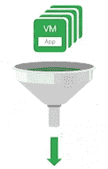
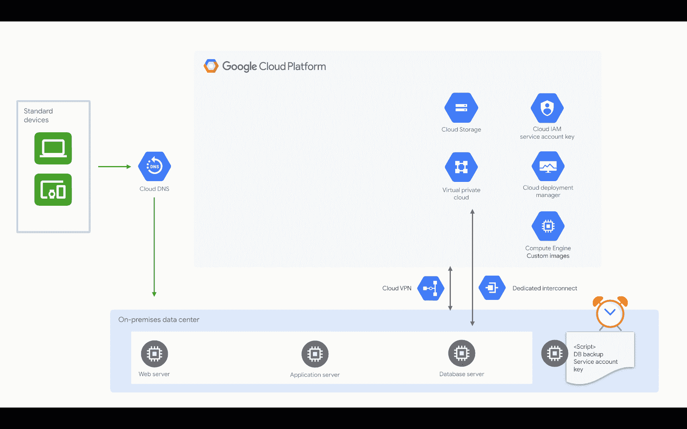
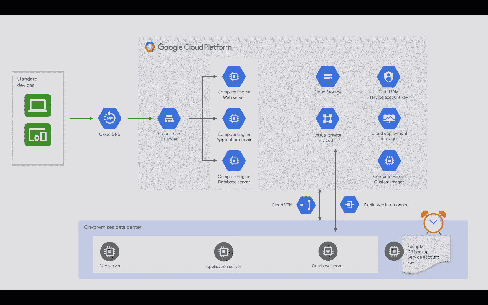

# 在 Google Cloud 上为内部运行的应用程序进行冷灾难恢复

> 原文：<https://medium.com/google-cloud/cold-disaster-recovery-on-google-cloud-for-applications-running-on-premises-114b31933d02?source=collection_archive---------0----------------------->

## 在云中烹饪

# 介绍

***【在云端做饭】*** 是一个博客和视频系列，帮助企业和开发者在 Google Cloud 上构建商业解决方案。在这第二个迷你系列中，我将介绍 Google Cloud 上的灾难恢复。当你在网上的时候，灾难是很难处理的。在接下来的几篇文章中，我们将详细阐述如何应对地震、停电、洪水、火灾等灾害。如果你对之前的迷你系列感兴趣，请查看[的这个](/google-cloud/hosting-web-applications-on-google-cloud-an-overview-46f5605eb3a6)。

这是这个系列的计划。

1.  [灾难恢复概述](/google-cloud/hosting-web-applications-on-google-cloud-an-overview-87d0962931a3)
2.  基于 Google Cloud 的本地应用冷灾难恢复(本文)
3.  基于 Google Cloud 的内部应用热灾难恢复
4.  基于 Google Cloud 的内部应用热灾难恢复
5.  Google 云中应用程序的冷灾难恢复
6.  Google 云中应用程序的冷灾难恢复
7.  Google 云中应用程序的热灾难恢复
8.  Google 云中应用程序的热灾难恢复
9.  Google Cloud 上的数据灾难恢复:第 1 部分
10.  Google Cloud 上的数据灾难恢复:第 2 部分

在本文中，您将学习为部署在本地的应用程序设置一个冷灾难恢复模式。所以，继续读下去吧！

# 你会学到什么

*   不同应用程序的灾难恢复
*   冷灾难恢复模式及示例
*   灾难来袭前需要采取的步骤
*   发生灾难时需要采取的步骤
*   灾难发生后需要采取的步骤

# 先决条件

*   谷歌云的基本概念和结构，这样你就可以识别产品的名称。

# 看看这个视频

Google 云上的冷灾难恢复

# 针对不同应用的灾难恢复(DR)

您的灾难恢复计划将取决于您的特定应用程序和恢复目标。让我们考虑几个场景

*   如果您运行**批处理工作负载**，它们往往是非关键任务，不需要为高可用性而设计。在这种情况下，您可以将可抢占的 VM 实例与 Google 云存储结合使用。和..这就是你的灾难恢复计划！

*   如果您有一个**视频流**解决方案，那么从搜索到实际的流内容，整个**体验都需要高可用性，否则，客户可能会转向您的竞争对手。**

电子商务网站

*   如果你运行**一个电子商务网站**，那么实际的采购渠道需要 HA，但是向客户发送通知的电子邮件流程可以容忍一点延迟。这是热(购买)和暖或冷(通知)模式的混合。

# 让我们用一个例子来学习冷 DR 模式

***Mane-Street Art*** 是一家在内部运行应用程序的公司，并且正在 Google Cloud 上构建灾难恢复基础架构。他们现在正在制定一个低预算的灾难恢复计划，并接受稍高的 RPO 和 RTO 值。这意味着他们需要建立一个冷灾难恢复模式。

*注意:如果您不熟悉这里使用的术语(RTO、RPO、DR 模式),请查看* [*以前的博客*](/google-cloud/hosting-web-applications-on-google-cloud-an-overview-87d0962931a3) *以获得概述。*

在**冷灾难恢复模式**中，Mane-street art 在灾难恢复 Google Cloud 项目中需要最少的资源——仅够实现恢复场景。当灾难发生时，故障转移策略需要在 Google Cloud 中启动生产环境的镜像。

在任何灾难恢复模式中，您都需要了解在灾难发生前需要采取什么步骤，灾难发生时会发生什么，以及灾难过去后需要发生什么。

# 冷灾难恢复模式—它是如何工作的？

## 灾难来袭前应采取的步骤

“在灾难以冷灾难恢复模式袭来之前要采取的步骤”的视觉效果

*   创建一个 VPC 网络
*   然后配置内部网络和 Google cloud 网络之间的连接。
*   您需要一个云存储桶作为我们数据备份的目标。
*   为了让您的本地机器将数据库备份上传到 google cloud，您将需要一个服务帐户密钥，以便在自动脚本中对您的机器进行身份验证。
*   您可以使用 IAM 策略来限制正确用户的访问权限，并确保服务帐户拥有所需的最低权限
*   确保上传和下载，到和从云存储桶工作。然后，您最后编写数据传输脚本
*   创建一个计划任务来运行脚本。
*   创建为生产环境中每种类型的服务器配置的自定义映像。
*   将 DNS 配置为指向面向互联网的 web 服务。
*   创建一个部署管理器模板，该模板将使用之前配置的定制映像在您的 Google cloud 网络中创建服务器。

## 灾难来袭时应采取的措施

“在冷灾难恢复模式下发生灾难时要采取的步骤”的可视化内容

*   当灾难发生时，您只需要执行部署管理器模板，它将自动创建一个 google 云部署。
*   应用云存储桶中最新的数据库备份和事务日志
*   通过模拟恢复环境中的用户来测试应用程序是否按预期工作。
*   然后最后点云 DNS 到 google cloud 上的 web 服务器。

## 灾难过去后应采取的步骤

“灾难过去后，在冷灾难恢复模式下要采取的步骤”的可视化

当生产环境再次在本地运行，并且可以支持生产工作负载时，颠倒您所遵循的步骤。通常是这样的:

*   备份运行在 Google cloud 上的数据库和事务日志
*   将备份文件复制并应用到生产环境中的数据库。
*   在这个阶段，您应该阻止连接到 Google cloud 中的应用程序，或者您可以在数据库成功恢复后停止连接，并应用备份后发生的任何事务。
*   在我们的示例中，我们需要停止到全局负载平衡器的连接。从这时起，您的应用程序将不可用，直到您完成生产环境的恢复。
*   将云 DNS 配置为指向您的本地 web 服务。
*   确保您将数据复制到云存储的流程按预期运行。
*   最后，删除您的部署。

# 结论

如果您在本地运行应用程序，预算有限，并且可以在较高的 RTO 和 RPO 值下工作，那么冷灾难恢复模式是最佳选择。您了解了如何在冷灾难恢复场景中从故障中恢复环境。敬请关注即将发布的文章，在这些文章中，您将了解如何建立更多对您的业务有意义的灾难恢复模式。

# 后续步骤

*   在[谷歌云平台媒体](https://medium.com/google-cloud)上关注这个博客系列。
*   参考[灾难恢复解决方案](https://cloud.google.com/solutions/dr-scenarios-planning-guide)。
*   关注[获取云端烹饪](https://www.youtube.com/watch?v=pxp7uYUjH_M)视频系列，订阅谷歌云平台 YouTube 频道
*   想要更多的故事？查看我的[媒体](/@pvergadia/)，[在 twitter 上关注我](https://twitter.com/pvergadia)。
*   请和我们一起欣赏这部迷你剧，并了解更多类似的谷歌云解决方案:)