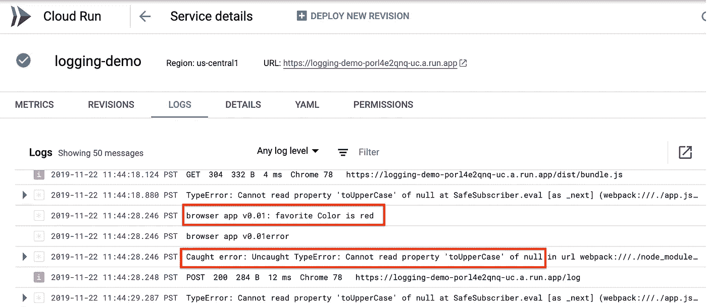

# 在 Stackdriver 中收集浏览器控制台日志

> 原文：<https://medium.com/google-cloud/collecting-browser-console-logs-in-stackdriver-fa388a90d32b?source=collection_archive---------1----------------------->

TL；DR:这篇文章解释了如何通过将浏览器控制台日志导出到 Google Stackdriver Logging 中的一个中心位置来提高浏览器 JavaScript 的可支持性，为什么要这样做，并讨论了实现选项。

**背景**

随着 ES2015 模块、Angular 和 TypeScript 等更好的工具可用于开发大规模基于浏览器的应用程序，大型应用程序已经开发出来，为它们提供良好的支持变得越来越重要。不幸的是，如今在一个中心位置收集浏览器日志和错误并不是一种常见的做法。商业支持的 web 应用程序的典型支持经验是:最终用户遇到问题，提交错误报告，开发人员或支持工程师查看服务器日志，发现服务器上没有错误，然后工程师请求最终用户发送浏览器日志。最终用户可能有也可能没有支持合同，可能知道也可能不知道如何发送浏览器日志。更糟糕的是，console.log()消息可能会被编译工具剥离。最糟糕的是，最终用户可能甚至懒得报告问题，而只是转向竞争产品。这导致了令人沮丧的用户体验，并且开发者对于最终用户所遇到的问题一无所知。

然而，浏览器控制台日志和未处理的错误可以相当容易和经济地收集在一个中心位置，例如谷歌云平台上的 [Stackdriver Logging](https://cloud.google.com/logging/) 。没有在一个中心位置收集日志是一个错失的机会。本文将解释如何通过一个示例应用程序来实现这一点，该应用程序定义了新的 log()和 error()方法，将日志和错误发送到运行 Node.js 的后端服务器，然后在服务器上将它们记录下来。它还可以选择重新定义浏览器控制台日志和错误函数来调用这些实现。这是可选的，因为一些开发人员可能不希望将消息记录到控制台，因此主动从他们的代码库中删除对 console.log()的调用。不依赖于 Stackdriver 专有的 API，但是演示了使用 Stackdriver 的简易性。

参见 [stackdriver-errors-js](https://github.com/GoogleCloudPlatform/stackdriver-errors-js) 获取从浏览器 JavaScript 到 stackdriver 错误报告 API 的错误报告代码。该项目的优点是它不需要后端服务器。但是，它不发送信息性日志消息，只发送错误。

除了日志和错误，您可能还想将其他有趣的事件记录到服务器上。例如，浏览器历史。像 Angular 这样的现代 JavaScript 框架使得开发一大组视图成为可能，这些视图在用户看来就像单个页面应用程序中的多个页面。但是在 web 服务器请求日志中没有用户导航到不同视图的记录，这是理解应用程序使用模式的另一个新的空白。这篇文章没有涉及到这个问题，但是这里描述的相似的原则也适用。

**接近**

下面的示意图显示了收集控制台日志和错误的方法。


浏览器日志传送到 Stackdriver 的示意图

在图中，红色表示示例应用程序代码，蓝色表示 Google 云平台服务，绿色表示开源或 web 浏览器。

将日志写入 Stackdriver 或另一个中央位置的可能方法，按从多到少的顺序排列如下

1.  创建一个新的 API，比如说日志收集器，

*   将日志发送到我们的服务器并保存到 Stackdriver 中
*   添加一些缓冲，以便不需要对每个日志消息进行远程调用
*   为了方便和代码可维护性，使它可以作为 ES6 模块安装
*   监听[global event handlers . on error](https://developer.mozilla.org/en-US/docs/Web/API/GlobalEventHandlers/onerror)来收集未捕获的错误
*   这种方法的缺点是我们无法捕捉通过 console.log()记录的消息。

2.重新定义控制台日志记录功能

*   这可以与上面的方法相结合。
*   JavaScript 的灵活特性使得在对象上重新定义函数变得容易
*   遵循与上面相同的关于缓冲和发送到我们的服务器的要点。
*   这假设我们有自己的服务器，即它不是一个静态的网站。您可以在另一台服务器上运行收集器进程，并配置跨源资源共享(CORS)以允许从静态网站发送日志。

3.使用 Stackdriver APIs 写入 Stackdriver

*   您可以直接从浏览器使用 stack driver API[客户端日志库](https://cloud.google.com/logging/docs/reference/libraries)，尽管它们主要用于 Node.js。但是，您需要为此使用 OAuth 2.0 并代表用户执行 API。如果您不能为您的应用程序的用户注册和提供对 GCP 的访问，这不是一个可行的方法。更多详情参见 GCP [认证概述](https://cloud.google.com/docs/authentication)。

在本文中，我将结合第一种和第二种方法:定义新的 log()和 error()方法，重新定义控制台日志和错误函数，并将日志和错误发送到 Node.js 服务器，在那里记录它们。演示应用程序使用标准 console.log()和 console.error()函数将[云运行](https://cloud.google.com/run/)与日志记录结合使用，这些函数由云运行定向到 Stackdriver。如果您不使用 Cloud Run，那么您可以按照[为 Node.js 设置 Stackdriver 日志记录](https://cloud.google.com/logging/docs/setup/nodejs)中的步骤轻松设置 Stackdriver 日志记录。Stackdriver 日志记录与 Node.js Bunyan 和 Winston 日志记录框架相集成，这也可以使您免受专有 API 的影响。类似的 Stackdriver 集成也适用于其他语言。

**样本 App**

示例应用程序创建日志收集器，并驱动一个带有 web 表单的简单页面，允许用户在文本字段中输入自己的名字和喜欢的颜色。执行此操作的浏览器类型脚本如下所示(文件 [public/app.ts](https://gist.github.com/alexamies/037d7c11432ea2301de9995515c6deea) )。TypeScript 编译器使用(文件 public/app.js)生成非常相似的 JavaScript。

```
import { fromEvent } from "rxjs"; import { LogCollector, LogCollectorBuilder } from "./index.js";// Start the log collector
const buildId = "v0.01";
const builder = new LogCollectorBuilder().setBuildId(buildId).setReplaceConsole(true);
const logCollector = builder.makeLogCollector();
logCollector.start();// Handle events for the name form
const nameForm = document.getElementById("nameForm");
const nameTF = document.getElementById("nameTF") as HTMLInputElement;
if (nameForm) {
  const events = fromEvent(nameForm, "submit");
  events.subscribe( (event) => {
    event.preventDefault();
    const name = nameTF.value as string;
    logCollector.log(`Your name is ${name}`);
    return false;
  });
}// Handle events for the favorite color form
const favColorForm = document.getElementById("favColorForm");
const favColorTF = document.getElementById("favColorTF") as HTMLInputElement;
if (favColorForm) {
  const events = fromEvent(favColorForm, "submit");
  events.subscribe( (event) => {
    event.preventDefault();
    const favColor = favColorTF.value as string;
    console.log(`Your favorite color is ${favColor}`);
    // recklessly generate a null pointer error
    let nullValue: string | null = "";
    nullValue = null;
    nullValue!.toUpperCase();
    return false;
  });
}
```

该代码首先导入 LogCollector 类(这是本文的重点)和 rxjs 模块(用于响应表单提交的用户事件)。我使用 Webpack 来解析导入语句，并将它们捆绑到文件 public/dist/bundle.js 中。构建 id 用于标识应用程序的版本。在实例化 LogCollector 的实例后，会调用 start 方法来启动日志刷新服务器，该服务器会以固定的时间间隔将缓冲的日志发送到服务器。该脚本对表单事件的响应演示了控制台日志方法，并有意生成一个未捕获的类型错误，以显示如何收集未捕获的错误。

JavaScript 应用程序驱动一个带有文本字段的 HTML 页面，如下所示。当开发人员单击按钮时，他或她可以在 Chrome 或其他浏览器中打开开发人员工具控制台，并看到记录的消息，如下所示。


浏览器控制台中 web 表单和日志的屏幕截图

日志收集的代码包含在文件 [public/index.ts](https://gist.github.com/alexamies/037d7c11432ea2301de9995515c6deea) 中导出的 JavaScript 模块中:

```
export { LogCollectorBuilder } from './lib/LogCollectorBuilder';
export { LogCollector } from './lib/LogCollector';
```

该模块导出两个类，它们包含在各自的文件中。大部分实现都在文件 lib/LogCollector.ts 中的 LogCollector:类中:

```
const defaultLog = console.log.bind(console);export class LogCollector {
  private buildId: string;
  private logs = new Array<string>();
  private errors = new Array<string>(); constructor(buildId: string, replaceConsole: boolean) {
    this.buildId = buildId;
    if (replaceConsole) {
      console.log = (msg: string, ...args: object[]) => {
        if (args && args.length) {
          defaultLog(msg, args);
        } else {
          defaultLog(msg);
        }
        this.log(msg, args);
      };
    }
....
}
```

构造函数可以选择替换 console.log 和 console.error 函数。有单独的可调用日志收集器方法 log()和 error，它们将日志和错误消息存储到缓冲区:

```
public log(msg: string, ...args: object[]) {
  let message = msg;
  if (args) {
    message += args.join(", ");
  }
  this.logs.push(`browser app ${this.buildId}: ${message}`);
}
```

LogCollectorBuilder 类是用于创建日志收集器实例的生成器类。

TypeScript 文件被编译成 JavaScript，JavaScript 也被 Webpack 打包成一个文件 dist/bundle.js。

在模块内部，日志消息和错误存储在字符串数组中。然后每隔 10 秒左右，用一个 AJAX 调用将日志记录到服务器。为简单起见，这忽略了一个事实，即本机控制台函数接受一个可变的参数列表，而不仅仅是一个消息参数。

未捕获的异常通过监听[global event handlers . on error](https://developer.mozilla.org/en-US/docs/Web/API/GlobalEventHandlers/onerror)来收集

```
window.onerror = (msg, url, lineNo, columnNo, error) => {
  if (error && error.stack) {
    errors.push(`Uncaught error: ${msg} in url ${url}\n${error.stack}`);
  } else {
    errors.push(`Uncaught error: ${msg}\n url ${url}\n Line: ${lineNo}`);
  }
};
```

server Node.js 应用程序包括一个处理程序，用于接收这些数据并将它们记录在服务器上，包含在文件 app.ts:

```
import * as express from "express";const app = express();
app.use(express.static("public"));
app.use(express.json());app.post("/log", (req: express.Request, res: express.Response) => {
  if ("logs" in req.body) {
    const logs = req.body["logs"];
    if (logs && logs instanceof Array) {
      logs.forEach( (log) => {
        if (typeof log === "string") {
          console.log(log);
        } else {
          sendError(`Log has wrong type: ${log}`, res);
        }
      });
    }
...
```

当应用程序在我们的本地环境中使用 Node.js 时，可以在服务器命令行上看到日志:

```
npm run start
> browser-logs@0.0.1 start
> node app.js
App listening on port 8080
browser app v0.01: Your name is Alex
browser app v0.01: Your favorite color is red
Uncaught error: Uncaught TypeError: Cannot read property 'toUpperCase' of null in url webpack:///./node_modules/rxjs/_esm5/internal/util/hostReportError.js?
TypeError: Cannot read property 'toUpperCase' of null
at SafeSubscriber.eval [as _next] (webpack:///./app.js?:57:15)
at SafeSubscriber.__tryOrUnsub
...
```

未捕获的浏览器异常可以在上面的输出中看到。

应用程序可以在云中运行，而无需更改代码，例如，通过部署到 Cloud Run。可以使用下面的命令构建 Node.js 应用程序的 Docker 映像。首先将 shell 变量 PROJECT_ID 设置为适当的值。

```
gcloud builds submit --tag gcr.io/$PROJECT_ID/logging-demo
```

可以使用命令将应用程序部署到云运行

```
gcloud run deploy --image gcr.io/$PROJECT_ID/logging-demo --platform managed
```

然后我们可以看到日志条目出现在 Stackdriver 控制台中，如下所示



Stackdriver 日志记录用户界面中显示的浏览器日志

在 [Stackdriver 错误报告](https://cloud.google.com/error-reporting/docs/)中也可以跟踪错误，它给出了错误第一次和最后一次出现的详细信息，并绘制了错误频率的时间表。


Stackdriver 错误报告用户界面中显示的浏览器错误

JavaScript [错误](https://developer.mozilla.org/en-US/docs/Web/JavaScript/Reference/Global_Objects/Error)对象包含一个堆栈跟踪，在 Chrome 和 Firefox 上实现。记录多行有效负载的错误，例如多行堆栈跟踪，将导致 Stackdriver 错误报告记录错误。不报告单行错误。

```
├── app.js
├── app.ts
├── Dockerfile
├── package.json
├── public
│   ├── app.js
│   ├── app.scss
│   ├── app.ts
│   ├── dist
│   │   ├── bundle.css
│   │   └── bundle.js
│   ├── index.html
│   ├── index.js
│   ├── index.ts
│   ├── lib
│   │   ├── LogCollectorBuilder.js
│   │   ├── LogCollectorBuilder.ts
│   │   ├── LogCollector.js
│   │   └── LogCollector.ts
│   ├── package.json
│   ├── tsconfig.json
│   ├── tslint.json
│   └── webpack.config.js
├── README.md
├── tsconfig.json
└── tslint.json
```

**接下来的步骤**

1.  从浏览器使用[客户端 JavaScript 库进行堆栈驱动错误报告](https://github.com/GoogleCloudPlatform/stackdriver-errors-js)
2.  使用 [opencensus-web](https://github.com/census-instrumentation/opencensus-web) 通过收集到堆栈驱动程序跟踪测量来自 web 客户端的性能数据。
3.  日志收集模块不具备浏览器控制台 API 的所有功能。有关详细信息，请参阅下面链接中的控制台文档。

**资源**

1.  [在谷歌云平台为 Node.js](https://cloud.google.com/logging/docs/setup/nodejs) 设置 Stackdriver 日志
2.  [谷歌网络基础的 Chrome 控制台文档](https://developers.google.com/web/tools/chrome-devtools/console)
3.  Mozilla 开发者连接上的 Mozilla 控制台文档