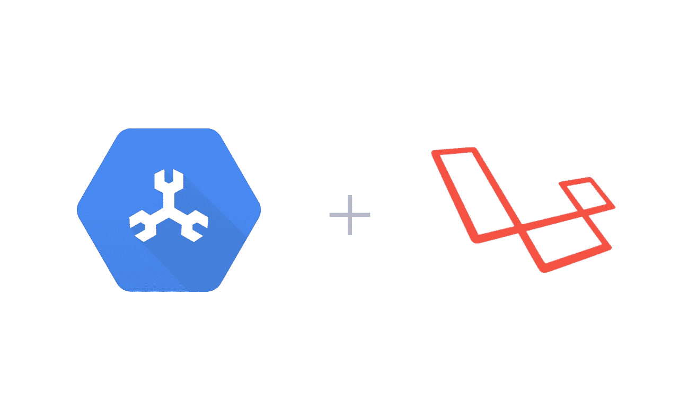

# Colopl 开源了一个用于 Laravel 框架的云扳手驱动

> 原文：<https://medium.com/google-cloud/colopl-open-sourced-a-cloud-spanner-driver-for-laravel-framework-4ca1db018a3?source=collection_archive---------0----------------------->

今天，我想与大家分享我们在日本最重要的客户之一 Colopl 所做的工作。在日本以外，你可能不知道这家公司，但 Colopl 是日本主要手机游戏公司之一。他们发布了多个热门手机游戏，如 [Shironeko Project](https://colopl.co.jp/shironekoproject/) (动作 RPG)或 [The World of Mystic Wiz](https://colopl.co.jp/magicianwiz/) (智力竞赛 RPG)，它们在 Google Play 商店中排名前 20。

作为一个背景，Colopl 决定从 2017 年 9 月开始将所有游戏迁移到 GCP，并于 2018 年 11 月结束迁移。我们今天刚刚在 GCP 日本博客[上发布了他们的用例](https://cloudplatform-jp.googleblog.com/2019/02/COLOPL-Google-Cloud-Platform.html)(只有日文)，但总结一下这篇文章，他们迁移到 GCP 使用 [Google Kubernetes 引擎](https://cloud.google.com/kubernetes-engine/) (GKE)和 [Cloud Spanner](https://cloud.google.com/spanner/) (水平可扩展的强一致性关系数据库)以减少基础设施和运营成本(他们实际上减少了 30%)。

谈到 Cloud Spanner，Colopl 已经使用这个数据库一年了，他们的后端应用程序是用 PHP 编写的。今天，他们刚刚为 Laravel 框架开源了一个[云扳手驱动程序，这是 PHP 最流行的框架之一。Github repo 是英文的，所以不要担心，你会找到自己使用驱动程序的方法:)(这个项目的首席工程师也能说流利的英语)](https://github.com/colopl/laravel-spanner)

 [## colopl/laravel 扳手

### 谷歌云扳手的 Laravel 数据库驱动。通过创建一个……

github.com](https://github.com/colopl/laravel-spanner) 

一个来自 Colopl 的后端工程师， [Hiroki Awata](/@awata) 刚刚发表了[一篇关于他们工作的文章](/google-cloud-jp/laravel-spanner-4d9f20eaeea3)(同样是日文的),所以我想我可以在这里用英文帮助和总结他们的文章:)

以下是文章原文。

 [## Laravel 用の Cloud Spanner ドライバを公開しました

### 株式会社コロプラの粟田です。前回は PHP ではじめる Cloud Spanner という記事を書き、Cloud Spanner に接続する最小限のコードを紹介しました。

medium.com](/google-cloud-jp/laravel-spanner-4d9f20eaeea3) 

# colopl/laravel 扳手特征

*   为 Cloud Spanner 提供大部分 Laravel 数据库特性
*   支持雄辩的
*   支持交叉表和索引的创建
*   他们最新游戏服务器的良好记录

# 装置

请遵循 [Github repo](https://github.com/colopl/laravel-spanner) 上的自述文件，其中包括使驱动程序工作的所有步骤。

# 限制

看一下 Github repo 上的[限制部分](https://github.com/colopl/laravel-spanner#limitations)，了解这个驱动程序与如何使用 Cloud Spanner 相关的限制。

我在这篇文章中只提到一个。这是关于 AUTO_INCREMENT。Cloud Spanner 不提供 AUTO_INCREMENT，因为这代表了一种反模式(参见[本文](https://cloud.google.com/spanner/docs/whitepapers/optimizing-schema-design#anti-pattern_timestamp_ordering)以了解潜在的原因)并可能导致热点。由于这个原因，驱动程序本身没有提供任何使用 AUTO_INCREMENT 的 Laravel 特性。

回购中提到:

> 可以使用`SchemaBuilder`(如`Schema`门面、`Blueprint`的大部分功能。但是，`artisan migrate`命令不起作用，因为 Google Cloud Spanner 中不存在 AUTO_INCREMENT。

如果您有任何要求或发现任何 bug，请不要犹豫，在 Github 问题中报告它们。在 Cloud Spanner 获得新功能的同时，Colopl 将继续维护这个项目。

希望这个 Laravel 的驱动程序能帮助 PHP 开发者以一种更友好的方式使用 Cloud Spanner！