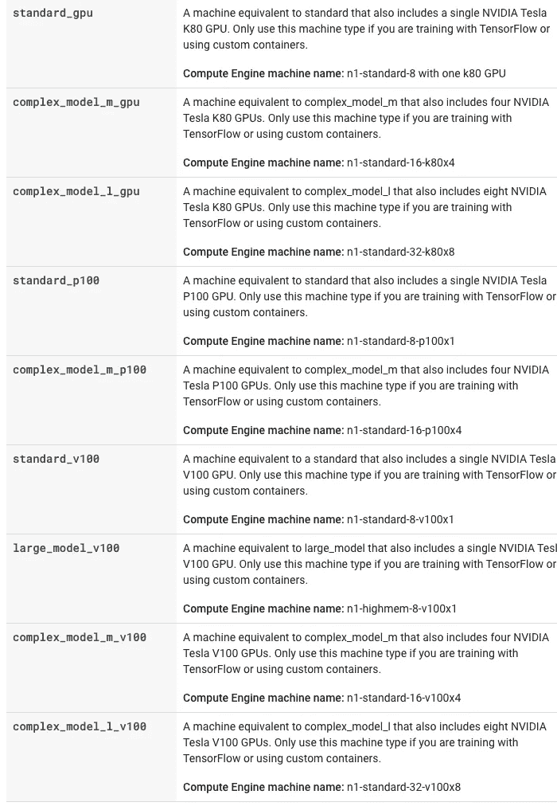

# 使用 YouTube-8M 比较 AI 平台机器类型

> 原文：<https://medium.com/google-cloud/comparing-ai-platforms-machine-types-using-youtube-8m-1522623f9c74?source=collection_archive---------3----------------------->

当训练神经网络模型时，时间是至关重要的。这就是为什么使用不同的机器配置，包括 GPU、TPU 和多个服务器。

在过去的几个月里，我一直在探索 YouTube-8M 项目，之前有关于该项目的帖子，视频数据集，算法以及如何在云中运行它们。在这篇文章中，我在不同的 AI 平台标准机器配置上训练了来自*入门代码*的两个算法，以观察它们如何进行比较。AI 平台提供了许多[规模层，这些规模层是不同机器类型和机器数量](https://cloud.google.com/ai-platform/training/docs/machine-types)的既定配置，以运行作业。

这篇文章介绍了如何运行不同规模的层，以及两种算法(框架级逻辑回归和深度框架模型)在不同层和类型上的时间和成本比较。

# 命令行标志

YouTube-8M 项目在*入门代码* repo 中包含一个 yaml 文件，用于在 AI 平台上运行该项目时设置其配置。您可以每次修改这个文件来改变层，或者您可以做一些更简单的事情，即传入改变层(`--scale-tier)`和类型(`--master-machine-type)`)的标志。

关于如何传入规模层，有几种不同的格式

```
--scale-tier='BASIC_TPU'
--scale-tier=basic-tpu
```

在为规模层传入标志时，必须指定`--runtime-version`，否则会出现错误:

*“当主 Docker 映像 URI 为空时，必须提供运行时版本。”*

将以下内容用于此项目。

```
--runtime-version=1.14
```

# 扩展层级

我在以下规模层的起始代码中试验运行了两种不同的算法，帧级逻辑和深度帧包(DBoF)。

*   *STANDARD_1* : 1 台主机，8 个 vcpu | 8 GB 内存，4 台工作机，8 个 vcpu | 8 GB 内存，3 台参数服务器，4 个 VCPUs | 15 GB 内存
*   *PREMIUM_1* : 1 台主服务器配 16 个虚拟 CPU | 14.4 GB 内存，4 台工作服务器配 16 个虚拟 CPU | 14.4 GB 内存，3 台参数服务器配 8 个虚拟 VCPUs | 52GB 内存
*   *BASIC_GPU:* 1 个工作人员，配备 1 个 K80 GPU | 8 个 VCPUs | 30 GB 内存
*   *基本 _TPU* : 1 个主处理器，带 4 个 VCPUs | 15 GB 内存和 8 个 TPU v2 内核
*   *自定义*:更多信息如下

传入比例层标志时的示例代码

```
JOB_NAME=yt8m_train_frame_$(date +%Y%m%d_%H%M%S)gcloud --verbosity=debug ai-platform jobs submit training \
$JOB_NAME --package-path=youtube-8m --module-name=youtube-8m.train \ --staging-bucket=$OUTPUT_BUCKET \
**--scale-tier=basic-tpu** **--runtime-version=1.14** **--region=us-central1\**
-- --train_data_pattern='$TRAIN_BUCKET/train*.tfrecord' \
--frame_features --model=FrameLevelLogisticModel \
--feature_names="rgb,audio" --feature_sizes="1024,128" \
--train_dir=$OUTPUT_BUCKET/$JOB_NAME --start_new_model
```

## 仅 CPU

注意，[上一篇关于如何在 AI 平台上运行这个项目的文章](/google-cloud/youtube-8m-on-ai-platform-f0a0f8688ce9)涵盖了在 BASIC_GPU 上运行这个项目。使用 STANDARD_1 和 PREMIUM_1 没有足够的内存来运行模型。您可以考虑使用允许您增加主内存和工作内存的自定义设置。此外，要指出的是，在以前的帖子中，我在一台服务器上运行了这些模型，只有至少 30 GB 内存的 CPU，我能够运行帧级，但不能运行 DBoF。您也许可以找到一个只使用 CPU 运行 DBoF 的多工作器配置，但最终，在训练神经网络时使用 TPU 和 GPU 是有意义的。

## **GPU**

人工智能平台让您可以访问 3 种不同类型的图形处理器进行机器配置。标准秤层仅包括 k80，您必须使用自定义层来利用其他层。这些是不同类型的 GPU，按性能的升序排列。

*   K80
*   p100
*   v100

当您添加这些不同类型的 GPU 时，模型的复杂性和数据量将影响您获得的性能提升。

## TPU 入口

TPU 秤等级是为您的项目获取 TPU 的快捷方式。当请求 TPU 时，你必须指定一个地区；否则，您可以将其关闭。如果您没有选择系统中有 TPU 的区域，可能会出现以下错误:

"*资源耗尽美国西部 1 区没有任何区域拥有所有请求类型的加速器."*

当我离开 region 时，它默认为 *us-west1* ，查看 TPU 类型和区域列表，它似乎位于 *us-central1* 区域。在此[链接](https://cloud.google.com/tpu/docs/types-zones)中可以找到 TPU 类型和区域的列表。

## 自定义层

定制层听起来确实如此，它提供了机器配置的灵活性。

使用自定义缩放层时，必须传入 master-machine-type。

```
--master-machine-type=[*MACHINE TYPE OPTIONS*]
```

我使用的机器类型选项。

*   *complex-model-m-gpu* : 4 个 K80 GPUs | 8 个 vcpu | 30gb 内存
*   *complex-model-l-gpu* : 8 个 K80 GPUs | 16 个 VCPUs | 60 GB 内存
*   *标配-p100* : 1 个 P100 GPU | 8 个 VCPUs | 30GB 内存
*   *complex-model-m-p100*:4 个 P100 GPU | 16 个 VCPUs | 60 GB 内存
*   *标准-v100* : 1 个 V100 GPU | 8 个 vcpu | 30gb 内存
*   *大型号 v100* : 1 个 V100 GPU | 16 个 vcpu | 52gb 内存

传入自定义层和机器类型标志时的示例代码。

```
JOB_NAME=yt8m_train_frame_$(date +%Y%m%d_%H%M%S)gcloud --verbosity=debug ai-platform jobs submit training \
$JOB_NAME --package-path=youtube-8m --module-name=youtube-8m.train \ --staging-bucket=$OUTPUT_BUCKET \
**--scale-tier=custom --master-machine-type=standard_p100 \** **--runtime-version=1.14** **\**
-- --train_data_pattern='$TRAIN_BUCKET/train*.tfrecord' \
--frame_features --model=FrameLevelLogisticModel \
--feature_names="rgb,audio" --feature_sizes="1024,128" \
--train_dir=$OUTPUT_BUCKET/$JOB_NAME --start_new_model
```

请注意，对于机器类型、配置以及增加员工数量的能力，还有更精细的控制空间。更多信息可以在文章顶部的链接中找到。在这次演示中，我坚持使用一些标准配置，并且没有在提供的范围之外增加工作人员。因此，对于大多数示例，它保持在单个机器上，并且定制中的所有示例都包括 GPU。

有关配置的更多详细信息，请参见下面的截图并查看[文档](https://cloud.google.com/ai-platform/training/docs/machine-types#compare-machine-types):



## 定额

以下是为我的项目自动设置的配额。

*   V2 TPU 16 号
*   TPU V3 街 16 号
*   2 P4
*   2 V100
*   40 K80
*   40 P100

当我尝试用两个以上 V100s 的机器类型进行实验时，我在得到的错误中发现了这个问题。如果您的工作需要您扩大机器的规模，那么您需要提出配额增加请求。如果我在不久的将来获得超过 2 台 V100s 的访问权限，我将运行其他类型的机器，并在下面添加详细信息。

# 性能比较

现在有趣的是，比较两种不同算法在所有这些不同配置下的性能。人工智能平台和任何托管服务的好处在于，你可以一次启动所有这些服务，它们可以并行运行。

提醒一下，预定义比例轮胎的价格是每培训单位每小时 0.49 美元，这是基本价格。要得到工作的成本，用*乘以消耗的毫升单位*。*消耗的 ML 单位* (MLU)相当于包含工作持续时间的训练单位。

如果您自己尝试，时间和成本可能会略有不同，但应该在下面提供的几分钟范围内。

## 框架级逻辑

每个要点提供了规模层级/机器类型、总培训时间和总成本。

*   *BASIC_GPU:* 13 小时 9 分 21.85 MLU * $ 0.49 = $ 10.71
*   *基本 _TPU* : 20 小时 51 分 198.58 MLU * $ 0.49 = $ 97.31
*   *复杂模型 m 图形处理器:* 11 小时 30 分 59.27 MLU * $ 0.49 = $ 29.04
*   *复杂-模型-l-gpu* : 11 小时 7 分钟，114.72 MLU * $ 0.49 = $ 56.21
*   *标准-p100*:12 小时 45 分 47.39 MLU * $ 0.49 = $ 23.22
*   *复杂型号 m-p100* : 11 小时 57 分 159.61 MLU * $ 0.49 = $ 78.21
*   标准版 v100 : 12 小时 19 分 71.39 MLU * $ 0.49 = $ 34.98
*   大型号 v100 : 13 小时 17 分钟，79.28 MLU * $ 0.49 = $ 38.85

*基本 GPU* 配置是下一个最低成本选项*标准 p100* 的一半成本，但运行时间几乎要多 30 分钟。这是确定时间价值的一个很好的例子。你能等 30 分钟训练结束吗？大概吧。培训时，您很可能需要多次运行这些机器来调整和试验模型。这些额外的时间可以累积起来，使用一台可以节省一些时间的机器似乎更划算(尤其是考虑到最后期限)。

## 深框架包(DBoF)

每个要点提供了规模层级/机器类型、总培训时间和总成本。

*   *基本 _GPU:* 1 天 10 小时 56.26 MLU * $ 0.49 = $ 27.57
*   *基本 _ TPU*:*内存不足，以非零状态退出*
*   *复杂模型 m GPU:*1 天 4 小时 145.95 MLU * $ 0.49 = $ 71.52
*   *complex-model-l-gpu* : 1 天 3 小时 286.36 MLU * $ 0.49 = $ 140.32
*   *标准-p100* : 16 小时 59 分 63.14 MLU * $ 0.49 = $ 30.94
*   *复杂型号 m-p100* : 16 小时 22 分 219.11 MLU * $ 0.49 = $ 107.36
*   *标准-v100* : 16 小时 24 分钟，92.8 MLU * $ 0.49 = $ 45.47
*   *大型号 v100* : 15 小时 23 分 91.76 MLU * $ 0.49 = $ 44.96

对于这种模式，很明显 v100 GPUS 略快，并且几乎与 p100 一样具有成本效益。考虑到时间因素，这几乎是最快也是最便宜的选择。此外，当在复杂模型下添加更多 GPU 时，成本显著增加，但时间并没有改善多少。在这种使用情况下，单个 GPU 可以完成工作，但在其他情况下，基于模型、数据和时间的限制，需要多个 GPU。

还要指出的是，如果您想试验 TPU，那么创建一个使用它们的自定义层，并使用一个比 BASIC_TPU 配置具有更多内存(至少 30 GB)的 main/master。

总的来说，对于这两种型号，v100 GPUs 显示出强大的性能，但在考虑时间和成本权衡时，单个 p100 是最佳选择。

# 包裹

这篇文章重点回顾了不同的人工智能平台规模层和机器类型如何使用 YouTube-8M 示例算法执行。扩展 GPU、TPU 和服务器的数量取决于模型的复杂程度、数据量以及完成工作所需的时间。这些将帮助您确定使用什么，使用几个服务器或 GPU 不一定更快。在启动平台之前，花时间了解您的需求是非常重要的。

这篇文章表明，对于这个特定的项目和代码提供的两种算法，考虑到时间和成本，使用 standard-p100 的定制层是最佳选择。如果您研究其他型号，不同的配置可能更适合您的需求。此外，我并没有穷尽所有可以定制这些配置的方法，因此可能会有更好的选择。我要求你去寻找它，如果你找到了就告诉我。