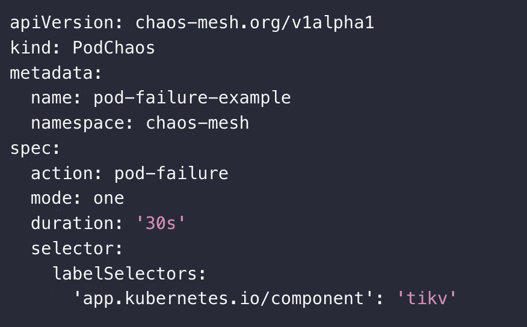

# 比较 CNCF 混沌工程工具

> 原文：<https://medium.com/google-cloud/comparing-cncf-chaos-engineering-tools-b33f53feb545?source=collection_archive---------1----------------------->

*混沌工程是一门在系统上进行实验的学科，目的是建立对系统承受生产中动荡条件能力的信心。*

应用程序出现故障的方式有很多，服务器发热、磁盘一直出现故障、网络连接变得脆弱。我们假设，由于我们已经复制了服务器，备份了数据库实例，应用程序已经分布在多个地区/区域，准备好应对灾难情况。

但是我们真的确定我们的分布式系统/应用程序是有弹性的吗？证明您的系统/应用程序对故障具有弹性的唯一方法是经历故障，并使对故障的快速响应成为您的软件/系统/应用程序不可或缺的一部分。

混沌工程是通过诱发受控故障来例行测试系统弹性的实践。

# 实践中的混乱

为了具体解决大规模分布式系统/应用的不确定性，混沌工程可以被认为是揭示系统弱点的受控实验的促进。这些实验遵循四个步骤:

1.  首先将“稳定状态”定义为系统的一些可测量的输出，表示正常的行为。
2.  假设这种稳定状态将在对照组和实验组中持续。
3.  引入反映真实世界事件的变量，如服务器崩溃、硬盘故障、网络连接中断等。
4.  通过在对照组和实验组之间寻找稳定状态的差异来试图推翻假设。

破坏稳定状态越难，我们对系统的行为就越有信心。如果一个弱点被发现，我们现在就有了一个改进的目标，在这个行为在整个系统中表现出来之前。

市场上有不同的工具，具有不同的成熟度，可以用分布式系统/应用程序来试验混沌。我决定在这篇博文中比较三种不同的工具。所有这些工具都是 CNCF 项目。

*   [混沌工具包](https://chaostoolkit.org/)
*   [石蕊](https://litmuschaos.io/)
*   [混沌网](https://github.com/chaos-mesh/chaos-mesh)

我将从以下几个方面比较这三个工具:安装和管理、实验定义和多样性、安全性和可观察性。

# 工具比较

# 混沌工具包

Chaos Toolkit 非常注重可扩展性，旨在成为创建定制混沌工具和实验的框架。它涵盖了实验的整个生命周期，使得在实验开始时运行检查(称为探针)来检查目标应用程序的状态成为可能，随后对系统采取行动以引起不稳定，并验证是否达到了预期的最终状态。它允许将你的混沌工程实验声明和存储为 JSON/YAML 文件，这样你就可以像其他代码一样协作和编排它们(混沌作为代码)。使用驱动程序扩展，如 AWS 驱动程序或 Kubernetes 驱动程序，可以很容易地安装这些驱动程序，以便对扩展的目标平台列表使用附加操作。可以创建新的自定义驱动程序，也可以增强现有的驱动程序，以便为实验提供更多类型的探针和动作。


# 安装和管理

# Python 要求

在 Python 3 中实现了 [chaostoolkit CLI](https://github.com/chaostoolkit/chaostoolkit) ,这需要运行一个有效的 Python 安装。它正式支持 Python 3.7+。它只在 [CPython](https://www.python.org/) 上测试过。

# 创建虚拟环境

可以通过软件包管理为您的系统安装依赖项，但更有可能的是，您希望自己在本地虚拟环境中安装它们。

```
python3 -m venv ~/.venvs/chaostk
```

确保在使用虚拟环境之前始终激活它:

```
source  ~/.venvs/chaostk/bin/activate
```

# 安装 CLI

在虚拟环境中安装`chaostoolkit`,如下所示:

```
pip install -U chaostoolkit
```

您可以通过运行以下命令来验证该命令是否已安装:

```
chaos --version
```

# 以 Kubernetes 操作员的身份部署混沌工具包

Kubernetes 操作符是在 Kubernetes API 上为任何应用程序创建定制控制器的一种流行方法。

Chaos Toolkit 操作员监听实验声明并触发一个新的 Kubernetes pod，用指定的实验运行 Chaos Toolkit。

# 部署操作员

[操作符](https://github.com/chaostoolkit-incubator/kubernetes-crd)可以在 Chaos Toolkit 孵化器上找到。

它是通过典型的 Kubernetes [清单](https://github.com/chaostoolkit-incubator/kubernetes-crd/tree/master/manifests)部署的，这些清单需要通过本机配置管理器 [Kustomize](https://kustomize.io/) 应用。

首先，下载 [Kustomize 二进制文件](https://github.com/kubernetes-sigs/kustomize/blob/master/docs/INSTALL.md):

```
curl -s "https://raw.githubusercontent.com/kubernetes-sigs/kustomize/master/hack/install_kustomize.sh" | bash
```

对于 macOS，您也可以通过 Homebrew 软件包管理器安装它:

```
brew install kustomize
```

接下来，只需运行以下命令:

```
kustomize build manifests/overlays/generic-rbac | kubectl apply -f -
```

# 实验定义和种类

混沌工具包旨在为您提供编写和运行自己的混沌工程实验的最简单的体验。主要概念都在一个实验定义中表达，下面是一个例子。

```
{
  "version": "1.0.0",
  "title": "System is resilient to provider's failures",
  "description": "Can our consumer survive gracefully a provider's failure?",
  "tags": [
    "service",
    "kubernetes",
    "spring"
  ],
  "configuration": {
    "app_name": {
      "type": "env",
      "key": "LABEL_NAME"
    },
    "name_space": {
      "type": "env",
      "key": "NAME_SPACE"
    }
  },
  "steady-state-hypothesis": {
    "title": "Killing the pod where application is running",
    "probes": [
      {
        "type": "probe",
        "name": "there-should-be-at-least-2-running-app-replicas",
        "tolerance": 3,
        "provider": {
          "type": "python",
          "module": "chaosk8s.pod.probes",
          "func": "count_pods",
          "arguments": {
            "label_selector": "app=${app_name}",
            "ns": "${name_space}"
          }
        }
      }
    ]
  },
  "method": [
    {
      "type": "action",
      "name": "Terminate_pod",
      "provider": {
        "type": "python",
        "module": "chaosk8s.pod.actions",
        "func": "terminate_pods",
        "arguments": {
          "label_selector": "app=${app_name}",
          "name_pattern": "${app_name}",
          "ns": "${name_space}",
          "rand": true,
          "mode": "fixed",
          "qty": 1
        }
      },
      "pauses": {
        "after": 20
      }
    }
  ],
  "rollbacks": []
}
```

混沌工具包的关键概念是`Experiments`、`Steady State Hypothesis`和实验的`Method`。`Method`包含了`Probes`和`Actions`的组合。

# 安全性

为了监视和管理自己的 CRD，Chaos Toolkit 操作员需要一个有足够权限来完成工作的服务帐户。例如，要运行一个简单的实验来删除给定名称空间中的应用程序 pod，操作员将使用一个拥有足够权限来删除 pod 的服务帐户来创建一个 chaos toolkit pod。

根据将要使用的附加驱动程序，可能需要任何特定的网络访问权限或更高的权限。这种模块化的方法更容易保证安全，因为人们可以选择或开发符合自己需求的驱动程序。

# 可观察性

Chaos Toolkit 有一个 Prometheus 驱动程序，可以从实验中导出度量和事件。它也有一个开放的跟踪驱动程序和一个 Humio 驱动程序。然而，该工具还没有提供实验结果的标准化报告，这意味着观察实验流程的方法是通过检查 Chaos Toolkit 本身的日志。

# 石蕊混沌

LitmusChaos 是一个具有跨云支持的云原生混沌工程框架。这是一个 CNCF 沙盒项目，被多个组织采用。它的任务是通过提供一个完整的混沌工程框架和相关的混沌实验，帮助 Kubernetes SREs 和开发人员发现非 Kubernetes 以及在 Kubernetes 上运行的平台和应用程序中的弱点。


# 安装和管理

# 先决条件[](https://docs.litmuschaos.io/docs/getting-started/installation#prerequisites)

在部署 LitmusChaos 之前，请确保存在以下项目

*   Kubernetes 1.17 或更高版本
*   20GB 的永久卷
*   [Helm3](https://v3.helm.sh/) 或 [kubectl](https://kubernetes.io/docs/tasks/tools/#kubectl)

# 使用舵[安装石蕊](https://docs.litmuschaos.io/docs/getting-started/installation#install-litmus-using-helm)

helm chart 将安装所有需要的服务帐户配置和 ChaosCenter。

以下步骤将帮助您通过 helm 安装 Litmus ChaosCenter。

## 第一步:添加石蕊头盔库[](https://docs.litmuschaos.io/docs/getting-started/installation#step-1-add-the-litmus-helm-repository)

```
helm repo add litmuschaos https://litmuschaos.github.io/litmus-helm/
helm repo list
```

## 步骤 2:创建要安装 Litmus ChaosCenter [](https://docs.litmuschaos.io/docs/getting-started/installation#step-2-create-the-namespace-on-which-you-want-to-install-litmus-chaoscenter)的名称空间

*   ChaosCenter 可以放在任何名称空间中，但是对于这个场景，我们选择`litmus`作为名称空间。

```
kubectl create ns litmus
```

## 第三步:安装石蕊混沌仪[](https://docs.litmuschaos.io/docs/getting-started/installation#step-3-install-litmus-chaoscenter)

```
helm install chaos litmuschaos/litmus --namespace=litmus --set portal.frontend.service.type=NodePort
```

**预期产出**


# 实验定义和种类

Litmus 的有趣之处在于，它提供了一种定义明确的方式来选择您自己的实验跑步者。它使用了混沌库的概念，混沌库定义了用于执行实验的包。

这使得 Litmus 成为一个非常可扩展和工具无关的框架，而不仅仅是另一个混沌注入工具。

创建 ChaosEngine 资源时会触发实验执行。通常，这些混沌引擎嵌入在 Litmus Chaos 工作流的“步骤”中。然而，也可以直接手工创建混沌引擎，混沌操作者协调这个资源并触发实验执行。

# 安全性

Litmus 需要一组定义良好的集群角色权限。此外，每个实验的先决条件是特定于实验的服务帐户、角色和角色绑定对象存在于目标名称空间中。Litmus 提供了一种确定目标工作负载的全面方法，从较高级别的对象开始，到 pod 级别结束。这可以很好地限制爆炸半径，并确保只在预期的工作负载上注入混乱。

Litmus 是一个多方面的框架，具有不同的层，从安全的角度来看都需要适当的关注。

# 可观察性

Litmus 的报告端主要由 chaosresult 自定义资源驱动。这是一个可定制的对象，可以用更多关于实验的细节来增强。然而，目前它提供非常简单的信息，主要是通过显示重要事件和最终结果来显示实验的状态。

# 混沌网格

混沌网格是一个开源的云原生混沌工程平台。它提供各种类型的故障模拟，并具有编排故障场景的巨大能力。使用 Chaos Mesh，您可以方便地模拟开发、测试和生产环境中现实中可能出现的各种异常，并发现系统中的潜在问题。为了降低混沌工程项目的门槛，混沌网格为您提供了可视化操作。您可以在 Web UI 上轻松设计您的混沌场景，并监控混沌实验的状态。


# 安装和管理

# 使用 Helm 安装混沌网格(推荐用于生产部署)[](https://chaos-mesh.org/docs/production-installation-using-helm/#install-chaos-mesh-using-helm)

# 第一步:添加混沌网格库[](https://chaos-mesh.org/docs/production-installation-using-helm/#step-1-add-chaos-mesh-repository)

将混沌网格储存库添加到头盔储存库:

```
helm repo add chaos-mesh https://charts.chaos-mesh.org
```

# 第二步:查看混沌网格 [](https://chaos-mesh.org/docs/production-installation-using-helm/#step-2-view-the-installable-versions-of-chaos-mesh) 的可安装版本

要查看可以安装的图表，请执行以下命令:

```
helm search repo chaos-mesh
```

# 步骤 3:创建命名空间来安装混沌网格[](https://chaos-mesh.org/docs/production-installation-using-helm/#step-3-create-the-namespace-to-install-chaos-mesh)

建议将 Chaos Mesh 安装在`chaos-mesh`命名空间下，也可以指定任意命名空间安装 Chaos Mesh:

```
kubectl create ns chaos-mesh
```

# 第四步:在不同的环境中安装混沌网格[](https://chaos-mesh.org/docs/production-installation-using-helm/#step-4-install-chaos-mesh-in-different-environments)

您可以根据不同的环境执行以下安装命令。

## 码头工人[](https://chaos-mesh.org/docs/production-installation-using-helm/#docker)

```
# Default to /var/run/docker.sock
helm install chaos-mesh chaos-mesh/chaos-mesh -n=chaos-mesh --version 2.5.0
```

## 集装箱[集装箱](https://chaos-mesh.org/docs/production-installation-using-helm/#containerd)

```
helm install chaos-mesh chaos-mesh/chaos-mesh -n=chaos-mesh --set chaosDaemon.runtime=containerd --set chaosDaemon.socketPath=/run/containerd/containerd.sock --version 2.5.0
```

## k3s[](https://chaos-mesh.org/docs/production-installation-using-helm/#k3s)

```
helm install chaos-mesh chaos-mesh/chaos-mesh -n=chaos-mesh --set chaosDaemon.runtime=containerd --set chaosDaemon.socketPath=/run/k3s/containerd/containerd.sock --version 2.5.0
```

## CRI-O[](https://chaos-mesh.org/docs/production-installation-using-helm/#cri-o)

```
helm install chaos-mesh chaos-mesh/chaos-mesh -n=chaos-mesh --set chaosDaemon.runtime=crio --set chaosDaemon.socketPath=/var/run/crio/crio.sock --version 2.5.0
```

# 验证安装[和](https://chaos-mesh.org/docs/production-installation-using-helm/#verify-the-installation)

要检查 Chaos Mesh 的运行状态，请执行以下命令:

```
kubectl get po -n chaos-mesh
```

预期产出如下:

```
NAME                                        READY   STATUS    RESTARTS   AGE
chaos-controller-manager-69fd5c46c8-xlqpc   3/3     Running   0          2d5h
chaos-daemon-jb8xh                          1/1     Running   0          2d5h
chaos-dashboard-98c4c5f97-tx5ds             1/1     Running   0          2d5h
```

# 实验定义和种类

混沌类型列表分为以下几类:网络、pod、I/O、时间、内核和压力，每一类都有自己的 CRD 类型。它们都有一个共同的选择器条目，作为寻找目标舱的一种方式，除了可选的持续时间或期望混乱的循环调度。您可以使用 chaos dashboard 或 yaml 格式创建实验。

# 使用混沌仪表盘[创建实验](https://chaos-mesh.org/docs/simulate-pod-chaos-on-kubernetes/#create-experiments-using-chaos-dashboard)


# 使用 YAML 配置文件创建实验

# pod 故障示例



# 安全性

混沌网格也使用一些 Linux 工具来实现低级的混沌类型。同样，它需要使用主机中的 Docker API。因此，daemon Pods(部署为 DaemonSet)将作为特权容器运行，并将挂载`/var/run/docker.sock`套接字文件。如果启用了边车注入，除了一些其他预期的基于角色的访问控制(RBAC)权限之外，控制器管理器窗格将需要管理可变 webhook 配置的权限。

# 可观察性

主项目存储库提到了一个 chaos dashboard side 项目，但它似乎专门用于测试他们的数据库产品。构建一个更通用的仪表板项目正在进行中。到目前为止，可以通过检查集群中的自定义资源对象来监控混沌实验的状态。

# 关键要点

我们可以将混沌工程工具归类为像 Litmus 和 Chaos Toolkit 这样的混沌指挥器，或者像 Chaos Mesh 这样的混沌注入器。混沌编排器的目标是使用适当的混沌工程原理提供定义良好的实验。Litmus 是一个更完整的框架，仍然提供可扩展性，而 Chaos Toolkit 旨在成为定义实验的标准 API。

混沌注入器专注于实验的执行。混沌网格简化了 Kubernetes 开箱即用的实验执行。

根据您是需要一个执行程序还是一个编排程序，有许多开源选项可供选择，它们各有优缺点。