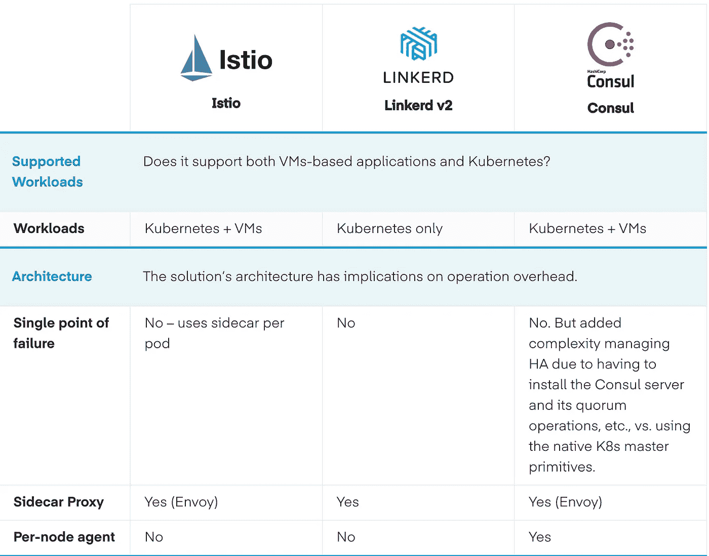
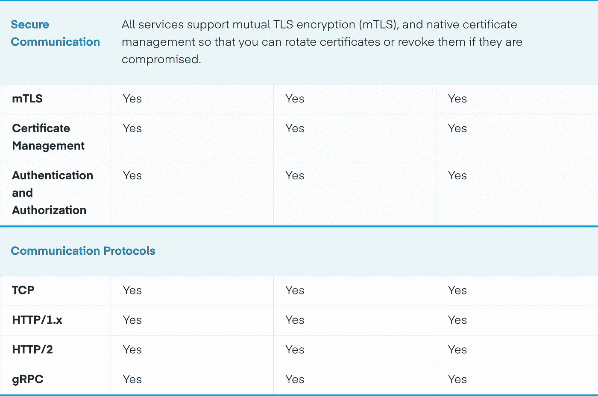
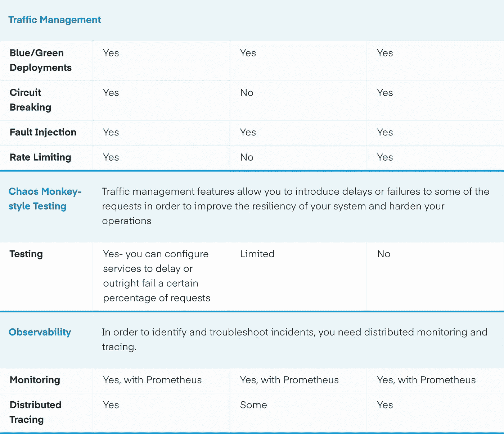
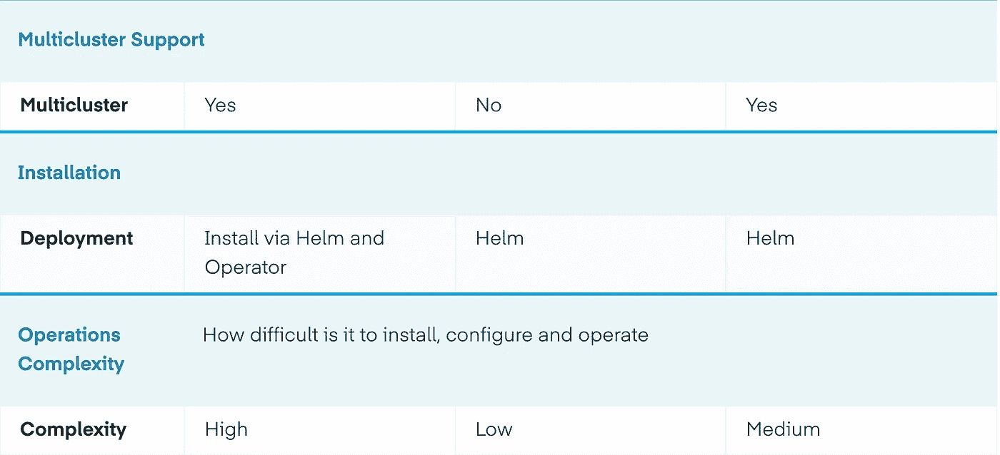
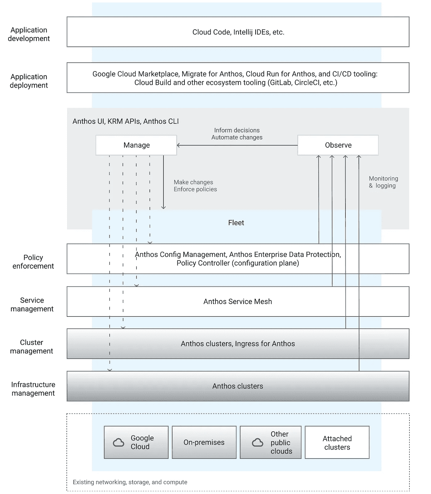

# 比较服务网格 Istio、Linkerd 和 Consul 的比较

> 原文：<https://medium.com/google-cloud/comparing-service-meshes-a-comparison-of-istio-linkerd-and-consul-7699357ac714?source=collection_archive---------1----------------------->

云原生应用程序被设计为一系列分布式微服务，它们运行在容器中，通过 kubernetes 进行编排。采用微服务架构会带来许多好处，包括增强的自主性、灵活性和模块化。但是，将单层整体应用程序解耦为较小的服务的过程引入了新的障碍:您如何知道正在运行什么？你如何推出新版本的服务？你如何保护和监控所有这些集装箱？

大多数使用微服务架构的公司在完全了解微服务蔓延之前不会完全理解。部署的小型服务数量呈指数级增长&微服务的这种指数级增长带来了一些挑战，比如如何在多个服务/版本之间进行路由、身份验证和授权、加密以及 Kubernetes 集群内的负载平衡。构建服务网格有助于解决其中的一些问题，甚至更多

正如容器从应用程序中抽象出操作系统一样，服务网格抽象出如何处理进程间的通信。

# 什么是服务网格

构建在 Kubernetes 上的微服务的激增使得人们对服务网格解决方案越来越感兴趣。微服务严重依赖网络。

服务网格管理服务之间的网络流量。与需要大量手动、容易出错的工作以及从长远来看不可持续的操作负担相比，它以一种更加优雅和可扩展的方式做到了这一点。

服务网格允许您将应用程序的业务逻辑与可观察性、网络和安全策略分离开来。它允许您连接、保护和监控您的微服务。

**连接:**服务网格使服务能够相互发现和对话。它支持智能路由来控制服务/端点之间的流量和 API 调用。这些还支持高级部署策略，如蓝/绿、canaries 或滚动升级等。

**安全:**服务网格允许您在服务之间进行安全通信。它可以强制执行允许或拒绝通信的策略。

**监视器**:服务网格使你的分布式微服务系统具有可观测性。Service Mesh 通常集成了现成的监控和跟踪工具(如 Kubernetes 中的 Prometheus 和 Jaeger ),允许您发现和可视化服务、流量、API 延迟和跟踪之间的依赖关系。

# Istio、Linkerd 和 Consul Connect 的比较

任何这些服务网将解决你的基本需求。选择归结于你是否想要比基本的更多。

到目前为止，Istio 拥有这三种服务网格中最多的特性和灵活性，但是请记住，灵活性意味着复杂性，因此您的团队需要为此做好准备。

对于只支持 Kubernetes 的极简方法，Linkerd 可能是最佳选择。如果您想要支持一个包含 Kubernetes 和 VMs 的异构环境，并且不需要 Istio 的复杂性，那么 Consul 可能是您的最佳选择。

# **Anthos 服务网格**

Anthos Service Mesh 是 Google 对强大的 Istio 开源项目的实现，允许您管理、观察和保护您的服务，而无需更改您的应用程序代码。

## 全面管理，句号

由于它是一个完全托管的产品，Anthos 服务网格消除了采购和管理您的服务网格解决方案的所有猜测和工作。你专注于开发优秀的应用程序。

## 了解您的应用

Anthos Service Mesh 强大的跟踪、监控和日志记录功能让您能够深入了解服务的执行情况、性能对其他进程的影响以及可能存在的任何问题。

## 简化的安全性

Anthos Service Mesh 通过为您提供自动和声明性地保护您的服务及其通信的工具，帮助您接受零信任安全模型。您可以使用一组不同的功能来管理服务之间的身份验证、授权和加密，所有这些都只需对应用程序本身进行很少或不做任何更改。

## 轻松的交通管理

使用 Anthos Service Mesh，您可以控制服务之间的流量和 API 调用，同时还可以了解您的流量。这使得通话更加可靠，您的网络更加强大，即使在不利的条件下。

有了 Anthos Service Mesh，你可以得到一个经过 Anthos 测试和支持的 Istio 发行版，让你在谷歌云和其他[平台](https://cloud.google.com/service-mesh/docs/supported-platforms)上创建和部署一个服务 Mesh，并得到谷歌的全面支持。