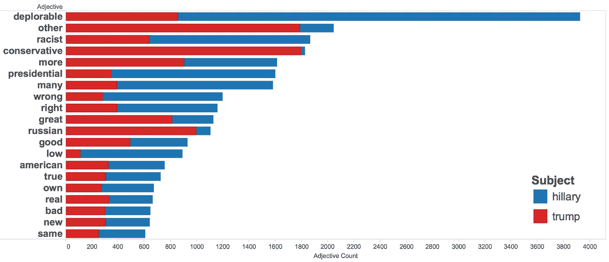
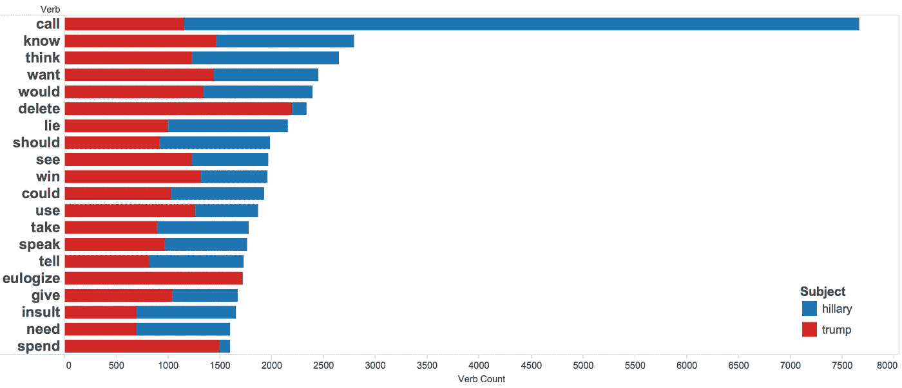
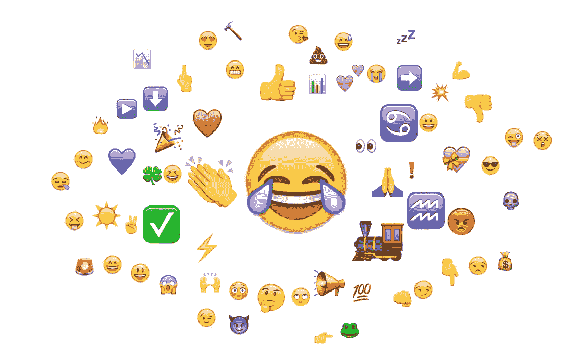
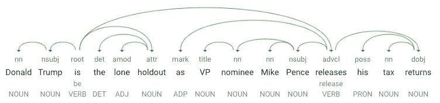
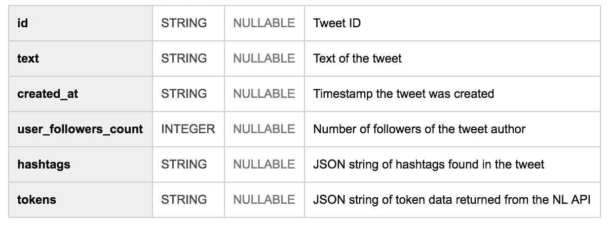
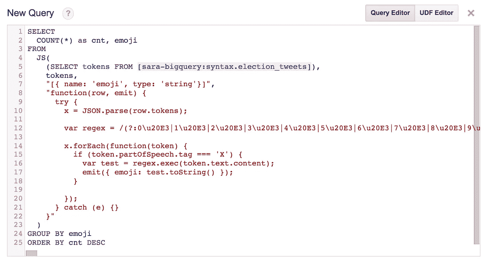
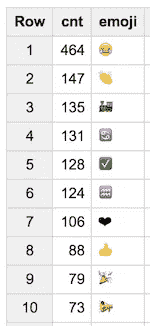
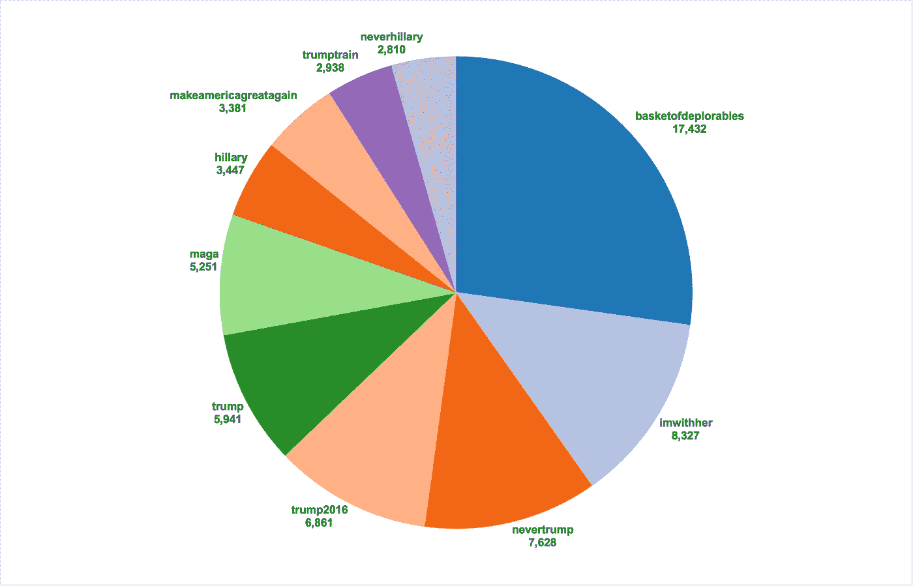
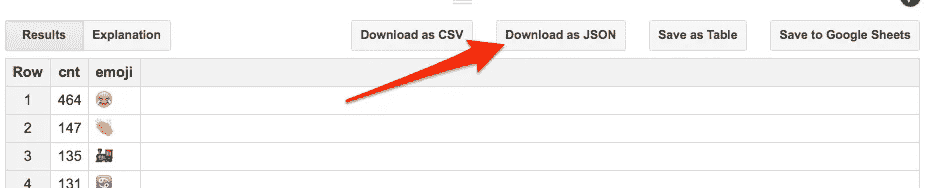

# 用自然语言处理比较关于特朗普和希拉里的推文

> 原文：<https://medium.com/google-cloud/comparing-tweets-about-trump-hillary-with-natural-language-processing-a0064e949666?source=collection_archive---------0----------------------->

人们在推特上是如何谈论希拉里和特朗普的？使用我在这里使用的相同方法来分析关于奥运会的推文，我处理了 9 月 9 日到 10 日关于两位候选人的 30 万条推文的数据。这是我想到的:

## **热门*形容词*在以希拉里或川普为主题的推文中使用**



## 在以希拉里或特朗普为主题的推文中使用的顶级动词



## **选举推文中最常用的表情符号**



我用了哪些工具？

*   [**Twitter 流媒体 API**](https://dev.twitter.com/streaming/overview) :获取所有选举推文
*   [**云自然语言 API**](https://cloud.google.com/natural-language/) :解析推文&获取语法数据
*   [**BigQuery**](https://cloud.google.com/bigquery) :分析推文语法数据
*   [**Tableau**](https://www.tableau.com/stories/topic/google-cloud-platform)**和一些 JavaScript 技巧:可视化数据**

# ****Twitter 流媒体 API:获取所有选举推文****

**我使用 Node.js 的 [Twitter 流媒体 API](https://dev.twitter.com/streaming/overview) 来传输提到希拉里或特朗普的推文。你可以在第一行代码中看到我寻找的粗体搜索词:**

```
var search_terms = '**#Trump2016**,**#ImWithHer**,**@HillaryClinton**,**@realdonaldtrump**,**#NeverTrump**,**#MakeAmericaGreatAgain**,**Hillary Clinton**,**Donald Trump**';client.stream('statuses/filter', {track: search_terms}, function(stream) { stream.on('data', function(tweet) {
    if (tweet.text.substring(0,2) != 'RT') {
      callNLApi(tweet);
    }
  }); stream.on('error', function(error) {
    console.log(error);
  });

});
```

**有一次我得到一条 tweet(不包括那些以“RT”开头的)，我把它发给自然语言 API 进行语法分析。**

# ****云自然语言 API:解析推文****

**新的[云自然语言 API](https://cloud.google.com/natural-language/) 有三种方法——语法标注、实体和情感分析。在这里，我将重点关注语法注释，但你可以查看这篇文章了解其他两个的细节。语法注释响应为您提供了有关句子结构和每个单词的词性的详细信息。Tweets 经常缺少标点符号，并且语法不总是正确的，但是 NL API 仍然能够解析它们并提取语法数据。例如，[这是我上传的大约 30 万条推文中的一条](https://twitter.com/Newsweek/status/774668800906043392):**

> **唐纳德·川普是唯一的拒绝者，副总统候选人迈克·彭斯公布了他的纳税申报单**

**下面是 API 为该推文返回的语法数据的可视化(您可以在这里创建自己的):**

****

**API 的 JSON 响应为您提供了上述依赖解析树中可视化的所有数据。它为句子中的每个标记返回一个对象(标记是一个单词或标点)。下面是上例中一个令牌的 JSON 响应示例，这里是单词“releases”:**

```
{
  "text": {
    "content": "releases",
    "beginOffset": -1
  },
  "partOfSpeech": {
    "tag": "VERB"
  },
  "dependencyEdge": {
    "headTokenIndex": 2,
    "label": "ADVCL"
  },
  "lemma": "release"
}
```

**让我们来分析一下答案:**标签**告诉我们‘发布’是一个动词。标签告诉我们这个词在上下文中的作用。这里是 **ADVCL** ，代表状语从句修饰语。 **headTokenIndex** 表示弧在依赖解析树中到这个标记的位置，每个标记作为一个索引。**[**lemma**](https://en.wikipedia.org/wiki/Lemma_(morphology))是单词的词根形式，如果你在统计一个单词的出现次数，并且想要合并重复项，这是很有用的(注意“releases”的 lemma 是“release”)。****

****下面是我对 NL API 的请求:****

```
**function callNLApi(tweetData) {
  var requestUrl = "https://language.googleapis.com/v1beta1/documents:annotateText?key=API_KEY" var requestBody = {
    “document”: {
       “type”: “PLAIN_TEXT”,
       “content”: tweetData.text
     }
  } var options = {
    url: requestUrl,
    method: “POST”,
    body: requestBody,
    json: true
  } request(options, function(err, resp, body) {
    if (!err && resp.statusCode == 200){ var tokens = body.tokens;
      // Do something with the tokens } 
  }
}**
```

****现在我有了 JSON 格式的所有语法数据，有无数种方法可以分析它。我决定将每条推文插入到一个 BigQuery 表中，并在以后找出如何分析它，而不是在推文进来时进行分析。****

# ******BigQuery:分析推文中的语言趋势******

****我创建了一个包含所有推文的 [BigQuery](https://cloud.google.com/bigquery/) 表，然后运行一些 SQL 查询来寻找语言趋势。下面是我的 BigQuery 表的模式:****

********

****BigQuery 表模式(每行是一条 tweet)****

****我使用 Google-cloud NPM 包将每条推文插入到我的表格中，只用了几行 JavaScript 代码:****

```
**var row = {
     id: tweet.id,
     text: tweet.text,
     created_at: tweet.created_at,
     user_followers_count: tweet.user.followers,
     hashtags: JSON.stringify(tweet.hashtags),
     tokens: JSON.stringify(body.tokens)
};table.insert(row, function(error, insertErr, apiResp) {
  if (error) {
    console.log('err', error);
  } else if (insertErr.length == 0) {
    console.log('success!');
  }
});**
```

*****现在该分析数据了！我的表中的 tokens 列是一个巨大的 JSON 字符串。幸运的是，BigQuery 支持[用户定义函数](https://cloud.google.com/bigquery/user-defined-functions)(UDF)，这允许您编写 JavaScript 函数来解析表中的数据。*****

****为了识别形容词，我查找了 NL API 返回的所有标记，其中 **ADJ** 作为它们的**部分语音**标签。但我不想要我收集的所有推文中的*所有*形容词，我真的只想要那些以希拉里或川普为句子主题的推文中的形容词。NL API 使用 **NSUBJ** (名义主题)标签来过滤符合这个标准的 tweets。[下面是完成的查询](https://gist.github.com/sararob/c1701d78523d4efe741203c08cc6a4bf)(内嵌 UDF)——它统计了所有以希拉里或川普为名词性主语的推文中的形容词。****

****为了统计表情符号，我修改了我的 UDF 来寻找所有带有 partOfSpeech 标签为 **X** (表示外国字符)的符号，并使用一个正则表达式来提取所有表情符号字符(感谢 [Mathias](https://twitter.com/mathias) 提供的[表情符号正则表达式](https://github.com/mathiasbynens/emoji-regex)！).以下是查询:****

********

****输出是:****

********

****当以表情符号标记云的形式查看时，这些数据会更有趣，详见下一节我是如何做到的。****

# ******可视化数据******

****我最喜欢 BigQuery 的一点是它与数据可视化工具的集成，如 [Tableau](http://www.tableau.com/) 、 [Data Studio](https://www.google.com/analytics/data-studio/) 和 [Apache Zeppelin](https://zeppelin.apache.org/) 。我将我的 BigQuery 表连接到 Tableau 来创建如上所示的条形图。Tableau 允许您根据正在处理的数据类型创建各种不同的图表。这里有一个饼状图，显示了我收集的推文中的前 10 个标签(小写以消除重复):****

********

****为了制作表情符号标记云，我从我的表情符号查询中下载了 JSON:****

********

****然后使用这个方便的 [JavaScript 库](https://github.com/lucaong/jQCloud)生成单词云。****

# ****下一步是什么？****

*   ****开始使用**自然语言 API** :在浏览器中试用[，深入](https://cloud.google.com/natural-language/#nl_demo_section)[文档](https://cloud.google.com/natural-language/docs/)，或者查看 [的](https://rominirani.com/tutorial-google-cloud-natural-language-api-910740100378#.obxvl0vpo) [one](https://cloud.google.com/blog/big-data/2016/08/structuring-unstructured-text-with-the-google-cloud-natural-language-api) [这些](https://cloud.google.com/blog/big-data/2016/07/using-the-cloud-natural-language-api-to-analyze-harry-potter-and-the-new-york-times)博客文章以获取更多信息****
*   ****从 **BigQuery** 开始:关注 [Web UI 快速入门](https://cloud.google.com/bigquery/quickstart-web-ui)或查看 [Felipe Hoffa](https://medium.com/u/279fe54c149a?source=post_page-----a0064e949666--------------------------------) 的任何中型帖子****

****有问题吗？在 Twitter 上找到我或者在评论中告诉我你的想法。****