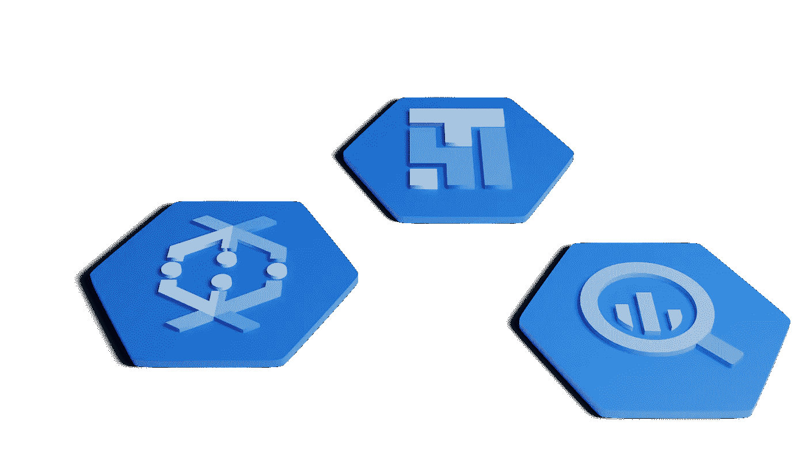

# 合成器、数据流和专用 IP 地址

> 原文：<https://medium.com/google-cloud/composer-dataflow-and-private-ip-addresses-c56086f699ea?source=collection_archive---------0----------------------->



公共 IP 地址是可从互联网寻址的地址。在 GCP 环境中，我们可以声明永远不应该为计算引擎分配公共 IP 地址。这可以在组织级别定义，并成为组织策略。对属于该组织的所有项目实施策略，包括可能由其他 GCP 产品作为其自身执行的一部分创建的计算引擎。我们可能希望禁用公共 IP 地址的原因是，这将减少*攻击面*。如果 GCP 的计算引擎不需要从互联网访问，那么将计算引擎定义为简单地不要求访问是正常的。但是，如果出现管理错误，则默认情况下，计算引擎可能会获得一个公共 IP 地址。组织级别的策略确保*没有*计算引擎可以拥有公共 IP 地址…无论是默认的、意外的还是试图要求一个。

现在让我们考虑数据流产品。这将执行分布在多个工作线程中的数据转换管道。默认情况下，这些工作人员使用公共 IP 地址相互协作。当我们向数据流提交作业时，我们可以传递一个参数，声明我们只使用私有 IP 地址。我们可以在用于提交数据流作业的`gcloud`命令中看到这个参数:

```
gcloud dataflow jobs run … --disable-public-ips …
```

[- disable-public-ips](https://cloud.google.com/sdk/gcloud/reference/dataflow/jobs/run#--disable-public-ips) 标志用于指示数据流仅使用私有 IP。

虽然查看`gcloud`命令很有趣，但是大多数数据流调用都是从调用 API 开始的。`gcloud`命令只是一个为调用这些 API 而预先构建的命令行工具。如果我们深入查看在数据流中运行工作的 API，我们将看到其余的[启动](https://cloud.google.com/dataflow/docs/reference/rest/v1b3/projects.locations.templates/launch)请求，该请求具有一个名为`environment`的参数，该参数定义了数据流作业应该运行的环境。在`environment`参数中，有一个名为`ipConfiguration`的参数，它可以取值为`WORKER_IP_PUBLIC`或`WORKER_IP_PRIVATE`。

简单地说，如果我们在一个禁止公共 IP 地址的环境中运行数据流，那么在数据流中运行作业的请求必须传递一个参数:

```
ipConfiguration=WORKER_IP_PRIVATE
```

到目前为止，我们已经讲述了一个关于调用数据流的通用故事，现在我们将注意力转向 Composer(气流)。在 Composer 中，我们可以从 DAG 调用数据流作业。当我们在 DAG 中有一个调用数据流的步骤时，DAG 作者可以提供传递给数据流进行解释的参数。这意味着我们想要设置并传递刚刚描述的`ipConfiguration`属性。理想情况下，我们需要如下内容:

```
default_args = {
  # Tell airflow to start one day ago, so that it runs as soon as you upload it
  "start_date": days_ago(1),
  "dataflow_default_options": {
    "project": project_id,
    # Set to your region
    "region": gce_region,
    # Set to your zone
    "zone": gce_zone,
    # This is a subfolder for storing temporary files, like the staged pipeline job.
    "temp_location": bucket_path + "/tmp/",    
    # Use private IP addresses
    "ipConfiguration": "WORKER_IP_PRIVATE"
  }
}
```

不幸的是，我们有一个问题。虽然数据流描述了可以设置的所有可能的参数，但气流(以及 Composer)产品有一个缺陷。只有数据流认可的可能参数的子集实际上被定义为在气流 DAG 配置中有效，并且`ipConfiguration`是**而不是**其中之一。尽管我们可以在 DAG 中设置该属性，但它在运行时会被忽略。

这个问题作为 Github 问题被追踪到 Airflow 项目，因为:

[#8300:无法使用私有 IP 配置创建数据流作业](https://github.com/apache/airflow/issues/8300)

幸运的是，这个问题已经解决。然而，正如你可能已经猜到的，我们仍然有一个问题。该解决方案和产生的代码修复是针对 Airflow 项目的主分支进行的，这意味着它将确保出现在 Airflow 的 v2.x 中(我们目前(2021–01)处于 1.x)。Composer 使用 Airflow 1.x，因此 Airflow 代码库中的解决方案仅适用于将来的某个版本。

幸运的是，我们已经测试了一个可行的解决方案，它看起来很有效。为了理解变通方法，您应该对一个叫做[猴子补丁](https://en.wikipedia.org/wiki/Monkey_patch)的概念有一个基本的了解。

假设你正在使用一个叫做`SomePackage`的 Python 包。现在假设您正在调用该包中一个名为`someFunction`的函数。您可以编写:

```
SomePackage.someFunction()
```

现在想象一下，当你调用某个函数时，它失败了或者没有完全按照你想要的去做。如果您可以访问 Python 包的源代码，您可能会发现其中有一个名为`_someInternalFunction`的内部函数，它包含一个阻碍您实现目标的错误。你想修补`_someInternalFunction`,但是你只是 Python 包的消费者，你不知道(也不想)如何用你的修改来重建整个包(即使那是可能的)。

相反，你可以做的是执行一个 Monkey 补丁，覆盖你想要改变的函数。您的新代码现在变成了:

```
def _myNewInternalFunction:
 # New code hereSomePackage._someInternalFunction = _myNewInternalFunction
SomePackage.someFunction()
```

结果是，当你现在调用`someFunction()`时，该函数的内部将调用`_someInternalFunction()`，但不是调用原始包提供的代码，而是调用你刚刚提供的作为`_someInternalFunction()`的新实现的代码。您已经有效地修补了软件包。这是一个被称为猴子修补技术的例子。

考虑到这一背景，有一个 Monkey 补丁可以与 Airflow (Composer)结合使用，这将导致尊重`ipConfiguration`参数。

在 Python DAG 中，早期包含以下代码:

```
# Required for the monkey patch
from airflow.contrib.hooks.gcp_dataflow_hook import DataFlowHook, _DataflowJob# We redefine the function that handles the environment keys 
# that are used to build the RuntimeEnvironment, to include 'ipConfiguration'
def _start_template_dataflow(self, name, variables, parameters,
                             dataflow_template):
    # Builds RuntimeEnvironment from variables dictionary
    # [https://cloud.google.com/dataflow/docs/reference/rest/v1b3/RuntimeEnvironment](https://cloud.google.com/dataflow/docs/reference/rest/v1b3/RuntimeEnvironment)
    environment = {}
    for key in ['numWorkers', 'maxWorkers', 'zone', 'serviceAccountEmail',
                'tempLocation', 'bypassTempDirValidation', 'machineType',
                'additionalExperiments', 'network', 'subnetwork', 'additionalUserLabels',
                'ipConfiguration']:
        if key in variables:
            environment.update({key: variables[key]})
    body = {"jobName": name,
            "parameters": parameters,
            "environment": environment}
    service = self.get_conn()
    request = service.projects().locations().templates().launch(
        projectId=variables['project'],
        location=variables['region'],
        gcsPath=dataflow_template,
        body=body
    )
    response = request.execute(num_retries=self.num_retries)
    variables = self._set_variables(variables)
    _DataflowJob(self.get_conn(), variables['project'], name, variables['region'],
                 self.poll_sleep, num_retries=self.num_retries).wait_for_done()
    return response# Monkey patching
DataFlowHook._start_template_dataflow = _start_template_dataflow
```

虽然有可能阅读此代码并理解它的作用，但我们的建议是将它视为一个黑盒，并在粘贴后尝试在 DAG 源文件中忽略它。理想情况下，在将来的某一天，已经在 Airflow master Github 分支中进行的代码更改将在 Composer 中可用，并且可以删除 Monkey 补丁。

有一个演示这个故事和测试的视频:

注意事项:

*   本文没有描述如何定义组织级别的策略，也没有强调用于禁用公共 IP 地址的特定策略。假设 GCP 管理员可以查阅有关 VPC 网络配置和 GCP 组织政策的文档。还应注意的是，Composer 和 Dataflow 配置使用的 VPC 网络启用了私有 Google 访问参数。默认为禁用。

另请参见:

*   [air flow . contrib . operators . data flow _ operator](https://airflow.apache.org/docs/apache-airflow/1.10.6/_api/airflow/contrib/operators/dataflow_operator/index.html#)
*   [数据流文档:指定您的网络和子网](https://cloud.google.com/dataflow/docs/guides/specifying-networks)