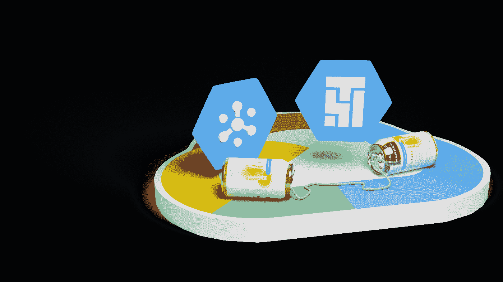
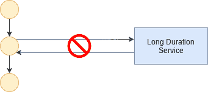
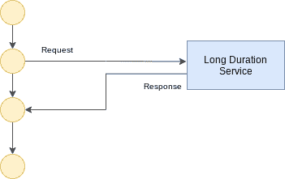
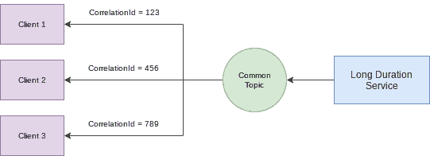
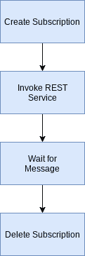
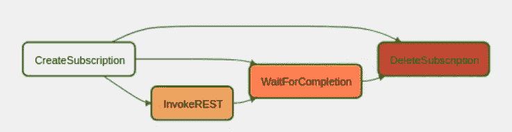

# Composer 调用长期运行的服务

> 原文：<https://medium.com/google-cloud/composer-invoking-long-running-services-4de2dfa5e33a?source=collection_archive---------0----------------------->



考虑一个场景，我们有一个任务，这是一个服务调用，由气流执行，可能需要几个小时。这是一个比我们所能保持的阻塞同步请求/响应调用更长的持续时间。同步 REST 调用不是一个好的解决方案。



我们想要的是异步请求/响应解决方案。



虽然可能有许多技术可供我们实现这一目标，但这里我们将使用 GCP 发布/订阅。现在让我们开始我们的探索。

我们可以想象，我们的 DAG in Airflow 中的一个任务将请求发起一个长执行持续时间的服务调用。我们可以使用 PubSub 来启动请求，但是在我们的故事中，我们将保持简单，使用 REST 请求来启动服务。这个 REST 请求会很快返回。它将仅用于启动服务，并且响应将仅指示服务现在正在进行其工作。

我们解决方案的核心是一份我们设计的存在于 Airflow 和服务提供商之间的合同。该合同规定，*当*后端服务完成其工作，*然后*它将发布一个消息到 GCP 的发布主题。在合同结束时，Airflow 将创建对该主题的订阅，并将关注将要发布的消息，该消息将指示服务请求已完成。

我们应该假设将会有多个服务客户端，它们可能会同时发出请求。我们需要确保将正确的响应返回给正确的调用者客户端。为了实现这一点，让我们看看 PubSub 提供的特性。

第一种选择是为每个请求创建一个*特有的*主题。当服务完成它的任务时，它会发布一条消息到那个主题。客户(气流)会订阅这个独特的主题。

第二种选择是让所有请求共享一个*主题。当一个服务完成时，它将再次向单个主题发布消息。这似乎有一个困惑，如果服务在完成它的工作时发布一个消息，正确的客户端如何知道它的*请求是完成的请求？答案是使用相关标识符(相关 ID)的概念。这是消息传递和队列技术中的常见做法。当发出请求时，会提供一个关联 id。当响应就绪时，发布一条消息，该消息包含最初提供的相关 id 值作为属性。这提供了请求和响应之间的耦合。在 GCP 技术中，当创建订阅时，我们可以提供一个*过滤器*，该过滤器丢弃(自动确认)发布到与订阅相关的主题的所有消息，除了那些匹配过滤器(关联 id)的消息。换句话说，只有具有正确相关 id 的消息才会被传递到匹配的客户端。**



由于过滤器应用于订阅，这意味着每个客户端都有自己的与相关 id 相关联的订阅。这实际上似乎是一个很好的解决方案，因为有一个与订阅相关的概念，它们可以过期，这意味着订阅在一段时间没有使用后会自动删除。这意味着，如果在订阅达到其目的后删除失败，订阅将随着时间的推移自行清理。

如果我们看一下涉及的零件，我们现在有:

*   由管理人员创建并由服务发布到的 GCP 主题。
*   由每个客户端在发送启动服务的请求之前创建的动态创建的订阅。对于匹配相关 id 的消息，订阅将有一个与之相关联的过滤器。

为了实现我们的目标，Airflow 要执行的步骤现在看起来是:



让我们从气流的角度依次看看每一个。

当我们创建订阅时，我们将为它生成一个唯一的名称。每个订阅都是互不相同的，只有为给定消费者发布的消息最终才能在正确的对应订阅上获得。为此，我们将使用订阅的唯一名称作为关联 id 的值。这意味着两件事。首先，当订阅被创建时，它将有一个过滤器表达式，以便只接收具有特定属性值的消息。其次，消息的发布者必须确保其发布的消息中包含将通过过滤器的属性。

Airflow 提供了一个 GCP 发布订阅操作，允许我们创建订阅。该操作被称为[PubSubCreateSubscriptionOperator](https://airflow.apache.org/docs/apache-airflow-providers-google/stable/_api/airflow/providers/google/cloud/operators/pubsub/index.html#airflow.providers.google.cloud.operators.pubsub.PubSubCreateSubscriptionOperator)。这是*非常*接近我们需要的，但它有几个缺点。最严重的限制是该操作不允许为过滤器传递动态计算的值。气流操作符*不*支持过滤器表达式作为模板参数。幸运的是，有一个解决方案。除了一组 GCP PubSub 操作符，Airflow 还提供了一个 GCP PubSub Airflow 钩子。这意味着我们可以编写一个调用 GCP PubSub 钩子的 Python 函数来实现我们的目标。

以下是在 Airflow 中执行创建订阅任务的代码:

```
def _createSubscription():
  subscriptionName = "airflow-test-" + str(uuid.uuid4())
  hook = PubSubHook()
  result = hook.create_subscription(
    topic="mytopic",
    subscription=subscriptionName,
    expiration_policy={
      "ttl": Duration(seconds=24*60*60)
    },
    labels={
      "source": "dag"
    },
    filter_='attributes.correlid = "' + subscriptionName + '"'
  )
  return subscriptionName  # The return value is the subscription namecreate_subscription_task = PythonOperator(
  task_id='CreateSubscription',
  python_callable=_createSubscription
)
```

拆开它，我们看到我们首先创建了一个订阅名称。还要注意订阅过滤器是动态构造的。该订阅将接收发布的消息，这些消息带有一个名为“correlid”的订阅名称值集的属性。

看下一步，我们看到它调用了一个 REST 服务。这是我们预计需要很长时间才能完成的服务。REST 调用本身将快速返回，但返回后执行将异步继续。

```
rest_invoke_task = SimpleHttpOperator(
  task_id='InvokeREST',
  http_conn_id='rest_serve',
  method='POST',
endpoint="/serve?correlid={{task_instance.xcom_pull(task_ids='CreateSubscription', key='return_value')}}",
  headers={},
 dag=dag
)
```

我们将使用提供的名为 SimpleHttpOperator 的气流操作符进行 REST 调用。请特别注意端点参数的值。在这里，我们传递服务将发布的相关 id 的值，以指示其工作已经完成。相关 id 的值是从 CreateSubscription 任务中检索的。

当 REST 调用者任务完成时，并不意味着后端服务已经完成。我们应该等待服务指示它已经这样做了。我们使用气流传感器来等待与订阅相关联的 PubSub 消息变得可用。PubSubPullSensor 是一个气流操作符，在有合适的消息可用之前不会完成。这将由服务代码发布。当我们使用这个操作符时，请注意它不会在消息发布后立即解除阻止。相反，它似乎会定期轮询(证据似乎显示轮询间隔为每分钟一次)。这意味着 DAG 可能需要一分钟的时间才能意识到后端服务已经完成。下面是说明等待消息的代码片段。请注意，项目 id 是必需的，它是订阅所在的项目。在这个片段中，我们提供了气流环境中的一个变量，而不是硬编码。

```
pubsubpullsensor_task = PubSubPullSensor(
  task_id="WaitForCompletion",
  project_id="{{var.value.GCP_PROJECT}}",
  subscription=subscription,
  max_messages=1
)
```

当在 DAG 中完成该任务时，直到订阅上有可用的消息，该任务才会完成。

最后，实现我们总体目标所需的所有任务都已完成。剩下的工作就是通过删除订阅进行清理。从技术上讲，我们不必删除订阅，因为它在创建时就被定义为在一天后自动过期。有一个预先提供的气流操作满足我们的需求。

```
delete_subscription_task = PubSubDeleteSubscriptionOperator(
  task_id='DeleteSubscription',
  subscription=subscription
)
```

我们现在可以将这些任务与以下内容联系起来:

```
create_subscription_task >> rest_invoke_task >> pubsubpullsensor_task >> delete_subscription_task
```

当我们运行该解决方案时，我们会看到最终的执行图，如下所示:



您可能会惊讶地发现，有从 CreateSubscription 到其他任务的链接。这是因为 CreateSubscription 会生成下游需要的订阅名称。这意味着任务 WaitForCompletion 和 DeleteSubscription 对 CreateSubscription 有显式的依赖关系。

完整的代码变成:

```
from datetime import timedelta, datetime
from airflow import DAG
from airflow.operators.python_operator import PythonOperator
from airflow.providers.http.operators.http import SimpleHttpOperator
from airflow.providers.google.cloud.operators.pubsub import PubSubDeleteSubscriptionOperator
from airflow.providers.google.cloud.sensors.pubsub import PubSubPullSensor
from airflow.providers.google.cloud.hooks.pubsub import PubSubHook
from google.cloud.pubsub_v1.types import Duration
import uuiddefault_args = {
    'owner': 'airflow',
    'depends_on_past': False,
    'email_on_failure': False,
    'email_on_retry': False,
    'retries': 1,
    'retry_delay': timedelta(minutes=5),
}with DAG(
    'test',
    default_args=default_args,
    schedule_interval="[@daily](http://twitter.com/daily)",
    start_date=datetime(2021, 12, 10),
) as dag:def _createSubscription():
        hook = PubSubHook()
        subscriptionName = "airflow-test-" + str(uuid.uuid4())
        result = hook.create_subscription(
            topic="mytopic",
            subscription=subscriptionName,
            expiration_policy={
                "ttl": Duration(seconds=24*60*60)
            },
            labels={
                "source": "dag"
            },
            filter_='attributes.correlid = "' + subscriptionName + '"'
        )
        return subscriptionName  # The return value is the subscription namecreate_subscription_task = PythonOperator(
        task_id='CreateSubscription',
        python_callable=_createSubscription
    )subscription = create_subscription_task.output# Invoke the back end REST Service
    rest_invoke_task = SimpleHttpOperator(
        task_id='InvokeREST',
        http_conn_id='rest_serve',
        method='POST', 
        endpoint="/serve?correlid={{task_instance.xcom_pull(task_ids='CreateSubscription', key='return_value')}}",
        headers={},
        dag=dag,
    )sensor1_task = PubSubPullSensor(
        task_id="WaitForCompletion",
        project_id="test1-305123",
        subscription=subscription,
        max_messages=1
    )delete_subscription_task = PubSubDeleteSubscriptionOperator(
        task_id='DeleteSubscription',
        subscription=subscription
    )create_subscription_task >> rest_invoke_task >> sensor1_task >> delete_subscription_task
```

后端服务将负责在完成长时间运行的工作后发布消息。它将被传递相关 id 的值，该值应该作为属性包含在消息中。

下面是这种应用的一个例子。

```
# Sample Flask application that exposes a sample REST service
#
# /serve?correlid=???
#import flask as Flask
import threading
import time
import os
from google.cloud import pubsub_v1app = Flask.Flask(__name__)# Sample long running task that executes for an extended period of time.
def long_running_task(**kwargs):
    correlid = kwargs.get('correlid', {}) # Retrieve the correlid value from the passed in parameters.
    print("Starting long running background task")# Do some busy work for a period of time.
    for i in range(10):
        time.sleep(1)
        print(str(i+1) + " of 10")

    # The long running work has been completed, publish an event that the work has completed.
    publisherClient = pubsub_v1.PublisherClient()
    topic_name = publisherClient.topic_path(os.getenv('GOOGLE_CLOUD_PROJECT'), os.getenv('GCP_TOPIC'))
    future = publisherClient.publish(topic_name, b'Work Done!', correlid=correlid)
    future.result()
    # End of long_running_task# Define the Flask endpoint:  POST /serve?correlid=<CORRELID>
[@app](http://twitter.com/app).route("/serve", methods=['POST'])
def serveRequest():
    correlid = Flask.request.args.get('correlid')  # Get the requested Correlid
    print("The Correlid was " + correlid)
    data = Flask.request.data.decode('utf-8')# Start the background thread that runs the long running task
    thread = threading.Thread(target=long_running_task, kwargs={'correlid': correlid})
    thread.start()# Return the response to the REST request.
    return Flask.make_response("Hello {}".format(data), 200)
    # End of serveRequestif __name__ == "__main__":
    print(f"Project: {os.getenv('GOOGLE_CLOUD_PROJECT')}, Topic: {os.getenv('GCP_TOPIC')}, Port: {os.getenv('PORT')}")
    app.run(host='0.0.0.0', port=int(os.environ.get("PORT", 5000)))
```

包含该解决方案所有构件的 GitHub 项目可在[这里](https://github.com/kolban-google/composer-pubsub)获得。

可以在这里找到一段描述这个故事的短片: