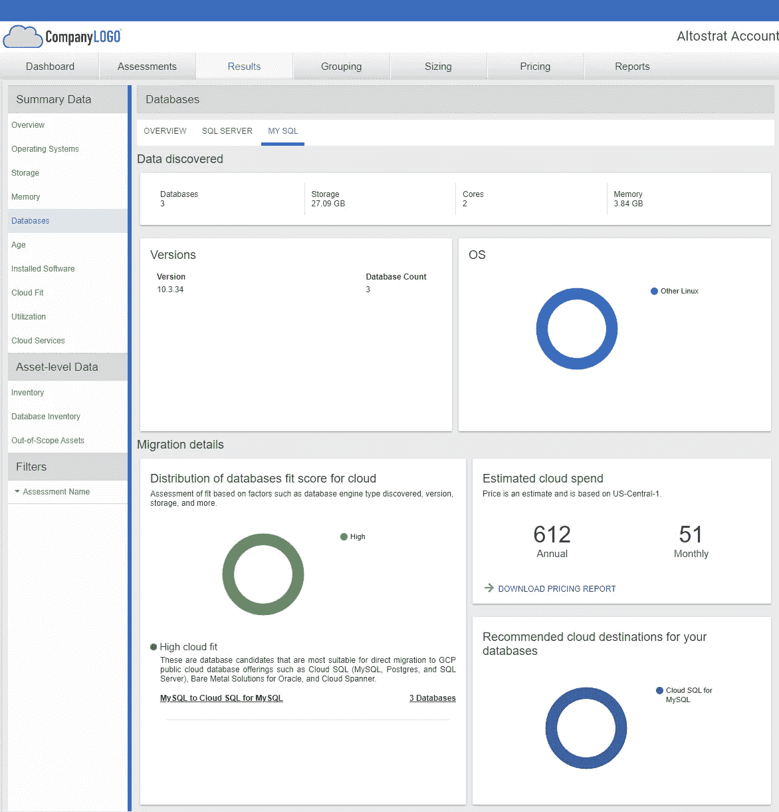
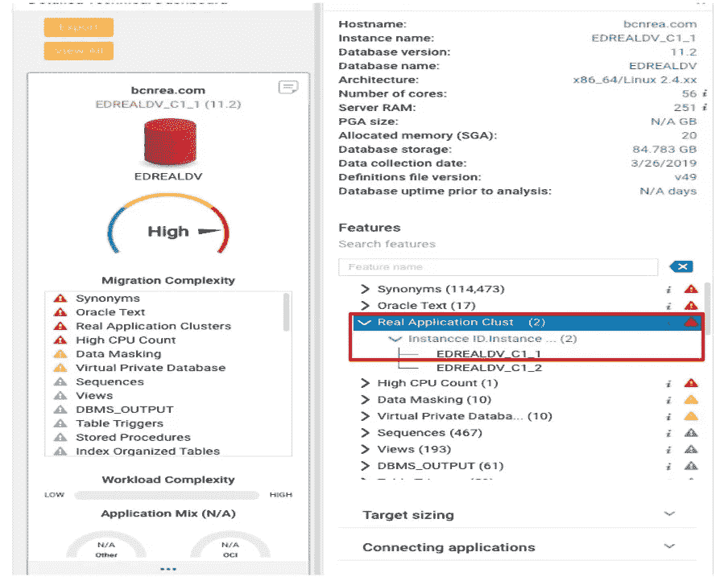

# 企业数据库迁移的综合方法

> 原文：<https://medium.com/google-cloud/comprehensive-approach-to-enterprise-database-migration-b242efc1ae98?source=collection_archive---------2----------------------->

**这篇博文是一系列关于数据库迁移方法的博客**,当您开始在 Google cloud 上进行数据库迁移和现代化之旅时，需要注意这些方法。

我们经常使用工具进行复杂的数据库迁移，这些工具最终不会给用户带来好处，并且会导致灾难性的失败和许多其他后果。

在 Google cloud，我们遵循全面的方法或框架来降低数据库迁移过程中的风险。我们从以下 3 种方法开始

1.  **发现** —数据库迁移复杂、耗时且极具挑战性。在此发现阶段，目的是清楚了解客户的关键业务驱动因素及其着手迁移和现代化的动机。理解客户的业务用例以及映射到用例的技术考虑。对客户进行 Google 云数据库产品组合的培训也是关键。理想情况下，建议举办一个从几小时到半天的研讨会。
2.  **范围界定&评估** —一旦发现研讨会完成，我们建议对客户 IT 环境中的数据库足迹进行范围界定和评估。本练习的目的是最好使用工具进行分析，以了解数据库环境和迁移复杂性。

在 Google，我们推荐 [Startozone](https://cloud.google.com/migrate/stratozone/docs/about-stratozone) 来获取支持数据库环境的基础设施详细信息，即 vCPUs、RAM(内存)、存储、操作系统等。这是理解客户数据资产的良好开端，通常称为“数据资产范围界定”。对其进行范围划分，以清楚地了解数据资产和潜在的迁移目标。

几个来自 Startozone 工具的截图，用于 MySQL 数据库的数据库洞察。

> **截图清晰地突出了 MySQL-3 数据库和 SQL Server-1 数据库的数据库占用空间**

> **下图清楚地突出显示了 MySQL 数据库的各种基础架构细节，即内核、内存、存储、操作系统等。**

> 范围界定后**数据库迁移评估**是帮助消除迁移挑战风险并为迁移规划阶段提供意见的关键。我们建议使用[MIG visor](http://doc.migvisor.com/mdoc)(Google Cloud Partner Tooling)。migVisor 是一个 SaaS 平台，主要帮助开始评估数据库迁移的复杂性，以经济高效的方式加速数据库迁移。工具事实上可以给 GCP 邮报目标数据库的总拥有成本分析的复杂性。目前，它支持 GCP 云 SQL 和 Spanner 作为托管数据库服务的目标。

假设您的数据源是在本地运行的 Oracle 数据库或任何其他云虚拟机，您可以获得关于迁移到 Postgres DB 引擎或 MySQL 引擎或云 SQL 上的 SQL Server 引擎的复杂性的建议和分析。migVisor 提供了跨平台的收集选项，以及一个基于 web 的控制台来探索和理解迁移的复杂性。它对您的源数据库进行一次性扫描，并突出显示源数据库配置、模式、专有数据库功能、应用程序代码现代化和当前数据层处理。这些见解对于分析迁移的复杂性至关重要。例如，Real Application Cluster 在 Oracle world 中被亲切地称为 RAC，这将导致从 Oracle 迁移到 Postgres 或 mysql 等的复杂性很高，而不是中等或较低，因为 RAC 是 Oracle 数据库专有的。

> 一旦你登录 console.migvisor.com，下面的几个截图。来自分析模块的屏幕截图—分析源数据库，即 Oracle 和云 SQL 上 Postgres 数据库引擎的迁移分析。**屏幕截图中的红框突出显示了 Oracle 数据库专有特性的使用，即具有 2 个实例 id 的 Real application cluster，这需要在云 SQL 中的 Postgres 数据库引擎上重新架构**

> **来自比较模块**的屏幕截图——比较仪表板提供了将特定源迁移到特定目标的复杂性的成对研究。**在我的例子中，Postgres 13(Cloud SQL)是 Google cloud 上的一个目标。**

> **您可以继续选择所需的复选框，即各种数据库引擎。同样，在图像的右侧，您可以看到具有高度迁移影响和中度迁移影响。**

以上见解对数据库迁移计划有很大帮助，包括使用工具进行实际迁移。

**3。迁移** —最后但并非最不重要的一点是将这些来自您之前步骤的见解整合到您的迁移计划中。一旦迁移完成，该步骤必须具有数据验证和回滚策略。

# **请在我的下一篇博客中关注关于使用正确工具的迁移计划的更多细节。**