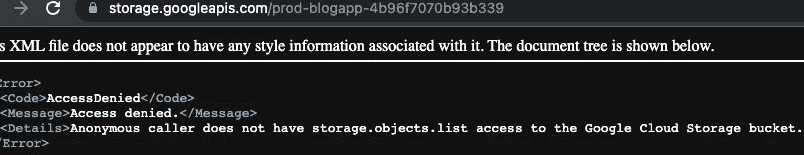
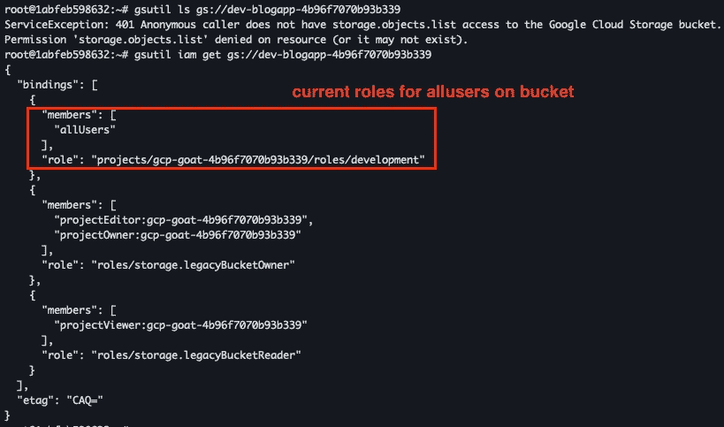
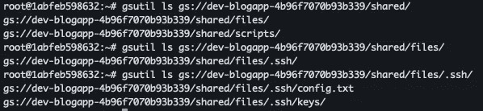

# 危及易受攻击的 INE GCP 实验室 GCPGoat 演练。第一部分

> 原文：<https://medium.com/google-cloud/compromising-a-vulnerable-gcp-ine-labs-gcpgoat-walkthrough-part-1-90090ed0448b?source=collection_archive---------6----------------------->

大家好，

随着新的一年的开始，我们必须记住网络安全不断发展的本质，以及不断了解最新威胁和最佳实践的必要性。

## 这篇文章是关于什么的？

今天我们将讨论 GCPGoat:一个由#INE 实验室开发的易受攻击的 GCP 基础设施，该基础设施挑战如何破坏应用程序并获得应用程序所在的 GCP 的管理员访问权限。https://github.com/ine-labs/GCPGoat
T3

## 我们将从中学到什么？

在我们应对挑战并了解环境后，我们将尝试总结如何缓解这种情况，以及可以实施哪些保护 GCP 环境的最佳实践。

GCPGoat 提供了各种挑战，包括应用程序攻击和云错误配置，这将导致对 Web-app 的管理权限和对 GCP 项目的特权访问。我们将只关注分解步骤，这些步骤将导致访问托管应用程序的 GCP 项目。


如果你需要关于如何在你的个人 GCP 账户上设置 GCPGoat 应用程序的指导，你可以在这篇文章的末尾找到它们；如果您只是在寻找一个演练，那么让我们开始吧。
如果安装成功，最后会提供一个 Web-app 的云功能 URL，如下图所示。


我们来看看 web app 和门户网站。最初的挑战是在同一个上通过配置不正确的存储桶(开发存储),我们搜索门户上的所有博客并收集所有正在进行的调用，捕获访问门户时进行的调用显示在存储桶上对存储对象访问进行了多次调用 Google api。


上面捕获的数据显示，这个存储桶的名称是 prod 让我们看看是否能得到这个桶的所有对象。
访问 bucket 以获取所有对象被拒绝，但可以访问单个对象，这表明 bucket 具有细粒度的 ACL。



经过一些阅读和帮助，找到了一个用于测试 bucket 权限的存储 API 文档[这里](https://cloud.google.com/storage/docs/json_api/v1/buckets/testIamPermissions)。这将使您能够在执行未经身份验证或经过身份验证的查询时，确定相关的权限是否与 bucket 相关联。
我们将使用一个未经验证的 API 调用来检查 bucket IAM 权限( [ref](https://cloud.google.com/storage/docs/access-control/iam-permissions) )是否映射到同一个上的“ [allUsers](https://cloud.google.com/iam/docs/overview#all-users) ”。

```
 curl \
  'https://storage.googleapis.com/storage/v1/b/prod-blogapp-4b96f7070b93b339/iam/testPermissions?permissions=storage.objects.create&permissions=storage.objects.delete&permissions=storage.objects.get&permissions=storage.objects.getIamPolicy&permissions=storage.objects.list&permissions=storage.objects.setIamPolicy&permissions=storage.objects.update&permissions=storage.buckets.delete&permissions=storage.buckets.get&permissions=storage.buckets.getIamPolicy&permissions=storage.buckets.setIamPolicy&permissions=storage.buckets.update' 
```

```
{
  "kind": "storage#testIamPermissionsResponse",
  "permissions": [
    "storage.objects.get"
  ]
}
```

因此，对于 bucket“prod-blogapp-4b 96f 7070 b 93b 339 ”,我们只有“storage.objects.get ”,这对我们的进一步开发没有帮助；相反，让我们通过简单地将上面的 bucket 名称中的单词“prod”改为“dev”来确定我们是否有一个 dev bucket。

是的，我们可以在相同的上访问 dev bucket 并运行 testIamPermissions 未经身份验证的调用，并获得 bucket 的权限。


尽管我们无法检索 dev bucket 中的所有对象，但上面突出显示了一个有趣的权限集“all users ”( storage . buckets . setiampolicy)。似乎我们可以在同一个上为 bucket 设置 IAM 权限，所以让我们使用 gsuitl 命令来这样做，如下所示。
为了保证在本地设置中没有已经存在的权限/帐户重叠，当利用权限进行未经验证的调用时，最好使用带有 [gcloud-sdk](https://hub.docker.com/r/google/cloud-sdk/) 的新 docker 实例。



```
gsutil iam ch allUsers:objectViewer gs://dev-blogapp-4b96f7070b93b339
```

上述命令会将“存储对象查看器”角色设置为“allusers ”,这也会设置“storage.objects.lists ”,这样我们就可以在同一个上获取存储桶中的所有对象。


让我们把所有的东西都列在桶上，看看我们是否有什么有趣的东西。如果您查看共享目录，您会在/shared/files/找到一些有趣的文件，它们的名称是 config.txt 和 ssh keys 目录。ssh/
让我们使用命令
将它们转储到本地:“gsutil CP-r GS://dev-blogapp-4b 96 f 7070 b 93b 339/shared/files/*/tmp/”



查看 config.txt 文件后，我们可以看到 host 的公共 IP 地址、用户名和 ssh 密钥文件的路径。似乎我们也可以连接到实例的端口 22。


但是 ssh 失败，并出现如下拒绝权限错误


ssh 密钥文件拥有过高的权限，如上面的错误所示。ssh 密钥私有文件的权限应该仅限于所有者，而不是其他任何人。因此，更新文件的权限并重试 ssh 确实成功了，并且我能够连接到机器。


获得对实例的访问权限后，无法运行任何 sudo 命令，但可以在实例上执行 gcloud CLI。
发现该实例与默认的计算引擎服务帐户绑定，该帐户默认带有编辑角色，这允许通过“gcloud 计算实例列表”获得项目上正在运行的实例。


因此，我们在同一个项目中有另一个名为“admin-vm”的实例，我们目前在“developer-vm”上，让我们尝试进入“admin-vm”

下一篇文章继续…

# **应用程序设置提示**

按照给出的说明在 [GitHub](https://github.com/ine-labs/GCPGoat) 上安装应用程序。最好的方法是在云 shell 终端上运行这些步骤，在本地运行会面临多重挑战。

-如果在本地运行，请确保在相同的和 gcloud SDK 上安装了 terraform。
此外，如果您已经在本地设置了多个帐户，请确保将配置设置为需要托管应用程序的相应项目和帐户 ID，并确认运行“gcloud config 配置列表”。
-一旦你有了创建新项目的权限，按照这里提到的[的默认安装步骤](http://Run terraform plan before apply to confirm the changes that going to be deployed, though the list is huge but would be good to grab to a file via command terraform plan -no-color > output.txt. After terraform apply is completed successfully you would be given with a cloud function URL for web app which is vulnerable to attack for explotation.)进行操作。
-在应用前运行“terraform plan”以确认将要部署的更改，虽然列表很大，但最好通过命令 terraform plan-no-color>output . txt .
-在 terra form 应用成功完成后，您将获得一个 web 应用的云函数 URL，该 URL 容易受到攻击。

如果你想在你的 GCP 上运行探索应用程序，希望现在一切都准备好了，如果你遇到任何问题，欢迎在下面分享评论。