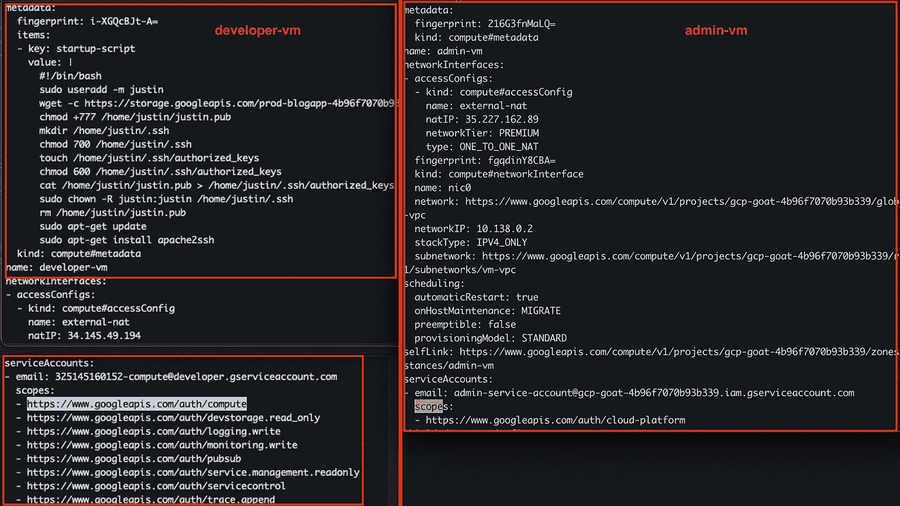
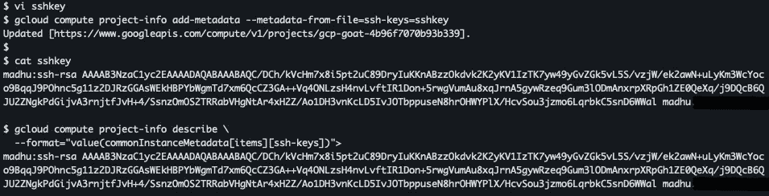
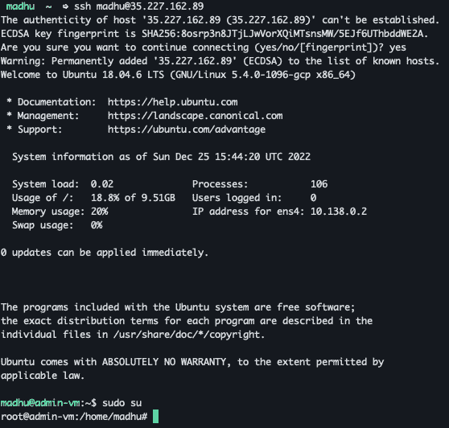
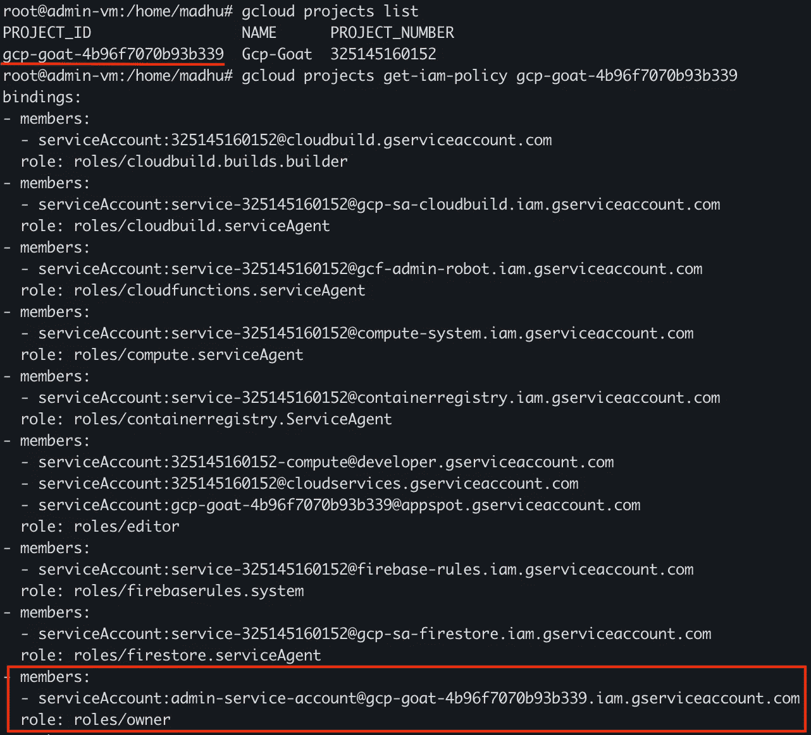
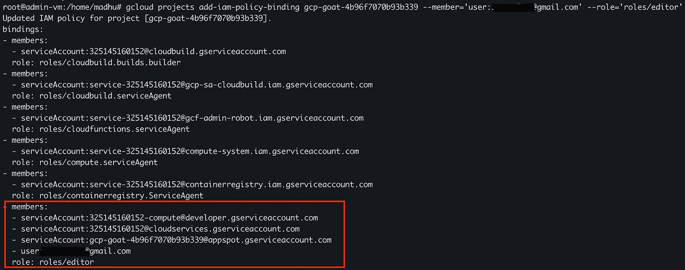
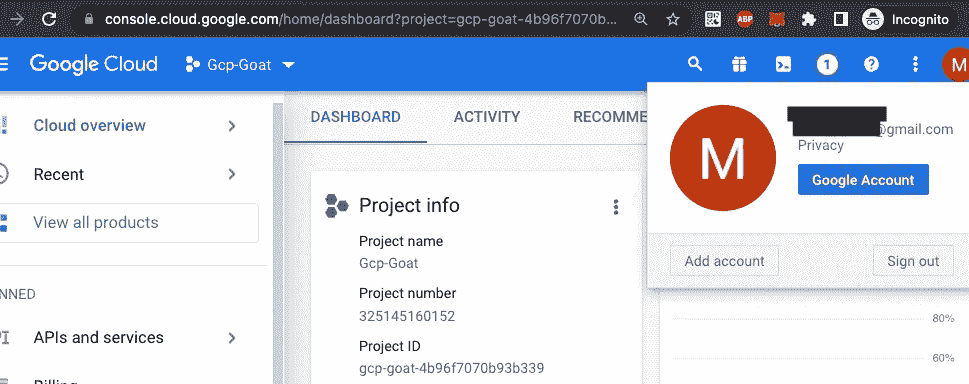

# 危及易受攻击的 INE GCP 实验室 GCPGoat 演练。第二部分

> 原文：<https://medium.com/google-cloud/compromising-a-vulnerable-gcp-ine-labs-gcpgoat-walkthrough-part-2-1674abd16a40?source=collection_archive---------6----------------------->

大家好，欢迎回来，如果你还没有看之前的帖子，请快速浏览这里的。

由于我们已经通过 developer-vm 获得了项目中当前运行的所有实例的访问信息，我们现在必须确定如何获得对 admin-vm 的访问。我们应该从开发虚拟机获得虚拟机的所有元数据信息。让我们使用下面的命令来查看这两个实例的元数据。
“云计算实例描述开发者-虚拟机”



快速浏览上面的详细信息后，我们能够在 developer-vm 上运行 gcloud compute 命令的原因现在很清楚了。虚拟机将计算 api 访问权限添加到范围中，因为它绑定到的默认服务帐户默认情况下对项目具有编辑权限。
查看连接到 admin-vm 的帐户，它似乎是项目的 admin 帐户。

让我们尝试利用开发计算虚拟机的计算 API 访问来访问管理虚拟机。因此，为了访问虚拟机，我们必须将我们的公共 ssh 密钥添加到虚拟机的元数据中。让我们尝试向计算元数据添加密钥，以授予对项目所有虚拟机的访问权限。

创建新文件并添加格式为“用户名:ssh _ key _ goes _ here”
的公钥，运行以下命令添加 sshkeys 以计算项目级别的元数据

```
gcloud compute project-info add-metadata-from-file=ssh-keys=filename
gcloud compute project-info describe --format="value(commonInstanceMetadata[items][ssh-keys])"
```



一旦我们将 ssh 密钥添加到计算元数据中，我们现在就能够通过 ssh 进入 admin-vm。



因此，我们可以访问虚拟机，并获得项目名称和项目上的 IAM 绑定列表，如下所示，看起来绑定到虚拟机的服务帐户对项目拥有所有者权限。



因此，有了上述权限，我们应该能够将我们的帐户添加到控制台访问项目，它确实工作。



所以我们妥协了这个项目并获得了优先使用权。

**我们应该从中学到什么？**

让我们快速检查一下是什么因素导致了攻击，以及什么样的最佳实践实施可以防止攻击。setIAMPolicy 设置为 allusers 的 bucket 权限
总是检查没有 Bucket 暴露给 IAM 级别的 allUsers/allAuthenticated。如果必须向公众公开存储桶，请检查是否只设置了 storage.objects.get 对象查看器权限，而没有设置其他权限。
-)将私有密钥等敏感文件存储在桶中，供内部用户访问。
使用 secrets manager，将访问权限仅限于特定的 svc 帐户，而不是将敏感密钥保存在云存储中。
-)用于实例的默认计算引擎帐户。
实施组织策略(“自动 IAM 授权给默认服务帐户”)以避免提供默认 svc 帐户，该帐户默认情况下具有编辑角色。相反，创建新的服务帐户，并且在虚拟机上仅具有有限的所需权限和有限的范围。( [Ref](/google-cloud/organization-policies-that-needs-to-be-enforced-to-tighten-your-gcp-security-f3bfb724e9dd) )
-)避免使用具有所有者权限的服务帐户
在项目上设置具有所有者权限的服务帐户不是一个好主意。因为以高特权访问 svc 帐户总是会导致问题和滥用。
-)强制实施“域受限共享”的组织策略
默认情况下，允许将所有工作区域帐户添加到 IAM 策略中。这是很好的限制，只有某些领域的帐户只允许在同一个。[参考](/google-cloud/organization-policies-that-needs-to-be-enforced-to-tighten-your-gcp-security-f3bfb724e9dd)

希望这有助于学习在 GCP 上建立一些标准，感谢 INE 实验室的 GCPGoat。很快再见。