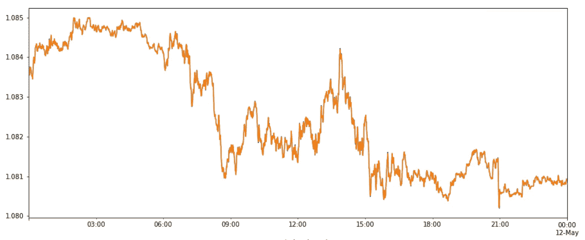

# 在谷歌云中大规模计算时间序列指标

> 原文：<https://medium.com/google-cloud/computing-time-series-metrics-at-scale-in-google-cloud-532ea4683e71?source=collection_archive---------1----------------------->

这篇博客文章展示了数据科学家和工程师如何使用 [GCP 数据流](https://cloud.google.com/dataflow)实时或批量计算时间序列指标，以大规模回填数据，例如[检测市场数据或物联网设备中的异常](https://cloud.google.com/blog/products/data-analytics/anomaly-detection-using-streaming-analytics-and-ai)。它在一个易于理解的 Jupyter 笔记本中比较了从外汇市场数据中得出的一些基本统计指标(移动平均数和标准差)，在 [Python Pandas](https://pandas.pydata.org/) 和新的 [Apache Beam 时间序列库](https://github.com/GoogleCloudPlatform/dataflow-sample-applications/tree/master/timeseries-streaming)之间。

# 我们要解决什么？

当提到[时间序列](https://en.wikipedia.org/wiki/Time_series)数据时，我们指的是按时间索引的数据点，因此基本上它们包括与我们想要生成的洞察或指标相关的时间戳。

时间序列示例

我们经常需要从这个时间索引数据点生成度量，也称为机器学习中的特征，用作我们预测或推理模型的输入。

但在其他时候，这些相同的指标也与最终用户直接识别趋势或突变有关，这意味着企业希望快速识别趋势中的这些异常，以便能够利用它们(例如价格或客户需求变化)，或在它们成为问题之前识别风险(例如，网络攻击，如检测为网络[拒绝服务攻击](https://en.wikipedia.org/wiki/Denial-of-service_attack)准备的机器人)。

在这种情况下，[流分析](https://cloud.google.com/learn/what-is-streaming-analytics)旨在持续计算这些指标，因为数据从无限的来源流入系统，例如来自连接设备的遥测数据、客户使用 web 应用程序生成的日志文件、电子商务交易或来自社交网络或地理空间服务的信息。

# 我明白，但是挑战是什么？

当您根据时间序列数据计算这些指标时，如移动平均值、标准偏差或其他类型的统计指标，您通常会面临以下挑战:

*   作为一名用户，我希望能够实时计算这些指标，将这些指标应用到我的无界数据集中，而不是在回顾中计算这些指标，这样我就可以利用它们或几乎实时地识别风险。
*   我经常需要拍摄这些指标的快照，我的意思是让所有的指标值在相同的时间段内“同步”计算。
*   为了能够获得这些快照，我实际上需要并行和大规模地计算这些指标，以便在更多事件到来或添加更多指标时，我可以继续处理数据。
*   我还需要能够在没有接收到事件时填补空白，因为我不能暗示该值默认为 0，这将影响我的一些统计计算，如移动平均值。
*   大规模计算历史上相同的指标，以便能够用新的指标回填您的数据，而且当我冷启动管道时，还可以引导这些指标缺少的输入数据。

# 嗯，那你怎么解决呢？

当谈到实时获取指标时，我们在流分析框架中确实有可用的原语，如 [Apache Beam](https://beam.apache.org/) ，它提供了丰富的 API，如[计时器](https://beam.apache.org/blog/timely-processing/)和[循环计时器](https://beam.apache.org/blog/looping-timers/)，允许实时处理时间序列数据——这个[时间序列库](https://github.com/GoogleCloudPlatform/dataflow-sample-applications/tree/master/timeseries-streaming)为您提供的是一组[包装器](https://github.com/GoogleCloudPlatform/dataflow-sample-applications/tree/master/timeseries-streaming#general-patterns)，用特殊的[聚合](https://github.com/GoogleCloudPlatform/dataflow-sample-applications/tree/master/timeseries-streaming#aggregations)和[数据对象](https://github.com/GoogleCloudPlatform/dataflow-sample-applications/tree/master/timeseries-streaming#data-proto-objects)封装这些原语， 因此，作为开发人员，您可以专注于业务价值，而不是试图学习和优化如何最好地使用这些原语。

[谷歌云](https://cloud.google.com/)中的分布式计算解决了关于“同步”和并行地拍摄和计算所有这些指标的问题，通过分布在许多 [GCP 数据流](https://cloud.google.com/dataflow)工人中的某些关键字来计算这些指标，然后在可扩展的汇中聚合结果，如 GCP [Pubsub](https://cloud.google.com/pubsub) 或 [BigQuery](https://cloud.google.com/bigquery) 。

谷歌数据流

这个时间序列库还提供了当没有接收到事件时[填充间隙](https://github.com/GoogleCloudPlatform/dataflow-sample-applications/tree/master/timeseries-streaming#gap-filling)的机制，例如默认为最后一个已知值。

最后但同样重要的是，可以使用相同的构造来重新计算历史数据，以:

*   回填历史数据集，例如，当添加新指标或稍后提供错过的历史事件时。
*   但最重要的是，当冷启动一个流管道，用以前的事件给工人补水时。

# 有什么你不知道的吗？

对于时间序列数据的批处理和追溯处理，有许多引擎和架构模式。**[**这个时间序列库**](https://github.com/GoogleCloudPlatform/dataflow-sample-applications/tree/master/timeseries-streaming) **的主要目的是当数据不适合内存时，便于实时和大规模地计算这些指标，而不是专门关注批处理/大规模类型的计算。****

# **让我们看看！**

## **设置**

**在亲自尝试下面的部分之前，请到 Github 中的[笔记本](https://github.com/GoogleCloudPlatform/dataflow-sample-applications/blob/master/timeseries-streaming/timeseries-python-applications/notebooks/Comparing_metrics_with_Pandas.ipynb)来遵循先决条件和设置步骤。**

## **时间序列流框架中的计算**

## **熊猫的计算机**

## **比较结果**

## **填补空白**

# **后续步骤**

**如上所述，尝试按照以下步骤运行[笔记本](https://github.com/GoogleCloudPlatform/dataflow-sample-applications/blob/master/timeseries-streaming/timeseries-python-applications/notebooks/Comparing_metrics_with_Pandas.ipynb)，以了解关于该库的更多信息以及它如何满足您的需求，例如为[异常检测](https://cloud.google.com/blog/products/data-analytics/anomaly-detection-using-streaming-analytics-and-ai)应用实时分析，如果有兴趣了解更多信息，也可以随时联系您的销售代表。**

**欲了解更多关于此模式和其他参考模式的信息，请访问[我们的 GCP 官方网站](https://cloud.google.com/solutions/smart-analytics/reference-patterns/overview#anomaly_detection)。**