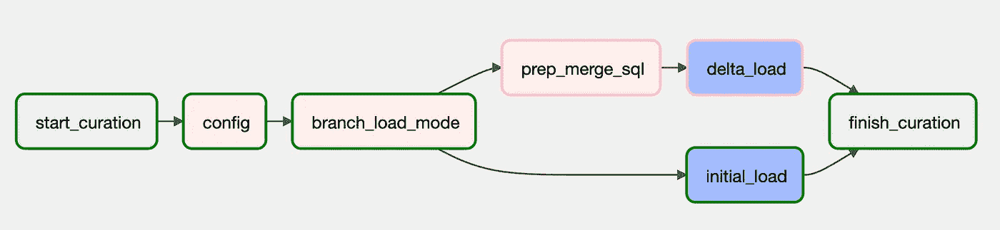

# 使用 Composer 有条件地初始或增量加载 BQ

> 原文：<https://medium.com/google-cloud/conditionally-initial-or-delta-load-big-query-tables-w-one-dynamic-dag-b1cdb2915b65?source=collection_archive---------0----------------------->

典型的数据复制作业包括两个阶段:初始加载和复制更改。为初始和增量加载的每个表构建单独的管道可能很耗时。

最好是建立一个元数据驱动的动态管道。

在这篇文章中，你可以发现如何有条件地对任何表动态地使用相同的 composer DAG 进行初始或增量加载**。**

这里的关键要素是**branch pythonooperator**，它使您能够根据条件对您的流进行分支；

这里，我们将构建一个参数化 DAG，它将 LOAD_MODE 作为一个参数。如果设置为*初始*，流程将继续执行*初始 _ 加载 _ 表*，或者如果设置为*增量*，流程将继续执行*辅助 _ 表*任务。

## 如何处理增量变更

一种方法是使用 merge 语句，通过一条语句和一次传递插入新记录并更新已更改的记录。

在 BigQuery 中，典型的 merge 语句如下所示；

感谢 **xcom variables** ，我们可以将表名、模式和键作为参数传递，并使我们的 DAG 完全动态，因此我们不需要每个表有一个单独的 DAG。

下面是如何获取这些参数并推送给 xcom 变量，以便这些变量可以被其他任务使用；

现在我们已经为准备合并语句做好了一切准备。为此，我们需要两项任务；第一，python 操作符准备 merge 语句并将其推送到 xcom 变量，第二，BigQuery 操作符运行 merge 语句。这是它的样子:

请注意，我们已经为不同的类型定义了默认的“null”值。原因是；在 BigQuery 的连接中，空不等式不匹配。

最后，我们如何从临时表中初始装载一个管理过的表？

这相对容易，我们只需要使用 BigQuery 操作符截断并写入表中；

注意我们如何使用 xcom 变量来获得 StagingTable 和 CuratedTable。

这就是全部，这里是**完整的 DAG 代码**；

您可以像这样运行 DAG w/config；

在这篇博文中，我们有条件地从临时表中加载了管理表。如果您对如何从 GCS 动态加载 BQ 表以及如何运行参数化管道感兴趣，可以查看[“从 GCS 动态加载数据到任何 BigQuery 表”帖子](/google-cloud/dynamically-load-data-to-any-bigquery-table-from-gcs-835a6525afef)。