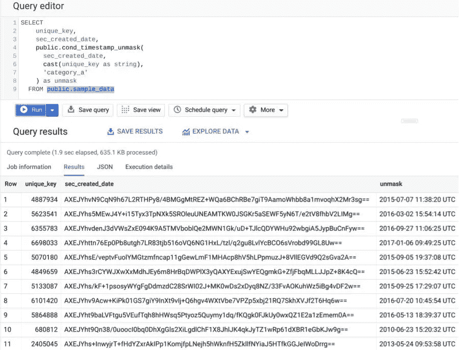
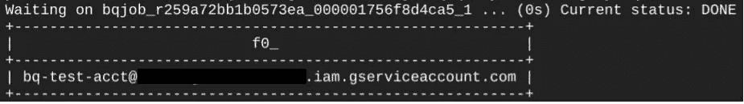
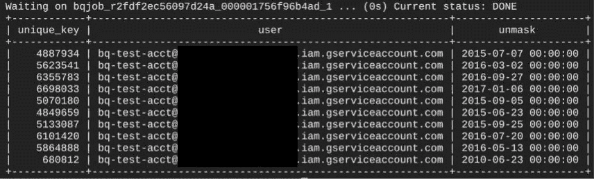
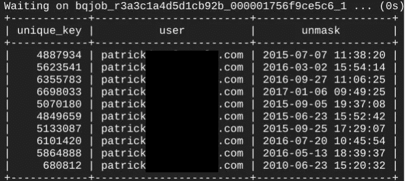
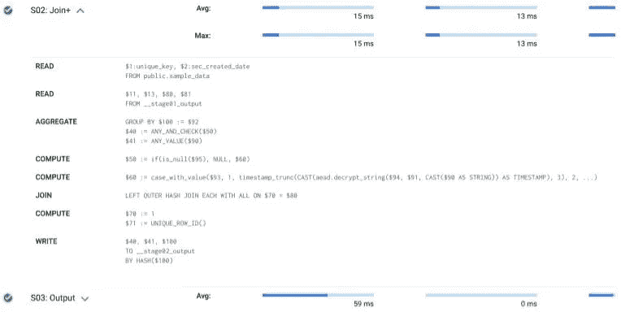

# 使用授权的 UDF 有条件地取消 BigQuery 中列的掩码

> 原文：<https://medium.com/google-cloud/conditionally-unmasking-columns-in-bigquerys-using-authorized-udfs-f3a55a9665fb?source=collection_archive---------0----------------------->

BigQuery 数据仓库在管理员如何设置[访问控制](https://cloud.google.com/bigquery/docs/access-control#overview)和[列级安全性](https://cloud.google.com/bigquery/docs/column-level-security-intro)方面有很大的灵活性。然而，BigQuery 的列级安全性目前只允许在访问敏感列时出现两种结果:查询成功显示列的明文或查询失败。

组织经常需要更大的灵活性，例如，他们经常想要截断时间戳或只显示电话号码的最后四位数字。在复杂的情况下，一个组织可能希望共享 T [ink 加密的](https://github.com/google/tink)数据，同时还控制对对称密钥的访问。

在本教程中，我将向您展示如何将 BigQuery 的 AEAD 加密函数嵌入到授权的 UDF 中，以便有条件地操作解密后的值，而不会将加密密钥暴露给最终用户。



*本指南假设您遵循使用* [*云壳*](https://cloud.google.com/shell/docs) *的说明，并使用 bash 脚本格式化*[*g Cloud*](https://cloud.google.com/sdk/gcloud)*和* [*bq*](https://cloud.google.com/bigquery/docs/bq-command-line-tool) *命令。除了从服务帐户查询 BigQuery 之外，所有执行的操作都可以在* [*谷歌云控制台*](https://cloud.google.com/compute/docs/console) *中执行。*

## 创建二级用户

需要第二个帐户来模拟具有条件数据访问的用户。本指南将模拟具有服务帐户的第二个用户。

```
gcloud iam service-accounts create bq-test-acct \
--display-name="bq-test-acct"#assign the full sevice account name to a variable
SERV_ACCT=$(gcloud iam service-accounts list --format="value(email)" | grep bq-test-acct)gcloud projects add-iam-policy-binding $DEVSHELL_PROJECT_ID \
--member="serviceAccount:${SERV_ACCT}" \
--role='roles/bigquery.jobUser'
```

## 设置测试数据

在一个对普通用户安全的`private`数据集中，创建一个将 AEAD 键集映射到数据类别的表。

```
ACCT=$(gcloud auth list \
--filter=status:ACTIVE --format="value(account)")bq mk --dataset --location=US privateSQL=$(cat <<- EOM
  CREATE OR REPLACE TABLE private.keys
  CLUSTER BY category
  AS (
    SELECT 
      'category_a' as category,
      KEYS.NEW_KEYSET('AEAD_AES_GCM_256') as keys
    UNION ALL
    SELECT
      'category_b' as category,
      KEYS.NEW_KEYSET('AEAD_AES_GCM_256') as keys
  )
EOM
)bq query --use_legacy_sql=false ${SQL}
```

现在创建`private.user_keys`表，将用户映射到每个类别的访问级别。该脚本授予服务帐户用户“1 级”访问权限，授予您的当前用户“2 级”访问权限。级别值将决定如何转换返回给请求用户的解密值。

```
SQL=$(cat <<- EOM
  CREATE OR REPLACE TABLE private.user_keys
  CLUSTER BY category, username
  AS (
    SELECT
      '${SERV_ACCT}' as username,
      1 as level,
      category,
      keys
    FROM private.keys a
    WHERE category = 'category_a'
    UNION ALL
    SELECT
      '${ACCT}' as username,
      2 as level,
      category,
      keys
    FROM private.keys a
    WHERE category = 'category_a'
  )
EOM
)bq query --use_legacy_sql=false ${SQL}
```

使用在`private.keys`表中创建的加密密钥，在`public`数据集中创建一个表，使用 [AEAD.encrypt](https://cloud.google.com/bigquery/docs/reference/standard-sql/aead_encryption_functions#aeadencrypt) 函数，将加密的值呈现给最终用户。

```
bq mk --dataset --location=US publicSQL=$(cat <<- EOM
  DECLARE KEYSTRING BYTES;
  SET KEYSTRING = (SELECT keys FROM private.keys a WHERE  category='category_a'); CREATE OR REPLACE TABLE public.sample_data 
  AS (
    SELECT 
      unique_key, 
      AEAD.encrypt(
        KEYSTRING, 
        CAST(created_date as STRING), 
        CAST(unique_key as string)
      ) AS sec_created_date, 
      status_notes
    FROM \`bigquery-public-data.san_francisco.311_service_requests\`
    LIMIT 10000
  );
EOM
)bq query --use_legacy_sql=false ${SQL}
```

为了完成环境设置，授予服务帐户访问`public`数据集中对象的必要权限，但不授予`private`数据集中对象的权限。在这个例子中，我使用了 [jq](https://stedolan.github.io/jq/manual/) 实用程序来简化 json 解析，这是在[命令行方法](https://cloud.google.com/bigquery/docs/dataset-access-controls#controlling_access_to_a_dataset)上更新数据集权限所必需的。

```
bq show --format=prettyjson public > dataset.jsonJQE=$(cat <<- EOM
.access += 
[{ 
   "role":"WRITER",
   "userByEmail":"${SERV_ACCT}"
}]
EOM
)cat dataset.json | jq "${JQE}" > grant.jsonbq update --source grant.json public
```

## 创建授权的 UDF

授权 UDF 与常规 UDF 的区别在于，对象被授权访问底层 GCP 资源，即使会话用户没有被授权。

该 UDF 检查当前用户，并根据他们的访问级别应用转换。具有“级别 1”访问权限的用户可以看到结果的截断版本，而具有“级别 2”访问权限的用户将获得完整的值。

当您的项目管理员创建该功能时，登录到云外壳。

```
SQL=$(cat <<- EOM
  CREATE OR REPLACE FUNCTION public.cond_timestamp_unmask(col BYTES, add_data STRING, key_category STRING)
  AS ((
    SELECT 
      CASE b.level
        WHEN 1 
        THEN TIMESTAMP_TRUNC(
          CAST(aead.decrypt_string(b.keys, col, add_data) as TIMESTAMP),
          DAY
        )
        WHEN 2 
        THEN CAST(aead.decrypt_string(b.keys, col, add_data) as TIMESTAMP)
        ELSE NULL
      END AS datevalue 
    FROM private.user_keys b
    WHERE b.category = key_category
    AND b.username = session_user()
  ));
EOM
)bq query --use_legacy_sql=false ${SQL}
```

通过授予 UDF 对`private`数据集的访问权限来授权 UDF。在这个例子中，我再次使用“ [jq](https://stedolan.github.io/jq/manual/) ”实用程序来简化更新数据集权限以[授权 UDF](https://cloud.google.com/bigquery/docs/reference/standard-sql/user-defined-functions?hl=nl#authorized_udfs) 所需的 json 解析。

```
bq show --format=prettyjson private > priv.jsonJQE=$(cat <<- EOM
.access += 
[{ "routine": 
  {"datasetId":"public",
   "projectId":"${DEVSHELL_PROJECT_ID}",
   "routineId":"cond_timestamp_unmask"} 
}]
EOM
)cat priv.json | jq "${JQE}" > authorized.jsonbq update --source authorized.json private
```

## 使用服务帐户

为了使说明保持简单，本指南将服务帐户密钥下载到云外壳中。或者，您可以考虑创建一个虚拟机，将“bq-test-acct”作为虚拟机的服务帐户。

无论是哪种情况，都建议在云外壳内打开第二个终端会话[以服务帐户用户的身份运行。](https://cloud.google.com/shell/docs/using-cloud-shell#opening_multiple_terminal_sessions)

```
SERV_ACCT=$(gcloud iam service-accounts list --format="value(email)" | grep bq-test-acct)gcloud iam service-accounts keys create key.json \
--iam-account ${SERV_ACCT}gcloud auth activate-service-account ${SERV_ACCT} \
--key-file="key.json"#should show the service account
bq query --use_legacy_sql=false 'select session_user()'
```



确认对具有加密数据的表的访问，同时拒绝对具有密钥材料的表的访问。

```
#Query should be successful
bq query --use_legacy_sql=false \
'select * from public.sample_data limit 1'#Query should return denied
bq query --use_legacy_sql=false \
'select * from private.keys limit 1'
```

## 测试 UDF

使用条件函数作为普通用户帐户和服务帐户发出查询。普通用户帐户将会看到完整的解析时间戳，而服务帐户将会看到截断到一天的时间戳。

```
SQL=$(cat <<- EOM
  SELECT
    unique_key,
    session_user() as user,
    public.cond_timestamp_unmask(
      sec_created_date, 
      cast(unique_key as string), 
      'category_a'
    ) as unmask
  FROM public.sample_data
  LIMIT 10;
EOM
)bq query --use_legacy_sql=false ${SQL}
```

服务帐户的结果。



“1 级”用户可以使用截断的时间戳

用户帐户的结果。



显示完整时间戳的“2 级”用户帐户

## 性能影响

当处理加密操作和 UDF 时，查询成本是一个经常关注的问题。查看云控制台中的[执行细节](https://cloud.google.com/bigquery/query-plan-explanation#viewing_information_cloud_console)；这个 UDF 是使用散列连接有效实现的。



使用哈希联接执行的查询计划

## 额外资源

*   [如何将 Google Cloud IAM 组信息同步到 BigQuery](/google-cloud/how-to-control-access-to-bigquery-at-row-level-with-groups-1cbccb111d9e)
*   [关于将 Tink 加密数据导入 BigQuery 的指南](/google-cloud/bigquery-encryption-functions-part-i-data-deletion-retention-with-crypto-shredding-7085ecf6e53f)