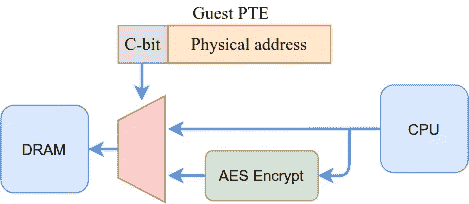

# 机密计算很酷！

> 原文：<https://medium.com/google-cloud/confidential-computing-is-cool-1d715cf47683?source=collection_archive---------1----------------------->

# 背景

默认情况下，Google Cloud 为传输中的数据*和静态的数据*和静态的数据*提供加密和/或完整性。我们还采用沙盒等其他技术来帮助保护我们的基础架构和客户数据。这种虚拟化安全模式使我们能够提供安全的多租户架构，在该架构中，虚拟机可以相互隔离运行并受到保护。*

在这个安全模型中，虚拟机管理程序是*可信计算基础*的一部分，因为它创建、管理和隔离这些虚拟机。因此，它对系统的安全性至关重要。如果虚拟机管理程序本身遭到破坏，所有虚拟机都会变得易受攻击。

我们投入了大量精力来加固和保持我们的基础设施安全，包括谷歌使用的管理程序 [*KVM*](https://www.linux-kvm.org/page/Main_Page) 。我们主动研究和测试漏洞，将我们的更改反馈给社区，并拥有提供代码完整性和出处保证的流程。

尽管如此，一些市场可以从保护其虚拟机免受虚拟机管理程序或云提供商漏洞的影响中受益，特别是那些受监管行业或管理高度敏感数据的市场。机密计算解决了这个问题。

# 安全性更上一层楼

谷歌是机密计算联盟的成员，该联盟旨在解决使用中的数据安全问题。即使数据在传输中或静止时被加密，也必须在内存中进行解密处理。如果另一个进程能够读取该内存，将会危及系统的安全性。当然，虚拟机管理程序就是这样一个进程。理论上，如果运行在较低特权级别的其他进程利用了虚拟机管理程序中的缺陷，它们也可以访问该内存。

非易失性存储器技术加剧了这种情况。这些存储芯片可以被物理移除，它们的数据可以像硬盘驱动器一样读取。像 DRAM 接口窥探这样的其他类型的攻击也是可能的。可以说，这些在云环境中相当复杂。

为了解决这种类型的安全风险，并给用户更多的信心和控制，谷歌现在提供[机密虚拟机](https://cloud.google.com/confidential-computing)。这些是在使用 AMD [*安全加密虚拟化*](https://developer.amd.com/sev/) (SEV)技术的主机上运行的 GCE 虚拟机。这项技术使用只有处理器知道而虚拟机管理程序不知道的密钥，为虚拟机提供内存加密。甚至谷歌都无法访问它。

这样，当创建一个新的虚拟机时，也会创建一个随机密钥，其内存会自动加密，因此其内容只能由虚拟机本身读取。包括虚拟机管理程序在内的其他进程只能访问加密形式的数据。安全性根植于硬件本身。

基于[英特尔 SGX](https://software.intel.com/content/www/us/en/develop/topics/software-guard-extensions.html) 技术的其他云提供商也在使用其他保密计算解决方案。该技术允许将内存区域划分为*飞地*，飞地是具有硬件辅助加密和完整性保护的执行区域，以防止来自飞地本身之外的其他进程的访问，包括那些运行在更高特权级别的进程。

英特尔在一些现代 CPU 上包括 SGX 指令集扩展，允许代码开发人员创建和管理这些飞地。然而，这意味着用户应该修改他们的应用程序来利用这种技术，并适当地使用它。这是一个严重的缺点，尽管英特尔和微软已经开发了 SDK 和框架来使开发者更容易完成这项工作。

我认为 AMD SEV 技术在这里采取了更好的方法，因为它允许机密计算，而不需要任何应用软件的改变。支持它的更改应该在堆栈的较低层进行，在来宾操作系统和虚拟机管理程序中进行。Google 会为您处理这些，所以您的应用程序可以按原样迁移。用户只需在创建新虚拟机时启用它。

# 神奇是如何发生的

AMD SEV 建立在 AMD-V 虚拟化特性之上。AMD-V 支持在虚拟机管理程序的控制下运行多个虚拟机。当虚拟机管理程序运行客户虚拟机代码时，它会执行一条 VMRUN 指令，并将*虚拟机控制块*作为描述虚拟机的参数。然后，可以通过设置控制位来启用 SEV 加密功能。

每个支持 SEV 的虚拟机都与一个唯一的内存加密密钥相关联。密钥管理不是由 CPU 处理，而是由独立的安全处理器和固件处理，因此加密密钥对主 CPU 或虚拟机管理程序是不可见的。固件提供了一个接口来帮助虚拟机管理程序执行常见任务，如启动、运行、拍摄快照和迁移虚拟机。

生成的密钥被加载到存储器控制器。每个控制器都包括一个 AES-128 引擎，该引擎在数据写入 DRAM 时对数据进行加密，在读取时对数据进行解密。启用 SEV 加密后，客户操作系统可以通过设置相应客户*页表条目* (PTE)中的 C 位(en **C** rypted 位)来决定哪些内存页是私有的(加密的)或共享的。通常，客户会将所有内存页面映射为私有的，除了那些与 I/O 的管理程序共享的内存页面

启用 SEV 时，不仅数据被加密。客户指令页和页表本身总是被视为私有的，因此其他进程(如管理程序)无法成功地注入或修改客户代码。虽然理论上 hypervisor 可以修改这些页面，但是这样做会导致垃圾数据被执行(很可能是一个错误)。

AMD SEV 提供的功能比这里描述的更多。我已经描述了基础知识，但是还有更多的技术正在开发中，以保护虚拟环境免受更复杂的威胁模型(包括恶意虚拟机管理程序)的影响。

# 结论

机密计算支持新的云场景，在这些场景中，客户可以运行高度敏感的工作负载，从而最大限度地降低虚拟机管理程序漏洞或内部访问的风险，以及对云提供商的信任需求。除了加密传输中的数据和静态数据，加密使用中的数据是端到端加密的第三大支柱。这真的是一项改变游戏规则的技术，提高了安全性，现在谷歌只需点击一个按钮就可以提供给你。是不是很酷？

PS:感谢何塞·卡洛斯·塞雷佐给我写这篇文章的灵感。