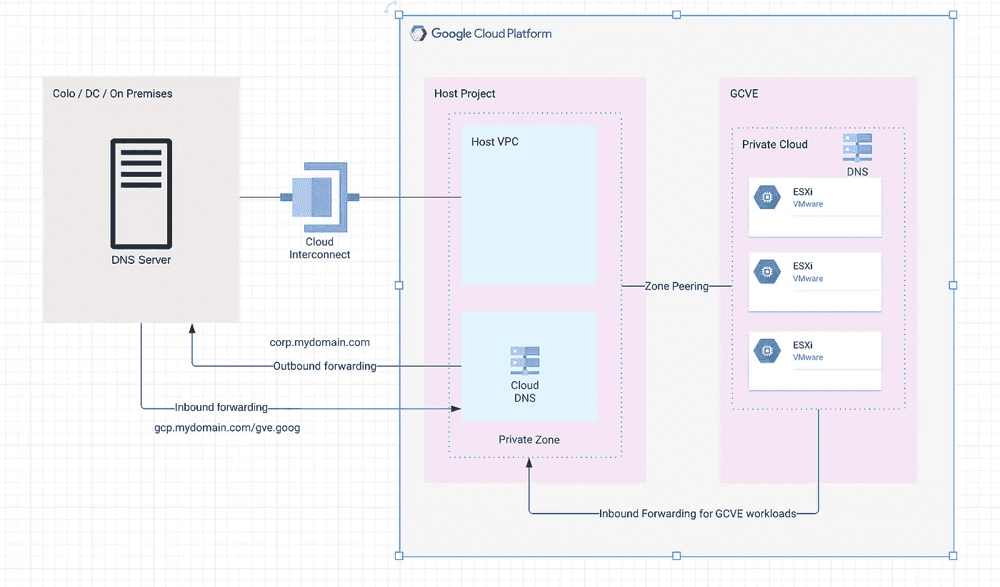

# 在混合环境中将云 DNS 配置为全球域名解析服务:GCP、内部和 GCVE

> 原文：<https://medium.com/google-cloud/configure-cloud-dns-as-global-name-resolution-service-in-hybrid-environment-gcp-on-premise-and-6aee6d0e7e15?source=collection_archive---------2----------------------->

现在，许多企业都在采用混合基础架构运营模式，这种模式为企业提供按需可扩展性、灾难恢复，帮助他们满足安全性和法规遵从性需求，并且具有成本效益。

GCP 提供计算引擎、Kubernetes 引擎、应用引擎、BQ、GCVE 和许多其他服务，帮助企业在云上无缝运行他们的应用程序。

如果您计划将工作负载迁移到 GCP 和 GCVE，那么您可以利用云 DNS 作为全球地址解析服务。它是高性能 DNS 服务，提供 100%可用性 SLA。



云 DNS 作为全球域名解析服务

这里的想法是使用云 DNS 解决 FQDN 的 GCP 和 GCVE 工作负载，使用本地 DNS 服务器解决 FQDN 的本地工作负载。来自 GCP 和 GCVE 的任何解决 FQDN 本地工作负载的请求都应转发到本地 DNS 服务器，来自本地的任何解决 FQDN GCP 和 GCVE 工作负载的请求都应转发到云 DNS。

## **配置步骤**

在主机项目中启用云 DNS API，在您的网络(主机 VPC)中创建一个专用区域，并添加 GCP 和 GCVE 工作负载的记录。

```
gcloud dns managed-zones create NAME \
    --description=DESCRIPTION \
    --dns-name=DNS_SUFFIX \
    --networks=VPC_NETWORK_LIST \
    --labels=LABELS \
    --visibility=private
```

要解决 GCP 和 GCVE 的本地工作负载 FQDN，您需要在云 DNS 中设置出站转发，以将请求转发到本地 DNS 服务器。

```
gcloud dns managed-zones create NAME \
    --description=DESCRIPTION \
    --dns-name=DNS_SUFFIX \
    --networks=VPC_NETWORK_LIST \
    --forwarding-targets=FORWARDING_TARGETS_LIST \
    --private-forwarding-targets=PRIVATE_FORWARDING_TARGETS_LIST \
    --visibility=private
```

允许 IP 范围 **35.199。192.0/19** 在本地防火墙上，支持云 DNS 将请求转发到本地 DNS 服务器。

要从本地解决 GCP 和 GCVE 工作负载 FQDN，请在云 DNS 中创建入站转发，以接受来自本地 DNS 服务器的请求。

```
gcloud dns policies create NAME \
    --description=DESCRIPTION \
    --networks=VPC_NETWORK_LIST \
    --enable-inbound-forwarding
```

当入站服务器策略应用于网络时，云 DNS 会创建一组区域 IP 地址，作为本地转发器的目标。

```
gcloud compute addresses list \
    --filter='purpose = "DNS_RESOLVER"' \
    --format='csv(address, region, subnetwork)'
```

获取入站转发器入口点列表，并在本地 DNS 服务器上设置有条件的出站转发。《出埃及记》

```
zone "mydomain.com" {
    type forward;
    forward only;
    forwarders { list of IP addresses};
};
```

在 GCVE 中部署私有云时，会自动创建一个 DNS 对等区域。GCP 和本地工作负载可以直接解决 GCVE 管理组件 FQDN。您需要创建启用了导入/导出路由的私有服务访问，以便在 GCP 和 GCVE 之间建立连接。

对于 GCVE 工作负载，首先在云 DNS 中设置入站转发，并按照上述步骤获取入站转发器入口点列表，然后[在 VMware NSX 中设置条件转发，将请求转发到云 DNS](https://docs.vmware.com/en/VMware-NSX-T-Data-Center/3.0/administration/GUID-A0172881-BB25-4992-A499-14F9BE3BE7F2.html) 。

## **使用云 DNS 的优势**

云 DNS 提供了区域和策略的集中管理，并使问题的故障排除变得容易。

它是高性能 DNS 服务，提供 [100%可用性 SLA](https://cloud.google.com/dns/sla) 。

它支持托管 DNSSEC，保护您的域免受欺骗和缓存中毒攻击。

它与 Cloud IAM 相集成，为网络管理员提供集中的身份验证和授权。