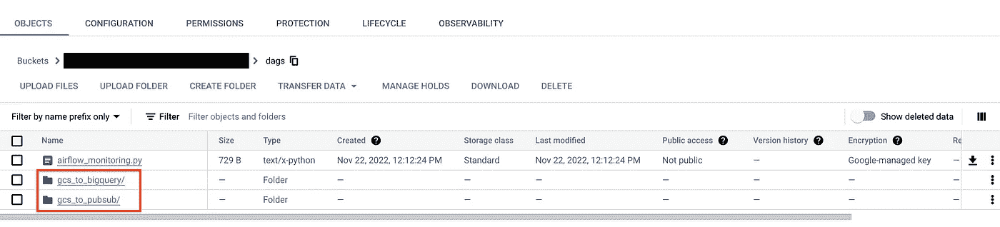

# 在 Cloud Composer 中配置 DAG 级权限

> 原文：<https://medium.com/google-cloud/configure-dag-level-permissions-in-cloud-composer-230368b152fe?source=collection_archive---------1----------------------->


Cloud Composer 通过向用户授予角色和权限，使用[身份和访问管理(IAM)](https://cloud.google.com/composer/docs/how-to/access-control) 进行访问控制。一旦用户拥有足够的 IAM 权限来访问 Cloud Composer 环境，他们就可以访问该环境中默认可用的所有 Dag。但是在大多数情况下，我们并不希望每个用户都能访问所有可用的 Dag。例如，一些用户不想让其他用户运行他们的 Dag 或查看敏感信息等。

在本帖中，首先我们将回顾如何使用 Cloud Composer 和 Airflow RBAC 来创建 Airflow 自定义角色并将其分配给用户，从而实现对 Airflow DAGs 的访问控制。稍后我们将讨论这种方法的局限性，以及“每文件夹角色注册”如何解决这个问题。

## 气流 RBAC

气流 RBAC 是一个内置于气流中的模型，允许在气流 UI 和气流 API 中管理权限、用户和角色。它允许配置用户可以访问哪些 Dag，以及允许哪些操作(读/编辑/删除)。

从气流 1.10 开始，气流引入了带有[预建角色](https://airflow.apache.org/docs/apache-airflow/stable/security/access-control.html#default-roles)的气流 RBAC，以便于访问控制 Dag。但是它有一个限制，即它只支持 5 个默认角色。但是后来在[气流 1.10.2](https://airflow.apache.org/docs/apache-airflow/stable/release_notes.html#airflow-1-10-2-2019-01-19) 中，气流 RBAC 扩展到支持 DAG 级别 ACL。

## 先决条件

要访问 Cloud Composer 中的 Airflow UI，用户必须在 [*Cloud IAM*](https://cloud.google.com/iam/docs/understanding-roles#composer.user) 中被授予适当的访问角色。

## **使用气流 RBAC 配置 DAG 级权限**

每次新用户第一次打开 Cloud Composer 环境的 Airflow UI 时，该用户都会自动在 Airflow RBAC 中注册。

用户在 Cloud Composer 的气流 RBAC 中自动注册的默认角色是 [**Op**](https://airflow.apache.org/docs/apache-airflow/stable/security/access-control.html#op) ，这允许用户查看所有可用的 Dag。

> [需要 Composer 管理员](https://cloud.google.com/iam/docs/understanding-roles#composer.admin) IAM 权限来覆盖气流配置、添加新角色以及向用户分配任何角色。

我们可以使用 Airflow RBAC 自定义角色添加每个 DAG 的权限，然后将这些角色分配给用户，从而将用户限制在特定 DAG。有两种方法可以实现这一点:

1.  [***在气流 UI***](https://airflow.apache.org/docs/apache-airflow/stable/security/access-control.html#custom-roles) 中添加一个新的自定义角色，允许用户读取/编辑/删除某些 Dag。
2.  通过 DAG 本身的 [***访问控制属性***](https://cloud.google.com/composer/docs/airflow-rbac#dag-permissions-property) 指定角色和权限如下图所示:


在 DAG 代码中添加访问控制属性

**限制** 这种方法将限制用户使用特定的 Dag。在有许多 Dag 和角色的情况下，跨所有 Dag 维护一致的配置、向用户分配适当的角色可能是繁重的，并且可能导致错误。

在下一节中，我们将介绍实现 DAG 级别权限的另一种方法，这种方法可以减少开销，并介绍在 Cloud Composer 中配置它的步骤。

## 使用每个文件夹的角色注册配置 DAG 级别的权限

[**每文件夹角色注册**](https://cloud.google.com/composer/docs/composer-2/airflow-rbac#how_per-folder_roles_registration_works) 是一种自动配置角色及其 DAG 级权限的方式。在这种方法中，dag 被分组到位于*/Dag*文件夹中的子文件夹中。这将在气流 RBAC 中为位于/dags 文件夹中的每个子文件夹自动创建一个新角色，并授予此角色对该子文件夹中所有 DAG 的 DAG 级访问权限。以下是开始的方法:

> Composer 1:在 Cloud Composer 1.18.12 和更高版本的 Airflow 2 中，以及在 Cloud Composer 1.13.4 和更高版本的 Airflow 1 中，可以进行基于文件夹的角色注册。
> Composer 2:Cloud Composer 2 . 0 . 16 及更高版本中提供了基于文件夹的角色注册。([来源](https://cloud.google.com/composer/docs/airflow-rbac#before_you_begin))

进入 ***导航*** 菜单- > ***作曲***

选择您的 ***Composer 环境*** - >转到“ ***气流配置覆盖*** ”选项卡。

添加如下所示的配置:

*   将**段**设置为 ***webserver*** ， **key** 设置为***RBAC _ auto register _ per _ folder _ roles***和 **value** 设置为 ***True*** 。
*   将**节**设置为 ***webserver*** ， **key** 设置为***RBAC _ user _ registration _ role***和 **value** 设置为 ***UserNoDags*** 。


在 Cloud composer 中覆盖气流配置

一旦***RBAC _ User _ registration _ role***更新为***UserNoDags:***Cloud Composer 自动创建 *UserNoDags* 角色，它相当于 [*User*](https://airflow.apache.org/docs/apache-airflow/stable/security/access-control.html#user) 角色，但无权访问任何 Dag。


现在，当新用户第一次打开 Cloud Composer 环境的 Airflow UI 时，他们会自动使用 *UserNoDags* 而不是 *Op* 进行注册，因此默认情况下没有任何 Dag 的权限。


添加了具有 UserNoDags 角色的新用户

将***RBAC _ auto register _ per _ folder _ roles***更新为***True:***Cloud Composer 基于 DAGs 子文件夹自动创建角色。



在/dags 中添加的子文件夹


为每个子文件夹添加的角色

> **顺便提一下**，使用 Dag 创建子文件夹的用户不会自动获得相应的每个文件夹的角色。例如，如果用户创建了一个名为 **gcs_to_pubsub** 的子文件夹，他们的帐户不会获得 **gcs_to_pubsub** 角色。管理员必须在 Airflow UI 中授予此角色。

最后一步是将这些每个文件夹的角色分配给相应的用户。只有具有管理员访问权限的用户才能向其他用户授予任何角色。可以通过 Airflow UI 或 CLI 分配角色。

进入 ***气流 UI*** - > ***安全*-**->***列表用户***

编辑用户并分配所需的角色。


```
gcloud composer environments run <ENVIRONMENT_NAME> \
--location <LOCATION> \
users add-role -- -e <USER_EMAIL> -r <ROLE_NAME>
```

一旦用户被分配了相应的基于子文件夹的角色，他们将只能看到属于该子文件夹的 Dag。而具有管理员访问权限的用户可以查看所有 Dag。

## 结论

在本文中，我们看到了使用气流 RBAC 在 Cloud Composer 中配置 DAG 级别权限的不同方法及其局限性。然后，我们还讨论了每个文件夹的角色注册如何解决这个问题，以及我们如何使用它来管理 DAG 级别的访问控制。

## 参考

*   [https://cloud . Google . com/composer/docs/air flow-RBAC # air flow-2](https://cloud.google.com/composer/docs/airflow-rbac#airflow-2)
*   [https://cloud . Google . com/composer/docs/overriding-air flow-configuration s](https://cloud.google.com/composer/docs/overriding-airflow-configurations)

希望你喜欢这篇文章，并发现它有用。你可以通过 [LinkedIn](http://www.linkedin.com/in/sunny-arora-2210) 联系到我。