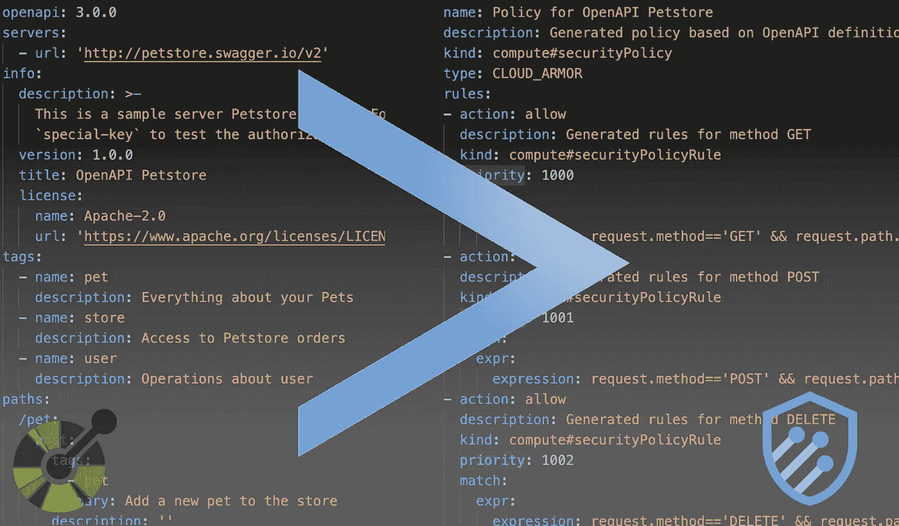

# 使用 OpenAPI 配置谷歌云装甲

> 原文：<https://medium.com/google-cloud/configure-google-cloud-armor-using-openapi-64ba16ac040e?source=collection_archive---------2----------------------->

**TL；我构建了一个简单的工具，用于根据 OpenAPI 3 规范生成云装甲安全策略。去这里看看[https://github . com/Google cloud platform/professional-services/tree/main/tools/open API-to-cloud-armor](https://github.com/GoogleCloudPlatform/professional-services/tree/main/tools/openapi-to-cloud-armor)**

使用 Web 应用程序防火墙(WAF)来保护您的应用程序免受威胁是一种最佳实践。像 Google 的 Cloud Armor 这样的托管、经济高效的服务为我们提供了保护，防止常见的攻击，如 SQL 注入、跨站点脚本，甚至是像最近 log4shell ( [链接](https://cloud.google.com/armor/docs/rule-tuning))这样的新漏洞。

为了进一步提高安全性，基于应用程序 API 配置 WAF 规则是一个好主意。但这可能是一项繁琐的任务。理想情况下，您会希望 API 上的更改作为 CI/CD 管道的一部分自动传播到 WAF 规则。

如果您有一个 OpenAPI 规范，无论是通过 API 优先的方法([链接](https://openapi-generator.tech/docs/generators/))，还是从您实现的代码中生成一个规范([链接](https://www.baeldung.com/spring-rest-openapi-documentation))，您都有一个很好的基础来做到这一点。OpenAPI 规范包含可以在 API 上调用的各种操作，因此可以解析这些操作，以便基于 HTTP 方法和路径为 WAF 创建规则。



我实现的 O [penAPI-to-Cloud-Armor 转换器](https://github.com/GoogleCloudPlatform/professional-services/tree/main/tools/openapi-to-cloud-armor)运行于一个 OpenAPI 规范，并基于规范中的路径和 HTTP 方法创建一个 Cloud Armor 安全策略。该规则具有低优先级的默认拒绝，有效的路径和方法将导致允许。

云甲有一些[限制和配额](https://cloud.google.com/armor/quotas)我们需要在规则大小、规则数量和规则长度方面进行处理:

*   有一个配额，我们最多可以在一个项目中有 20 个使用表达式的规则。
*   使用表达式语言的规则只能有 5 个子表达式
*   每个表达式只能有一个正则表达式匹配
*   表达式不能超过 2048 个字符，子表达式不能超过 1024 个字符

这意味着对于大型规则，我们可能需要在规则结构方面做出一些妥协和优化。这意味着每个 API 操作一个规则的方法是行不通的，我们需要将方法和路径结合起来。因此，转换器可以在三种模式下运行，可以通过相应的标志进行选择:

*   **Methodwise** 为每个 HTTP 方法创建一个规则，以及一个包含该方法上允许的所有路径的正则表达式。假设规则的数量为 4 (GET、PUT、POST、DELETE)是合理的，但是如果有很多路径，那么路径的正则表达式可能会超过子表达式的长度限制。
*   **Pathwise** 为每条路径创建一个规则，并为路径上允许的所有方法创建一个 or。这是最简单明了的规则。但是如果 API 中有许多路径，可能会导致规则配额耗尽。
*   **Compressed** 创建一个规则，包含所有已定义的 HTTP 方法和路径。有一点风险，即路径可能被无效的方法访问，并且单个规则表达式超过了子表达式的长度限制。

我个人认为**方式的**模式是最有用的，因为它创建了一组有限的规则，子表达式长度限制应该适合大多数 API。因此我把这个模式设为默认模式；-).

使用正则表达式检查路径。正则表达式减少了，因为路径`/user/login`可能已经包含在另一个操作的路径`/user/{userId}`中。目前没有进一步的压缩。

为了为流行的 [Petstore API 示例](https://raw.githubusercontent.com/openapitools/openapi-generator/master/modules/openapi-generator/src/test/resources/3_0/petstore.yaml)生成安全策略，您只需执行以下命令:

```
go run main.go -input https://raw.githubusercontent.com/openapitools/openapi-generator/master/modules/openapi-generator/src/test/resources/3_0/petstore.yaml
```

由此产生的策略 YAML 将包含 5 个规则。优先级最低的最后一个规则是默认的拒绝规则。GET、POST、PUT 和 DELETE 方法有 4 条规则，每个方法的不同路径都简化为一个正则表达式。以下仅是生成的 YAML 的 GET 方法的规则:

```
- action: allow
  description: Generated rules for method GET
  kind: compute#securityPolicyRule
  priority: 1000
  match:
    expr:
      expression: **request.method=='GET' && request.path.matches('/pet/[^/]*$|/store/inventory$|/store/order/[^/]*$|/user/[^/]*$')**
```

您可以在 GitHub 上找到转换器的完整代码。如果你给它一个旋转或整合到你的 CI/CD 管道，我会感谢你的反馈。

[](https://github.com/GoogleCloudPlatform/professional-services/tree/main/tools/openapi-to-cloud-armor) [## 专业服务/工具/openapi-to-cloud-armor at main …

### 这个工具是 OpenAPI 规范到云装甲规则的简单转换器。你可以把它作为你的一部分…

github.com](https://github.com/GoogleCloudPlatform/professional-services/tree/main/tools/openapi-to-cloud-armor)