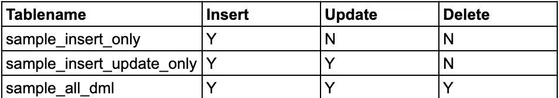
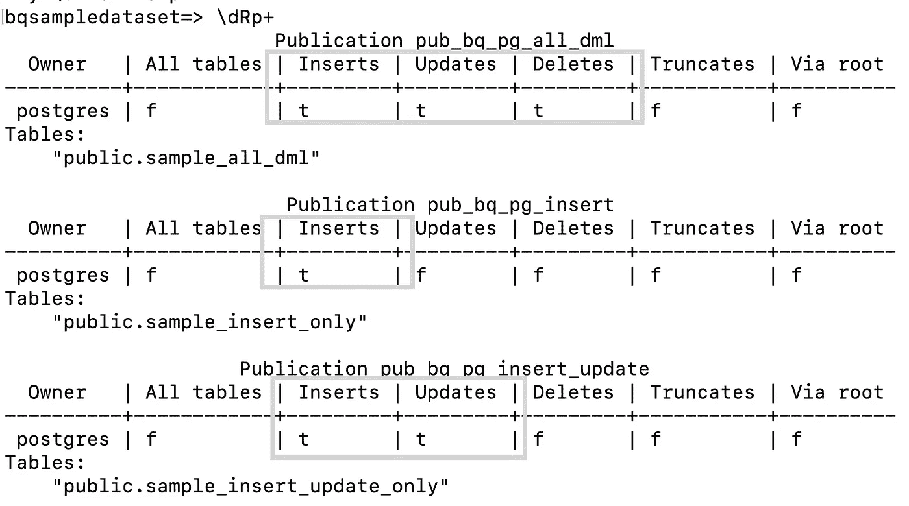
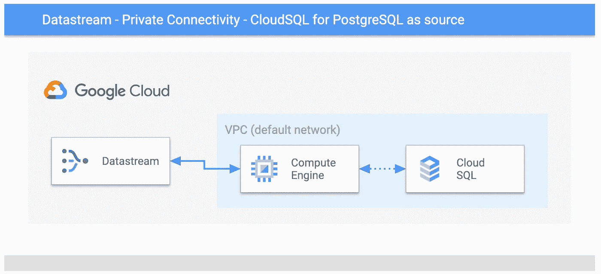
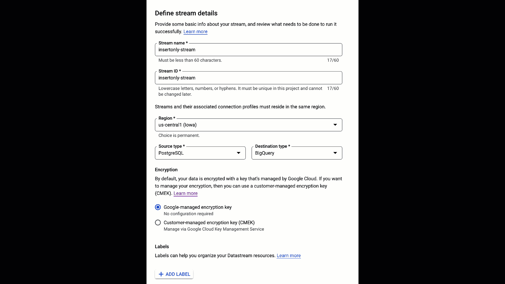
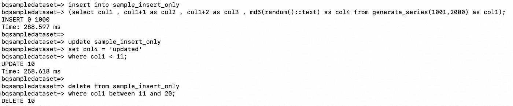
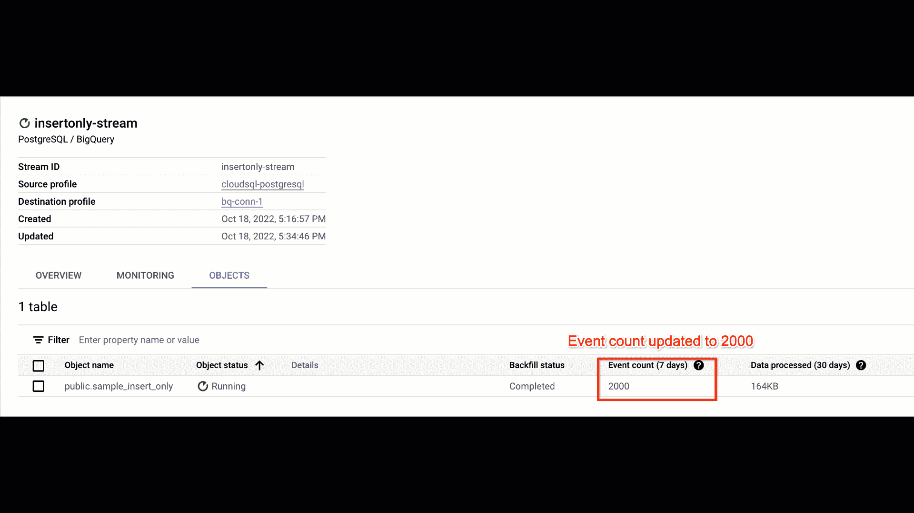
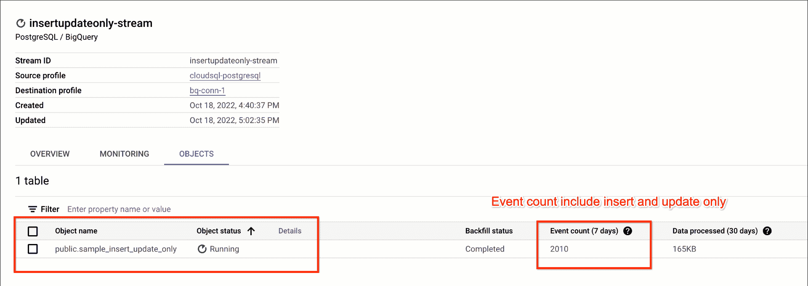
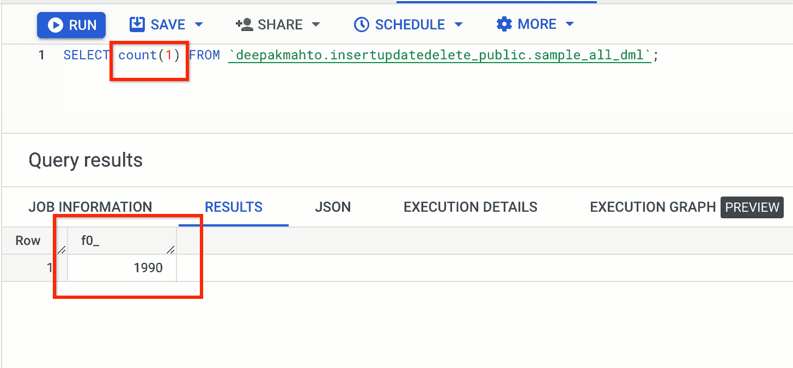

# 仅将 PostgreSQL 上的某些 DML 的数据流配置为源。

> 原文：<https://medium.com/google-cloud/configure-google-cloud-datastream-for-only-certain-dmls-on-postgresql-as-source-16e4ad789ef8?source=collection_archive---------0----------------------->

> 这是 PostgreSQL 和 BigQuery 在数据流上解决真实世界场景系列的第 1 部分，如果有兴趣查看所有策划的场景[请点击我。](https://mahtodeepak.medium.com/solving-real-world-scenarios-on-datastream-for-postgresql-and-bigquery-b79334a065fc)

PostgreSQL 是被广泛采用的托管数据库之一，许多客户要求将事务更改直接传输到 BigQuery。在 Google Cloud 上，来自 CloudSQL for PostgreSQL 的连续流是不同客户的常见问题之一，是 BigQuery 等下游平台上进一步整合分析的一部分。
通过最近发布的 Datastream for BigQuery，它使用逻辑复制从不同的 PostgreSQL 兼容源提供初始回填和连续复制。有了 Datastream，CloudSQL 和 BigQuery 之间的集成变得更加容易，这是一种丰富、简单、无服务器和可扩展的方法。它目前正在公开预览中，以测试从事务性工作负载到 BigQuery 的流更改的不同用例。


主要是插入、更新和删除是需要包含在流中的事务性表上的常见更改。但是我们可能有一个功能需求，只对特定的表列表进行流插入或者只进行插入和更新。目前，Datastream 不提供支持选择性数据操作事件的特性来在 BigQuery 上捕获和发布。

在当前的博客中，我们将演练如何使用 PostgreSQL 逻辑复制特性为特定事件配置流，如仅插入或仅插入、在特定表列表上插入和更新。

让我们将 CloudSQL for PostgreSQL 配置为带有示例表集的源。

```
drop table if exists sample_insert_only;
create table sample_insert_only
as
select col1 , col1+1 as col2 , col1+2 as col3 , md5(random()::text) as col4 from generate_series(1,1000) as col1;
alter table sample_insert_only add constraint pk_sample_insert_only primary key(col1);
drop table if exists sample_insert_update_only;
create table sample_insert_update_only
as
select col1 , col1+1 as col2 , col1+2 as col3 , md5(random()::text) as col4 from generate_series(1,1000) as col1;
alter table sample_insert_update_only add constraint pk_sample_insert_update_only primary key(col1);
drop table if exists sample_all_dml;
create table sample_all_dml
as
select col1 , col1+1 as col2 , col1+2 as col3 , md5(random()::text) as col4 from generate_series(1,1000) as col1;
alter table sample_all_dml add constraint pk_sample_all_dml primary key(col1);
```

下面是需要发布的表格列表和 dml 的摘要。



数据流[文档](https://cloud.google.com/datastream/docs/configure-your-source-postgresql-database#csqlforpostgresql)详细介绍了如何为托管实例配置源和启用逻辑解码。

作为启用选择性发布的一部分，我们将创建三个不同的发布，并根据源 PostgreSQL 数据库中的发布要求添加表，即是否必须仅插入或仅插入并更新。

## 创建发布并配置发布属性

```
CREATE PUBLICATION pub_bq_pg_insert FOR TABLE sample_insert_only 
WITH (publish = 'insert');
CREATE PUBLICATION pub_bq_pg_insert_update FOR TABLE sample_insert_update_only 
WITH (publish = 'insert,update');
CREATE PUBLICATION pub_bq_pg_all_dml FOR TABLE sample_all_dml 
WITH (publish = 'insert,update,delete') ;
```

从 psql 控制台创建的发布和添加到其中的表的摘要。我们可以向同一个[发布](https://www.postgresql.org/docs/14/sql-alterpublication.html)添加多个表，其更改将基于发布属性发布。



数据流创建的每个流都将使用 pgoutput 插件从活动的复制槽中获取。接下来，我们将创建三个不同的复制插槽。

## 为每个发布创建复制槽

```
SELECT PG_CREATE_LOGICAL_REPLICATION_SLOT('pg_rep_bq_insertonly', 'pgoutput');
SELECT PG_CREATE_LOGICAL_REPLICATION_SLOT('pg_rep_bq_insertupdonly', 'pgoutput');
SELECT PG_CREATE_LOGICAL_REPLICATION_SLOT('pg_rep_bq_all_dml', 'pgoutput');
```

我们已经配置了必要的连接配置文件，并在 GCE(Google Compute Engine)上启用了 cloudsqlproxy 来连接 CloudSQL 作为源。



接下来，我们将根据发布需求创建三个不同的流。我们已经完成了基于发布模式创建三个不同流的所有必要步骤，并完成了数据的初始回填。

## 在数据流中创建流，将 PostgreSQL 作为源，将 BigQuery 作为目标。



让我们看看不同的流如何基于为表配置的发布事件将更改推送到 BigQuery。
在数据流 stream 1-insert only-stream 上，只订阅了 insert。让我们在源端应用所有 dml，并检查它在目标端是如何被使用的。

```
insert into sample_insert_only
(select col1 , col1+1 as col2 , col1+2 as col3 , md5(random()::text) as col4 
from generate_series(1001,2000) as col1);
update sample_insert_only
set col4 = 'updated'
where col1 < 11;
delete from sample_insert_only
where col1 between 11 and 20;
```



虽然我们已经推送了所有 dml，但只有与 Insert 相关的事件被推送到数据流和流 1 的 BigQuery 目标。



在数据流 stream 2-insertupdateonly-stream 上，只订阅了插入和更新。让我们在源端应用所有 dml，并检查它在目标端是如何被使用的。

```
insert into sample_insert_update_only(select col1 , col1+1 as col2 , 
col1+2 as col3 , md5(random()::text) as col4 
from generate_series(1001,2000) as col1);
update sample_insert_update_only
set col4 = 'updated-one'
where col1 < 11;
delete from sample_insert_update_only
where col1 between 11 and 20;
```

虽然我们推送了所有的 dml，但只有与插入和更新相关的事件被推送到数据流和流 2 的 BigQuery 目标。



最后一个流 3 订阅所有事件，且它也将捕获删除，包括插入和删除。

```
insert into sample_all_dml
(select col1 , col1+1 as col2 , col1+2 as col3 , md5(random()::text) as col4 
from generate_series(1001,2000) as col1);
update sample_all_dml
set col4 = 'updated-one'
where col1 < 11;
delete from sample_all_dml
where col1 between 11 and 20;
```



## 学问

使用 PostgreSQL 发布，我们可以根据 BigQuery 作为目标数据流的功能需求来改变要发布的事件。在一个出版物中，我们可以包含多个表，用于根据配置发布特定的 dml。
在此过程中，我们根据自定义更改创建了多个复制槽，我们应该对其进行测试，以验证任何开销或对源的影响，以及为逻辑复制发布者调整的工作器的必要配置。

## 进一步阅读

> 查看[第 2 部分](/google-cloud/configure-streams-from-partition-table-in-postgresql-to-non-partition-in-bigquery-using-datastream-3238fe3321d9)，解决 PostgreSQL 和 BigQuery 数据流上的真实场景，其中包括“使用数据流配置从 PostgreSQL 中的分区表到 BigQuery 中的非分区的流”