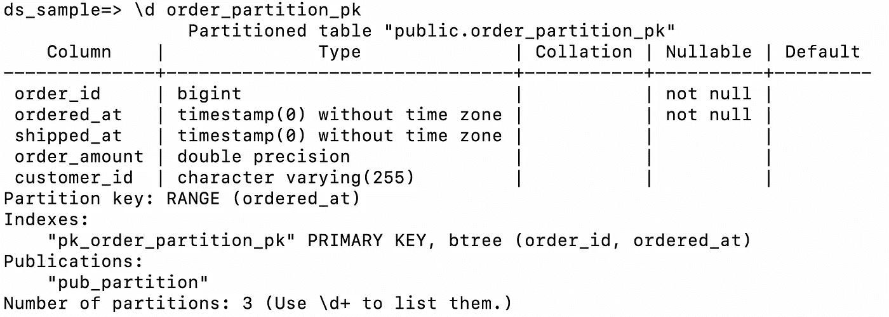
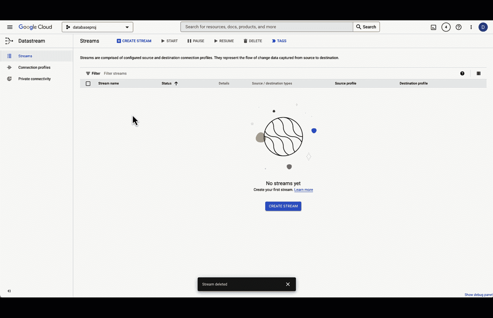
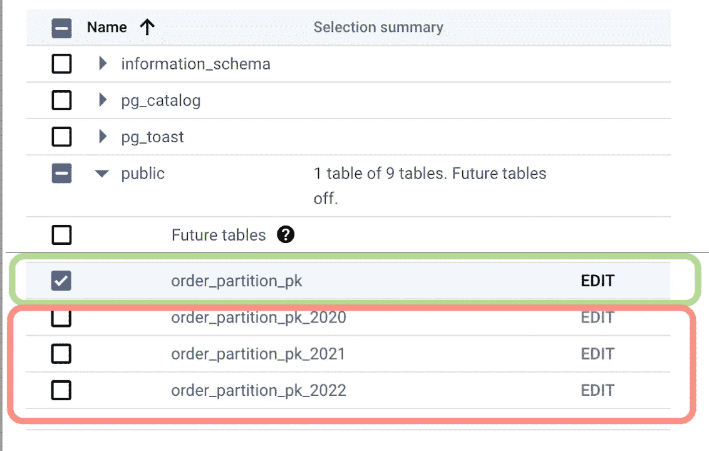
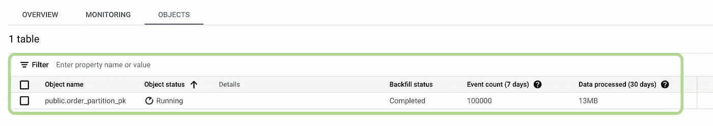
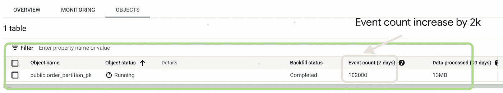
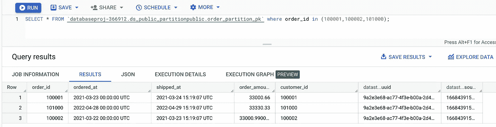
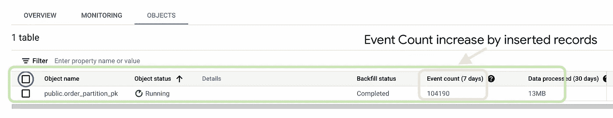
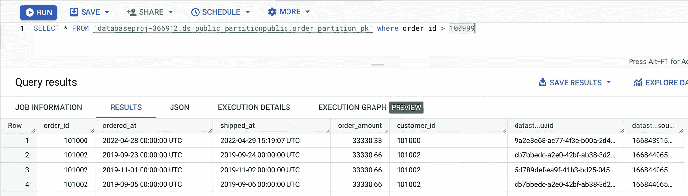

# 使用数据流配置从 PostgreSQL 中的分区表到 BigQuery 中的非分区的流

> 原文：<https://medium.com/google-cloud/configure-streams-from-partition-table-in-postgresql-to-non-partition-in-bigquery-using-datastream-3238fe3321d9?source=collection_archive---------1----------------------->

> 这是 PostgreSQL 和 BigQuery 在数据流上解决真实世界场景系列的第 2 部分，如果有兴趣查看所有策划的场景[请点击我。](https://mahtodeepak.medium.com/solving-real-world-scenarios-on-datastream-for-postgresql-and-bigquery-b79334a065fc)

PostgreSQL 数据库提供了分区等企业级数据库特性。当谈到使用逻辑复制的分区和流更改时，我们有像[*publish _ via _ partition _ root*](https://www.postgresql.org/docs/current/sql-createpublication.html#:~:text=existing%20table%20data.-,publish_via_partition_root,-(boolean))这样的配置，它们影响更改需要如何传播到订阅服务器。PostgreSQL 支持声明性分区，它允许为一个表声明一个分区，并且根表是一个不存储任何数据的虚拟表；所有数据都驻留在特定的分区中。

我们可以让客户将 PostgreSQL 中跨分区的数据作为源合并到 BigQuery 的单个表中。

在今天的博客中，我们将提供一种方法，说明如何使用*publish _ via _ partition _ root*发布配置将 PostgreSQL 中作为源的分区表的所有更改合并到 BigQuery 中的单个表中，并了解如何从源中捕获新的分区数据。

让我们用 PostgreSQL 构建一个示例分区表，并创建必要的发布和复制槽。

## PostgreSQL 分区表和发布配置

```
CREATE TABLE order_partition_pk(
order_id bigint NULL,
ordered_at timestamp(0) without time zone NULL,
shipped_at timestamp(0) without time zone NULL,
order_amount double precision NULL,
customer_id varchar(255) NULL
) PARTITION BY RANGE( ordered_at);

alter table order_partition_pk add constraint pk_order_partition_pk primary key(order_id,ordered_at);

CREATE TABLE order_partition_pk_2020 PARTITION OF order_partition_pk FOR VALUES FROM ('2020-01-01') TO ('2021-01-01');
CREATE TABLE order_partition_pk_2021 PARTITION OF order_partition_pk FOR VALUES FROM ('2021-01-01') TO ('2022-01-01');
CREATE TABLE order_partition_pk_2022 PARTITION OF order_partition_pk FOR VALUES FROM ('2022-01-01') TO ('2023-01-01');

insert into order_partition_pk  
select col1, 
date_trunc('day',clock_timestamp()::timestamp(0) without time zone - interval '1 day' * mod(col1,700)),
clock_timestamp()::timestamp(0) without time zone + interval '1 day' - interval '1 day' * mod(col1,700)  ,
col1*0.33,
col1::text
from generate_series(1,100000) as col1 ;

create publication pub_partition for all tables;

SELECT PG_CREATE_LOGICAL_REPLICATION_SLOT('rep_slot_partition', 'pgoutput');
```

我们将使用*publish _ via _ partition _ root*配置将发布更改为 true。

```
alter publication pub_partition set (publish_via_partition_root=true);

ds_sample=> \dRp
                                    List of publications
     Name      |  Owner   | All tables | Inserts | Updates | Deletes | Truncates | Via root 
---------------+----------+------------+---------+---------+---------+-----------+----------
 pub_partition | postgres | t          | t       | t       | t       | t         | t
(1 row)
```

我们已经创建了必要的分区表，并填充了三个分区。



## 为作为目标的 BigQuery 的数据流中的已分区表创建流。

我们已经配置了必要连接相关设置，并将为 PostgreSQL 中的分区表创建流，作为数据流中 BigQuery 的源和目标。



数据流公共预览— PostgreSQL 到 BigQuery

在选择分区表时，我们有意忽略选择它的分区，而只选择父表或根表。不应选择它，以避免由于*publish _ via _ partition _ root*设置*而导致初始回填和连续更改之间可能发生的 BigQuery 目标差异。*



创建流并启动它之后，我们可以看到我们的初始回填已经完成。



数据流回填完成

## 在 PostgreSQL 中对已分区表应用 DML，并在 BigQuery 中进行验证。

我们将在分区表上应用 dml，并用模拟数据添加新的分区。
在 PostgreSQL 源代码上应用插入和更新。

```
insert into order_partition_pk  
select col1, 
date_trunc('day',clock_timestamp()::timestamp(0) without time zone - interval '1 day' * mod(col1,700)),
clock_timestamp()::timestamp(0) without time zone + interval '1 day' - interval '1 day' * mod(col1,700)  ,
col1*0.33,
col1::text
from generate_series(100001,101000) as col1 ;

update order_partition_pk
set order_amount = order_amount+0.33
where order_id in (select generate_series(100001,101000));
```

我们可以从数据流控制台验证是否捕获了新的 DML 事件。



数据流事件

BigQuery 控制台中的快速检查可以确认这一点。



BigQuery — SQL 检查

在接下来的更改中，我们将为 subscribe partitions 表创建新的分区，并应用 DML。

```
ds_sample=> CREATE TABLE order_partition_pk_2019 PARTITION OF order_partition_pk FOR VALUES FROM ('2019-01-01') TO ('2020-01-01');
CREATE TABLE
ds_sample=> insert into order_partition_pk  
select col1, 
dd,
dd + interval '1 day'  ,
col1*0.33,
col1::text
from generate_series(101000,101005)  as col1  , generate_series
        ( '2019-01-01'::timestamp 
        , '2019-12-31'::timestamp
        , '1 day'::interval) dd;
INSERT 0 2190
```

我们可以从数据流控制台验证是否捕获了新的 DML 事件。



BigQuery 控制台中的快速检查可以确认这一点。

```
SELECT * FROM `databaseproj-366912.ds_public_partitionpublic.order_partition_pk` where order_id > 100999
```



BigQuery SQL 检查。

## 结论

如果我们有一个从 PostgreSQL 作为源到 BigQuery 作为目标合并分区表的场景，我们可以使用发布配置*publish _ via _ partition _ root*来实现它。为了避免任何差异，建议在创建流时不要选择关注表的分区。
所有场景都在支持 PostgreSQL 作为源和 BigQuery 作为目标的公开预览版的数据流上进行测试。

## 进一步阅读

> 查看解决 PostgreSQL 和 BigQuery 的数据流上的真实场景的第 3 部分的[，其中包括“使用 PostgreSQL 的 BigQuery 中的预定义表配置数据流中的流作为源”](/google-cloud/configure-streams-in-datastream-with-predefined-tables-in-bigquery-for-postgresql-as-source-528340f7989b)