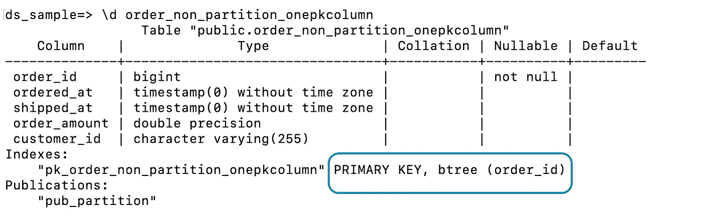
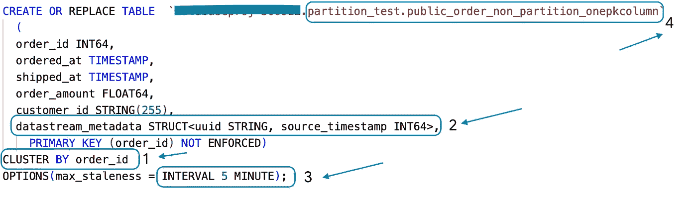
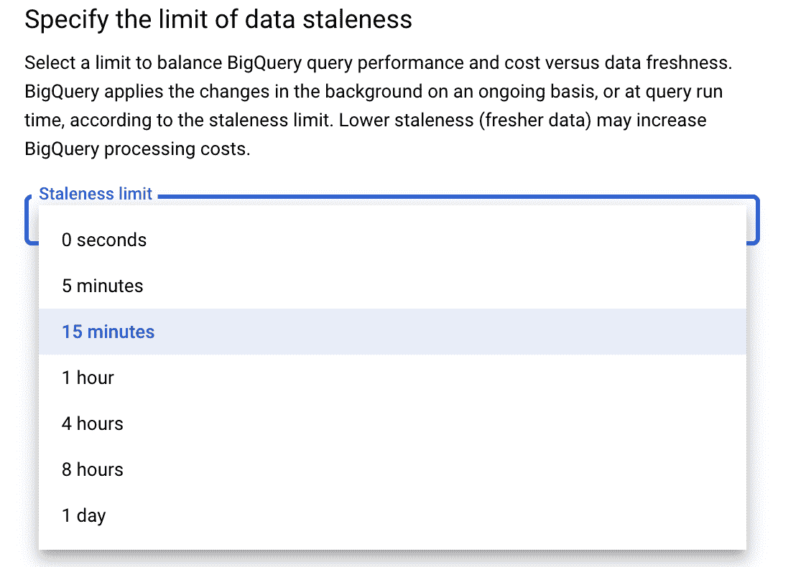
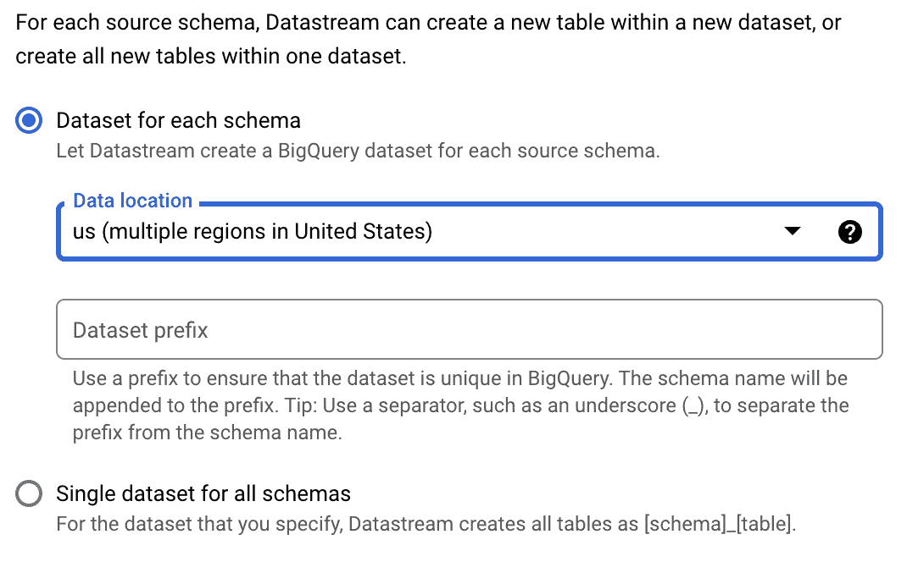
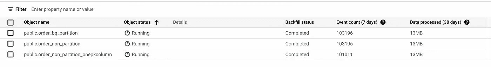
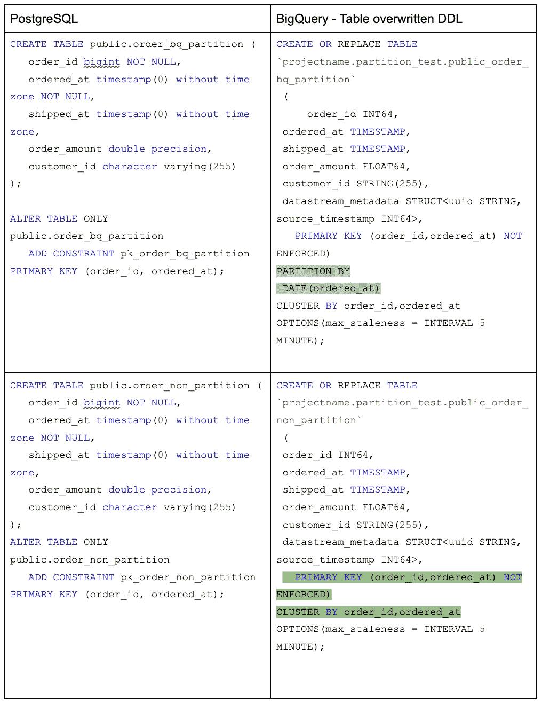
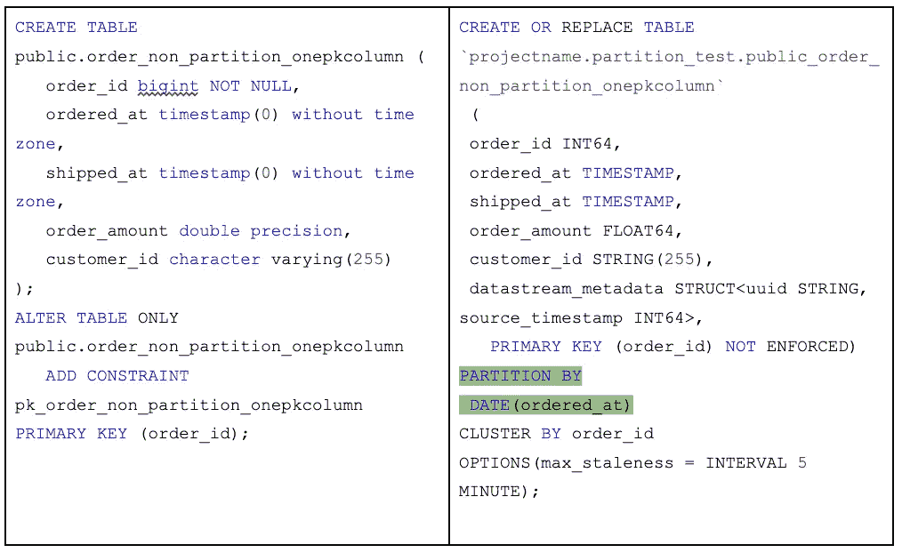

# 使用 PostgreSQL 的 BigQuery 中预定义的表作为源来配置数据流中的流。

> 原文：<https://medium.com/google-cloud/configure-streams-in-datastream-with-predefined-tables-in-bigquery-for-postgresql-as-source-528340f7989b?source=collection_archive---------1----------------------->

> 这是 PostgreSQL 和 BigQuery 在数据流上解决真实世界场景系列的第 3 部分，如果有兴趣查看所有策划的场景[请点击我。](/@mahtodeepak/solving-real-world-scenarios-on-datastream-for-postgresql-and-bigquery-b79334a065fc)

我没有预料到使用 Datastream 从 PostgreSQL 到 BigQuery 的公开预览会如此有趣。这是我的第三篇博客，如果你想玩得开心，可以好好看看第一篇[第一篇](/google-cloud/configure-google-cloud-datastream-for-only-certain-dmls-on-postgresql-as-source-16e4ad789ef8)和第二篇[关于以 PostgreSQL 为源的数据流的博客。](/google-cloud/configure-streams-from-partition-table-in-postgresql-to-non-partition-in-bigquery-using-datastream-3238fe3321d9)

如果我们有一个客户场景，让 PostgreSQL to BigQuery 从作为源的**非分区**表复制到**分区**表或 **alter columns 数据类型**会怎样？我们将探索如何实现它的方法，但首先让我们更好地理解在 BigQuery 中创建的表，这些表是使用 Datastream 从 PostgreSQL 流式传输的一部分。

主键是复制捕获更改并应用于目标的重要约束。在 BigQuery 中，主键作为表定义的一部分被转换为一个簇。我们来拿个样表做参考。我们将在 BigQuery 中映射数据流如何转换 PostgreSQL 中的表。

PostgreSQL 表在 order_id 列上定义了主键约束。



数据流将表转换如下。



看一看这两个截图，并尝试在 PostgreSQL 和 BigQuery 表之间映射细节。它包括多个数据点，让我们根据它是如何编号的来讨论。

## 1.PostgreSQL 表中的主键。

Primary 被转换为 BigQuery 表中的聚类。聚类主要是根据列对表中的数据进行排序。它提高了查询性能，降低了 BigQuery 的成本。同一组列上的主键也应用于 BigQuery，但不是强制的。

## 2.数据流元数据。

数据流向事件添加额外的元数据，例如，作为初始回填和连续更改的一部分，将更改推送到 BigQuery。它包括唯一的事件 id 和源事件的时间戳。

## 3.最大过期时间

创建流时，我们有一个选项来配置过时限制。它定义了数据的新鲜度，并对成本有直接影响。基于过时限制，数据流创建表并在 BigQuery 中为表定义 max_staleness。



## 4.BigQuery 中的表名。

数据流根据来自源的表的架构创建具有相同数据集或数据集的表。该表通常在 BigQuery 内或根据创建流时设置的前缀追加模式名，即<<*schemaname***_***table _ name*>>。



分享所有细节的原因是为了理解由数据流创建的 BigQuery 表，并在任何情况下使用它作为覆盖表定义的参考。

如果我们需要**在 BigQuery 表上定义分区**,那么通过根据数据流使用的 BigQuery writer 定义我们自己的表定义，就可以使用来自数据源的数据流进行复制。在某些情况下，我们也可以用**覆盖 BigQuery 中定义的**数据类型。

作为 BigQuery 自定义表引用的 SQL 代码段。

```
CREATE OR REPLACE TABLE  `projectname.partition_test.public_order_non_partition_onepkcolumn`
  (
  order_id INT64,
  ordered_at TIMESTAMP,
  shipped_at TIMESTAMP,
  order_amount FLOAT64,
  customer_id STRING(255),
  datastream_metadata STRUCT<uuid STRING, source_timestamp INT64>,
    PRIMARY KEY (order_id) NOT ENFORCED)
PARTITION BY
  DATE(ordered_at)
CLUSTER BY order_id
OPTIONS(max_staleness = INTERVAL 5 MINUTE);
```

覆盖表定义可能会导致异常，需要进行测试。下面是在以 PostgreSQL 为源启动流之前，在 BigQuery 中覆盖的示例表 DDL，在我的测试中它工作得很好。



其他注意事项，请注意在尝试自定义 BigQuery 定义时可能会遇到的数据流故障。

> 大查询编写器写入失败
> 
> big query _ UNSUPPORTED _ PRIMARY _ KEY _ CHANGE

这可能是由于不正确的表定义或 BigQuery 中覆盖的列数据类型造成的。请使用博客中共享的参考表，如果问题仍然存在，请联系谷歌云支持。

## 结论

添加分区或改变列数据类型是使用数据流复制到 BigQuery 的一个非常常见的场景。有了博客中分享的知识，我们可以在启动流作业和测试复制之前覆盖目标表定义。

## 进一步阅读

> 查看附加的[博客](https://mahtodeepak.medium.com/b79334a065fc)，解决 PostgreSQL 和 BigQuery 的数据流上的真实场景。