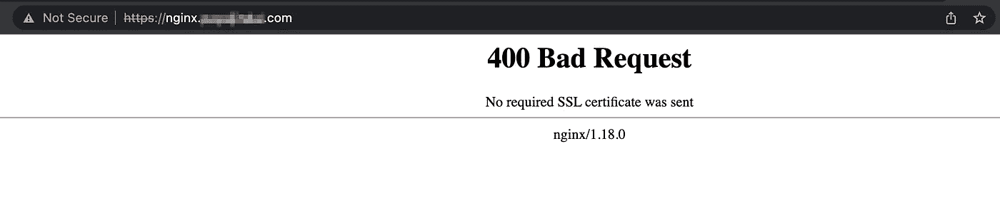

# 为 Apigee X 南行流量配置 mTLS

> 原文：<https://medium.com/google-cloud/configuring-mtls-for-apigee-x-southbound-traffic-flow-eb91f381b60f?source=collection_archive---------3----------------------->

在深入研究 mTLS 之前，让我们先了解一下单向 TLS 是如何工作的。

# 单向 TLS

如图 1 所示，在单向传输层安全性(TLS)中只验证服务器的身份。首先，客户端向服务器发起一个会话请求。然后，服务器用其证书进行响应，客户端在开始与服务器传输数据之前验证该证书。要对证书进行身份验证，客户端可以向证书颁发机构(CA)请求验证，或者根据存储在其信任库中的证书验证证书(如果 TLS 服务器使用的是自签名证书或者不是由可信 CA 签名的证书)。


图 1 .单向 TLS 握手

在上图中，Keystore(在服务器端)保存着 TLS 证书和私钥，用于在 TLS 握手过程中标识实体。另一方面，信任库(在客户端)包含用于验证 TLS 握手期间收到的证书的证书。

# mTLS 和 TLS 有什么不同？

mTLS (mutual TLS)是 TLS(传输层安全性)协议的变体，它通过要求客户端和服务器在 TLS 握手过程中出示自己的 TLS 证书和密钥来提供增强的安全性。相反，在单向 TLS 中，只要求服务器提供其 TLS 证书和密钥，而不验证客户端的身份。

在 mTLS 握手中，TLS 服务器首先将其包含公钥的证书提供给 TLS 客户端。然后，客户端通过对照受信任的证书列表(如存储在信任库中的那些列表)检查证书来验证服务器的身份。一旦服务器的身份得到验证，客户端就向服务器出示自己的证书和公钥，以便通过身份验证。如果服务器验证了客户端的身份，数据传输就可以开始了。

下图显示了客户端和服务器之间的 mTLS 握手过程。


图 2 .相互 TLS 握手

为了使用 mTLS 进行相互身份验证，客户端和服务器都需要维护一个包含它们自己的 TLS 证书和私钥的密钥库。此外，如果用于身份验证的证书是自签名的，那么客户端和服务器都需要一个包含可信证书列表的信任库。

# Apigee X 中的 MTL

在 Apigee X 中，对后端系统的任何请求(通过 Apigee API 代理)都可以分为两部分:用户对 Apigee 实例的请求，以及 Apigee 实例对后端系统的请求。下图显示了这一过程:


图 3 .顶点 X 中的最大允许长度

在 Apigee X 的上下文中，术语“北向”是指客户端和 Apigee 实例之间的流量，而“南向”是指 Apigee 实例和代理后端之间的流量。可以为北向和南向流量流启用 mTLS(本文仅涵盖南向 mTLS 的配置)；北向流量的 mTLS 配置目前需要在外部负载平衡器和 Apigee 运行时之间建立一个网桥(如 [Envoy proxy](https://github.com/apigee/terraform-modules/tree/main/samples/x-l4xlb-mtls) )。在外部负载平衡器[HTTP(s)]上实施的 mTLS 正在预览中。

为南行请求启用 mTLS 允许 Apigee 实例和代理后端之间的安全通信，确保在传输数据之前验证双方的身份。

这篇博文将讨论如何在 Apigee X 中为南行请求配置 mTLS。

# 配置南行 mTLS

在 Apigee 中，南行 mTLS 可用于保护运行时实例(充当 TLS 客户端)与代理目标和后端(充当 TLS 服务器)之间的请求。Mutual TLS 支持运行时实例和后端之间的相互认证，确保只有授权方才能访问 API。

现在，借助一个例子，我们将演示如何使用 Nginx 服务器作为代理目标，在 Apigee 中启用南行 mTLS。这个参考演示展示了 OpenSSL 证书的使用。你可以参考[这篇](https://www.ibm.com/docs/en/api-connect/10.0.1.x?topic=overview-generating-self-signed-certificate-using-openssl)来了解如何生成 OpenSSL 证书。

***顶点代理***

让我们看看如何在 Apigee 代理级别配置 mTLS。为此，我们需要对 *TargetEndpoint* 配置进行更改，添加一个 *SSLInfo* 块(示例配置如下所示),其中包含关于用于相互 TLS 握手的密钥库和信任库的信息。

```
<TargetEndpoint name="default">
    <PreFlow name="PreFlow">
        <Request/>
        <Response/>
    </PreFlow>
    <Flows/>
    <PostFlow name="PostFlow">
        <Request/>
        <Response/>
    </PostFlow>
    <HTTPTargetConnection>
        <URL>https://nginx.example.com</URL>
        <SSLInfo>
            <Enabled>true</Enabled>
            <ClientAuthEnabled>true</ClientAuthEnabled>
            <KeyStore>ref://ks-apigee-gateway-ref</KeyStore>
            <KeyAlias>ks-apigee-gateway-alias</KeyAlias>
            <TrustStore>ref://ts-apigee-gateway-ref</TrustStore>
            <IgnoreValidationErrors>false</IgnoreValidationErrors>
        </SSLInfo>
    </HTTPTargetConnection>
</TargetEndpoint>
```

让我们看看<sslinfo>块中需要添加的用于配置 MTL 的各种标签。</sslinfo>

<enables>标签支持 Apigee 运行时实例和目标后端之间的单向 TLS，而<clientauthenabled>标签支持双向 TLS。<keystore>和<truststore>标记允许您指定用于相互 TLS 握手的密钥库和信任库，方法是直接提供密钥库和信任库的名称，或者使用对它们的引用。引用是包含密钥库或信任库名称的变量。首选方法是使用引用，这样，如果有一天您的证书在密钥库中过期，您只需更改引用以指向新的密钥库，如果您保持新密钥库的名称与以前的名称相同，则不需要在代理中进行任何更改。<keyalias>标记指定了将证书和私钥添加到密钥库中时分配给它们的别名。<ignorevalidationerrors>标记，如果设置为 true，允许您忽略 TLS 证书错误。</ignorevalidationerrors></keyalias></truststore></keystore></clientauthenabled></enables>

要创建信任库和密钥库，可以使用 Apigee UI。

> **注意**:在 Apigee UI 中，您只在 Keystore 部分下配置 Keystore 和 Truststore。信任库是一个仅包含证书或证书链的密钥库。因此，每当您上传密钥库中的证书和密钥时，它将被用作密钥库，如果您只上传证书，它可以被用作信任库。此外，您不需要为信任库指定别名，因为它不用于存储私钥。请记住，每当您将证书和密钥上传到密钥库时，您都需要为它指定一个别名。

***代理后端***

为了为后端服务启用 mTLS，使用了一个默认接受所有 HTTP 请求的 Nginx 服务器。该服务器需要配置为侦听端口 443，为此，必须创建一个密钥库。此外，配置 mTLS 需要一个信任库，因为本演示涉及使用 OpenSSL 的自签名证书生成 pem 和密钥文件。下面的代码片段应该添加到 Nginx 服务器的配置文件中，以启用 mTLS。

```
server{
        listen 443 ssl;
        server_name nginx.payaljindal.com;
        ssl_certificate /etc/nginx/client-certis/nginx_server.pem;
        ssl_certificate_key /etc/nginx/client-certis/nginx_server.key;
        ssl_client_certificate /etc/nginx/client-certis/RootCA.pem;
        ssl_verify_client on;
}
```

在提供的代码中，密钥库由 *ssl_certificate* 和 *ssl_certificate_key* 组成。 *ssl_client_certificate* 包含将用于验证由 Apigee 实例作为信任库发送的证书的证书。通过将 ssl_verify_client 设置为“on”来启用双向 TLS。

> **注意**:如果您使用不同的目标后端，此配置可能会有所不同，但是我们上传的文件/证书将保持不变。

***测试***

现在，我们已经完成了向 Apigee 代理及其后端添加信任库和密钥库配置的过程，我们可以继续测试设置了。

此外，我们需要在端口 443 上向 Nginx 服务器发送一个包含所有请求的证书。让我们尝试直接从浏览器点击端口 443 上的 Nginx 服务器，它给出如下所示的响应



图 4 .从浏览器访问 Nginx 服务器

错误的原因是浏览器没有发送任何证书，但 Nginx 服务器需要一个证书，如错误消息“没有发送所需的 SSL 证书”所示。

但是，如果请求是从 Apigee 代理发送到 Nginx 服务器的，并且 Nginx 服务器是目标后端，那么它将按预期工作，因为 Apigee 代理已经配置为发送必要的证书，如下图所示。


图 5 .通过 Apigee 代理访问 Nginx 服务器

因此，我们可以在顶点代理级别启用南行 mTLS。希望这篇文章对你有帮助！

快乐学习！！