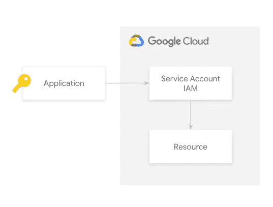
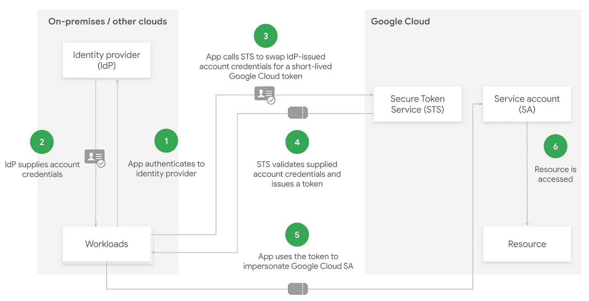
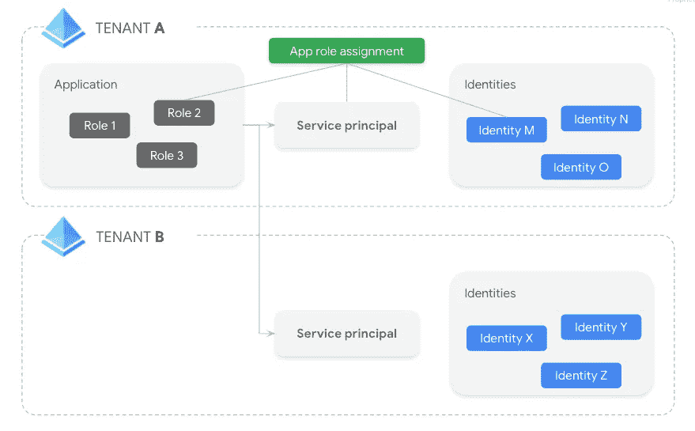
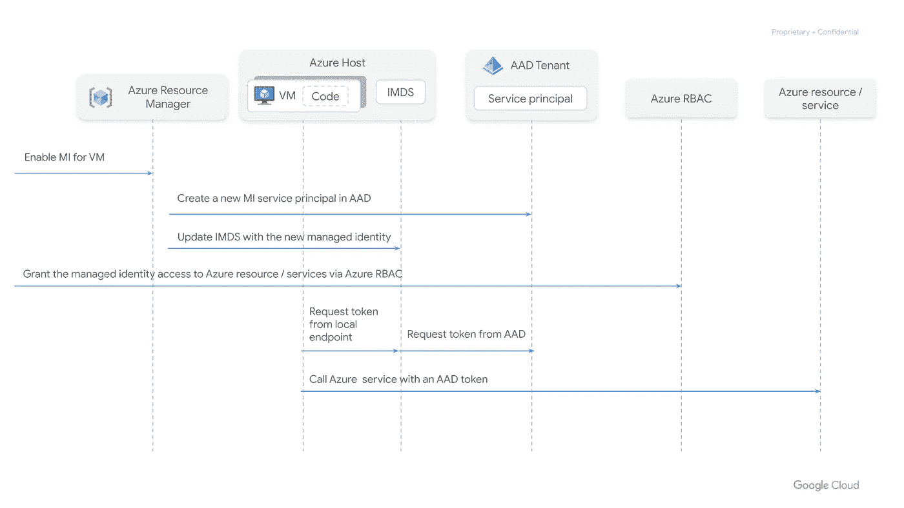

# Google Cloud:用 Azure 配置工作负载身份联邦

> 原文：<https://medium.com/google-cloud/configuring-workload-identity-federation-with-azure-672a1e1f3eec?source=collection_archive---------0----------------------->

对于运行在 Google Cloud 之外的工作负载来说，调用 Google Cloud APIs 最直接的方法是使用下载的服务帐户密钥。



然而，这种方法有两个主要难点:

*   这是一个管理难题，密钥需要安全存储并经常轮换。
*   安全风险，密钥是可能被泄露的长期凭证。

**Workload identity Federation**支持在 Google Cloud 之外运行的应用程序用短期访问令牌替换长期服务帐户密钥。这是通过将 Google Cloud 配置为信任外部身份提供者来实现的，因此应用程序可以使用外部身份提供者颁发的凭据来模拟服务帐户。

目前，Google Cloud 支持与以下 IDP 集成:

*   自动警报系统
*   符合 OIDC 标准的境内流离失所者
*   符合 SAML 的国内流离失所者(预览版)

下图说明了工作负载身份联合在幕后的实际工作方式:



1.  在内部或另一个云提供商中运行的工作负载提交一个请求，以根据 IdP 进行身份验证。
2.  IdP 验证与该工作负载相关联的身份，并返回帐户凭证。
3.  工作负载调用 Google Cloud Secure Token Service(STS ),提供 IdP 颁发的帐户凭证。
4.  STS 验证提供的令牌并返回一个短期令牌。
5.  工作负载使用该令牌来模拟服务帐户。
6.  最后，工作负载可以访问 Google Cloud 上受保护的资源。

在本文中，我将解释如何使用 Azure (OIDC 兼容的 IdP)配置工作负载身份联盟，以便在 Azure VM 上运行的工作负载可以模拟一个服务帐户来执行 Google 云资源上的操作。

每当我们配置工作负载身份联合时，都需要遵循 3 个关键步骤:

1.  准备外部 IdP。
2.  定义一个**属性映射**和一个可选的**属性条件**，以将 IdP 凭证映射到外部身份。
3.  准备 Google Cloud 与外部 IdP 建立信任。

让我们一步一步地了解整个过程。

# 准备外部 IdP

在解释 Azure 中需要设置的细节之前，了解身份和访问管理(IAM)在 Azure 上的工作方式是很重要的。

Azure Active Directory (AAD)是微软基于云的 IAM 服务，它帮助组织的员工登录和访问以下资源:

*   外部资源，如 Microsoft 365、Azure 门户和其他 SaaS 应用程序。
*   内部资源，如公司网络和内联网上的应用程序，以及组织开发的任何云应用程序。

AAD **租户**是组织在与微软建立关系之初收到的 AAD 的专用实例。这种关系可以从注册 Azure 或微软 365 开始。

一个**应用程序**必须在一个租户中注册，才能将身份和访问管理委托给 AAD。在门户网站中，这是在*应用注册*刀片上完成的。

当一个应用程序被注册时，需要指定它是单租户还是多租户。应用程序由其唯一的应用程序对象定义，该对象驻留在应用程序注册的租户中。应用程序对象用作创建一个或多个服务主体对象的模板。在使用应用程序的每个租户中都创建了一个**服务主体**，它们可以在门户的*企业应用*刀片中进行管理。

**托管身份** (MI) 向 Azure 托管资源提供 AAD 身份。在这些资源上运行的代码可以使用 MI 为支持 AAD 身份验证的服务请求访问令牌。有两种类型的托管身份:

*   **系统分配的** —一些 Azure 服务允许直接在服务实例上启用托管身份。如果启用，将在 AAD 中创建一个身份，它与服务实例的生命周期相关联。
*   **用户分配的** —托管身份也可以创建为独立的 Azure 资源，然后分配给 Azure 服务的一个或多个实例。在这种情况下，身份与服务实例的生命周期无关。

默认情况下，在 AAD 租户中注册的应用程序可供成功通过身份验证的租户的身份使用。应用程序 RBAC 是一种对租户可用的应用程序实施授权的机制。应用程序开发人员定义角色。然后，管理员可以将这些角色分配给不同的身份(例如，虚拟机的托管身份)。

下图描述了到目前为止所描述的不同实体之间的关系:



在虚拟机上运行的代码可以使用与虚拟机关联的托管标识，从 Azure 实例元数据服务器(IMDS)中的令牌端点请求资源的访问令牌，该令牌只能从虚拟机内部访问。关于如何调用该端点的更多细节可以在这里找到[。](https://docs.microsoft.com/en-us/azure/active-directory/managed-identities-azure-resources/how-to-use-vm-token#get-a-token-using-http)

序列图描述了获取资源令牌并使用它来访问资源的过程。



在 Azure 应用服务或 Azure 功能的情况下，具有关联 MI 的应用通过定义 2 个环境变量使端点请求可用的访问令牌:

*   **IDENTITY_ENDPOINT** —本地令牌服务的 URL。
*   **IDENTITY_HEADER** —用于帮助缓解 SSRF 攻击的报头。该值由平台旋转。

关于如何调用端点检查[的更多细节，请点击这里](https://docs.microsoft.com/en-us/azure/app-service/overview-managed-identity?tabs=portal%2Chttp#rest-endpoint-reference)。

好了，现在已经清楚了 IAM 在 Azure 中的工作方式，让我们看看需要在 Azure 中设置什么来实现与 Google Cloud 的工作负载身份联邦集成。你只需要遵循以下步骤:

1.  创建一个新的 AAD 应用程序，专门用于获取 Google Cloud 凭据。
2.  设置一个应用程序 ID URI，它在你的 Azure Active Directory 中唯一地标识该应用程序，并记下它，因为在 Google Cloud 中进行配置时将需要它。
3.  为应用程序分配角色。
4.  在 AAD 租户中为应用程序创建服务主体。

如果您使用 Terraform 进行自动化，您可以按如下方式轻松完成:

```
resource “azuread_application” “app” {display_name = <**APP_NAME>**identifier_uris = [<**APPLICATION_ID_URI>**]app_role {
    allowed_member_types = [“Application”]
    description = <**ROLE_DESCRIPTION>** display_name = <**ROLE_DISPLAY_NAME>** enabled = true
    id = <**UUID>** value = <**ROLE_VALUE>** }
}resource “azuread_service_principal” “service_principal” {application_id = azuread_application.app.application_id
  app_role_assignment_required = true}
```

# 定义属性映射和可选的属性条件

在工作负载的上下文中，IdP 凭证(在我们的例子中是由 AAD 发布的 JWT 令牌)中的身份联合声明被称为**断言属性**并表示为断言。[姓名]。

需要一个**属性映射**来将断言属性映射到由工作负载身份联盟识别的预定义目标属性，如下所列:

*   **google.sub** —外部身份的唯一标识符。对于 OIDC 提供者，比如我们正在合作的那个，需要为这个目标属性提供一个映射。
*   **google.groups** —身份所属的一组组。
*   **属性。[名称]** —最多 50 个自定义属性。

稍后，我们将看到在与我们将尝试模拟的服务帐户相关联的 IAM 策略中创建 IAM 绑定时，如何使用此目标属性。

属性映射采用以下形式:

```
TARGET_ATTRIBUTE=SOURCE_EXPRESSION
```

[CEL(公共表达式语言](https://cloud.google.com/certificate-authority-service/docs/using-cel))可用于定义对断言属性进行操作的源表达式。

适合我们用例的映射如下所示:

```
google.subject=assertion.sub
```

可选地，我们还可以添加一个**属性条件**来建立接受外部凭证的环境。条件被写成可以检查断言属性和目标属性的 CEL 表达式。如果条件评估为真，则接受凭证。否则，凭证被拒绝。为了简单起见，我们不指定条件。

# 准备 Google Cloud 与外部 IdP 建立信任

我们差不多完成了。最后一步是继续在 Google Cloud 上进行配置。为此，我们需要在 Google Cloud 项目中创建一个工作负载身份池和提供者。提供者将被配置为信任由我们的 AAD 租户为之前创建的应用程序颁发的令牌。

Google Cloud 项目需要启用以下 API:

*   cloudresourcemanager.googleapis.com
*   iam.googleapis.com
*   iamcredentials.googleapis.com
*   sts.googleapis.com

要创建工作负载身份池和提供者，需要在该项目中授予以下角色之一:

*   *工作负载身份池管理*
*   *所有者*(不建议生产)

可以使用以下代码在 Terraform 上创建这两个资源:

```
resource "google_iam_workload_identity_pool" "pool" { provider                  = google-beta
  project                   = <**PROJECT_ID>** workload_identity_pool_id = <**POOL_ID>**}resource "google_iam_workload_identity_pool_provider" "provider" { provider                           = google-beta
  project                            = <**PROJECT_ID>** workload_identity_pool_id          =   google_iam_workload_identity_pool.pool.workload_identity_pool_id
  workload_identity_pool_provider_id = <**PROVIDER_ID>** attribute_mapping = { "google.subject" = "assertion.sub" } oidc { allowed_audiences = [<**APPLICATION_ID_URI>**]
    issuer_uri        = "https://sts.windows.net/<**AAD_TENANT_ID>**" }}
```

# 测试我们的设置

好了，所有的配置都完成了。现在让我们确认它实际上是有效的。我们如何做到这一点？

1.让我们首先用系统分配的 MI 在 Azure 中创建一个 Linux VM，并在其上安装 gcloud CLI。

2.一旦 VM 准备就绪，在 Azure 中创建一个应用程序角色分配，这样与 VM 相关联的 MI 就可以为 AAD 应用程序请求访问令牌。使用 Terraform，可按如下方式完成:

```
resource “google_service_account_iam_binding” “admin-account-iam” {service_account_id = <**SERVICE_ACCOUNT_EMAIL>** role = “roles/iam.workloadIdentityUser”
  members = [ "principalSet://iam.googleapis.com/projects/<**PROJECT_NUMBER>**/locations/global/workloadIdentityPools/<**POOL_ID>**/*" ]}
```

3.在 Google Cloud 中，授予外部身份一个服务帐户上的*工作负载身份用户*角色，该角色被授予在资源上执行所需操作所需的权限。

IAM 绑定中的成员可以按如下方式引用:

*   特定的外部身份

```
principal://iam.googleapis.com/projects/<**PROJECT_NUMBER>**/locations/global/workloadIdentityPools/<**POOL_ID>**/subject/<**SUBJECT>**
```

*   一组外部身份

```
principal://iam.googleapis.com/projects/<**PROJECT_NUMBER>**/locations/global/workloadIdentityPools/<**POOL_ID>**/group/<**GROUP>**
```

*   通过在自定义属性中具有特定值来标识的一组外部身份。

```
principalSet://iam.googleapis.com/projects/<**PROJECT_NUMBER>**/locations/global/workloadIdentityPools/<**POOL_ID>**/**attribute.<ATTRIBUTE_NAME>**/<**ATTRIBUTE_VALUE>**
```

*   工作负荷标识池中的所有外部标识。

```
principalSet://iam.googleapis.com/projects/<**PROJECT_NUMBER>**/locations/global/workloadIdentityPools/<**POOL_ID>**/*
```

在这个特殊的例子中，我们授予池中的所有身份模拟服务帐户的权限。

4.使用 gcloud CLI 生成一个凭据文件。

```
gcloud iam workload-identity-pools create-cred-config \
projects/<**PROJECT_NUMBER>**/locations/global/workloadIdentityPools/<**POOL_ID>**/providers/<**PROVIDER_ID>** \
--service-account=<**SERVICE_ACCOUNT_EMAIL>** \
--azure \
--app-id-uri <**APPLICATION_ID_URI>** \
--output-file=<**FILEPATH>**.json
```

这里有一个警告。在这种情况下生成的凭据文件适合在虚拟机中运行的工作负载。如果您检查该文件，您将看到 Azure IMDS url 被引用为 IdP 令牌端点。但是，此端点不适合 Azure App Service 或 Azure Functions 上的应用程序。在这种情况下，令牌端点将由环境变量 INDETITY _ ENDPOINT 给出，并且需要添加一个带有环境变量 IDENTIT_HEADER 值的 X-IDENTITY-HEADER HTTP 头。

5.使用生成的凭证文件登录 Google Cloud。

```
gcloud auth login –cred-file <**FILEPATH>**.json
```

6.运行特定的 gcloud 命令对资源执行操作。

我希望这篇文章能帮助你更好地理解 workload identity Federation for Azure 是如何工作和设置的。请查看与此示例相关的[代码](https://github.com/GoogleCloudPlatform/cloud-foundation-fabric/tree/master/examples/cloud-operations/workload-identity-federation)，您可以在云基础架构存储库中查看该代码。

我打算写一篇关于如何为 AD FS 设置工作负载身份联邦的后续文章。一旦文章写好了，再见。