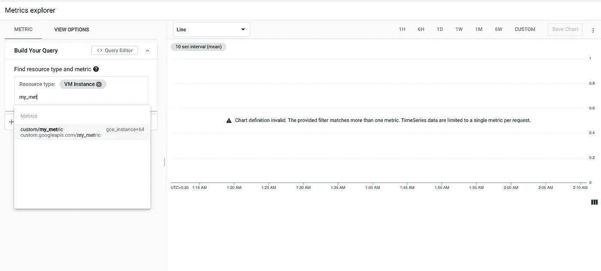
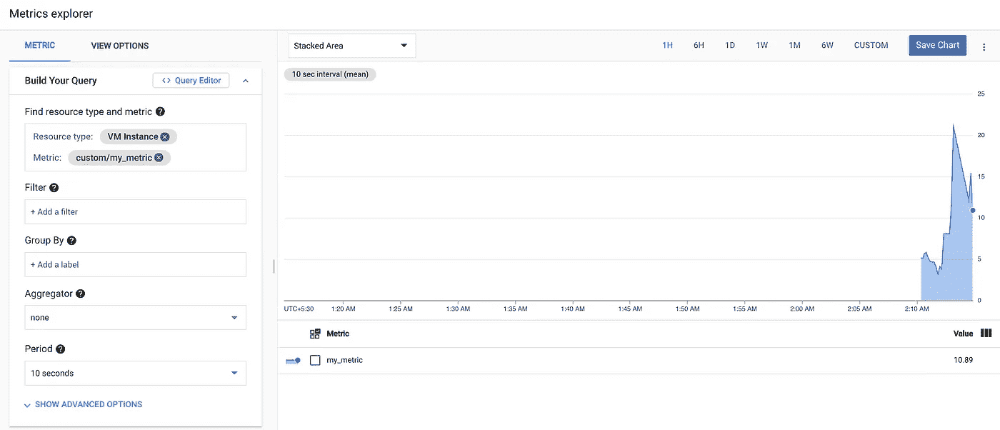

# Google 云监控 API 入门—第 1 部分

> 原文：<https://medium.com/google-cloud/confused-with-custom-monitoring-metrics-on-gcp-c514cd4a776b?source=collection_archive---------0----------------------->

> 如果您已经部署了您的应用程序，那么您尤其希望尽快推出新功能，而不是花时间检查您的服务是否停机，对吗？这就是监控发挥作用的地方。


[图片来自 [Pexels](https://www.pexels.com/photo/simple-workspace-at-home-6476587/?utm_content=attributionCopyText&utm_medium=referral&utm_source=pexels) 的米凯尔·布隆维斯特

Google cloud operations suite，以前称为 Stackdriver，提供了一个内置的监控仪表板，让您可以在 GCP 或混合环境中检查项目的各种指标。

假设您想在 GCP 上定制监控仪表板，并想自动化这个过程(或者您是一名开发人员，更喜欢终端/编辑器，不想使用 UI)。您可以使用`google-cloud-monitoring`——用于监控 API 的客户端库。


来源:Reddit

在这篇博客中，我将首先创建一个自定义指标，然后用它来创建我们的仪表板，而不用离开我们的编辑器！✨
我们将特别关注两种方法— `create_metric_descriptor`和`create_time_series`。你不一定要知道 API 是如何工作的，但是掌握一些 python 知识是很有必要的。

# 到底什么是度量？

GCP 的指标包含以下三个要素:

*   一组**数据点**。
*   **度量型**信息，告诉您数据点代表什么。
*   **受监控资源**信息，它告诉您数据点的来源。这可以是从您的虚拟机到 K8s 群集的任何内容，也可以是您定义的任何任务。

您可以尝试在 GCP 项目的人工智能平台上的 Jupyter 笔记本中创建自定义指标，或者按照以下步骤使用监控 API 进行身份验证— [设置身份验证](https://cloud.google.com/monitoring/docs/reference/libraries#setting_up_authentication)。

重要的事情先来！如果你是一个 python 开发者，你应该已经知道这个训练了，:D

```
pip install google-cloud-monitoring
```

# **创建自定义指标和时间序列**

您的定制指标应该有一个在 google cloud 项目中所有指标名称中唯一的**字符串标识符**，并以`custom.googleapis.com`为前缀。因此，如果您的度量被称为`my-metric`，标识符将看起来像`custom.googleapis.com/my-metric`。

> **注意:**因为这些指标标识符必须是唯一的，所以您可以理解，如果您试图将数据写入现有指标，即已经有定义源的指标，您将会收到一个错误。我在 403 卡了一段时间！对我来说一直有效的一个技巧是参考库的源代码，看看发生了什么，怎么样！或者只是在每一步继续打印😛

现在转到**受监控的资源**，假设我们的这个自定义指标是由一个虚拟机生成的，那么您的资源类型是`gce_instance`。您可以在这里找到资源类型列表。您可以添加“标签”字段来指定资源的任何标签。比如`instance_id`或者`zone`。请记住，这是关于我们的数据源的**附加信息。**

> 。create_metric_descriptor()

如果您在自定义指标的指标描述符尚不存在时写入指标数据，则会自动创建一个指标描述符。度量描述符的自动创建是有限制的，所以最好自己添加这些数据。
在描述符的两个组成部分——`metric_kind`和`value_type`中，我特别混淆了`metric kind`。度量数据的*种类*告诉您如何解释彼此相关的值。它可以是`GAUGE`，代表某个特定点的指标值，不像`DELTA`，value 衡量自上次记录以来的变化。

```
descriptor = client.create_metric_descriptor(name=project_name, metric_descriptor=descriptor)
```

现在我们有了一个自定义指标，我们可以编写我们的数据点，以便在监控仪表板上显示它们。



在监控>指标浏览器中查找您的自定义指标

通过将一列`[TimeSeries](https://cloud.google.com/monitoring/api/ref_v3/rest/v3/TimeSeries)`对象传递给`[timeSeries.create](https://cloud.google.com/monitoring/api/ref_v3/rest/v3/projects.timeSeries/create)`来写入数据点。最大列表大小为 200。每个`[TimeSeries](https://cloud.google.com/monitoring/api/ref_v3/rest/v3/TimeSeries)`对象只能包含一个`[Point](https://cloud.google.com/monitoring/api/ref_v3/rest/v3/TimeSeries#Point)`对象。如果你想对同一个时间序列写多个点，那么使用一个单独的对`[timeSeries.create](https://cloud.google.com/monitoring/api/ref_v3/rest/v3/projects.timeSeries/create)`的调用。

> 。创建时间序列()

因此，通过更改键`double_value`的值并运行几次代码，您可以针对特定时间序列的间隔推送值。这可用于在指标值发生变化时立即推送数据。您可以在 celery 中使用异步任务创建触发器，或者使用云发布/订阅。不要以每 10 秒一个点的速度向单个时间序列写入数据。

查看 metrics explorer 下的监控仪表板，观察您的时间序列产生的波动！🥳



在为时间序列写了几个值之后

更多信息，请参考[https://cloud . Google . com/monitoring/custom-metrics/creating-metrics](https://cloud.google.com/monitoring/custom-metrics/creating-metrics#writing-ts)，或在 twitter 上 ping 我@ [arpana_naa](https://twitter.com/arpana_naa) ！

在— [第二部分](/google-cloud/fetching-monitoring-metrics-data-from-gcp-into-your-application-using-python-214358b0047e)、[第三部分](/google-cloud/missing-data-points-in-your-monitoring-api-response-use-page-iterators-81d27e954c70)中找到本系列的其他帖子。

[](/google-cloud/fetching-monitoring-metrics-data-from-gcp-into-your-application-using-python-214358b0047e) [## 使用 python 将监控指标数据从 GCP 提取到您的应用程序中

### 在这篇博客中，我将解释如何使用 python 客户端库中的“list_time_series”方法…

medium.com](/google-cloud/fetching-monitoring-metrics-data-from-gcp-into-your-application-using-python-214358b0047e)