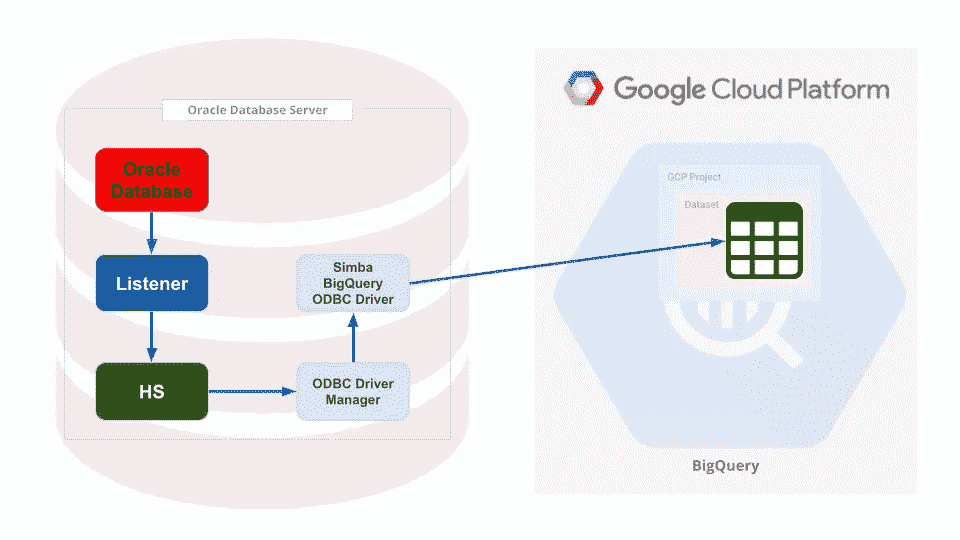

# 使用数据库链接将 Oracle 连接到 BigQuery

> 原文：<https://medium.com/google-cloud/connect-oracle-to-bigquery-using-db-link-6f2040336a47?source=collection_archive---------0----------------------->

**背景:**我搜索了一个简单的、端到端的、**工作指南**来使用 Simba BigQuery ODBC 驱动程序配置 Oracle 数据库网关。然而，我找不到一本**完整指南**，所以我决定写这本。

Oracle 有一个很酷的特性，叫做异构服务(或 Oracle 数据库网关),用来连接不同类型的数据库。这样，只需使用 Oracle 数据库中的数据库链接，您就可以在没有任何 ETL 工具的情况下直接访问具有 ODBC 驱动程序的数据库。

下面是 4 步 Oracle 数据库网关到 BigQuery 的配置；

1-创建用于从 Oracle 访问 BigQuery 的 GCP 服务帐户

2-在 Oracle 数据库服务器上配置 Simba ODBC 驱动程序

3-配置 Oracle HS 和 Oracle 监听器

4-创建数据库链接并运行查询

在我们进入这些点之前，这里是架构的样子；



## 1-创建用于从 Oracle 访问 BigQuery 的 GCP 服务帐户

有两种方法可以进入 GCP。您可以使用个人帐户或创建服务帐户。Simba ODBC 驱动程序支持这两种选项。在这篇博文中，我将选择服务账户。

请要求您的 GCP 项目所有者获取服务帐户和密钥，或者如果您是项目所有者，请创建一个服务帐户，生成密钥并授予服务帐户的 BigQuery User + BigQuery Editor 权限。

(如果你是 GCP 的新手，你可以按照这个指南创建服务帐户[https://cloud . Google . com/iam/docs/creating-managing-service-accounts](https://cloud.google.com/iam/docs/creating-managing-service-accounts)并按照这个[https://cloud . Google . com/iam/docs/creating-managing-service-account-keys](https://cloud.google.com/iam/docs/creating-managing-service-account-keys)创建密钥。)

**2-在 Oracle 数据库服务器上配置 Simba ODBC 驱动程序**

这里的所有步骤都是以 root 用户身份完成的，但它也可以是“oracle”操作系统用户，您只需要设置一个属于 oracle 的不同路径。

**下载 BigQuery 的 Simba ODBC 驱动:**

```
wget [https://storage.googleapis.com/simba-bq-release/odbc/SimbaODBCDriverforGoogleBigQuery64_2.1.11.1011.tar.gz](https://storage.googleapis.com/simba-bq-release/odbc/SimbaODBCDriverforGoogleBigQuery64_2.1.11.1011.tar.gz)
```

在/opt 下提取它:

```
tar — directory=/opt -zxvf SimbaODBCDriverforGoogleBigQuery64_2.1.11.1011.tar.gz
```

将您在上一步中获得的服务帐户密钥复制到/opt/simba/googlebigqueryodbc(或者复制到任何位置，记住您需要稍后定义路径)

**编辑位于/opt/Simba/googlebigqueryodbc/Setup/odbc.ini 中的 odbc . ini 文件:**

我们需要 64 位配置，odbc.ini 文件中已经有一个示例[Google BigQuery 64 位]配置定义。我不喜欢空白，因此我用[bq]改变了[Google BigQuery 64 位]。Oracle HS 配置中需要此定义。

如果你想把[Google BigQuery 64 位]也换成[bq]；

```
Under [ODBC Data Sources] (line 10ish):
Replace;
Google BigQuery 64-bit=Simba ODBC Driver for Google BigQuery 64-bit
with; 
bq=Simba ODBC Driver for Google BigQuery 64-bit
----
And at line 68ish Replace [Google BigQuery 64-bit] with [bq]
```

更改/设置以下属性:

```
**Driver**=/opt/simba/googlebigqueryodbc/lib/64/libgooglebigqueryodbc_sb64.so
**Catalog**=your-gcp-project-id
**SQLDialect**=1
**OAuthMechanism**=0
**Email**=[your-gcp-service-account@your-gcp-project-id.iam.gserviceaccount.com](mailto:Email=bq-user@nokia-bms-poc.iam.gserviceaccount.com)
**KeyFilePath**=/opt/simba/googlebigqueryodbc/sa_key.json
```

(可选)如果需要打开调试日志记录，请设置以下附加属性:

```
**LogLevel**=5
**LogPath**=/opt/simba/googlebigqueryodbc/logs
```

(请参阅附录末尾这些更改后的完整 odbc.ini 文件)

**编辑位于/opt/Simba/googlebigqueryodbc/Setup/odbc . ini 中的 odbcinst.ini 文件:**

将$(INSTALLDIR)替换为“/opt/Simba/googlebigqueryodbc ”, odbc 焦油球被提取到此处。

更改后的 odbcinst.ini:

```
# To use this INI file, replace $(INSTALLDIR) with the
# directory the tarball was extracted to.[ODBC Drivers]
Simba ODBC Driver for Google BigQuery 32-bit=Installed
Simba ODBC Driver for Google BigQuery 64-bit=Installed[Simba ODBC Driver for Google BigQuery 32-bit]
Description=Simba ODBC Driver for Google BigQuery(32-bit)
Driver=$(INSTALLDIR)/lib/libgooglebigqueryodbc_sb32.so[Simba ODBC Driver for Google BigQuery 64-bit]
Description=Simba ODBC Driver for Google BigQuery(64-bit)
#Driver=$(INSTALLDIR)/lib/libgooglebigqueryodbc_sb64.so
Driver=/opt/simba/googlebigqueryodbc/lib/64/libgooglebigqueryodbc_sb64.so## The option below is for using unixODBC when compiled with -DSQL_WCHART_CONVERT.
## Execute 'odbc_config --cflags' to determine if you need to uncomment it.
# IconvEncoding=UCS-4LE
```

**编辑位于/opt/Simba/googlebigqueryodbc/lib/64/中的 Simba . googlebigqueryodbc . ini**

在此定义编码；

```
DriverManagerEncoding=UTF-8
```

或者，您可以通过设置来启用调试日志记录:

```
LogLevel=5
LogPath=/opt/simba/googlebigqueryodbc/logs
```

经过这些更改后，simba.googlebigqueryodbc.ini 文件应该如下所示:

```
# To use this INI file, replace $(INSTALLDIR) with the
# directory the tarball was extracted to.[Driver]
DriverManagerEncoding=UTF-8
ErrorMessagesPath=/opt/simba/googlebigqueryodbc/ErrorMessages
LogLevel=5
LogPath=/opt/simba/googlebigqueryodbc/logs
IgnoreTransactions=1## — Note that the path to your ODBC Driver Manager must be specified in LD_LIBRARY_PATH.
```

**使用 isql 测试您的配置:**

```
*#Set your environment variables first:*export LD_LIBRARY_PATH=$LD_LIBRARY_PATH:/usr/local/lib
export LD_LIBRARY_PATH=$LD_LIBRARY_PATH:/opt/simba/googlebigqueryodbc/lib/
export ODBCINI=/opt/simba/googlebigqueryodbc/Setup/odbc.ini
export SIMBAGOOGLEBIGQUERYODBCINI=/opt/simba/googlebigqueryodbc/lib/64/simba.googlebigqueryodbc.ini
```

从 cmd 行调用 isql:

```
isql bq#run a sample query on BQ:
SQL> select * from `your-project-id.dataset.table_name`;
```

如果您看到了您的查询结果，那么恭喜您，您已经完成了第一个棘手的部分！现在我们需要配置 Oracle HS。

## **3-配置 Oracle HS 和 Oracle 监听器**

第二个棘手的问题来了，切换到 oracle user 并转到$ORACLE_HOME。在 ORACLE _ HOME 下有 hs 文件夹，在该文件夹下有 admin 文件夹，我们需要在其中**创建一个新的 initbq.ora** 文件来定义我们的 HS 配置。

```
**cd $ORACLE_HOME/hs/admin**
vi initbq.ora
```

定义以下参数:

```
HS_FDS_CONNECT_INFO = "bq"
HS_FDS_SHAREABLE_NAME = /usr/lib64/libodbc.so 
**# Note that above path is not the ODBC lib path that we downloaded and extracted but the ODBC Driver Manager's path!** HS_LANGUAGE=AMERICAN_AMERICA.WE8ISO8859P1set ODBCINI=/opt/simba/googlebigqueryodbc/Setup/odbc.ini
set SIMBAGOOGLEBIGQUERYODBCINI=/opt/simba/googlebigqueryodbc/lib/64/simba.googlebigqueryodbc.ini
set LD_LIBRARY_PATH=$LD_LIBRARY_PATH:/usr/local/lib:/opt/simba/googlebigqueryodbc/lib/64
```

以下是 initbq.ora 文件示例:

```
#
# HS init parameters
#HS_FDS_CONNECT_INFO = "bq" 
#HS_FDS_TRACE_LEVEL = DEBUG 
HS_FDS_SHAREABLE_NAME = /usr/lib64/libodbc.so
HS_LANGUAGE=AMERICAN_AMERICA.WE8ISO8859P1

#
# ODBC specific environment variables
#
set ODBCINI=/opt/simba/googlebigqueryodbc/Setup/odbc.ini
set SIMBAGOOGLEBIGQUERYODBCINI=/opt/simba/googlebigqueryodbc/lib/64/simba.googlebigqueryodbc.ini
set LD_LIBRARY_PATH=$LD_LIBRARY_PATH:/usr/local/lib:/opt/simba/googlebigqueryodbc/lib/64
```

**配置您的 listener.ora 文件，以便您的监听器可以监听 hs (bq)实例。**如果您没有 listener.ora 文件，您需要创建一个。

```
cd $ORACLE_HOME/network/admin
vi listener.ora
```

您需要为 bq HS 配置定义 SID_DESC。将以下内容添加到 SID_LIST_LISTENER 中:

```
 (SID_DESC=
         (SID_NAME=bq)
         (ORACLE_HOME=/u01/app/oracle/product/19c/dbhome_1)
         (PROGRAM=dg4odbc)
      )
```

更改后的样本 listener.ora 文件:

```
LISTENER =
    (DESCRIPTION_LIST =
        (DESCRIPTION =
          (ADDRESS = (PROTOCOL = TCP)(HOST = localhost)(PORT = 1521))
        )
    )SID_LIST_LISTENER=
   (SID_LIST=
      (SID_DESC=
        (SID_NAME=orclsid)
        (ORACLE_HOME=/u01/app/oracle/product/19c/dbhome_1)
      )
      (SID_DESC=
        (SID_NAME=orclsidXDB)
        (ORACLE_HOME=/u01/app/oracle/product/19c/dbhome_1)
      )
      (SID_DESC=
         (SID_NAME=bq)
         (ORACLE_HOME=/u01/app/oracle/product/19c/dbhome_1)
         (PROGRAM=dg4odbc)
      )
   )
```

在 tnsnames.ora 文件中为 bq hs 实例添加一个 **TNS 条目。**

```
bq  =
  (DESCRIPTION =
    (ADDRESS = (PROTOCOL = tcp)(HOST = localhost)(PORT = 1521))
    (CONNECT_DATA =
      (SID = bq)
    )
    (HS = OK)
  )
```

(如果$ORACLE_HOME/network/admin 下没有 tnsnames.ora 文件，则需要创建一个来启用 HS。)

重新启动您的 Oracle 监听器:

```
lsnrctl stop
lsnrctl start
```

在此阶段，我们完成了 HS 配置。

## 4-创建数据库链接并运行查询

使用 sqlplus 或任何客户端，使用您的数据库用户登录到您的数据库；

```
sqlplus db_user/password@db_sid
```

创建数据库链接；

```
CREATE DATABASE LINK bq CONNECT TO “dataset_name” IDENTIFIED BY “password” USING ‘bq’;
```

这里我使用了“dataset_name ”,这是 BigQuery 中实际的数据集名称。然而，您不需要实际的 dataset_name 或密码，您只需要为“Connect to”和“password”提供一些东西(任何东西)来创建数据库链接。

现在，最后，我们到了你到目前为止所做的一切都有了结果或者你评论你的问题的时候了。

使用数据库链接对 BigQuery 运行 select 查询:

```
select * from "dataset"."table_name"@bq;
```

请注意，默认情况下，Oracle 不区分大小写，如果您不将数据集和表的名称用双引号括起来，它会自动转换为大写。

如果你看到你的查询结果，恭喜你！

您也可以使用数据库链接插入到 BigQuery:

```
insert into "dataset"."table_name"@bq(COLUMN_NAME) values ('some value here')
```

由于 Oracle 的一个缺陷，运行更新和删除有点棘手:

例如，如果您运行下面的 update 或 delete 语句；

```
update “dataset”.”table_name”@bq set NAME=’sam’ where NAME=’some value’delete “dataset”.”table_name”@bq where ”intfield”=1 ;
```

您将得到如下错误:

```
ERROR at line 1:ORA-28500: connection from ORACLE to a non-Oracle system returned this message:[Simba][BigQuery] (70) Invalid query: Unrecognized name: dataset_name; Did you meantable_name? at [1:48] {42000,NativeErr = 70}ORA-02063: preceding 2 lines from BQ
```

有一个 Oracle 错误，它会自动将 update/delete 语句中的列名转换为完全限定的(dataset.table.column)格式，这是 BigQuery 的错误格式。

您可以在 ODBC 日志中清楚地看到这一点:

```
May 24 13:53:02.301 INFO  2205617216 StatementState::InternalPrepare: Preparing query: UPDATE `test`.`test3` SET `intfield` = 2 WHERE **`test`.`test3`.`intfield`**=1May 24 13:53:02.301 DEBUG 2205617216 GStatement::CreateDataEngine: Check Driver Locking.May 24 13:53:02.301 INFO  2205617216 GDataEngine::Prepare: UPDATE `test`.`test3` SET `intfield` = 2 WHERE **`test`.`test3`.`intfield`**=1May 24 13:53:02.301 INFO  2205617216 GDataEngine::Prepare: Query after escape: UPDATE `test`.`test3` SET `intfield` = 2 WHERE **`test`.`test3`.`intfield`**=1
```

我不知道 Oracle 为什么这样做，但它可能是在解决另一个 bug 时引入的。(请参见 Oracle 错误 10432873)

如果确实想从 BigQuery 中更新/删除 BQ 表，可以使用 DBMS_HS_PASSTHROUGH:

```
DECLARE
ret_num INTEGER;
BEGIN
ret_num := DBMS_HS_PASSTHROUGH.EXECUTE_IMMEDIATE@bq
('delete test.test3  where intfield=2');
END;
/
```

如果你走了这么远，这是最后的祝贺！你完了！享受您的直接连接。

请让我知道，它是如何在评论中进行的。

> 如果我有可能将 Oracle 数据库直接连接到 BigQuery，为什么我还需要其他工具将数据从 Oracle 传到 BQ？

请评论你的想法！

## 附录

步骤 2 之后的完整 odbc.ini 文件:

```
# To use this INI file, replace $(INSTALLDIR) with the
# directory the tarball was extracted to.[ODBC]
Trace=no[ODBC Data Sources]
Google BigQuery 32-bit=Simba ODBC Driver for Google BigQuery 32-bit
bq=Simba ODBC Driver for Google BigQuery 64-bit[Google BigQuery 32-bit]# Description: DSN Description.
# This key is not necessary and is only to give a description of the data source.
Description=Simba ODBC Driver for Google BigQuery (32-bit) DSN# Driver: The location where the ODBC driver is installed to.
Driver=$(INSTALLDIR)/lib/32/libgooglebigqueryodbc_sb32.so# These values can be set here, or on the connection string.
# Catalog: The catalog to connect to. This is a required setting.
#Catalog=# SQLDialect: The SQL Dialect to use.  There are two SQL dialects:
# 0 = BigQuery Legacy SQL
# 1 = BigQuery Standard SQL (SQL 11)
SQLDialect=1# OAuth Mechanism: The OAuth mechanism to use.  There are two choices:
# 0 = Service Authentication
# 1 = User Authentication
#
# This is a required setting.
OAuthMechanism=1# RefreshToken: The Refresh Token used. This can be generated from the Windows connection dialog.
# It can also be generated by executing the following steps:
# 1\. Get an Authentication by logging into Google from the following URL:
# [https://accounts.google.com/o/oauth2/auth?scope=https://www.googleapis.com/auth/bigquery&response_type=code&redirect_uri=urn:ietf:wg:oauth:2.0:oob&client_id=977385342095.apps.googleusercontent.com&hl=en&from_login=1&as=76356ac9e8ce640b&pli=1&authuser=0](https://accounts.google.com/o/oauth2/auth?scope=https://www.googleapis.com/auth/bigquery&response_type=code&redirect_uri=urn:ietf:wg:oauth:2.0:oob&client_id=977385342095.apps.googleusercontent.com&hl=en&from_login=1&as=76356ac9e8ce640b&pli=1&authuser=0)
# 2\. Run the get_refresh_token.sh shell script and pass in the Authentication Token received in step 1.
# 3\. Copy the Refresh Token (the text on the right-side of the colon, without the trailing or leading spaces) from the output of the script.
# This is a required setting.
#RefreshToken=# Email: For Service Authentication, this is a required setting. It is your GENERATED service account email (not a typical Gmail account).
# It is unique and associated with at least one public/private key pair.
# Email=# KeyFile Path: For Service Authentication, this is a required setting.  This is the path to the stored keyfile (.p12).
# KeyFilePath=# Used to specify the full path of the PEM formatted file containing trusted SSL CA certificates.
# If an empty string is passed in for the configuration, the driver expects the trusted SSL CA
# certificates can be found in the file named cacerts.pem located in the same directory as the
# driver's shared library.
#TrustedCerts=# AllowLargeResults: When set to 1, the driver allows for result sets in responses to be larger than 128 MB.
AllowLargeResults=0# LargeResultsDataSetId: DatasetId to store temporary tables created.  This is a required setting if AllowLargeResults is set to 1.
LargeResultsDataSetId=_bqodbc_temp_tables# LargeResultsTempTableExpirationTime: Time in milliseconds before the temporary tables created expire.  This is a required setting if AllowLargeResults is set to 1.
LargeResultsTempTableExpirationTime=3600000[bq]# Description: DSN Description.
# This key is not necessary and is only to give a description of the data source.
Description=Simba ODBC Driver for Google BigQuery (64-bit) DSN# Driver: The location where the ODBC driver is installed to.
Driver=/opt/simba/googlebigqueryodbc/lib/64/libgooglebigqueryodbc_sb64.so# These values can be set here, or on the connection string.
# Catalog: The catalog to connect to. This is a required setting.
Catalog=your-gcp-project-id# SQLDialect: The SQL Dialect to use.  There are two SQL dialects:
# 0 = BigQuery Legacy SQL
# 1 = BigQuery Standard SQL (SQL 11)
SQLDialect=1# OAuth Mechanism: The OAuth mechanism to use.  There are two choices:
# 0 = Service Authentication
# 1 = User Authentication
#
# This is a required setting.
OAuthMechanism=0# RefreshToken: The Refresh Token used. This can be generated from the Windows connection dialog.
# It can also be generated by executing the following steps:
# 1\. Get an Authentication by logging into Google from the following URL:
# [https://accounts.google.com/o/oauth2/auth?scope=https://www.googleapis.com/auth/bigquery&response_type=code&redirect_uri=urn:ietf:wg:oauth:2.0:oob&client_id=977385342095.apps.googleusercontent.com&hl=en&from_login=1&as=76356ac9e8ce640b&pli=1&authuser=0](https://accounts.google.com/o/oauth2/auth?scope=https://www.googleapis.com/auth/bigquery&response_type=code&redirect_uri=urn:ietf:wg:oauth:2.0:oob&client_id=977385342095.apps.googleusercontent.com&hl=en&from_login=1&as=76356ac9e8ce640b&pli=1&authuser=0)
# 2\. Run the get_refresh_token.sh shell script and pass in the Authentication Token received in step 1.
# 3\. Copy the Refresh Token (the text on the right-side of the colon, without the trailing or leading spaces) from the output of the script.
# This is a required setting.
#RefreshToken=
IgnoreTransactions=1
# Email: For Service Authentication, this is a required setting. It is your GENERATED service account email (not a typical Gmail account).
# It is unique and associated with at least one public/private key pair.
[Email=your-gcp-service-account@your-gcp-project-id.iam.gserviceaccount.com](mailto:Email=bq-user@nokia-bms-poc.iam.gserviceaccount.com)# KeyFile Path: For Service Authentication, this is a required setting.  This is the path to the stored keyfile (.p12).
KeyFilePath=/opt/simba/googlebigqueryodbc/sa_key.json# Used to specify the full path of the PEM formatted file containing trusted SSL CA certificates.
# If an empty string is passed in for the configuration, the driver expects the trusted SSL CA
# certificates can be found in the file named cacerts.pem located in the same directory as the
# driver's shared library.
#TrustedCerts=# AllowLargeResults: When set to 1, the driver allows for result sets in responses to be larger than 128 MB.
AllowLargeResults=0# LargeResultsDataSetId: DatasetId to store temporary tables created.  This is a required setting if AllowLargeResults is set to 1.
LargeResultsDataSetId=_bqodbc_temp_tables
LogLevel=5
LogPath=/opt/simba/googlebigqueryodbc/logs
# LargeResultsTempTableExpirationTime: Time in milliseconds before the temporary tables created expire.  This is a required setting if AllowLargeResults is set to 1.
LargeResultsTempTableExpirationTime=3600000
```