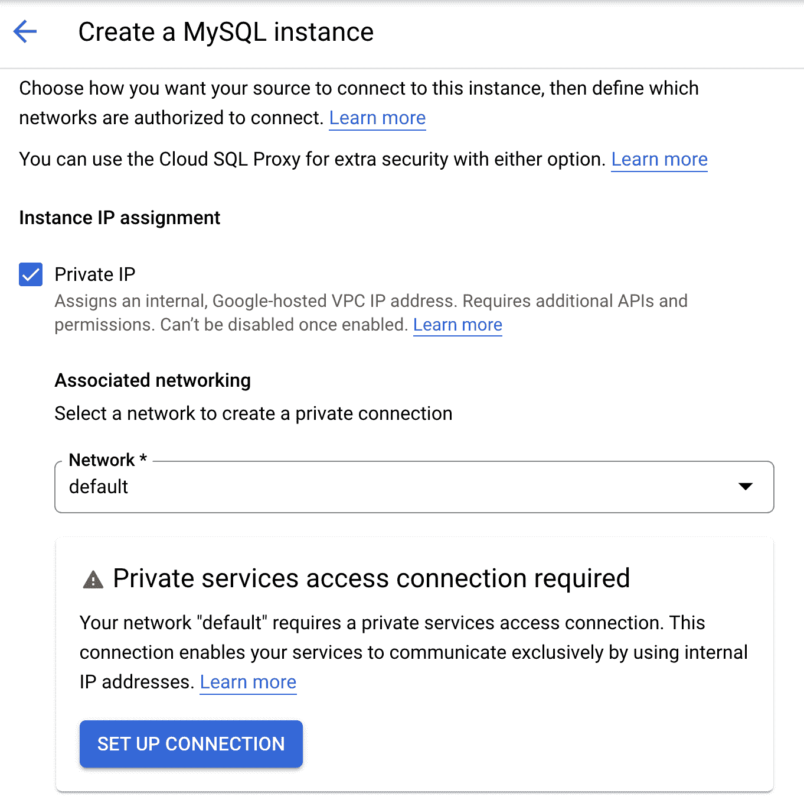
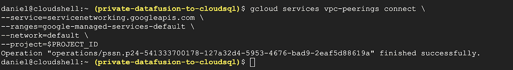
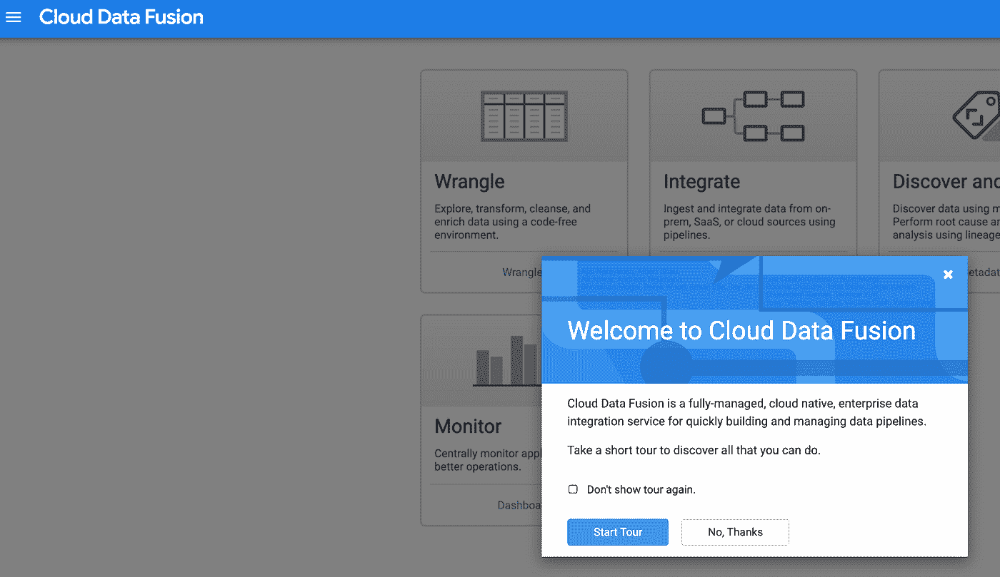
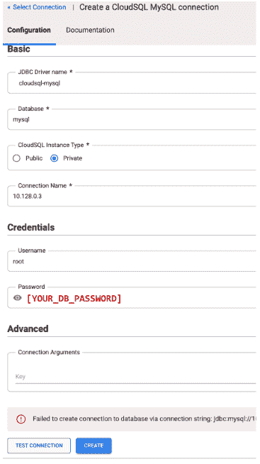

# 使用 Cloud SQL 代理将私有数据融合实例与私有云 SQL 实例连接起来

> 原文：<https://medium.com/google-cloud/connect-private-data-fusion-instance-with-a-private-cloud-sql-instance-using-cloudsql-proxy-caddf4795ac6?source=collection_archive---------0----------------------->


云数据融合的一个常见用例是创建一个数据管道，需要从云 SQL 实例中的数据库收集一些数据，当数据融合和云 SQL 实例都作为公共实例部署时，这很容易执行。但是，最佳实践建议是将这两个实例都部署为私有实例，以便只允许通过本地 IP 地址进行私有访问。本实验提供了使用 SQL 代理从私有云数据融合实例安全访问私有云 SQL 实例所需的步骤

# 概观

[云 SQL](https://cloud.google.com/sql) 是 Google Cloud 的托管关系型 SQL 数据库服务；它支持 MySQL、PostgreSQL 和 SQL Server 数据库引擎。作为一项托管服务，Google 负责提供数据库所需的所有基础设施管理任务，为其分配存储并运行它，因此用户只需负责加载数据和使用数据库。

[云数据融合](https://cloud.google.com/data-fusion)是谷歌云的原生低/无代码解决方案，用于创建任何规模的 ETL/ELT 管道。通过抽象出编写在云 Dataproc 集群上运行的代码的所有复杂性，并为用户提供一个点击式可视化用户界面，它可以轻松地创建和运行数据争论和转换管道。

上述两种服务都可以公开部署(在这种情况下，一个公共 IP 被分配给您在 GCP 的组织的域下的用户项目中的一个计算实例，因此两者之间的连接非常简单)

需要代理，因为云 SQL 网络不直接与云数据融合网络对等，并且可传递对等点无法相互通信(有关更多信息，请参见 [VPC 文档](https://cloud.google.com/vpc/docs/vpc-peering)中的 VPC 网络对等部分)。

这些是我们将执行的任务，以便能够从私有云数据融合实例访问私有云 SQL 实例，从而以保密和安全的方式从中获取数据。尽管这超出了本练习的范围，但是如果您在运行本练习之前已经设置了与 GCP 的专用连接(使用 HA VPN 或任何其他类型的专用互连),通过执行这些步骤，也可以从您的本地网络以专用方式访问这两个实例。

# 我们将涵盖的内容

1.  如何使用 MySQL 数据库启动私有云 SQL 实例
2.  如何启动私有云数据融合实例
3.  如何启动代理计算引擎虚拟机实例，以允许云 SQL 和数据融合实例之间的私有连接
4.  如何使用云数据融合中心提供的 MySQL JDBC 驱动程序创建到私有云 SQL 实例的连接

# 用于解决方案的 GCP 服务:

*   谷歌云 SQL。
*   谷歌计算引擎。
*   谷歌云数据融合。

# 设置—启用所需的 API

确保启用本练习所需的所有 API，在云 shell 中，运行下面的 gcloud 命令以启用以下 API(您也可以通过逐个访问 GCP 控制台中的所有部分并在系统提示时启用每个 API 来这样做):

*   数据融合 API
*   计算引擎 API
*   云 SQL API
*   服务网络 API
*   SQL 管理 API
*   网络管理 API

通过在 cloud shell 中运行以下命令来设置初始环境变量:

```
export PROJECT_ID=$(gcloud config get-value project)
```

现在，通过在 cloud shell 中运行以下命令，启用我们将在本实验中使用的 API:

```
gcloud services enable \
datafusion.googleapis.com \
compute.googleapis.com \
sql-component.googleapis.com \
servicenetworking.googleapis.com \
sqladmin.googleapis.com \
networkmanagement.googleapis.com
```

注意:每当您需要启用 API 时，您可以检查可用服务列表，以找到您需要使用 gcloud services list 命令激活的服务，例如，您可以使用以下命令列出 GCP 可用的 API，同时将输出限制为前 1000 个 API:

```
gcloud services list --available --filter "NAME:googleapis" --limit 1000
```

# 创建私有云 SQL MySQL 实例:

# 为云 SQL 配置私有服务访问

要创建私有云 SQL 实例(以及私有数据融合实例)，您需要在创建实例本身之前设置私有服务访问连接。私有服务访问连接允许您在 GCP 项目中定义的 VPC 网络与 Google 管理的项目(也称为**“服务提供商项目”，或“租户项目”**)中的另一个 VPC 进行内部通信，私有云 SQL 实例基础架构实际驻留在该项目中。这有效地允许您从您的项目(以及从您的项目被授权并连接到的任何网络)连接到私有云 SQL 实例，该实例本质上没有公共 IP，因此不具有其本地网络之外的任何连接性(由于其私有性质)。

当您创建私有服务访问连接时，您分配了一个 IP 范围，Google 将使用该范围将私有 IP 分配给私有实例。Google 将根据您定义的分配范围创建一个子网，以便在某个区域提供资源。您可以分配的最小 CIDR 块是/24，但建议至少分配一个/16 块。

实际上，这在您的 GCP 项目中的 VPC 和从您分配给 Google 管理的服务生产者项目使用的 IP 范围中创建的 VPC 之间创建了一个 VPC 对等。

下图描述了这在示例部署中是如何工作的:


请注意，每个 Google 服务都从定义的范围创建一个子网，在其中提供资源。子网的 IP 地址范围通常是由服务选择的/24 CIDR 块，来自分配的 IP 地址范围。您不能修改服务生成器的子网。GCP 的一项服务在该服务先前创建的现有区域子网中提供新资源。如果子网已满，该服务将在同一区域创建一个新的子网。

这意味着同一子网不能分配给其他服务(如数据融合)。对于两个服务之间的本地通信，每个服务都需要一个从服务提供商 GCP 项目到您的 GCP 项目的独立连接。

如果在创建任何私有实例之前没有设置此连接，则在尝试创建实例时，您将面临以下警告:



注意:虽然在本练习中并非如此，但如果在您自己的部署中使用共享 VPC，您还需要在共享 VPC 网络主机项目中启用服务网络 API，您可以通过要求该项目中的网络管理员运行所需的 gcloud 命令来实现:

```
gcloud services enable servicenetworking.googleapis.com
```

在本实验中，我们将对私有云 SQL 实例连接使用 10.30.1.0/24 范围。

# 为云 SQL 分配 IP 地址范围

在 cloud shell 中运行以下命令(或者，您可以使用控制台中的 UI 来执行这些步骤):

```
gcloud compute addresses create google-managed-services-default \
--global \
--purpose=VPC_PEERING \
--addresses=10.30.1.0 \
--prefix-length=24 \
--network=projects/$PROJECT_ID/global/networks/default
```


创建后，您可以在 VPC 网络部分的内部 IP 地址子部分检查 IP 分配:


# 创建私有连接

现在您已经创建了 IP 分配，您可以在项目中的 VPC 和您刚刚分配的 IP 范围之间创建 VPC 对等连接。在云 shell 中运行以下命令:

```
gcloud services vpc-peerings connect \
--service=servicenetworking.googleapis.com \
--ranges=google-managed-services-default \
--network=default \
--project=$PROJECT_ID
```

几分钟后，操作将完成。



您还应该能够在云控制台中看到 VPC 对等，特别是在 VPC 网络对等部分。


# 参考上一步中创建的私有服务访问连接，创建私有云 SQL 实例

首先，确保设置了所有必需的环境变量:

```
export INSTANCE_ID=$(echo test-private-cloudsql) \
export PROJECT_ID=$(gcloud config get-value project) \
export VPC_NETWORK_NAME=$(echo default) \
export RANGE_NAME=$(echo google-managed-services-$VPC_NETWORK_NAME) \
export DB_PASSWORD=(echo [YOUR_DB_PASSWORD])
```

在 Cloud shell 中运行以下命令，启动私有云 SQL 实例配置过程。这需要几分钟时间:

```
gcloud beta sql instances create $INSTANCE_ID \
--project=$PROJECT_ID \
--network=projects/$PROJECT_ID/global/networks/$VPC_NETWORK_NAME \
--database-version=MYSQL_8_0 \
--cpu=2 \
--memory=4GB \
--region=us-central1 \
--no-assign-ip \
--root-password=$DB_PASSWORD \
--allocated-ip-range-name=$RANGE_NAME
```

几分钟后，实例达到可运行状态，这意味着它可以使用了:


在云控制台中，您还应该能够看到实例已经创建，它已经通过从我们之前创建的分配中选择一个 IP 来设置其私有 IP 地址，并且已经使用私有服务访问连接到对等设备:


# 创建私有数据融合实例

# 授予 Google 管理的数据融合服务帐户所需的权限，以便它可以生成 Dataproc 集群。

我们需要授予 Data Fusion 服务帐户启动 Dataproc 集群的权限。如果我们不这样做，我们的数据融合管道将会失败。当您转到 UI 中的数据融合部分中的创建实例向导时，如果您没有授予将用于创建 Dataproc 集群的服务帐户的数据融合权限，您将会得到如下图所示的警告(默认情况下是计算引擎服务帐户，我们可以在 IAM & Admin 页面的服务帐户部分检查这一点，其格式如下所示:[PROJECT_NUMBER]-compute@developer.gserviceaccount.com)


**您只需点击授予权限按钮(确保在该警告下方的下拉框中选择了计算服务帐户):**

**或者，**您可以遵循此文档并使用[云控制台](https://cloud.google.com/data-fusion/docs/how-to/granting-service-account-permission?_ga=2.97242134.-86038369.1663269464)、**或**中 IAM 部分的 UI 授予所需的权限。您可以在云外壳中执行以下命令:

(可选)首先获取服务代理电子邮件地址:

```
export PROJECT_ID=$(gcloud config get-value project)
export PROJECT_NUMBER=$(gcloud projects list --filter="$PROJECT_ID" --format="value(PROJECT_NUMBER)")
export DATAFUSION_SA=$(echo service-$PROJECT_NUMBER@gcp-sa-datafusion.iam.gserviceaccount.com)
export COMPUTE_SA=$(echo $PROJECT_NUMBER-compute@developer.gserviceaccount.com)
```

(可选)现在，授予代理所需的权限:

```
gcloud iam service-accounts add-iam-policy-binding \
            $COMPUTE_SA \
            --member='serviceAccount:'$DATAFUSION_SA'' \
            --role='roles/iam.serviceAccountUser'
```


**注意:如果您在导航到数据融合部分时看到此提示，您可能还没有启用 API:**


# 部署私有数据融合实例

在本练习中，我们将使用数据融合 API 创建一个私有实例。

首先设置一些环境变量，这些变量将在以后调用 API 时使用:

```
export PROJECT_ID=$(gcloud config get-value project)
export LOCATION="us-central1"
export DATA_FUSION_API_NAME=datafusion.googleapis.com
export DF_INSTANCE_ID=test-private-datafusion
```

# 为数据融合分配 IP 地址范围

与创建私有云 SQL 实例时一样，我们必须为数据融合分配一个 IP 范围，默认情况下，数据融合使用/22 范围在租户项目中部署其内部组件。**在这种情况下，将使用范围 10.40.0.0/22。**运行此命令创建 IP 分配:

```
gcloud compute addresses create google-managed-services-default-df \
--global \
--purpose=VPC_PEERING \
--addresses=10.40.0.0 \
--prefix-length=22 \
--network=projects/$PROJECT_ID/global/networks/default
```


# 使用 API 创建数据融合实例

要使用 API 创建实例，请在 Cloud shell 中运行以下 cURL 命令:

```
curl -H "Authorization: Bearer $(gcloud auth print-access-token)" -H "Content-Type: application/json" https://$DATA_FUSION_API_NAME/v1/projects/$PROJECT_ID/locations/$LOCATION/instances?instance_id=$DF_INSTANCE_ID -X POST -d '{"description": "Private CDF instance created through REST.", "type": "BASIC", "privateInstance": true, "networkConfig": {"network": "default", "ipAllocation": "10.40.0.0/22"}}'
```

API 接收请求并开始处理它:


我们可以在 GCP 的数据融合部分看到正在创建的实例:


注意:创建实例大约需要 20 分钟。

一旦实例创建过程结束，我们将启动并运行云 SQL 和数据融合私有实例。


在这里，通过单击实例名称，我们可以看到创建该实例的详细信息，请注意，它使用了我们之前保留的 IP 地址分配(10.40.0.0/22)。


在实例详细信息页面中，**记下运行数据融合实例的 TENANT_PROJECT_ID** ，我们将在下一步中用到它。我们可以在@符号和下一个点之间的**服务帐户**字段中找到它，就在*" . iam . gserviceaccount . com "*之前，它通常以*-TP "***"结尾(在上面的示例中，它将是" **eh3a2c2bf9e20v09d-tp** ")**

# **在本地 VPC 和为数据融合分配的范围之间创建 VPC 对等**

**因为在创建云 SQL 实例期间已经创建了私有服务访问的对等关系，而 Data Fusion 并不使用这一点，而是需要不同的 VPC 对等关系，所以我们不能使用之前创建这一新连接时使用的相同 g Cloud Services VPC-peerings connect 命令。云数据融合使用项目中本地 VPC 和 Google 管理的租户项目之间的 VPC 对等，其中数据融合实例在自己的远程 VPC 中运行。为了在您的本地网络和运行 Data Fusion 的网络之间创建 VPC 对等，我们需要收集两件东西:**

**1)运行数据融合实例的远程项目 ID(称为“租户项目”，我们在上一步中从数据融合实例详细信息页面中检索到它)。**

**2)租户项目中的远程网络:它是在数据融合私有实例创建时自动为我们生成的，并且采用以下命名: <region>-<data_fusion_instance_name></data_fusion_instance_name></region>**

**在 cloud shell 中运行以下命令，在本地 VPC 和运行 Data Fusion 的租户项目中的对等 VPC 之间创建 VPC 对等关系:**

****注意:记住用上一步中检索到的租户项目 ID 替换[YOUR-TENANT-PROJECT-ID]值。****

```
export TENANT_PROJECT=[YOUR-TENANT-PROJECT-ID]
```

```
export LOCATION="us-central1"gcloud compute networks peerings create peering-private-datafusion \
    --network=default \
    --peer-project $TENANT_PROJECT \
    --peer-network $LOCATION-$DF_INSTANCE_ID
```

**现在，您应该在控制台的 VPC 网络对等部分看到新的对等:**

****

# **在我们的本地 VPC 子网启用私人谷歌访问**

**为了让数据融合管道正常运行，我们需要在对云 SQL 和数据融合都对等的子网中启用私有 Google 访问。否则，当我们在数据融合中运行管道时，管道将在尝试提供 Dataproc 集群时被卡住。**

**在云 Shell 中运行以下命令:**

```
export SUBNET_NAME=default
export REGION=us-central1
```

```
gcloud compute networks subnets update $SUBNET_NAME \
--region=$REGION \
--enable-private-ip-google-access
```

**导航到控制台中的云 SQL 部分，记下 IP 地址云 SQL(在本例中，它为实例分配了 IP 地址 10.30.1.3):**

****

# **创建云 SQL 代理虚拟机**

**由于云 SQL 和数据融合实例都与 GCP 项目中的本地 VPC 对等(如下图所示，默认子网范围为 us-central1，10.128.0.0/20)，因此这两个实例都可以从该网络访问，也可以访问该网络(这意味着任何资源，如从 10.128.0.0/20 网络通信的虚拟机，都应该能够独立地与云 SQL 和数据融合专用实例通信)。**

**但是，由于网络对等点不会将网络路由转发到网络对等点之外，因此云 SQL 实例无法直接与数据融合实例通信，因为两个网络对等点会导致传递性问题。**

****

**上图显示，通过前面步骤中创建的私有服务访问连接，两个连续的对等点位于数据融合到达云 SQL 所需的网络路径中，导致数据融合无法到达云 SQL，因为根据网络设计，VPC 对等点是不可传递的。为了解决这个问题，需要在本地 VPC (10.128.0.0/20)中部署一个虚拟机代理，以在两个网络(即数据融合的 10.40.0.0/22 和云 SQL 的 10.30.1.0/24)之间传播路由。下图显示了该设置的外观:**

****

# **导出初始变量**

**首先，导出我们将在后续步骤中使用的变量:**

```
export PROJECT_ID=$(gcloud config get-value project)
export REGION=us-central1
export ZONE=`gcloud compute zones list --filter="name=${REGION}" --limit 1 --uri --project=${PROJECT}| sed 's/.*\///'`
export NETWORK=default 
export SUBNET=default
export INSTANCE_NAME=cloudsql-proxy
export SQL_CONN=private-datafusion-to-cloudsql:us-central1:test-private-cloudsql
export CDF_IP_RANGE=10.40.0.0/22
export VM_IMAGE=$(gcloud compute images list --project=$PROJECT | grep cos-stable | awk 'NR<2{print $2}')
export SQL_PORT=3306 Important Note:
```

**要获取“SQL_CONN”环境变量的值，我们可以从 GCP 控制台的云 SQL 部分的实例详细信息中的**“连接名称”**字段获取:**

****

**创建防火墙规则以允许数据融合进入流量。在云 Shell 中运行以下命令:**

```
gcloud compute firewall-rules create allow-private-cdf \
 --allow=tcp:22,tcp:${SQL_PORT} \
 --source-ranges=$CDF_IP_RANGE --network=$NETWORK --project=$PROJECT_ID
```

**您的输出应该如下所示:**

****

**您应该能够看到在名为“allow-private-cdf”的控制台中创建了新的防火墙规则，并允许在端口 22 和 3306:**

****

**在云 shell 中使用以下 gcloud 命令创建代理虚拟机:**

```
gcloud compute --project=${PROJECT} instances create ${INSTANCE_NAME} \
 --zone=${ZONE} \
 --machine-type=g1-small \
 --subnet=${SUBNET} \
 --metadata=startup-script="docker run -d -p 0.0.0.0:${SQL_PORT}:${SQL_PORT} gcr.io/cloudsql-docker/gce-proxy:latest /cloud_sql_proxy -instances=${SQL_CONN}=tcp:0.0.0.0:${SQL_PORT}" \
 --maintenance-policy=MIGRATE \
 --scopes=https://www.googleapis.com/auth/cloud-platform \
 --image=${VM_IMAGE} \
 --image-project=cos-cloud
```

**您应该会看到如下输出:**

****

**现在，导出一个变量来保存分配给虚拟机的内部 IP 地址，这样我们就可以将它作为一个为这台机器保留的静态 IP。在云 Shell 中运行:**

```
export IP=`gcloud compute \
 --project=${PROJECT} instances describe ${INSTANCE_NAME} \
 --zone ${ZONE} | grep "networkIP" | awk '{print $2}'`
```

**运行以下命令保留虚拟机 IP:**

```
gcloud compute --project=${PROJECT} addresses create mysql-proxy \
 --addresses ${IP} --region ${REGION} --subnet ${SUBNET}
```

**您可以在 GCP 控制台的 VPC 网络部分的 IP 地址列表中看到该 IP 被列为静态 IP(您还可以看到虚拟机的外部 IP(被列为临时 IP):**

****

****注意，这个内部静态 IP 是您从现在开始将要用来建立到云 SQL 实例的连接的 IP。****

# **从数据融合连接到云 SQL**

**导航到 GCP 控制台中的云数据融合部分，单击“查看实例”操作 URL 以访问数据融合 UI。**

**URL 应该是这样的:**

**[https://test-private-data fusion-private-data fusion[PROJECT _ NUMBER]-dot-us C1 . data fusion . Google user content . com/](https://test-private-datafusion-private-datafusion[PROJECT_NUMBER]-dot-usc1.datafusion.googleusercontent.com/)**

# **为 MySQL 安装 JDBC 连接器**

**在云数据融合用户界面中，单击欢迎弹出窗口中的“不，谢谢”按钮:**

****

**单击屏幕右上角的中心按钮，导航至数据融合中心:**

****

**在 HUB 中，在顶部的搜索栏中，搜索“cloudsql ”,并从可用插件列表中选择“CloudSQL MySQL JDBC 驱动程序”,单击它:**

****

**系统会提示我们下载驱动程序。jar 文件，然后将其上传到 Data Fusion，以便在数据管道中进行部署和使用。点击第一步下面的下载链接**

****

**按照提供的说明，下载。jar 文件从链接到 Google 云平台的 Github 到你的本地机器。您应该下载一个类似于**“MySQL-socket-factory-connector-j-8–1 . 0 . 16-jar-with-driver-and-dependencies . jar”**的文件**

**下载文件后，单击“完成”按钮:**

****

**现在是时候上传。jar 文件和数据融合实例的插件。单击您在上一步中单击的链接旁边的“部署”链接:**

********

**提供。jar 文件，然后单击“下一步”**

****

**保留所有默认设置，然后单击“Finish”按钮。**

****

**部署过程将开始(可能需要一分钟)。完成后，您将看到一个成功弹出窗口，提示您“创建管道”或“转到主页”。忽略按钮，点击旁边的“转到主页”链接。**

****

# **使用 JDBC 插件测试云 SQL 中 MySQL 数据库的连接性**

**从云数据融合 UI 主页，单击欢迎弹出窗口中的“不，谢谢”按钮(如果它再次出现)。从这里开始，通过向画布添加一个牧马人任务来测试创建一个简单的数据管道。点击“争吵”卡片。**

****

**然后单击左侧菜单底部的添加连接按钮:**

****

**从屏幕中间的列表中选择 CloudSQL MySQL 连接:**

****

**输入新连接的名称，根据下表选择您之前在 JDBC 驱动程序中部署的驱动程序和其余必需的输入，然后在底部单击“测试连接”按钮:**

****

**如果一切顺利，您应该会看到连接尝试成功，如下图所示:**

****

# **搞定了。！您通过云 SQL 的私有接口将数据融合与云 SQL 连接起来。**

**如果您在点击 TEST CONNECTION 按钮时遇到类似下图中的错误，很可能是您没有正确配置 peerings 或您缺少防火墙规则，请记住将 SQL 代理虚拟机内部 IP 放在 Connection Name 字段中，放入来自 CloudSQL 或其私有 IP 的连接名称将不起作用:**

****

# **恭喜你！**

**您已经安全地将私有数据融合实例与私有云 SQL 数据库实例连接起来。**

# **我们讨论过的内容**

*   **如何使用 MySQL 数据库启动私有云 SQL 实例**
*   **如何启动私有云数据融合实例**
*   **如何启动代理计算引擎虚拟机实例，以允许云 SQL 和数据融合实例之间的私有连接**
*   **如何使用云数据融合中心提供的 MySQL JDBC 驱动程序创建到私有云 SQL 实例的连接**

# **有用的文档**

**了解云 SQL 私有 IP:[https://cloud.google.com/sql/docs/mysql/private-ip?hl=en](https://cloud.google.com/sql/docs/mysql/private-ip?hl=en)**

**为 cloud 配置私有服务访问 SQL:[https://cloud . Google . com/SQL/docs/MySQL/configure-Private-Services-Access](https://cloud.google.com/sql/docs/mysql/configure-private-services-access)**

**为云 SQL 配置私有 IP:[https://Cloud . Google . com/SQL/docs/MySQL/configure-Private-IP？hl=en](https://cloud.google.com/sql/docs/mysql/configure-private-ip?hl=en)**

**创建私有数据融合实例:**

**[https://cloud . Google . com/data-fusion/docs/how-to/create-private-IP # curl](https://cloud.google.com/data-fusion/docs/how-to/create-private-ip#curl)**

**授予 Data Fusion Service 帐户权限:**

**[https://cloud . Google . com/data-fusion/docs/how-to/granting-service-account-permission？_ga=2.97242134。-86039464](https://cloud.google.com/data-fusion/docs/how-to/granting-service-account-permission?_ga=2.97242134.-86038369.1663269464)**

**云数据融合服务客户:**

**[https://cloud . Google . com/data-fusion/docs/concepts/service-accounts # service _ account _ table](https://cloud.google.com/data-fusion/docs/concepts/service-accounts#service_account_table)**

**VPC 对等:**

**[https://cloud.google.com/vpc/docs/using-vpc-peering](https://cloud.google.com/vpc/docs/using-vpc-peering)**