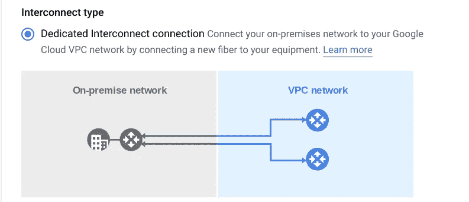
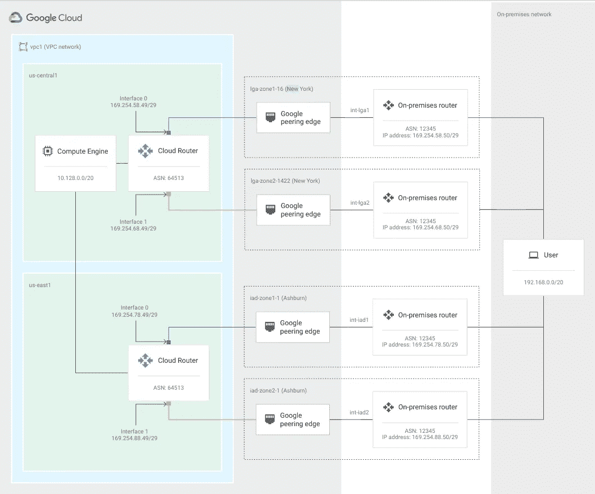

# 通过直接互连连接您的内部数据中心，并通过 Terraform 自动创建 vlan 附件

> 原文：<https://medium.com/google-cloud/connect-your-on-premise-data-center-with-direct-interconnect-and-automate-vlan-attachments-creation-8db1bdcc156b?source=collection_archive---------1----------------------->

当客户需要将内部数据中心连接到 Google Cloud 时，有多种方法可以满足低容量需求，从互连等高性能选项到云 VPN。

如果客户需要专用的高吞吐量连接，[Google Cloud Professional Services](https://cloud.google.com/consulting)可以建议使用直接互连作为正确的选择。直接互连允许您在直接物理连接上传输大量数据。为了做到这一点，你必须提供你的设备，并能够满足谷歌网络在[的托管设施](https://cloud.google.com/network-connectivity/docs/interconnect/concepts/choosing-colocation-facilities)。专用互联带宽为 **10 Gbps /100 Gbps。**

# 订购专用互连连接

要创建专用互连，您需要开始订购连接，以便 Google 分配资源，并向您发送授权书和连接设施分配(LOA-CFA)。您将 LOA-CFA 发送给提供连接的供应商，然后用从 Google 收到的配置信息对其进行测试。

# 创建 VLAN 附件并配置 BPG 会话

当您的互连连接准备就绪时，您可以创建 VLAN 附件，指定您想要到达的 VPC 网络中的现有云路由器，或者创建一个新的云路由器。创建 VLAN 连接后，您需要配置本地路由器，以便与云路由器建立 BGP 会话。

将您的内部网络连接到您的谷歌云 VPC

根据您的可用性需求，您可以使用一种配置来实现 [99.9% SLA](https://cloud.google.com/network-connectivity/docs/interconnect/tutorials/dedicated-creating-999-availability) 或 [99.99% SLA](https://cloud.google.com/network-connectivity/docs/interconnect/tutorials/dedicated-creating-9999-availability) 。

互连连接实现 99.99%的可用性

您可以在此找到云互联的最佳实践:

[https://cloud . Google . com/network-connectivity/docs/interconnect/concepts/best-practices](https://cloud.google.com/network-connectivity/docs/interconnect/concepts/best-practices)

# 将（行星）地球化（以适合人类居住）

您可以使用 terraform 自动创建 VLAN 附件。

我开发了一个模块，你可以在 GitHub 的资源库中找到:

[https://github . com/terraform-Google-modules/cloud-foundation-fabric/tree/master/modules/net-interconnect-attachment-direct](https://github.com/terraform-google-modules/cloud-foundation-fabric/tree/master/modules/net-interconnect-attachment-direct)

该模块允许您创建 VLAN 附件、路由器和配置 BGP 会话。路由器创建是可选的，您可以指定一个现有的路由器。提供了一个实现 99.9% SLA 的设置示例。