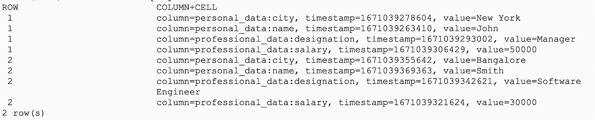
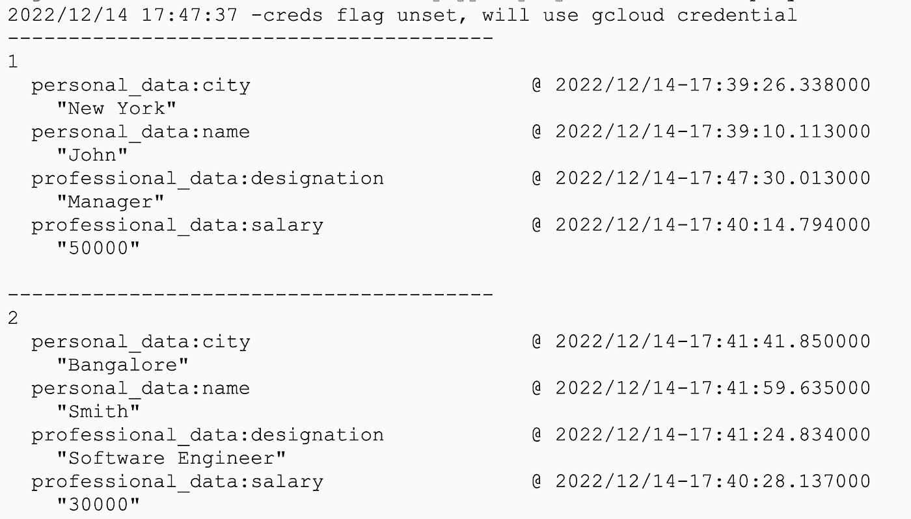
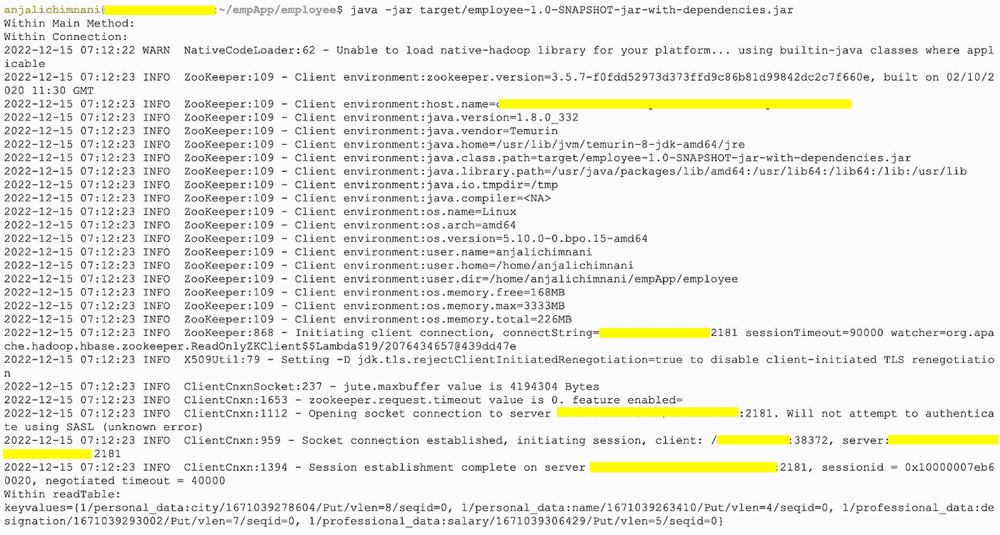
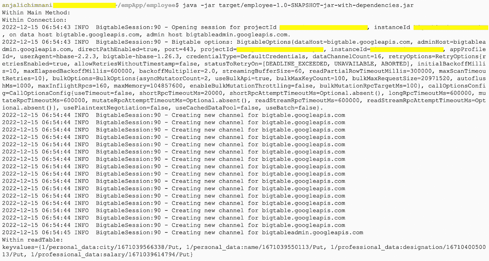

# 将您的 Scala 应用程序从 HBase 连接到 Bigtable

> 原文：<https://medium.com/google-cloud/connect-your-scala-application-from-hbase-to-bigtable-668945511d31?source=collection_archive---------2----------------------->

将 Scala 代码和数据一起从 HBase 迁移到 Google Cloud Bigtable

在将本地基础设施迁移到 Google Cloud 之后，通常会迁移连接到该基础设施并从中使用数据的应用程序代码。代码可以是不同的语言，因此涉及基于基础设施和应用程序语言的相应变化。因此，我们将访问一个这样的常见需求，迁移连接到 [Apache Hbase](https://hbase.apache.org/) 的 Scala 应用程序，以连接和使用来自 [Google Cloud Bigtable](https://cloud.google.com/bigtable) 的数据。

假设我们有一个 HBase 集群，其中一个表为“employee ”,还有一个 Bigtable 集群，其中一个表的名称相同，如下所示。两个表都有 2 行，行键分别为 1 和 2。

> HBase:

```
scan 'employee'
```



> 谷歌云 Bigtable:

```
cbt read employee
```



## 连接 HBase 的 Scala 应用程序

我们有一个 Scala 应用程序，它连接到上面的 HBase 集群，从行键为 1 的 employee 表中读取数据。应用程序中包含的文件有:

*   App.scala(从 HBase 集群读取数据的应用程序代码)
*   Connection.scala(建立与 HBase 集群连接的代码，该集群将由 App.scala 使用)
*   Pom.xml(项目依赖、插件、版本等的配置。包括 HBase 连接、配置)

注意:对应用程序代码进行了简化，以关注从 HBase 迁移到 Bigtable 所需的更改。

> App.scala

```
package com.example

import org.apache.hadoop.hbase.client._
import org.apache.hadoop.hbase.util.Bytes
import org.apache.hadoop.hbase.{CellUtil, HBaseConfiguration, TableName}
import org.apache.hadoop.conf.Configuration
import scala.collection.JavaConverters._

/**
 * @author anjalichimnani
 */
object App {

  /**
   * Read data in the cluster connected to connection object from table name specified and for row key requested
   */
  def readTable(connection: Connection, tableName: String, rowKey: String) {
    println("Within readTable:")
    val table = connection.getTable(TableName.valueOf( Bytes.toBytes(tableName) ) )

    var get = new Get(Bytes.toBytes(rowKey))
    var result = table.get(get)

    println(result)

    table.close()
  }

  /**
   * Main function where the code execution initiates.
   * It sets the variable values for cluster, table name and row key to be read
   * Requests for a connection to cluster
   * Calls readTable method to get data from the cluster.
   *
   * To run the code, specify HBase Cluster host/hosts
   */
  def main(args : Array[String]) {

    println( "Within Main Method:")
    val zookeeper_quorum = "<HBase-cluster>"
    val tableName = "employee"
    val rowKey = "1"

    val connection = Connection.connect(zookeeper_quorum)
    readTable(connection, tableName, rowKey)

    connection.close()

  }

}
```

> Connection.scala

```
package com.example

import org.apache.hadoop.hbase.client._
import org.apache.hadoop.hbase.util.Bytes
import org.apache.hadoop.hbase.{CellUtil, HBaseConfiguration, TableName}
import org.apache.hadoop.conf.Configuration
import scala.collection.JavaConverters._

object Connection {

  /**
   * Connect Method to take the cluster details, create a Hbase configuration and consequently a connection
   * The method returns a Connection object which could be used to read/write/update data from the cluster which it is connected to.
   */
  def connect(zookeeper_quorum: String): Connection = {
    println("Within Connection:")
    val conf : Configuration = HBaseConfiguration.create()
    conf.set("hbase.zookeeper.quorum", zookeeper_quorum)

    val connection = ConnectionFactory.createConnection(conf)

    return connection
  }

}
```

> pom.xml

```
<project  xmlns:xsi="http://www.w3.org/2001/XMLSchema-instance" xsi:schemaLocation="http://maven.apache.org/POM/4.0.0 http://maven.apache.org/maven-v4_0_0.xsd">
  <modelVersion>4.0.0</modelVersion>
  <groupId>com.example</groupId>
  <artifactId>employee</artifactId>
  <version>1.0-SNAPSHOT</version>
  <name>${project.artifactId}</name>
  <description>My wonderfull scala app</description>
  <inceptionYear>2018</inceptionYear>
  <licenses>
    <license>
      <name>My License</name>
      <url>http://....</url>
      <distribution>repo</distribution>
    </license>
  </licenses>

  <properties>
    <maven.compiler.source>1.8</maven.compiler.source>
    <maven.compiler.target>1.8</maven.compiler.target>
    <encoding>UTF-8</encoding>
    <scala.version>2.12.6</scala.version>
    <spark.version>2.4.8</spark.version>
    <hbase.version>2.4.9</hbase.version>
    <scala.compat.version>2.12</scala.compat.version>
    <spec2.version>4.2.0</spec2.version>
  </properties>

  <dependencies>

    <dependency>
      <groupId>org.scala-lang</groupId>
      <artifactId>scala-library</artifactId>
      <version>${scala.version}</version>
    </dependency>

    <dependency>
      <groupId>org.apache.hbase</groupId>
      <artifactId>hbase-server</artifactId>
      <version>${hbase.version}</version>
    </dependency>

    <dependency>
      <groupId>org.apache.spark</groupId>
      <artifactId>spark-core_2.12</artifactId>
      <version>${spark.version}</version>
      <scope>provided</scope>
    </dependency>

    <!-- Test -->
    <dependency>
      <groupId>junit</groupId>
      <artifactId>junit</artifactId>
      <version>4.12</version>
      <scope>test</scope>
    </dependency>
    <dependency>
      <groupId>org.scalatest</groupId>
      <artifactId>scalatest_${scala.compat.version}</artifactId>
      <version>3.0.5</version>
      <scope>test</scope>
    </dependency>
    <dependency>
      <groupId>org.specs2</groupId>
      <artifactId>specs2-core_${scala.compat.version}</artifactId>
      <version>${spec2.version}</version>
      <scope>test</scope>
    </dependency>
    <dependency>
      <groupId>org.specs2</groupId>
      <artifactId>specs2-junit_${scala.compat.version}</artifactId>
      <version>${spec2.version}</version>
      <scope>test</scope>
    </dependency>
  </dependencies>

  <build>
    <sourceDirectory>src/main/scala</sourceDirectory>
    <testSourceDirectory>src/test/scala</testSourceDirectory>
    <plugins>
      <plugin>
        <!-- see http://davidb.github.com/scala-maven-plugin -->
        <groupId>net.alchim31.maven</groupId>
        <artifactId>scala-maven-plugin</artifactId>
        <version>3.3.2</version>
        <executions>
          <execution>
            <goals>
              <goal>compile</goal>
              <goal>testCompile</goal>
            </goals>
            <configuration>
              <args>
                <arg>-dependencyfile</arg>
                <arg>${project.build.directory}/.scala_dependencies</arg>
              </args>
            </configuration>
          </execution>
        </executions>
      </plugin>
      <plugin>
        <groupId>org.apache.maven.plugins</groupId>
        <artifactId>maven-surefire-plugin</artifactId>
        <version>2.21.0</version>
        <configuration>
          <!-- Tests will be run with scalatest-maven-plugin instead -->
          <skipTests>true</skipTests>
        </configuration>
      </plugin>
      <plugin>
        <groupId>org.scalatest</groupId>
        <artifactId>scalatest-maven-plugin</artifactId>
        <version>2.0.0</version>
        <configuration>
          <reportsDirectory>${project.build.directory}/surefire-reports</reportsDirectory>
          <junitxml>.</junitxml>
          <filereports>TestSuiteReport.txt</filereports>
          <!-- Comma separated list of JUnit test class names to execute -->
          <jUnitClasses>samples.AppTest</jUnitClasses>
        </configuration>
        <executions>
          <execution>
            <id>test</id>
            <goals>
              <goal>test</goal>
            </goals>
          </execution>
        </executions>
       </plugin>
       <plugin>
        <groupId>org.apache.maven.plugins</groupId>
        <artifactId>maven-assembly-plugin</artifactId>
        <version>2.4</version>
                <configuration>
                    <descriptorRefs>
                        <descriptorRef>jar-with-dependencies</descriptorRef>
                    </descriptorRefs>
                    <archive>
                        <manifest>
                            <mainClass>com.example.App</mainClass>
                        </manifest>
                    </archive>
                </configuration>
                <executions>
                    <execution>
                        <phase>package</phase>
                        <goals>
                            <goal>single</goal>
                        </goals>
                    </execution>
                </executions>
       </plugin>

    </plugins>
  </build>
</project>
```

应用程序执行的输出如下:



## 迁移应用程序以连接到 Google Cloud Bigtable

要迁移应用程序，我们只需在 connect 方法中进行更改，以使用 Bigtable 配置而不是 HBase 配置，传入适当的连接参数，并在 pom.xml 中用适当的版本指定 Bigtable 依赖项。

> 对 Connection.class 的首次更改

将连接更改为使用 BigtableConfiguration connect 方法来创建连接。因此，移除较早的 HBase 配置和连接。

要使用 BigtableConfiguration 类，请使用 com . Google . cloud . bigtable . h base . bigtable configuration 导入它

```
package com.example

import org.apache.hadoop.hbase.client._
import org.apache.hadoop.hbase.util.Bytes
import org.apache.hadoop.hbase.{CellUtil, HBaseConfiguration, TableName}
import org.apache.hadoop.conf.Configuration
import scala.collection.JavaConverters._
import com.google.cloud.bigtable.hbase.BigtableConfiguration;

object Connection {

  /**
   * Connect Method to take the cluster details, create a Hbase configuration and consequently a connection
   * The method returns a Connection object which could be used to read/write/update data from the cluster which it is connected to.
   */
  def connect(project_id: String, instance_id: String): Connection = {

    println("Within Connection:")

    val connection = BigtableConfiguration.connect(BigtableConfiguration.configure(project_id, instance_id))

    return connection
  }

}
```

> App.scala 中的变化

因为连接配置已经从 HBase 中的 cluster list 更改为 Bigtable 中的 project_id 和 instance_id，所以更改对 connect 方法的调用。

当 Bigtable 中存在与 HBase 中相同的表名和行键时，读取数据不需要进行其他更改

```
package com.example

import org.apache.hadoop.hbase.client._
import org.apache.hadoop.hbase.util.Bytes
import org.apache.hadoop.hbase.{CellUtil, HBaseConfiguration, TableName}
import org.apache.hadoop.conf.Configuration
import scala.collection.JavaConverters._

/**
 * @author anjalichimnani
 */
object App {

  /**
   * Read data in the cluster connected to connection object from table name specified and for row key requested
   */
  def readTable(connection: Connection, tableName: String, rowKey: String) {
    println("Within readTable:")
    val table = connection.getTable(TableName.valueOf( Bytes.toBytes(tableName) ) )

    var get = new Get(Bytes.toBytes(rowKey))
    var result = table.get(get)

    println(result)

    table.close()
  }

  /**
   * Main function where the code execution initiates.
   * It sets the variable values for cluster, table name and row key to be read
   * Requests for a connection to cluster
   * Calls readTable method to get data from the cluster.
   *
   * To run the code, specify Bigtable Project ID and Instance ID 
   */
  def main(args : Array[String]) {

    println( "Within Main Method:")
    val tableName = "employee"
    val rowKey = "1"
    val project_id = "<google-cloud-project-name>"
    val instance_id = "<bigtable-instance-id>"

    val connection = Connection.connect(project_id, instance_id)
    readTable(connection, tableName, rowKey)

    connection.close()

  }

}
```

> pom.xml 中的最终更改

因为我们需要 com . Google . cloud . bigtable . h base . bigtable configuration 类，所以我们需要指定各自的依赖项和版本。它们被添加如下:

```
<project  xmlns:xsi="http://www.w3.org/2001/XMLSchema-instance" xsi:schemaLocation="http://maven.apache.org/POM/4.0.0 http://maven.apache.org/maven-v4_0_0.xsd">
  <modelVersion>4.0.0</modelVersion>
  <groupId>com.example</groupId>
  <artifactId>employee</artifactId>
  <version>1.0-SNAPSHOT</version>
  <name>${project.artifactId}</name>
  <description>My wonderfull scala app</description>
  <inceptionYear>2018</inceptionYear>
  <licenses>
    <license>
      <name>My License</name>
      <url>http://....</url>
      <distribution>repo</distribution>
    </license>
  </licenses>

  <properties>
    <maven.compiler.source>1.8</maven.compiler.source>
    <maven.compiler.target>1.8</maven.compiler.target>
    <encoding>UTF-8</encoding>
    <scala.version>2.12.6</scala.version>
    <spark.version>2.4.8</spark.version>
    <hbase.version>2.4.9</hbase.version>
    <scala.compat.version>2.12</scala.compat.version>
    <spec2.version>4.2.0</spec2.version>
    <bigtable.version>1.26.3</bigtable.version>
  </properties>

  <dependencies>
    <dependency>
       <groupId>com.google.cloud.bigtable</groupId>
       <artifactId>bigtable-hbase-2.x-hadoop</artifactId>
       <version>${bigtable.version}</version>
    </dependency>

    <dependency>
      <groupId>org.scala-lang</groupId>
      <artifactId>scala-library</artifactId>
      <version>${scala.version}</version>
    </dependency>

    <dependency>
      <groupId>org.apache.hbase</groupId>
      <artifactId>hbase-server</artifactId>
      <version>${hbase.version}</version>
    </dependency>

    <dependency>
      <groupId>org.apache.spark</groupId>
      <artifactId>spark-core_2.12</artifactId>
      <version>${spark.version}</version>
      <scope>provided</scope>
    </dependency>

    <!-- Test -->
    <dependency>
      <groupId>junit</groupId>
      <artifactId>junit</artifactId>
      <version>4.12</version>
      <scope>test</scope>
    </dependency>
    <dependency>
      <groupId>org.scalatest</groupId>
      <artifactId>scalatest_${scala.compat.version}</artifactId>
      <version>3.0.5</version>
      <scope>test</scope>
    </dependency>
    <dependency>
      <groupId>org.specs2</groupId>
      <artifactId>specs2-core_${scala.compat.version}</artifactId>
      <version>${spec2.version}</version>
      <scope>test</scope>
    </dependency>
    <dependency>
      <groupId>org.specs2</groupId>
      <artifactId>specs2-junit_${scala.compat.version}</artifactId>
      <version>${spec2.version}</version>
      <scope>test</scope>
    </dependency>
  </dependencies>

  <build>
    <sourceDirectory>src/main/scala</sourceDirectory>
    <testSourceDirectory>src/test/scala</testSourceDirectory>
    <plugins>
      <plugin>
        <!-- see http://davidb.github.com/scala-maven-plugin -->
        <groupId>net.alchim31.maven</groupId>
        <artifactId>scala-maven-plugin</artifactId>
        <version>3.3.2</version>
        <executions>
          <execution>
            <goals>
              <goal>compile</goal>
              <goal>testCompile</goal>
            </goals>
            <configuration>
              <args>
                <arg>-dependencyfile</arg>
                <arg>${project.build.directory}/.scala_dependencies</arg>
              </args>
            </configuration>
          </execution>
        </executions>
      </plugin>
      <plugin>
        <groupId>org.apache.maven.plugins</groupId>
        <artifactId>maven-surefire-plugin</artifactId>
        <version>2.21.0</version>
        <configuration>
          <!-- Tests will be run with scalatest-maven-plugin instead -->
          <skipTests>true</skipTests>
        </configuration>
      </plugin>
      <plugin>
        <groupId>org.scalatest</groupId>
        <artifactId>scalatest-maven-plugin</artifactId>
        <version>2.0.0</version>
        <configuration>
          <reportsDirectory>${project.build.directory}/surefire-reports</reportsDirectory>
          <junitxml>.</junitxml>
          <filereports>TestSuiteReport.txt</filereports>
          <!-- Comma separated list of JUnit test class names to execute -->
          <jUnitClasses>samples.AppTest</jUnitClasses>
        </configuration>
        <executions>
          <execution>
            <id>test</id>
            <goals>
              <goal>test</goal>
            </goals>
          </execution>
        </executions>
       </plugin>
       <plugin>
        <groupId>org.apache.maven.plugins</groupId>
        <artifactId>maven-assembly-plugin</artifactId>
        <version>2.4</version>
                <configuration>
                    <descriptorRefs>
                        <descriptorRef>jar-with-dependencies</descriptorRef>
                    </descriptorRefs>
                    <archive>
                        <manifest>
                            <mainClass>com.example.App</mainClass>
                        </manifest>
                    </archive>
                </configuration>
                <executions>
                    <execution>
                        <phase>package</phase>
                        <goals>
                            <goal>single</goal>
                        </goals>
                    </execution>
                </executions>
       </plugin>

    </plugins>
  </build>
</project>
```

完成所有更改后，迁移后的代码成功运行，如下所示:



注意:要运行代码，您必须提供代码中“<>”中指定的 HBase 集群和 Bigtable 集群详细信息，例如:

```
//For HBase
val zookeeper_quorum = "<HBase-cluster>"

//For Google Cloud Bigtable
val project_id = "<google-cloud-project-name>"
val instance_id = "<bigtable-instance-id>"
```

要构建和执行 jar，请在 pom.xml 所在的目录中运行以下命令:

```
mvn package

java -jar target/employee-1.0-SNAPSHOT-jar-with-dependencies.jar
```

那都是乡亲们！！您成功地迁移了 Scala 代码，从 HBase 连接到 Google Cloud Bigtable 并从中读取数据。

## 参考资料:

*   拥有 Maven 的 Scala:[https://docs.scala-lang.org/tutorials/scala-with-maven.html](https://docs.scala-lang.org/tutorials/scala-with-maven.html)
*   h 基本文档:[https://hbase.apache.org/](https://hbase.apache.org/)
*   Bigtable 依赖项的 Maven 存储库:[https://mvn Repository . com/artifact/com . Google . cloud . Bigtable](https://mvnrepository.com/artifact/com.google.cloud.bigtable)

## Google Cloud Bigtable 的更多信息:

*   [https://cloud.google.com/bigtable/docs/overview](https://cloud.google.com/bigtable/docs/overview)
*   [https://github . com/Google cloud platform/cloud-bigtable-examples](https://github.com/GoogleCloudPlatform/cloud-bigtable-examples)

感谢您的阅读。欢迎分享您对该主题的评论和进一步的兴趣！！