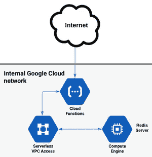
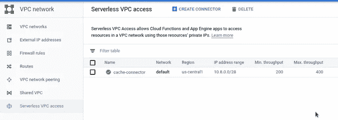

# 使用无服务器 VPC 访问将云功能与计算引擎连接起来

> 原文：<https://medium.com/google-cloud/connecting-cloud-functions-with-compute-engine-using-serverless-vpc-access-79c5cd7420c7?source=collection_archive---------2----------------------->

谷歌云平台(GCP)上的无服务器产品，如云功能和应用引擎，由于其无服务器的性质(隐藏的服务器基础设施)，只能通过其公共 IP 地址连接到一些 GCP 产品(计算引擎、内存存储、云 SQL ),这当然增加了安全风险，因为它们暴露于整个互联网，并增加了延迟，因为流量通过公共互联网而不是通过快速的谷歌网络。在大多数情况下，产品可以选择只有内部 IP 地址，但不能从互联网访问，只能从 GCP 网络内访问，但到目前为止，由于网络问题，无服务器产品无法通过这种方式进行连接。

最近 GCP 推出了[无服务器 VPC 接入](https://cloud.google.com/vpc/docs/configure-serverless-vpc-access)，它就像是 VPC 网络中无服务器产品和其他产品之间的粘合剂。基本上，随着无服务器 VPC 接入连接器的创建，处理连接和传输的 f1-micro 实例被创建。仅支持从无服务器实例到其他服务器的请求，不可能通过内部网络从其他产品向无服务器实例发出请求，只能通过 HTTP 请求通过公共互联网。

目前，无服务器 VPC 访问可用于云功能和应用程序引擎(尚未用于托管云运行)，并且需要在无服务器服务所在的同一地区。目前的定价是“为连接器自动提供的每 100 Mbps 吞吐量的 as 1 `[f1-micro](https://cloud.google.com/compute/pricing#sharedcore)`实例”,大约每月 5 美元，尽管由于服务目前处于测试状态，价格可能会上涨。

为了演示功能，我将使用用 Python 编写的云函数，它连接到 Redis(部署为计算引擎上的容器), Redis 用作简单的缓存服务。



当 HTTP 请求到达云函数时，在代码中，向 Redis 服务器发出请求，该请求通过无服务器 VPC 访问连接器到达具有内部 IP 地址的计算引擎，然后返回，如上图所示。这可以用作一个简单的缓存服务，尽管 Cloud Memorystore 是一个类似的托管产品，具有更多功能。

包含脚本和代码的存储库位于 [Github](https://github.com/zdenulo/cf_serverless_vpc) 上。要做到这一点，需要完成几个步骤:

# 1.正在创建计算引擎实例

我们需要创建一个允许访问 Redis(默认端口 6379)的防火墙规则。

```
gcloud compute firewall-rules create allow-redis --network default --allow tcp:6379
```

然后创建实例

```
gcloud compute instances create-with-container redis-cache \
--machine-type=f1-micro \
--container-image=registry.hub.docker.com/library/redis \
--tags=allow-redis \
--zone=us-central1-a \
--private-network-ip=10.128.0.2 \
--network default

gcloud compute instances delete-access-config redis-cache
```

正如我之前提到的，我正在创建一个基于 Redis Docker 容器映像的实例，该容器映像托管在 Docker 注册表上并自动部署在计算引擎实例上，我正在应用防火墙标记，明确分配内部 IP 地址(基于区域)和一些强制性内容，如机器类型(f1-micro 用于演示目的，而非实际使用案例)、区域。现在这个实例也有了公共 IP，但是在下一个命令中，我将删除它。原因是当我创建一个没有公共 IP 连接的实例时，它不起作用。当我用公共 IP 创建一个实例，然后马上删除它时，它工作正常。也许这是一些暂时的小故障，或者也许我做错了什么，但这就是我工作的方式。最后一种状态是实例只有内部 IP 地址。

# 2.创建无服务器 VPC 访问连接器

激活无服务器 VPC 访问 API 的一次性命令:

```
gcloud services enable vpcaccess.googleapis.com
```

创建连接器的命令没有太多选项:

```
gcloud beta compute networks vpc-access connectors create cache-connector \
--network default \
--region us-central1 \
--range 10.8.0.0/28 \
--min-throughput 200 \
--max-throughput 400
```

重要的是将连接器放在无服务器部署所在的同一区域。我不知道 IP 范围有多重要，但是在创建 Web UI 时推荐的 10.8.0.0/28 起作用了。创建后有许多选项，即只有删除连接器或查看基本数据的选项。在云控制台，无服务器 VPC 访问在 VPC 网络部分。



# 3.部署云功能

云函数中使用的示例代码如下所示:

```
import os
import datetime
import random

import redis

r = redis.StrictRedis(host=os.environ['REDIS_HOST'], decode_responses=True)

def main(request=None):
    cache_key = datetime.datetime.now().minute
    val = r.get(cache_key)
    if not val:
        val = random.random()
        out = f'set value: {val}'
        r.set(cache_key, val)
    else:
        out = f'value from cache: {val}'
        r.delete(cache_key)
    return out
```

我通过环境变量传递 Redis 实例的 IP，该变量是在部署期间设置的，对应于计算引擎实例的内部 IP 地址。除此之外，我还获取、设置和删除缓存键，以便与 Redis 数据库进行交互。

为了部署云功能并与 Connector 配合使用，需要为云功能服务代理帐户设置额外的 IAM 角色，即项目/查看者和计算/网络用户。云功能服务代理账号一般有邮箱:Service-<project-number>@ GCF-admin-robot . iam . gserviceaccount . com</project-number>

命令包括:

```
gcloud projects add-iam-policy-binding $PROJECT_ID \
--member=serviceAccount:service-$PROJECT_NUMBER@gcf-admin-robot.iam.gserviceaccount.com \
--role=roles/viewer

gcloud projects add-iam-policy-binding $PROJECT_ID \
--member=serviceAccount:service-$PROJECT_NUMBER@gcf-admin-robot.iam.gserviceaccount.com \
--role=roles/compute.networkUser
```

要部署云功能，VPC 连接器需要按以下格式定义:项目/<project_id>/位置/<region>/连接器/连接器名称</region></project_id>

```
VPC_CONNECTOR=projects/adventures-on-gcp/locations/us-central1/connectors/cache-connector

gcloud beta functions deploy random-cache --entry-point main \
--runtime python37 \
--trigger-http \
--region us-central1 \
--vpc-connector $VPC_CONNECTOR \
--set-env-vars REDIS_HOST=10.128.0.2
```

现在，当你点击云函数 URL 时，你应该会得到 Redis 的响应。

最后，无服务器 VPC 访问应该可以与第一代和第二代标准 App Engine 运行时一起工作，对于第一代和第二代标准 App Engine 运行时，配置是将连接器“路径”添加到 yaml 配置文件中，就像云函数的情况一样。

每周一我都会出版 [GCP 周刊](https://www.gcpweekly.com)，这是一份关于谷歌云平台和相关技术的时事通讯，如果你有兴趣可以在网站上订阅。