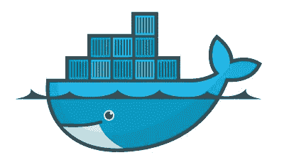

# 连接云 SQL - Kubernetes Sidecar

> 原文：<https://medium.com/google-cloud/connecting-cloud-sql-kubernetes-sidecar-46e016e07bb4?source=collection_archive---------0----------------------->


嗨，朋友们！

这个博客比我通常的操作方法要长一点，因为我们要处理很多移动的部分。我们有云 SQL、云 SQL 代理、Docker 和 containers、Google Container Registry、Kubernetes，以及云中的数据库凭证等管理机密，因此您不必将它们暴露在任何配置文件或环境变量中。

但是不要被吓倒！我是从一个初学者的角度来看这个问题的，所以我会解释很多细节。如果你有很多这方面的经验，不要担心，我已经把很多分成了独立的博客文章，我一路上都在链接，所以你应该能够很快进入文章的核心。

如果您完全没有经验，欢迎来到 Kubernetes 和云 SQL 的广阔世界！虽然你不会成为一个专家(我离 Kubernetes 专家还很远)，但希望你能掌握一些基本知识，以及如何开始。


那么，什么是边车？我们说的不是摩托车边车，而是这种格局因此而得名。

Kubernetes sidecar 模式是将一个支持容器附加到应用程序的容器上，以便在某种程度上使您的生活更轻松。在我们的例子中，这指的是将运行[云 SQL 代理](https://cloud.google.com/sql/docs/mysql/sql-proxy)的容器附加到您的应用程序中。使用代理有很多好处，这是我们推荐的连接到[谷歌云 SQL](https://cloud.google.com/sql/) 的最佳实践。

是的，除了边车模式，还有其他方法可以做到这一点。在后续的博客中，我将深入探讨不同模式的利弊。

在这篇博文中，我写了一个时髦的(对我来说)应用程序，为 MySQL 伪造数据库数据。你可以在 GitHub 上找到我的脚本[，还有一个关于它的博客和它的用法](https://github.com/GabeWeiss/sql_data_randomizer)[在这里](/@GabeWeiss/creating-sample-data-for-mysql-databases-38e3eff4a91b)。

如果您想了解更多关于云 SQL 连接的背景知识，请查看我的[连接介绍](/@GabeWeiss/connecting-google-cloud-sql-94025ba27071)博文。这篇文章还链接到更多关于不同用例和方法的分步文章，以及为什么您可能想要选择一种方法而不是另一种方法。

先决条件:我假设你已经有了自己的谷歌云平台(GCP)项目，并设置了计费。如果没有，请点击此处的[按钮](https://console.cloud.google.com/freetrial)开始项目，或点击此处的[按钮](https://console.cloud.google.com/billing)为项目设置账单。如果你打算在本地运行这些(codelab 在控制台外壳的 [GCP](http://console.cloud.google.com) 上运行，这是 Linux，所以默认安装了它)你需要在你的机器上安装并提供 [Docker](https://docs.docker.com/get-started/) 。


# 该应用程序

[codelab](https://github.com/GoogleCloudPlatform/gmemegen) 展示了一个允许你创建和存储迷因的应用程序。它有一个由 flask 和 SQLAlchemy 提供的 web 用户界面。

我写的[app](https://github.com/GabeWeiss/sql_data_randomizer)明显更简单。我只是想要一个展示一件事的应用程序:连接到云 SQL 并将一些虚假的人数据转储到数据库中。

当然，如果你也编写了自己的应用程序，那么一切都适用。



# 用集装箱装

写这篇博文时，我遇到的一个问题是找到一条简单的路径，从“我有一个应用程序”到“它正在 Kubernetes 上运行”。现在我们有一个应用程序要运行。

为了在 Kubernetes 中运行，我们需要一个容器(在我们的例子中是多个容器)。如果你已经知道如何构建一个容器，耶！如果没有，我写了一个单独的博客[来讲述我是如何用我的应用程序脚本创建一个容器的，并并排分解了在 codelab 中创建的容器，以帮助导航你需要做什么来用你想在 Kubernetes 和代理 sidecar 中运行的任何东西创建一个容器。](/@GabeWeiss/breaking-down-containers-9b0eb94cc0cd)

无论哪种方式，浏览博客文章获得一个容器，或者使用自己的容器。现在，故事的核心是:用代理 sidecar 部署应用程序！


# 扩展应用程序

*本节:*

1.  [*用谷歌容器注册表*](#b736) 安装并授权 gcloud(谷歌云 SDK 命令行工具)
2.  [*准备，并将容器上传到 Google 容器注册表*](#c797)
3.  [*创建 Google Kubernetes 引擎(GKE)集群*](#f4ce)
4.  [*用 Kubernetes Secrets*](#3298) 替换 Dockerfile 中的 ENV 变量
5.  [*分解 Kubernetes yaml 部署文件*](#d201)
6.  [*将应用部署到 Kubernetes 集群*](#6ab7)
7.  [*上下伸缩*](#7310)
8.  [*故障排除*](#ce93)

第一步，让我们把应用程序容器放到云中。 [GCR (Google 容器注册表)](https://cloud.google.com/container-registry)是一种安全的存储容器的方式，使它们可以从云中访问。我们将使用 [GKE(谷歌 Kubernetes 引擎)](https://cloud.google.com/kubernetes-engine)来扩大规模。我们需要配置 docker 来使用 GCR。我要用`gcloud`来做这件事。如果你不熟悉 Google Cloud SDK，你应该熟悉！万物云平台的命令行界面。安装文档可以在[这里](https://cloud.google.com/sdk/install)找到，我在之前的博文[这里](/google-cloud/cloud-iot-step-by-step-quality-of-life-tip-the-command-line-ce23046867d4#016c)中详细介绍了它的安装和配置。去做吧，然后回来。

接下来，运行命令，用 GCR: `gcloud auth configure-docker`对`gcloud`进行授权。您将看到如下所示的输出:

```
The following settings will be added to your Docker config file
located at [/Users/<user>/.docker/config.json]:
{
  "credHelpers": {
    "gcr.io": "gcloud",
    "us.gcr.io": "gcloud",
    "eu.gcr.io": "gcloud",
    "asia.gcr.io": "gcloud",
    "staging-k8s.gcr.io": "gcloud",
    "marketplace.gcr.io": "gcloud"
  }
}Do you want to continue (Y/n)?
```

注意，根据 Docker 的安装位置和安装方式，config.json 的路径可能会有所不同，但其余部分应该是相同的。继续按“Y”键。

在我们上传容器之前，我们需要编辑和重建它。请记住，我们不希望密码写在云中的任何地方，所以在我们上传容器之前，我们希望以明文形式消除密码的任何痕迹。删除 Dockerfile 文件中的 ENV 行。

运行以下命令，用 GCR uri 标记您的容器。如果你之前给你的容器命名了不同于`randomizer`的名字，在下面的命令中用它代替 randomizer，并且用你在 gcloud 中使用的任何项目代替`$PROJECT_ID`:

`docker tag randomizer gcr.io/$PROJECT_ID/randomizer`

如果您想多次重新构建容器，不要忘记标记步骤。如果你不这样做，那么它不会上传新版本的容器到 GCR。

通过以下方式将您的集装箱推送到您的 GCR 仓库:

`docker push gcr.io/$PROJECT_ID/randomizer`

一旦完成，你的集装箱就准备好了，可以被 Kubernetes 拉走了。当然，GCR 并不是让你的容器进入云端被拉入的唯一方式。你可以使用 Docker Hub，建立自己的提供商。GCR 只是让它从 GKE 变得容易。

接下来，让我们在 GKE 创建我们的 Kubernetes 集群:

```
gcloud container clusters create randomizer-cluster --zone us-central1-f --machine-type=n1-standard-1 --max-nodes=10 --min-nodes=1
```

请确保选择一个离您和/或您希望应用程序运行的地方很近的区域。你可以在这里看到区域列表[。机器类型映射到集群中运行的机器的功能有多强大。您可以点击](https://cloud.google.com/compute/docs/regions-zones/#available)[此处](https://cloud.google.com/compute/docs/machine-types)查看不同机器类型的更多详情。`n1-standard-1`是一个具有 3.75GB 内存的 vCPU，对于我们的目的来说足够了。最后，最小/最大节点对集群的扩展设置了一些限制。

继续运行该命令，然后通过运行`gcloud container clusters list`来验证集群创建是否正常。

我们需要确保`kubectl`(命令行工具，我们将通过它与 k8s 集群进行交互)通过了 GKE 认证。运行以下程序进行身份验证:

```
gcloud container clusters get-credentials randomizer-cluster --zone us-central1-f
```

确保您更改了集群的名称和区域，以匹配您在设置集群时使用的名称和区域。您应该看到:

`kubeconfig entry generated for randomizer-cluster`

现在为了混淆我们的数据库凭证。有几种方法可以做到这一点，我不打算在这里介绍它们。几年前，我的老队友写了一篇很棒的分为两部分的博客文章[,介绍了一些背景和基本知识。从那以后，有了更多的方法。我可能会写或找一篇后续文章来介绍它们。现在，我们将使用 Kubernetes 的秘密来做到这一点。](/google-cloud/kubernetes-configmaps-and-secrets-68d061f7ab5b)

我们的容器需要两组凭证:数据库用户凭证，以及服务帐户凭证。云 SQL 代理使用服务帐户连接到我们的云 SQL 实例。

我们可以将服务帐户 json 文件转换成 Kubernetes 秘密，该秘密可以传递到容器中并由代理使用。

```
kubectl create secret generic cloudsql-instance-credentials --from-file=sql_credentials.json=<service_account_json_file>
```

并创建我们的数据库凭证:

```
kubectl create secret generic cloudsql-db-credentials --from-literal=username=[DB_USER] --from-literal=password=[DB_PASS] --from-literal=dbname=[DB_NAME]
```

我们可以使用这些秘密来设置环境变量，作为我们部署的一部分，然后由我们的脚本获取，我们就可以开始了！

我的应用程序的部署 yaml 看起来与 codelab 非常相似，所以我将遍历我的部署 YAML 并分解正在发生的事情(注意，完整的文件在 [repo](https://github.com/GabeWeiss/sql_data_randomizer/blob/master/randomizer_deployment.yaml) 中，我只是抽出相关的部分)。

containers 部分定义了我们将哪些容器放入 k8s 集群的每个节点。对于我们来说，我们使用了两个容器。我们用我们的应用程序创建的容器，然后是已经在 GCR 为我们设置好的 SQL 代理容器。

在随机数发生器容器部分，你可以看到我们是如何使用之前上传的来自 GCR 的图片 URL 的。记得将<project_id>值更改为您的项目 id。env 部分定义了部署容器时将在容器上设置的环境变量。在我们的例子中，它是来自我们创建的秘密的数据库凭证。记住，我们没有使用 SQL_HOST 变量，因为我们使用了代理，所以脚本代码默认使用 localhost。</project_id>

```
 containers:
        - name: randomizer
          image: gcr.io/[PROJECT_ID]/randomizer
        # Set env variables used for database connection
        env:
          - name: DB_USER
            valueFrom:
              secretKeyRef:
                name: cloudsql-db-credentials
                key: username
          - name: DB_PASS
            valueFrom:
              secretKeyRef:
                name: cloudsql-db-credentials
                key: password
          - name: DB_NAME
            valueFrom:
              secretKeyRef:
                name: cloudsql-db-credentials
                key: dbname
```

在`cloudsql-proxy`容器中，图像标签告诉 Kubernetes 在哪里获取它。写这篇文章的时候，我已经设置了图片的最新版本(`1.16`)。检查[这里](https://console.cloud.google.com/gcr/images/cloudsql-docker/GLOBAL/gce-proxy?gcrImageListsize=30&pli=1)的容器列表，看看最新版本是什么。更新线图像:`gcr.io/cloudsql-docker/gce-proxy:1.16`用最新版本替换`1.16`。要运行该命令，请确保使用您的云 SQL 实例的连接名称来更改`<INSTANCE_CONNECTION_NAME>`。如果您正在查看云 SQL 实例的概述页面，您会在 Connect to this instance 标题下看到它。看起来会像`<project id:region:instance id>`。因为代理需要一个 json 文件作为服务帐户承载令牌，所以我们用我们之前创建的服务帐户秘密设置一个 mount，并将该路径传递给启动代理的命令。

```
- name: cloudsql-proxy
        image: gcr.io/cloudsql-docker/gce-proxy:1.16
        command: ["/cloud_sql_proxy",
          "-instances=<INSTANCE_CONNECTION_NAME>=tcp:3306",
          "-credential_file=/secrets/cloudsql/sql_credentials.json"]
        volumeMounts:
          - name: my-secrets-volume
            mountPath: /secrets/cloudsql
            readOnly: true
    volumes:
      - name: my-secrets-volume
        secret:
          secretName: cloudsql-instance-credentials
```

在部署我们的应用程序之前，我想描述一下它运行时将要发生的事情，这意味着我需要解释一下 Kubernetes 是如何运行容器的。当 Kubernetes 启动 pod 时，您的容器将运行应用程序，这将生成 1，000 条雇员记录，然后退出。Kubernetes 会监控 pod 的健康状况，以确定是否需要重启它们。其中一种方法叫做*活性探测*。它检查容器是否空闲，如果是，就重新启动它。这是一个过于简单的问题，它比那更复杂，如果你想知道更多，文档在这里。

接下来会发生什么:应用程序将运行，活性探测器将看到应用程序已经退出，容器处于空闲状态，因此 Kubernetes 将重启容器。

这意味着容器将重新启动，脚本将再次运行！因此，它将再增加 1000 名员工，冲洗并重复。

长话短说(太晚了)，让我们开始吧！要部署的命令是:

```
kubectl create -f randomizer_deployment.yaml
```

这将我们的应用程序的单个副本启动到 GKE。如果你想更深入地了解 Kubernetes，副本、节点、荚等都是你想要学习的术语。简而言之，节点代表运行 pod 的机器，pod 代表容器。这些节点由我们刚刚创建的部署控制，它定义了节点的行为方式。

几乎立刻，你应该能跑:

```
kubectl get pods
```

您将会看到如下输出:

```
$kubectl get podsNAME                         READY   STATUS    RESTARTS   AGE
randomizer-7b7845c7d-8vjgq   2/2     Running   0          3s
```

当它从 GCR 抓取集装箱时，它可能会先说`ContainerConstruction`一会儿。如果它显示`Running`,那就意味着我们已经出发了！你应该能够连接到你的数据库(我只是在 shell 中使用了`mysql`，切换到你在我们为`DB_NAME`创建的秘密中定义的数据库，并运行`SELECT * FROM employee;`。正如我提到的，由于 Kubernetes 的工作方式，您会看到行数随着时间的推移不断增加。

现在，这一切都很好，但在这一点上，我们并不比仅仅在本地运行脚本更快。这是因为我们只使用了一个副本。那么现在会发生什么呢？让我们把功率开大一点。为了阻止 Kubernetes 集群运行脚本，我发现的最简单的方法(可能有更好的方法，再说一次，我不是 Kubernetes 高手)是将集群的规模缩小到 0。您可以通过运行以下命令来实现:

```
kubectl scale --replicas=0 -f randomizer_deployment.yaml
```

这告诉集群运行零个副本，从而终止现有的运行节点。现在运行`kubectl get pods`，你会看到你的节点状态为`Terminating`，或者`No resources found.`你可能已经看到了它的走向。要扩展我们的应用程序，我们可以运行:

```
kubectl scale --replicas=20 -f randomizer_deployment.yaml
```

现在，您将看到类似这样的内容:

```
$ kubectl get podsNAME                        READY  STATUS             RESTARTS  AGE
randomizer-7b7845c7d-2w6vx  0/2    ContainerCreating  0         4s
randomizer-7b7845c7d-2xnmp  0/2    ContainerCreating  0         4s
randomizer-7b7845c7d-5g6cc  0/2    ContainerCreating  0         4s
randomizer-7b7845c7d-8rc94  2/2    Running            0         4s
randomizer-7b7845c7d-cmv9m  2/2    Running            0         4s
randomizer-7b7845c7d-cqzl8  0/2    ContainerCreating  0         4s
randomizer-7b7845c7d-ddskl  0/2    ContainerCreating  0         4s
randomizer-7b7845c7d-fbxxc  2/2    Running            0         4s
randomizer-7b7845c7d-hhfm4  0/2    ContainerCreating  0         4s
randomizer-7b7845c7d-hxnnd  2/2    Running            0         4s
randomizer-7b7845c7d-jbm2c  0/2    ContainerCreating  0         4s
randomizer-7b7845c7d-jxfhk  2/2    Running            0         4s
randomizer-7b7845c7d-m6zwz  0/2    ContainerCreating  0         4s
randomizer-7b7845c7d-mhgxn  0/2    ContainerCreating  0         4s
randomizer-7b7845c7d-sgvd5  2/2    Running            0         4s
randomizer-7b7845c7d-ss5fm  0/2    ContainerCreating  0         4s
randomizer-7b7845c7d-tllg8  0/2    ContainerCreating  0         4s
randomizer-7b7845c7d-xnm96  2/2    Running            0         4s
randomizer-7b7845c7d-xtwd6  2/2    Running            0         4s
randomizer-7b7845c7d-z2528  0/2    ContainerCreating  0         4s
```

我们在这里，同时运行应用程序的 20 个实例，愉快地做着它们的事情，被 GKE 标记为空闲，重新启动，并继续向我们的数据库输入数据。现在，如果您连接到您的数据库并开始运行几次那个`SELECT`语句，您将看到我们的行数比以前增加得快了很多。

一点故障排除…如果 pod 的状态显示`Error`,这通常意味着容器中有东西崩溃或失败。在 Kubernetes 中调试东西可能会…很困难。到目前为止，我发现的最简单的方法是知道打印到容器中的 stdout 的任何内容都会被记录，您可以使用`kubectl`来检索该日志。假设我上面的一个 pod:`randomizer-7b7845c7d-ss5fm`的状态是`Error`。我可以用这个命令找出是怎么回事:

```
kubectl logs randomizer-7b7845c7d-ss5fm randomizer
```

**注意:**如果您已经缩减到零个副本，这将不起作用。它必须在一个运行的吊舱上。我必须在该命令中再次指定`randomizer`，因为我们在每个 pod 中运行两个容器，所以当我请求一个节点的日志时，我必须指定我指的是哪个容器的日志，因为它们是分开保存的。当我运行日志时，作为容器运行的一部分进入 stdout/stderr 的任何内容都将被转储。在准备这个博客的时候，我有一个`Couldn’t connect to the MySQL instance`让我困惑了很久。我最终意识到，这是因为在我的脚本启动之前，云 SQL 代理还没有在其容器中启动。这就是为什么(您将在我的脚本中看到)我在连接数据库时增加了指数后退重试。


# 总结

所以你有它！使用 Kubernetes sidecar 模式运行云 SQL 代理，作为水平扩展应用程序的连接点。希望现在，在 gmemegen codelab 和我的 data faker 脚本这两个例子之间，你已经有了一个坚实的基础来启动和运行你自己的应用程序！

要进行清理，您需要删除集群:

```
gcloud container clusters delete randomizer-cluster
```

然后，如果你真的想彻底清理门户，删除我们从 GCR 上传的容器:

```
gcloud container images delete gcr.io/$PROJECT_ID/randomizer
```

但是等等，如果你多次上传容器，你可能会得到一些孤立的图片。两个选项:1)进入控制台[这里](https://console.cloud.google.com/gcr/images)(别着急，会说找不到网址，点左边`images`就行)，手动删除。或者 2)运行:

```
gcloud container images list-tags gcr.io/$PROJECT_ID/randomizer --filter='-tags:*' --format='get(digest)' --limit=100
```

然后对于每个 sha 值，像这样运行`images delete`命令:

```
gcloud container images delete gcr.io/$PROJECT_ID/randomizer@sha256:cd53812d71ed6e264788cc60d3413774f8553a877ef78b3eacb5c3334c653fc8
```

应该就是这样了，你的项目现在已经重置，并清除了我们在这篇博客中所做的内容！

最后一点，如果你想像 k8s `Job`一样运行，而不是作为一个连续的集群，请注意有一个问题:代理边盘不会退出，因为它正在愉快地运行，所以`Job`永远不会完成。有几种方法可以解决这个问题，特别是[这个堆栈溢出](https://stackoverflow.com/questions/41679364/kubernetes-stop-cloudsql-proxy-sidecar-container-in-multi-container-pod-job/64650086#64650086)问题有一些很好的讨论和解决方案，当应用程序的其余部分完成工作时，使用`SYS_PTRACE`安全上下文来杀死代理。

遇到什么问题了吗？请让我知道！请在下面的评论中回复，或者在 Twitter 上联系我。我的 DMs 打开了！