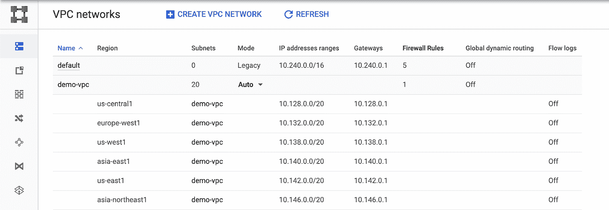

# 连接到云 SQL——考虑一下

> 原文：<https://medium.com/google-cloud/connecting-google-cloud-sql-94025ba27071?source=collection_archive---------1----------------------->

嗨，朋友们！

因此，您已经[创建了您的第一个云 SQL 实例](https://cloud.google.com/sql/docs/mysql/quickstart)！但是指南告诉你只要在云壳中连接它就可以了。这太棒了。不要误解我。我喜欢云壳。然而，当您试图弄清楚如何用您的应用程序或数据库管理工具连接到您的数据库时，这实际上没有什么好处。

在这篇文章中，我将讨论连接到云 SQL 的位置、方式和原因。

1.  `[**Where**](/p/94025ba27071#a772)`您正在连接，这将如何影响文档中所谓的“公共与私有”IP，以及围绕这一问题的考虑因素和设置方法(剧透一下，这不是公共与私有这么简单)。
2.  `[**How**](/p/94025ba27071#2bcf)`你连接。具体来说:围绕身份验证的类型做出决定，是否使用 SSL。使用 Google 的 SQL 代理是否有意义(代理是什么？最简单地说，它是一个独立的二进制文件，可以安全地连接到您的云 SQL 实例，而不用担心 IP 地址的允许列表，或者手动配置 SSL。更多[此处](https://cloud.google.com/sql/docs/mysql/sql-proxy)。)，或者最好通过 API 直接连接。
3.  `[**Why**](/p/94025ba27071#1b41)`将会围绕什么时候组合`Where`和`How`的不同片段展开一些场景。

# 在哪里

当您设置您的云 SQL 实例时，隐藏在`Set connectivity`下拉列表中的配置选项下的是公共和私有 IP 设置选项。

我将做一个陈述让你记住，然后再详细解释一下:私有意味着你从虚拟私有云(VPC)内部连接到云 SQL。公共意味着你是从公共互联网连接到它。

首先，什么是 VPC？

这里有一个详细的概述。简而言之:VPC 是一个专用的私人网络，类似于公司办公室的网络，这样不同的谷歌云产品就可以在不使用公共互联网的情况下相互交流。

它们有很多复杂的网络用途。现在，只要知道存在一个默认的就行了(适当地命名为“default”)。如果您决定启用专用 IP，您会看到它列在“关联网络”下的配置选项中(即使您自己没有设置)。请注意，如果您有一个遗留 VPC，因为您的项目有点旧，它不会显示在下拉列表中。你可以通过进入控制台中的 [VPC 网络](https://console.cloud.google.com/networking/networks/list)来检查这一点，并检查你的默认 VPC 的模式。

如果是`Legacy`，它不会显示为云 SQL 实例的选项。

现在事情变得有点复杂了。并非所有谷歌云的产品都支持 VPC 连接。事实上，一些“无服务器”产品(如应用引擎、云功能或云运行)无法直接连接到 VPC。不过没关系，不要惊慌。我们有一个解决办法。[无服务器 VPC 连接器](https://cloud.google.com/vpc/docs/configure-serverless-vpc-access)可以授权您的无服务器环境访问您的 VPC 上的产品(比如带有私有 IP 的云 SQL 实例)。

快速回顾一下:公共 IP 意味着可能通过外部互联网路由，私有 IP 意味着来自 VPC 网络内部。一些 GCP 产品需要一些帮助才能使用私有 IP。

# 怎么

有多种方法可以连接到云 SQL 实例:

1.  云代理
2.  允许消费者使用的公共知识产权
3.  VPC 互联应用的私有 IP
4.  特定于语言的连接器(例如 Java 的 JDBC 套接字工厂)
5.  使用 API 编写自己的连接器需要短暂的 SSL 创建/连接
6.  使用永久密钥对设置 SSL 加密

这绝对是混搭的情况。例如，您可以作为白名单中的用户连接到公共 IP，还可以在实例上设置 SSL 加密。我们将在下一节讨论为什么您会选择进行不同的配置，但首先我想简单地介绍一下如何设置一些方法，并强调一些使用案例。

我得到的大部分信息将被整合到官方[文档](https://cloud.google.com/sql/docs/mysql/quickstarts)页面的快速入门中。所以当他们合并后，我会链接到快速入门，而不是我的快速博客。指南的链接:

1.  [私有 IP +代理](/@GabeWeiss/cloud-sql-private-ip-proxy-83e85456571f)(谷歌计算引擎虚拟机)
2.  [公共 IP +代理](/@GabeWeiss/cloud-sql-public-ip-proxy-5513f59e5a9e)
3.  [带有允许列表 IP 的公共 IP](/@GabeWeiss/cloud-sql-public-ip-allowlist-e2e375b4432d)
4.  [Kubernetes 边车集装箱中的代理人](/@GabeWeiss/connecting-cloud-sql-kubernetes-sidecar-46e016e07bb4)

我也很乐意在这些最初的基础上增加更多的内容。如果你有具体想看的，请在下面添加评论，或者通过 [Twitter](https://twitter.com/GabeWeiss_) (DMs 开放)联系我，让我知道。

# 为什么

虽然您可以通过我们上面列出的任何方式连接到云 SQL，但是考虑一下您为什么选择哪种方式实际上归结为两点:

第一，你的环境允许什么。例如，正如我们所提到的，如果你在一个不允许你运行额外的二进制文件的企业环境中工作，那么运行 Google 的 SQL 代理将不会是一个选项，你将需要寻找其他选项。有时，您可能需要使用以特定方式签名的永久 SSL 证书。如果你在 GCP 使用的产品还不完全支持 VPC 连接，那么你需要使用公共 IP 而不是私有 IP。

二，风险承受能力。您可以采用最简单的方式来设置路由，即向您的实例开放一个公共 IP，并允许列出任何正在连接的 IP。求你了。求你了。不要那样做。也许是为了测试您的应用程序，但在生产中，不要这样做。除非你不介意别人访问你的数据库。在这种情况下，无论如何！

另一方面，你可以反其道而行之，在与云 SQL 实例相同的 VPC 内运行 GCE 上的应用程序，这样你就可以使用内部 IP 地址，然后在本地主机上使用 Google 的 SQL 代理，这样只有你的应用程序可以与代理对话。

就性能而言，与查询优化之类的东西相比，在完全安全的锁定模式下运行之间的差异可能很小，但它大于零。当然，如果您的应用程序依赖于实时响应，那么就对所有的事情进行优化。我只是提醒你不要在不需要的地方进行预优化。除非你需要，否则不要为了几毫秒的额外延迟而牺牲数据安全性。

**最佳实践是使用谷歌 SQL 代理。**从安全的角度来看，它将使用短暂的 SSL 令牌为您管理所有应用程序到数据库实例的加密，因此即使其中一个受到攻击，它也是一个短期证书，因此您的暴露窗口很小。我再强调一遍…除非你有要求让你不用，那就用代理吧！

# 结论

所以你有它！这是一个关于 Google 云平台上云 SQL 的连接性的博客，希望基本上是完整的。无论你从哪里连接，无论你选择什么样的连接方式，我希望这篇博客能帮你做到这一点！

如果您有任何问题或意见，请在下面留下，或通过 [Twitter](https://twitter.com/GabeWeiss_) 联系我。DMs 打开了！