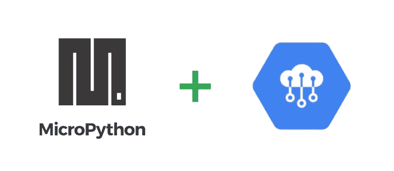
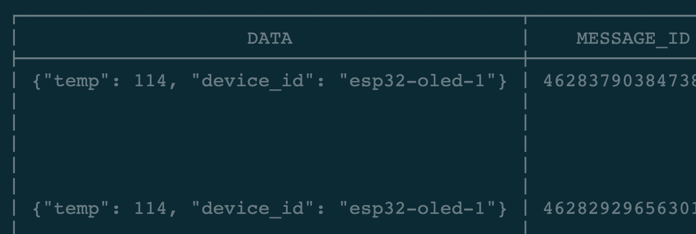

# 将 MicroPython 设备连接到谷歌云物联网核心

> 原文：<https://medium.com/google-cloud/connecting-micropython-devices-to-google-cloud-iot-core-3680e632681e?source=collection_archive---------1----------------------->



# 介绍

几周前，我开始建设另一个物联网项目。(稍后会有更多的内容)当布置所有的组件并决定如何设置它时，我花了一点时间来考虑软件方面的事情。我看到了两条主要的前进道路。一方面，我可以走 Arduino C/C++路线，这是一条很好的记录，在很多情况下是一条好路线。但另一方面，我听说过 MicroPython，但从未尝试过。我也找不到任何关于使用 MicroPython 和 Google Cloud IoT Core 的好信息。

因此，这篇博客的目标是一步步地分享如何获得一个兼容 MicroPython 的微控制器，在这里是一个 ESP32，配置为通过 MQTT 连接和发送事件到 Google Cloud IoT 核心。

# 选择一个设备

正如我之前提到的，我们将从 ESP32 开发板开始。这些可以在易贝、邦古德、速卖通等网站上找到，价格相当便宜。不过，我在亚马逊上捡到了一个 lolin32。在任何情况下，大多数(如果不是全部)ESP32 开发板都应该可以工作。

因为您的设备可能还没有安装 MicroPython，所以我们需要刷新它。别担心，这是一个非常简单的过程。在我的例子中，我使用的是当前最新的 stable(esp32–2019 05 29-v 1.11 . bin)，但如果你愿意，也许值得看看最新最棒的。你可以在 MicroPython 网站上找到二进制文件:[http://micropython.org/download#esp32](http://micropython.org/download#esp32)

在您选择并下载了 MicroPython 二进制文件之后，我们需要确保您拥有 esptool，它允许您轻松地与设备的 ROM 引导加载程序进行通信。代码位于[这里](https://github.com/espressif/esptool)，但是你可以使用 pip 很容易地安装它。此外，我们还希望有一个可以通过串行通信和控制 MicroPython 板的工具。这个工具叫做 ampy，我们现在也要安装它。

```
pip install esptool adafruit-ampy
```

现在您已经安装了 esptool，您需要将该板插入到您的计算机中，并找出它位于哪个串行端口上。因为我用的是 Mac，所以我会这样做:

```
ls /dev/ | grep -i "tty" | grep -i "usb"
```

在我的例子中，串行端口以`/dev/tty.SLAB_USBtoUART`结束，然而你的可能会不同，这取决于你的操作系统。我们可以将它存储在一个环境变量中，这样会简单一些。

```
export SERIALPORT="/dev/tty.SLAB_USBtoUART"
```

现在，您可以通过对设备进行检查来确认一切正常:

```
esptool.py —-port $SERIALPORT flash_id
```

这应该会打印出一些关于 ESP32 芯片的细节。

此时，我们准备擦除当前在板上的 flash，并继续使用 MicroPython 刷新它。下面是完成这项工作的两个命令。[注意:这假定您的 MicroPython 文件在您的主目录下载文件夹中，并且您的串行端口可能与下面列出的不同]

```
esptool.py —-chip esp32 —-port $SERIALPORT erase_flashesptool.py —-chip esp32 —-port $SERIALPORT —-baud 460800 write_flash -z 0x1000 ~/Downloads/esp32–20190529-v1.11.bin
```

完成后…成功！现在，您的 ESP32 板上已经安装了 MicroPython。您可以使用 ampy 查看当前设备上的文件。应该只有一个名为 boot.py 的文件，每次设备启动时都会加载该文件。

```
ampy —-port $SERIALPORT -—baud 115200 ls
```

现在是生成 RSA 公钥/私钥对的时候了。您可以通过运行以下两个命令来实现这一点。

```
openssl genrsa -out rsa_private.pem 2048openssl rsa -in rsa_private.pem -pubout -out rsa_public.pem
```

这将输出两个文件`rsa_private.pem`和`rsa_public.pem`。在下一步中，您将需要这些，但请确保它们是私有的。

# 配置谷歌云物联网核心

我们现在需要设置 Google Cloud 物联网核心，以便我们在配置设备时拥有所需的所有值。登录到 https://console.cloud.google.com 的。如果您还没有帐户，可以免费试用。

在左侧，您需要导航至“物联网核心”。如果这是您第一次，您需要启用 API。

接下来，您需要创建一个注册表，并填写以下信息:

**注册表 ID** —这是一个注册表，包含一个或多个您想要连接的设备。

**地区** —选择最适合您的地区。在我的情况下，我将使用美国中心 1，因为它离我最近。

选择遥测和状态的发布/订阅主题。(您可以为每一项创建一个新的)

创建注册表后，我们现在可以在注册表中为 esp32 板创建一个器件。转到“设备”，然后“创建新设备”。在本节中，我们将配置设备。给它一个唯一的设备 ID，对于这个设置，我只是使用了类似`esp32-dev-1`的东西，但是你可以使用任何你想要的 ID。我们将保持默认值不变。

设备通信—允许
认证—手动输入
公钥格式— RS256。

在公钥值中，我们将粘贴上一步中创建的文件`rsa_public.pem`的内容。此时，我们可以单击“创建”,我们已经在 Google Cloud 端设置好了。

# 设备设置

酷毙了。现在我们准备在这个设备上安装一些代码。为此，我们将使用下面的一些示例代码:[**https://github.com/GoogleCloudPlatform/iot-core-micropython**](https://github.com/GoogleCloudPlatform/iot-core-micropython)

```
git clone https://github.com/GoogleCloudPlatform/iot-core-micropythoncd iot-core-micropython/
```

在这个 repo 中将有一个名为`config.py.example`的文件。这是一个模板配置，您需要用您的信息进行更新。当您到达`jwt_config`部分时，我们将不得不做一些工作来使其工作。由于内存限制，我无法让 pyasn1 库在 MicroPython 的 ESP32 上运行。(但是，这在将来可能会改变)这用于将 ASN.1 数据类型编码和解码为 PEM 或 DER 格式，这是 RSA 使用的格式。为了解决这个问题，我们必须使用本地机器来解码私钥，并将密钥的组成部分存储在一个元组中。然后我们将把它用于 RSA 库。要读取这些值，您可以运行:

```
pip install rsapython utils/decode_rsa.py
```

它应该在括号内输出 5 个(非常大的)整数。您需要将这个值复制并粘贴到`private_key`值的`jwt_config`部分。更新完信息后，你需要将文件重命名为`config.py`。

接下来，我们将使用`ampy`将文件复制到设备。我们将通过发出以下 3 个命令来实现这一点。

```
ampy —-port $SERIALPORT —-baud 115200 put libampy —-port $SERIALPORT —-baud 115200 put config.pyampy —-port $SERIALPORT —-baud 115200 put main.py
```

您可以使用`ampy` ls 命令来验证文件是否在板上。

```
ampy —-port /dev/tty.SLAB_USBtoUART —-baud 115200 ls/boot.py
/config.py
/lib
/main.py
```

此时，您可以重置您的电路板，并使用 screen 查看输出。

```
screen -L /dev/tty.SLAB_USBtoUART 115200 -L
```

如果一切顺利，您应该会看到如下所示的输出:

```
Publishing message {“temp”: 113, “device_id”: “esp32-oled-1”}
Publishing message {“temp”: 114, “device_id”: “esp32-oled-1”}
Publishing message {“temp”: 114, “device_id”: “esp32-oled-1”}
```

# 包扎

恭喜你！现在，您的设备正在向物联网核心发送数据。您可以通过打开云 shell 并运行以下命令来查看消息:

```
gcloud pubsub subscriptions pull —-limit=10 —-auto-ack projects/[your-project-id]/subscriptions/[your-subscription-id]
```

