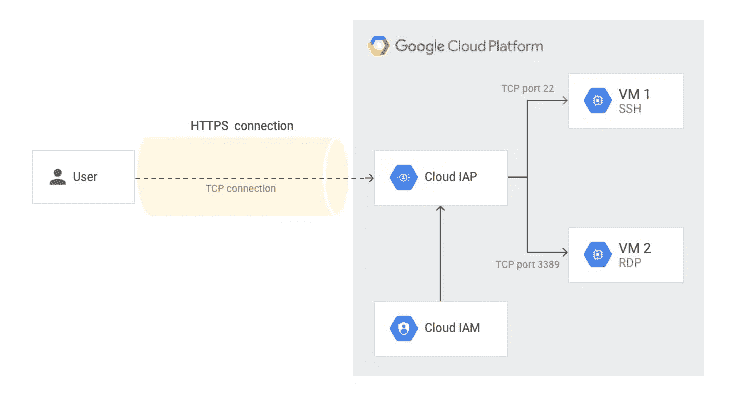
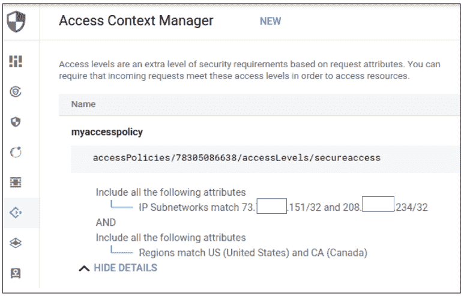

# 无需公共 IP 或 VPN 即可安全连接到 Google 计算引擎虚拟机

> 原文：<https://medium.com/google-cloud/connecting-securely-to-google-compute-engine-vms-without-a-public-ip-or-vpn-720e53d1978e?source=collection_archive---------0----------------------->

在本文中，我将向您展示如何在没有公共 IP 或 VPN 连接的 GCE 上建立到虚拟机的安全 RDP、ssh 和 VNC 连接。

提议的基于代理的配置减少了 GCE 虚拟机的攻击面，因为它们不必暴露给外界。对于 Windows 节点，远程桌面协议(RDP)是恶意行为者最常用的攻击媒介之一。对于 Linux 节点，强力 ssh 攻击是获得未授权访问的常见方法。该配置还允许在单个虚拟机的粒度上控制远程访问。这解决了 VPN 的一个缺点，即在假设网络是有效的安全边界的情况下，允许访问 VPN 后面的所有系统。

虽然重点是 RDP 和 ssh 协议，但所描述的隧道方法适用于所有 TCP 端口。

**谷歌云平台(GCP)的身份感知代理(IAP)**

对于 TCP 连接，GCP 的[身份识别代理(IAP)](https://cloud.google.com/iap) 支持通过其私有 IP 从互联网访问 GCE 虚拟机。当试图建立到代理的 HTTPS 加密隧道时，代理执行认证和授权检查。在成功的认证和授权之后，来自客户端的流量通过代理在 Google 的内部网络上被转发到 VM 实例。换句话说，代理充当对外界开放的传入流量的看门人，而 VM 只需要允许来自 Google 内部网络上的代理的连接。



我们将首先描述基本的 IAP 配置。然后我们会覆盖

*   使用 ssh 的 Linux 到 Linux 连接
*   与 VNC 的 Linux 到 Linux 连接
*   与 RDP 的 Windows 到 Windows 连接
*   从 Linux 到 Windows 的 RDP 连接

在讨论了基本配置和设置之后，我们将讨论如何结合 IAM 条件使用 GCP 的[访问上下文管理器](https://cloud.google.com/access-context-manager/docs/overview)进行访问控制。访问上下文管理器根据请求属性授予访问级别，例如尝试建立连接的客户端的 IP。最后，我们将介绍一个基本的云 NAT 配置，它可以为您的虚拟机实现出站连接。

**隧道配置**

为了配置 IAP 通道，我假设您有以下条件

*   您拥有的 GCP 项目，带有正在运行的 GCE 虚拟机，对于 Windows 虚拟机，登录和密码—确保在创建虚拟机时禁用公共 ip 的分配—对于 Windows 节点，确保在创建虚拟机后不要忘记指定用户名和密码
*   安装在您想要连接的系统上的 [Google Cloud SDK](https://cloud.google.com/sdk)

在我们开始之前，请确保您的项目和用户帐户设置正确。您可以使用“ [gcloud 配置列表](https://cloud.google.com/sdk/gcloud/reference/config/list)验证您的设置是否正确，如有必要，更改您使用“ [gcloud auth login](https://cloud.google.com/sdk/gcloud/reference/auth/login) 登录的帐户。项目可以用'[g cloud config set core/project](https://cloud.google.com/sdk/gcloud/reference/config/set)来设置。如果你在公司代理的后面，你可能必须[将 IAP 用于 TCP 的域‘tunnel . cloud proxy . app’列入白名单](https://cloud.google.com/iap/docs/faq#what_domain_does_for_tcp_use)。在大多数情况下，我将通过 CLI 描述配置，但是大多数任务也可以通过 GCP 控制台 UI 来完成。

首先，我们需要创建一个防火墙规则，以支持从 IAP 到 VM 的流量。IAP 使用范围 35.235.240.0/20 作为转发流量的源地址。我们允许端口 22 (ssh)、3389 (rdp)和 5900 (vnc)。您可以根据您需要的协议挑选端口号。

```
gcloud compute firewall-rules create allow-ingress-from-iap \
--direction=INGRESS \
--action=allow \
--rules=tcp:3389,tcp:22,tcp:5901 \
--source-ranges=35.235.240.0/20
```

该命令允许从代理连接到项目中的所有节点。如果您不想为项目中的所有虚拟机打开防火墙，您可以[将标签](https://cloud.google.com/sdk/gcloud/reference/compute/instances/add-tags)附加到您希望应用规则的虚拟机，并使用'— target-tags=TAG '作为附加选项指定该标签。

现在我们需要添加一个 IAM 策略，允许用户建立隧道连接。我们将 IAM 角色 iap.tunnelResourceAccessor 授予所有被授权使用隧道的用户和/或用户组。在这个例子中，这个角色是在项目级别设置的。这允许用户建立到项目中应用上述防火墙规则的所有虚拟机的连接。我们将在后面看到如何更有选择性地只启用到特定实例的隧道，而不改变防火墙配置。

```
gcloud projects add-iam-policy-binding iap-access-test \
--member=user:[testuser@example.com](mailto:testuser@example.com) \
--role=roles/iap.tunnelResourceAccessor
```

用户还需要拥有 compute.viewer 角色

```
gcloud projects add-iam-policy-binding iap-access-test \
--member=user:[testuser@example.com](mailto:testuser@example.com) \
--role=roles/compute.viewer
```

**连接 SSH:Linux-GCE 上的 Linux**

如果您想通过 VNC 协议连接到一个 Linux 节点，您需要为端口 5901 建立隧道，这是 iap-test-ubuntu 托管的第一个 VNC 会话的端口号

```
gcloud compute start-iap-tunnel iap-test-ubuntu 5901 \
--local-host-port=localhost:5901
```

或者，您也可以通过 ssh 使用端口转发

```
gcloud compute ssh iap-test-ubuntu --project iap-access-test \
--zone us-central1-a --ssh-flag "-L 5901:localhost:5901"
```

建立隧道后，您可以将 VNC 客户端，例如 [Remmina](https://remmina.org/) 或 [VNC 查看器](https://www.realvnc.com/en/connect/download/viewer/)指向本地主机上的端口 5901，通过您的隧道连接到您的虚拟机实例。


如果你想通过 Remmina 实现“点击式”连接，你可以创建一个简短的启动脚本。在编写脚本之前，您需要为连接创建一个配置文件。打开 Remmina 桌面客户端，点击左上角的“+”添加新的连接配置文件。我们需要指定的只是连接的类型(Remmina VNC 插件)，配置文件名和 localhost:5901 作为服务器端口。本地主机是通过 IAP 到 Windows 虚拟机的隧道的起点。“保存”以确保保存连接设置。


新描述文件存储在~/中。本地/共享/remmina。现在，您可以创建一个小的启动脚本，并将其放在桌面上进行即时访问。

```
#!/bin/bash
gcloud config set core/project iap-access-test
gcloud compute start-iap-tunnel iap-test-ubuntu 5901 \
--local-host-port=localhost:5901 --zone=us-central1-a &
sleep 2
remmina -c /home/adittmer/.local/share/remmina/1604188073948.remmina
```

我们不会在这里描述如何在 GCE 实例上安装像 Gnome 这样的桌面。我们也不包括服务器端 VNC 配置。[这篇文章](https://subscription.packtpub.com/book/big_data_and_business_intelligence/9781788474221/1/ch01lvl1sec15/installing-and-configuring-ubuntu-desktop-for-google-cloud-platform)是一个很好的起点，如果你在~/中添加以下内容的话。文中建议的 vnc/xstartup 文件。

```
gnome-panel &
gnome-settings-daemon &
metacity &
nautilus &
```

**连接 RDP:GCE 上的 Linux-Windows**

为了连接到 Windows VM 实例，我还使用了 [Remmina](https://remmina.org/) 客户端。与 VNC 客户端示例的唯一区别显然是端口号以及 Remmina UI 中的一些小差异。对于我们运行的隧道设置

```
gcloud compute start-iap-tunnel iap-test-windows 3389 \
--local-host-port=localhost:3389
```

按照上述说明创建 Remmina 配置文件时，您需要将 RDP 指定为协议。对于“服务器”,您只需输入“本地主机”,无需端口号。您可以使用上面的脚本，但是需要将端口号 5901 更改为 3389，修改虚拟机的主机名，并为 RDP 连接引用正确的配置文件。

**与 RDP 连接:GCE 上的 Windows-Windows**

对于来自 Windows 客户端的 RDP 连接来说, [IAP Desktop](https://github.com/GoogleCloudPlatform/iap-desktop/releases/tag/2.7.315) 是一个很棒很简单的解决方案。安装向导会启动一个 Oauth 流程来验证您的 Google 用户帐户。初始化后，它会显示可用的虚拟机。双击虚拟机实例会创建一个隧道和一个 RDP 连接。


**终止 IAP 隧道连接**

使用 gcloud 从 shell 启动的连接可以通过 CTRL-C 终止

```
kill $(lsof -ti tcp:<port number>)
```

**访问级别**

如果你想对可以建立 IAP 隧道的设备有更多的限制，你可以结合使用[访问级别](https://cloud.google.com/access-context-manager/docs/overview)和 [IAM 条件](https://cloud.google.com/iam/docs/conditions-overview)。IAP 根据请求的属性授予访问级别。例如，IAP 可以根据请求的源 IP，为发起隧道连接的请求分配访问级别。如果为请求用户分配了访问级别，并且该访问级别与 IAM 条件中为“iap.tunnelResourceAccessor”角色指定的级别相匹配，则建立隧道。

访问级别是通过[访问上下文管理器](https://cloud.google.com/access-context-manager/docs)定义的，是组织级别的构造。这意味着所有访问级别在所有项目中都是可见的。访问上下文管理器支持基本和自定义访问级别。基本访问级别只允许“与”或“或”组合的条件。自定义级别允许更复杂的表达式，并支持基于请求类型和属性进行过滤的通用表达式语言(CEL)。自定义访问级别仅作为付费企业安全订阅的一部分提供。对于本例，我们将定义一个基本访问级别。

被授权创建访问级别的用户需要具有资源管理器组织编辑者角色以及访问上下文管理器策略管理员角色。这些角色可以由组织管理员(角色为 roles/resource manager . organization admin 的个人)分配。可通过' [gcloud organizations list](https://cloud.google.com/sdk/gcloud/reference/organizations/list) '获取组织 ID。

```
gcloud organizations add-iam-policy-binding 505850696945 \
--member="user:[newuser@example.com](mailto:newuser@example.com)" \
--role roles/editorgcloud organizations add-iam-policy-binding 505850696945 \
--member="user:[newuser@example.com](mailto:newuser@example.com)" \
--role roles/accesscontextmanager.policyAdmin
```

在我们继续并探索如何为创建隧道设置限制之前，我们需要撤销我们之前通过“g cloud projects add-iam-policy-binding”授予的广泛访问权限，该权限授予所有虚拟机 iap.tunnelResourceAccessor 角色，除了用户已通过身份验证之外，没有任何其他条件。

```
gcloud projects remove-iam-policy-binding iap-access-test \
--member testuser@example.com \
--role "roles/iap.tunnelResourceAccessor”
```

请注意，项目所有者将始终可以不受限制地使用隧道。

**通过源 IP 和地理位置限制访问**

我的使用案例是，我经常去加拿大旅行，希望创建一个策略，只允许来自加拿大或美国的特定 IP 的隧道创建。我创建了下面的 YAML 文件，该文件将访问级别“secureaccess”分配给来自各个地区的指定(修订)IP 地址的请求。默认情况下，两个 IP 地址和地理位置是“或”组合，IP 范围和区域是“和”组合。这可以通过'[g cloud access-context-manager levels create](https://cloud.google.com/sdk/gcloud/reference/access-context-manager/levels/create)'命令的-combine-function 参数进行更改。

```
- ipSubnetworks:
     - 73.21.45.151/32
     - 201.23.121.234/32
- regions:
     - US
     - CA
```

我们创建访问级别

```
gcloud access-context-manager levels create secureaccess \
--title myaccesspolicy \
--basic-level-spec access-canada-us.yaml
```

在 GCP 控制台中，如果转到“安全性|访问上下文管理器”，您可以创建和编辑访问级别



现在，我们创建一个 IAM 条件，如果请求的访问级别为“secureaccess”，则向用户授予“隧道用户”(iap.tunnelResourceAccessor)角色。必须为其应用的资源设置具有 IAM 条件的“隧道用户”角色。不幸的是，目前还没有办法通过 gcloud CLI 来实现这一点，所以我们使用控制台。

1.  转到“安全|身份识别代理”并选择您的项目。
2.  选择“SSH 和 TCP RESOURCES ”,您将看到隧道资源的资源层次结构——通过复选框，您可以指定即将创建的 IAM 条件的范围——您可以将 IAM 条件应用于项目或区域中的所有隧道或特定的虚拟机实例。
3.  点击“添加会员”并输入用户的身份(【testuser@example.com】T2)，
4.  选择角色 IAP 安全隧道，并
5.  使用条件生成器或编辑器添加 IAM 条件(参见下面的屏幕截图)
6.  '保存'

从项目到区域再到虚拟机的继承层次结构，防止您覆盖和阻止为层次结构中的更高级别设置的策略。例如，您不能删除或修改为项目中的一个虚拟机设置的 IAM 条件。


如果您需要从命令行为资源上的 iap.tunnelResourceAccessor 设置 IAM 条件，您可以为 IAP 使用 [REST API。与我们通过下拉列表中的标题来标识访问级别的 UI 相反，API 使用长访问级别名称。您可以通过“g cloud access-context-manager levels list-format list”获得长名称](https://cloud.google.com/iap/docs/reference/rest)

```
curl -H "Authorization: Bearer $(gcloud auth print-access-token)" -H "content-type: application/json" -X POST [https://iap.googleapis.com/v1beta1/projects/307931860343/iap_tunnel:setIamPolicy](https://iap.googleapis.com/v1beta1/projects/307931860343/iap_tunnel:setIamPolicy) -d '{"policy":{"bindings":[{"role":"roles/iap.tunnelResourceAccessor","members":["user:testuser@example.com"],"condition": {"description": "Test","expression": "\"accessPolicies/78305086638/accessLevels/secureaccess\" in request.auth.access_levels","title": "restricted access"}}]}}'
```

如果您想要在特定实例级别分配策略，可以通过将请求的 URL 更改为您想要启用访问的 VM 实例的 URL 来实现，

https://iap.googleapis.com/v1beta1/projects/<project_id>/IAP _ tunnel/zones/<vm zone="">/instances/<instance-name>:setIamPolicy</instance-name></vm></project_id>

例如

[https://IAP . Google APIs . com/v1 beta 1/projects/185772708261/IAP _ tunnel/zones/us-central 1-a/instances/my-instance:setIamPolicy](https://iap.googleapis.com/v1beta1/projects/185772708261/iap_tunnel/zones/us-central1-a/instances/my-instance:setIamPolicy)

如果要将条件应用于区域，URL 格式为

https://iap.googleapis.com/v1beta1/projects/<project_id>/IAP _ 隧道/区域/</project_id>

请注意，API 调用会覆盖为相应资源设置的任何策略，但从资源层次结构的较高层继承的策略除外。

**通过 GCP 云 NAT 为您的 GCE 虚拟机启用出站连接**

如果你需要从你的 GCE 虚拟机到互联网的出站访问，你可以使用 GCP 的[云 NAT](https://cloud.google.com/nat/docs/overview) 。云 NAT 为没有外部 IP 地址的虚拟机提供源网络地址转换(SNAT)。云 NAT 还为已建立的入站响应数据包提供目的网络地址转换(d NAT)。

我们首先创建一个[云路由器](https://cloud.google.com/network-connectivity/docs/router/concepts/overview)实例

```
gcloud compute routers create mycloudrouter \
--project=iap-access-test \
--region=us-central1 --network=default
```

我们为云路由器设置了 NAT 配置

```
gcloud compute routers nats create mynatconfig \
--router=mycloudrouter --nat-all-subnet-ip-ranges --enable-logging \
--auto-allocate-nat-external-ips
```

auto-allocate-nat-external-ips 标志确保自动分配 SNAT 地址。nat-all-subnet-ip-ranges 允许命名区域内所有子网的所有 ip 范围，包括主要和次要范围。这些说明只是涵盖了一个相对简单的配置。更多信息请参考 [GCP 文档](https://cloud.google.com/nat/docs)。

**总结**

我们在这篇文章中涉及了相当多的内容。我们首先讨论了 GCP 的 IAP，然后创建了一个基本配置，允许通过代理将流量转发到您的虚拟机，从任何地方访问虚拟机。然后，我们通过访问级别研究了访问控制，并通过一个例子说明了只有当请求来自指定的 IP 和地理位置时才建立隧道。我们还看到了如何将访问限制在特定区域的虚拟机以及特定的虚拟机。最后，我们快速配置了 GCP 云 NAT，以防您的虚拟机需要出站访问。