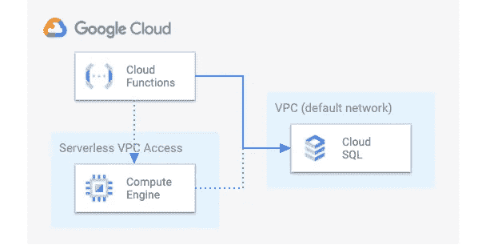

# 从运行在 GCP 无服务器环境中的服务连接到 CloudSQL(例如:云函数)

> 原文：<https://medium.com/google-cloud/connecting-to-cloudsql-from-a-service-running-in-a-gcp-serverless-environnement-ex-cloud-a0187a57c551?source=collection_archive---------2----------------------->

## TL；灾难恢复—将 SQL 代理(通过 unix 套接字)与具有私有 IP 的云 SQL 的无服务器 VPC 访问结合使用

云功能是一种可扩展的解决方案，可以将现收现付功能作为一种服务。

您可以选择函数将被实例化的区域，但是它们不会在您的网络上运行。当您需要连接到 CloudSQL 实例时，您必须回答这两个问题:

*   CloudSQL 使用的是公有 IP 还是私有 IP？*(私有 IP 更安全，不需要就不要暴露你的 DB)*
*   是否启用了 SSL？*(加密你的流量，以避免任何不可预见的窥探)*

一旦您知道了如何设置 CloudSQL 实例，您就可以轻松地从云函数的无服务器环境连接到它(参见[文档](https://cloud.google.com/sql/docs/mysql/connect-functions)和[使用云函数的云 SQL 快速入门指南](https://cloud.google.com/sql/docs/postgres/quickstart-connect-functions))。

## 公共或私有 IP

实线:公共 IP 网络路径。虚线:专用 IP 路径

您的 CloudSQL 实例有一个公共 IP，那么您可以直接从云功能访问它(防火墙规则适用)。

您的 CloudSQL 实例有一个私有 IP，那么您需要[配置无服务器 VPC 访问](https://cloud.google.com/functions/docs/networking/connecting-vpc)来将您的云功能连接到 VPC 网络。

## 启用 SSL？

当您有一个启用了 SSL 的实例时，您可以通过证书在它的 *IP:port* 上访问 CloudSQL，或者使用 SQL 代理进行安全连接。

## Python 中云函数的 CloudSQL (Postgres)连接的代码“备忘单”

如果没有 SSL，请使用 IP 和端口(如果是专用 IP，请启用无服务器 VPC 访问):

要在 web 应用程序的上下文中查看这个片段，请查看 GitHub 上的[自述文件。](https://github.com/GoogleCloudPlatform/python-docs-samples/tree/master/cloud-sql/postgres/sqlalchemy/README.md)

启用 SSL，使用 unix 套接字通过 SQL 代理(如果是私有 IP，则启用无服务器 VPC 访问)，并授予`cloudsql.instances.connect`对您的云功能的服务帐户的权限(参见[文档](https://cloud.google.com/sql/docs/postgres/sql-proxy#authentication-options))。

要在 web 应用程序的上下文中查看这个片段，请查看 GitHub 上的[自述文件](https://github.com/GoogleCloudPlatform/python-docs-samples/tree/master/cloud-sql/postgres/sqlalchemy/README.md)

从云功能的无服务器环境连接到任何 CloudSQL 实例，对您来说已经没有秘密可言。去试试吧！