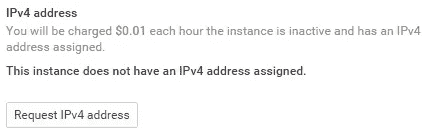
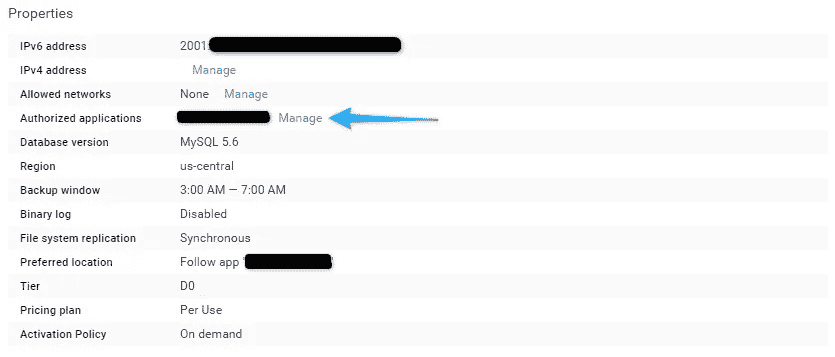
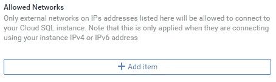
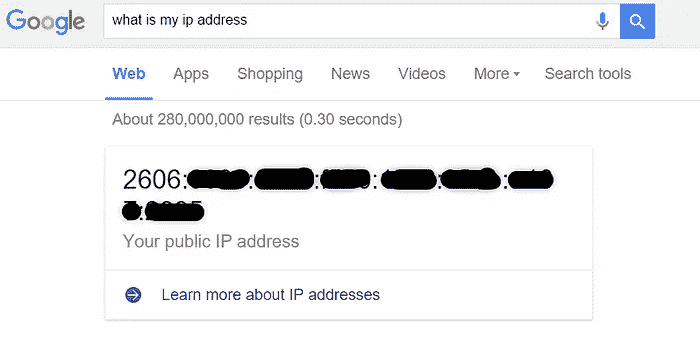
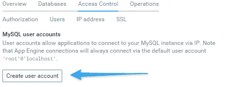
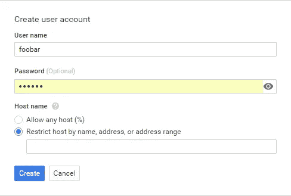
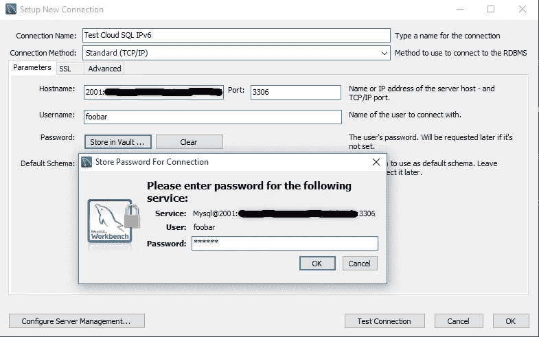
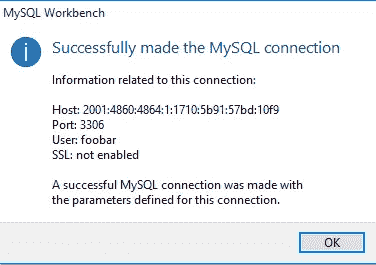

# 使用 IPV6 连接到 Google Cloud SQL

> 原文：<https://medium.com/google-cloud/connecting-to-google-cloud-sql-using-ipv6-f854f064489e?source=collection_archive---------2----------------------->

> TL；DR:创建云 SQL 实例，在“允许的网络”中添加您/您的服务器的 IP，在“访问控制>用户”中创建新的用户帐户，连接！

我最近决定步入 2012 年，不再生活在 20 世纪 80 年代，转而使用 IPv6，主要是因为 Google Cloud 会向我收取每月 7 美元的费用，来获取一个基于云 SQL 实例的 IPv4 地址。

但这并不是没有问题，所以我是这样解决的:

1.  创建您的云 SQL 实例。
2.  进入访问控制面板。

3.添加你的 IP 到允许的网络，给它一个名字，**点击保存**。*(要允许所有网络，可以':/0 '，即* [*相当于 IPv4*](http://serverfault.com/questions/698369/what-is-the-ipv6-equivalent-of-0-0-0-0-0) *中的 0 . 0 . 0 . 0/0)*

提示:要找到自己的地址，你可以谷歌'[我的 ip 地址是什么](https://www.google.com/search?q=what+is+my+ip+address)'，好人谷歌会给你看你的 IPv6 地址。

4.转到用户，添加一个新用户，给它一个用户名，密码和地址，可以访问您的网络。

这是重要的一步，因为默认的根用户将 127.0.0.1，:/1 和 localhost 作为允许的主机名，从而阻止您从外部网络访问具有所有 IPv6 优点的实例。

这就是它的全部，让我们试着连接到它，看看它是否工作。(在这个例子中，我们将使用 MySQL workbench 来测试访问，对于任何客户端，步骤应该是相同的。)

## GLHF！