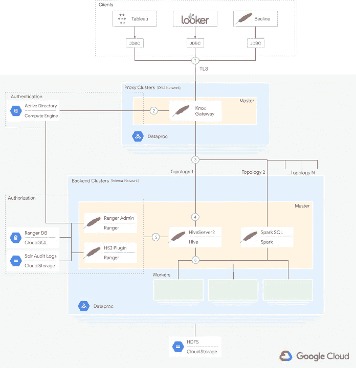

# 将您的可视化软件连接到 Google Cloud 上的 Hadoop

> 原文：<https://medium.com/google-cloud/connecting-your-visualization-software-to-hadoop-on-google-cloud-64b55f536fab?source=collection_archive---------3----------------------->

# 第 1 部分—架构

# 概观

作为一名 IT 管理员，您希望让您的数据分析师能够安全地访问熟悉的商业智能(BI)工具，以便他们能够高效地从数据中获得洞察力。您还希望利用云提供的计算能力和灵活性，并且希望最大限度地降低成本。本文展示了如何使用 Hadoop 生态系统中熟悉的开源工具来满足这些需求，比如 Apache Hive、Apache Ranger 和 Apache Knox。您将看到如何在 Dataproc 上部署这些工具，以在云中提供快速、简单且更安全的数据分析处理。

本文面向对使用 Tableau 和 Looker 等 BI 工具，同时利用熟悉的开源工具和 Google Cloud 为数据分析师设置安全数据访问感兴趣的操作员和 IT 管理员。本文没有为数据分析师提供如何使用这些 BI 工具的指导，也没有为希望与 Dataproc APIs 交互的开发人员提供指导。

本文档是帮助您构建端到端解决方案的第一部分，可帮助数据分析师使用 BI 工具安全地访问数据。它包括:

*   组件的架构
*   边界、交互和网络的高级视图，以及
*   体系结构中身份验证和授权的高级视图

[第二部分](/@david.cueva/connecting-your-visualization-software-to-hadoop-on-google-cloud-f50279d83f2)带你一步一步地在谷歌云上建立架构。

# 体系结构

这是该架构的示意图:

从高层次来看，架构是简单明了的。简而言之:

1.  客户端应用程序通过 JDBC 连接到 Dataproc 集群上的单个入口点。入口点由 Apache Knox 提供，它安装在集群主节点上。与 Apache Knox 的通信由 TLS 保护。
2.  Apache Knox 通过一个提供者将认证委托给一个系统，比如 LDAP 目录。
3.  在认证之后，Apache Knox 将用户请求路由到多个后端集群中的一个。路由和配置被定义为自定义拓扑。
4.  像 Apache Hive 这样的服务在所选的后端集群中监听请求。
5.  Apache Ranger 拦截请求，验证用户的授权，并决定是否继续处理。
6.  如果验证成功，后端服务将处理请求并返回结果。

# 成分

该架构最重要的组件包括:

*   [**data proc**](https://cloud.google.com/dataproc)**:**data proc 是谷歌云管理的 Apache Spark 和 Apache Hadoop，一种让你利用开源数据工具进行批处理、查询、流和机器学习的服务。Dataproc 是支撑本文描述的解决方案的平台。
*   [**Apache Knox**](https://knox.apache.org/)**:**Apache Knox 充当 Hadoop 集群中所有底层服务的单一 HTTP 接入点。Apache Knox 被设计成一个[反向代理](https://en.wikipedia.org/wiki/Reverse_proxy),具有用于认证、授权、审计和其他服务的可插拔提供者。客户向 Knox 发送请求。根据请求 URL 和参数，Knox 将请求路由到适当的 Hadoop 服务。Knox 是该架构的核心，因为它是透明地处理客户端请求并隐藏复杂性的入口点。
*   [**Apache Ranger**](https://ranger.apache.org/)**:**Apache Ranger 为用户在 Hadoop 服务上执行特定操作提供细粒度授权。它还实现了对用户访问和管理操作的审计。
*   [**Apache Hive**](https://hive.apache.org/)**:**Apache Hive 是一款数据仓库软件，支持使用 SQL 访问和管理驻留在分布式存储中的大型数据集。Apache Hive 解析 SQL 查询，执行语义分析，并构建由处理引擎执行的阶段的[有向非循环图](https://en.wikipedia.org/wiki/Directed_acyclic_graph) (DAG)。在本文的架构中，Hive 充当用户请求和可能的多个处理引擎之一之间的转换点。Apache Hive 在 Hadoop 生态系统中无处不在，它为熟悉标准 SQL 的从业者打开了执行数据分析的大门。
*   [**Apache Tez**](https://tez.apache.org/):Apache Tez 是负责执行 Hive 准备的 Dag 并随后返回结果的处理引擎。
*   [**Apache Spark**](https://spark.apache.org/):Apache Spark 是大规模数据处理的统一分析引擎，支持 Dag 的通用执行，可供 Hive 使用。该架构展示了 Apache Spark 的 [Spark SQL](https://spark.apache.org/docs/latest/sql-distributed-sql-engine.html) 组件，以展示本文所介绍的方法的灵活性。Spark SQL 最初是从 HiveServer2 构建的，支持在 Apache Spark 上执行 SQL 查询。但是有一点需要注意，Spark SQL 没有官方的 Ranger 插件支持，所以授权必须通过 apache Knox 中的粗粒度 ACL 来完成。

# 深潜

接下来的部分将更深入地研究参与流程的每一个组件及其交互。

## 客户端应用程序

这些应用程序包括可以向 HTTPS REST 端点发送请求的工具，但是不一定支持 [Dataproc 作业 API](https://cloud.google.com/dataproc/docs/reference/rest/v1/projects.regions.jobs/submit) 。BI 工具如 **Tableau** 和 **Looker** 有 HiveServer2 和 Spark SQL JDBC 驱动，可以通过 HTTP 发送请求。

在本文中，我们假设客户端应用程序在 Google Cloud 之外，例如，在分析师工作站、内部或另一个云上执行。因此，客户端应用程序和 Apache Knox 之间的通信必须使用 SSL/TLS 证书进行保护，该证书可以是 CA 签名的，也可以是自签名的。

## 入口点和用户身份验证

**代理集群**是一个或多个[长期存在的 Dataproc 集群](https://cloud.google.com/blog/products/data-analytics/10-tips-for-building-long-running-clusters-using-cloud-dataproc)，其主要目的是托管 Apache Knox 网关。

[Apache Knox](https://knox.apache.org/) 充当客户端请求的单一入口点。它安装在代理群集主节点上。Knox 执行 SSL 终止，委托用户认证，并将请求转发给一个后端服务。

每个后端服务都被配置成 Knox 所谓的**拓扑**。[拓扑描述符](https://knox.apache.org/books/knox-1-1-0/user-guide.html#Topology+Descriptors)定义了如何为服务授权认证、后端服务转发请求的 URI 以及简单的每服务授权访问控制列表(ACL)。

Apache Knox 支持与企业和云身份管理系统的身份认证集成。用户身份验证可使用身份验证提供程序按拓扑进行配置。默认情况下，Knox 利用[阿帕奇·希罗](https://shiro.apache.org/)来验证本地演示 [ApacheDS](https://directory.apache.org/apacheds/) LDAP 服务器，但是 Knox 也可以使用 Kerberos。在图中，您可以看到一个位于集群之外的 Google Cloud 上托管的 Active Directory 服务器。

将 Knox 连接到外部 ApacheDS 服务器或 Microsoft Active Directory (AD)等企业认证服务超出了本文的讨论范围。你可以在谷歌云的 [Apache Knox 用户指南](https://knox.apache.org/books/knox-1-4-0/user-guide.html#Authentication)和[托管活动目录](https://cloud.google.com/managed-microsoft-ad/docs)或[联合广告](https://cloud.google.com/solutions/federating-gcp-with-active-directory-introduction)文档中找到更多信息。

对于本文中的用例，只要 Apache Knox 充当代理和后端集群的单一看门人，您就不必使用 [Kerberos](https://hadoop.apache.org/docs/stable/hadoop-project-dist/hadoop-common/SecureMode.html) 。

## 处理引擎

**后端集群**是托管执行用户请求处理的服务的 Dataproc 集群。Dataproc 集群可以[自动扩展](https://cloud.google.com/dataproc/docs/concepts/configuring-clusters/autoscaling)工作人员的数量，以满足您的分析师团队的需求，不需要手动重新配置。

后端集群最好是长期集群，以便在集群被删除的情况下不间断地为数据分析师的临时请求提供服务。然而，这些集群也可以是特定于作业的，也称为[短暂的](https://cloud.google.com/blog/products/data-analytics/10-tips-for-building-long-running-clusters-using-cloud-dataproc)，如果它们只需要在短时间内为请求提供服务，或者作为一种节省成本的策略。在这种情况下，为了避免修改拓扑配置，请确保在相同的区域中以相同的名称重新创建临时集群，以便在临时集群恢复时，Knox 可以使用主节点[内部 DNS 名称](https://cloud.google.com/compute/docs/internal-dns)透明地路由请求。

[HiveServer2](https://cwiki.apache.org/confluence/display/Hive/HiveServer2+Overview) (HS2)负责服务用户对 Apache Hive 的查询。它是使用 [Apache Thrift](https://thrift.apache.org/) 框架构建的，所以它有时被称为 Hive Thrift 服务器。它可以配置为使用各种执行引擎，如 Hadoop Map Reduce 引擎、Apache Tez 和 Apache Spark。在本文中，HS2 被配置为使用 Apache Tez 引擎。

[Spark SQL](https://spark.apache.org/sql/) 是 Apache Spark 的一个模块，它包括一个 JDBC/ODBC 接口，用于在 Apache Spark 上执行 SQL 查询。在架构图中，它被显示为服务于用户查询的一种替代方式。Spark SQL 源自 HS2 的工作，也是使用 Thrift 框架构建的。它有时被称为 Spark 节俭服务器。

Tez 或 Spark 处理引擎调用[纱线资源管理器](https://hadoop.apache.org/docs/current/hadoop-yarn/hadoop-yarn-site/YARN.html)在集群工作机上执行它们的 Dag。最后，这些工作机访问数据。对于在 Dataproc 集群中存储和访问数据，使用云存储连接器，而不是 HDFS。有关优势的更多信息，请参见[连接器文档](https://cloud.google.com/dataproc/docs/concepts/connectors/cloud-storage)。

架构图展示了一个 Apache Knox 拓扑，用于将请求转发到 Apache Hive，另一个用于 Spark SQL，以及其他可以将请求转发到相同或不同后端集群中的服务的拓扑。后端服务可以处理不同的数据集。例如，一个 Hive 实例可以为一组受限用户提供对个人身份(PII)数据的访问，而另一个 Hive 实例可以为更广泛的用户提供对非 PII 数据的访问。

## 用户授权

[Apache Ranger](https://ranger.apache.org/) 可以安装在后端集群上，为 Hadoop 服务提供细粒度授权。在该体系结构中，用于 Hive 的 Ranger 插件拦截用户请求，并基于 Ranger 策略确定是否允许用户对 Hive 数据执行动作。

作为管理员，您可以使用管理员用户界面定义管理员策略。这些策略存储在外部云 SQL 数据库中。将策略外部化有两个强大的优势:它使它们在任何后端集群被删除的情况下保持不变，并且还使策略能够为所有后端集群或定制的后端集群组进行集中管理。

为了能够将 Ranger 策略分配给正确的用户身份或组，Ranger 必须配置为从 Knox 连接到的同一目录同步身份。默认情况下，Ranger 使用的用户身份来自操作系统。

Apache Ranger 还可以将其审计日志外部化到云存储中，使其持久化。这些审计可以通过利用 [Apache Solr](https://lucene.apache.org/solr/) 进行搜索。

注意，与 HiveServer2 不同，Spark SQL 没有官方的 Ranger 插件支持，因此它的授权必须由 Apache Knox 中提供的粗粒度 ACL 来管理。要使用这些 ACL，请在服务的相应拓扑描述符中添加允许使用每个特定服务(如 Spark SQL 或 Hive)的 LDAP 标识。

## 高可用性

Dataproc 提供了一个[高可用性(HA)模式](https://cloud.google.com/dataproc/docs/concepts/configuring-clusters/high-availability)。在这种模式下，有几台机器被配置为主节点，其中一台处于活动状态。这种模式允许不间断的纱线和 HDFS 操作，不管任何单节点故障/重启。

但是，如果主节点出现故障，单一入口点外部 IP 会发生变化，因此您需要重新配置 BI 工具连接。当您在 HA 模式下运行 Dataproc 时，您应该配置一个[外部 HTTP 负载平衡器](https://cloud.google.com/load-balancing/docs/https)作为入口点。负载平衡器将请求路由到一个[非托管实例组](https://cloud.google.com/compute/docs/instance-groups#unmanaged_instance_groups)，该实例组捆绑了您的集群主节点。作为一个完全成熟的负载均衡器的替代方案，你可以应用一个[循环 DNS](https://en.wikipedia.org/wiki/Round-robin_DNS) 技术，但是要考虑到使用它带来的[缺点](https://en.wikipedia.org/wiki/Round-robin_DNS#Drawbacks)。这些配置超出了这些文章的范围。

云 SQL 还提供了[高可用性模式](https://cloud.google.com/sql/docs/mysql/high-availability)，通过位于不同区域的主实例和备用实例之间的同步复制实现数据冗余。

云存储固有的可用性、可访问性、延迟、耐用性和冗余性在其[存储类别描述](https://cloud.google.com/storage/docs/storage-classes#descriptions)中有所阐述。

## 建立工作关系网

在分层网络架构中，代理集群位于外围网络(也称为[隔离区，或 DMZ](https://en.wikipedia.org/wiki/DMZ_(computing)) )中，与其他集群隔离，因为它们暴露于外部请求。防火墙规则只允许从一组受限的源 IP 地址(对应于 BI 工具)进入代理集群。

另一方面，后端集群位于受防火墙规则保护的内部网络中，只允许来自代理集群的传入流量通过。

分层网络的配置超出了这些文章的范围。实际操作说明仅使用默认网络。有关分层网络设置的更多信息，请参见 [VPC 网络安全](https://cloud.google.com/solutions/best-practices-vpc-design#network_security)的最佳实践，以及关于[如何配置多个网络接口](https://cloud.google.com/vpc/docs/multiple-interfaces-concepts)的概述和示例。

# 后续步骤

继续阅读本文的第二部分,它将带你一步一步地完成在 Google Cloud 上建立这个架构的过程。