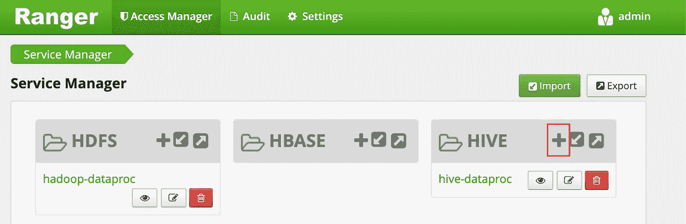
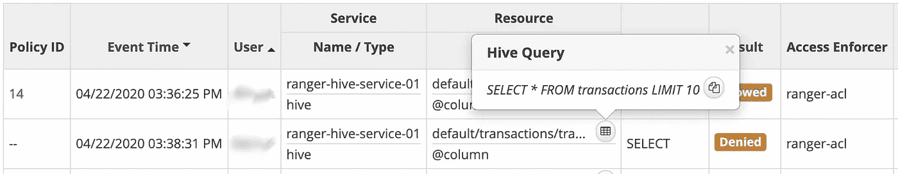
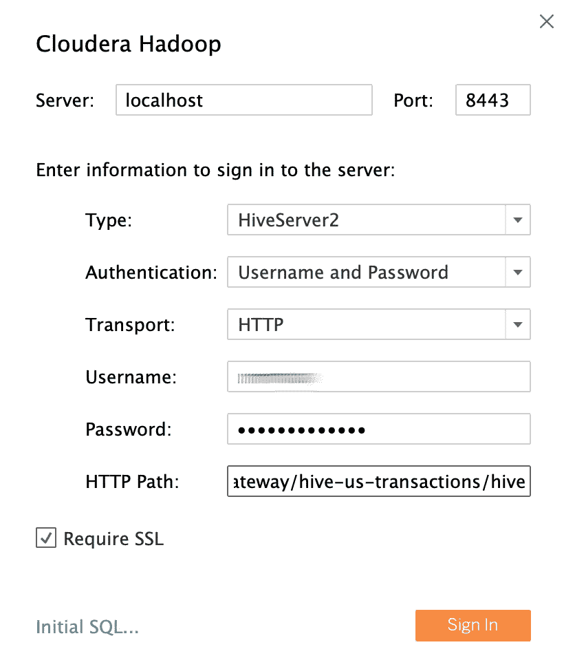
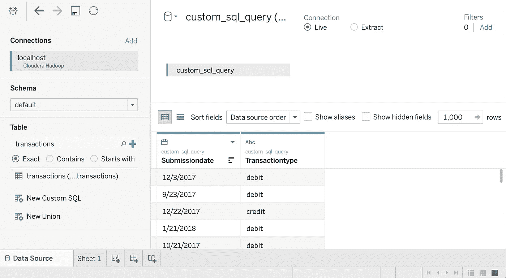

# 将您的可视化软件连接到 Google Cloud 上的 Hadoop

> 原文：<https://medium.com/google-cloud/connecting-your-visualization-software-to-hadoop-on-google-cloud-f50279d83f2?source=collection_archive---------2----------------------->

# 第 2 部分—实践


# 概观

本文档是帮助您构建端到端解决方案的第二部分，该解决方案可帮助数据分析师使用商业智能(BI)工具安全地访问数据。该解决方案使用 Hadoop 生态系统中熟悉的开源工具和 Tableau 作为 BI 工具。

在[的第一部分](/@david.cueva/connecting-your-visualization-software-to-hadoop-on-google-cloud-64b55f536fab)中，您关注于架构定义、其组件以及它们之间的交互。在本文中，您将逐步了解在 Google Cloud 上从构成端到端 Hive 拓扑的架构中设置组件的过程。

本文面向设置环境的操作员和 IT 管理员，该环境为数据分析师使用的 BI 工具提供数据和处理功能。在整篇文章中，您将使用“Mary”作为数据分析师的虚构用户身份。这个用户身份集中在由 [Apache Knox](https://knox.apache.org/) 和 [Apache Ranger](https://ranger.apache.org/) 使用的 LDAP 目录中。您也可以配置 LDAP 组，但是该任务不在本文的讨论范围之内。

# 目标

*   创建端到端设置，允许 BI 工具使用 Hadoop 环境中的数据。
*   验证和授权用户请求。
*   在 BI 工具和集群之间建立并使用安全的通信通道。

# 费用

本文使用 Google Cloud 的付费组件，包括:

*   [Dataproc](https://cloud.google.com/dataproc/pricing?hl=bg)
*   [云 SQL](https://cloud.google.com/sql/pricing)
*   [云存储](https://cloud.google.com/storage/pricing)
*   [网络出口](https://cloud.google.com/compute/network-pricing)

# 开始之前

## 设置项目

1.在云控制台的项目选择器页面上，选择或创建云项目。

```
*Note: If you don’t plan to keep the resources that you create in this procedure, create a project instead of selecting an existing project. After you finish these steps, you can delete the project, removing all resources associated with the project.*
```

[转到项目选择器页面](https://console.cloud.google.com/projectselector2/home/dashboard?_ga=2.16426303.820133692.1587377411-71235912.1585654570&_gac=1.195935838.1584696876.Cj0KCQjw09HzBRDrARIsAG60GP9u6OBk_qQ02rkzBXpwpMd6YZ30A2D4gSl2Wwte1CqPW_sY6mH_xbIaAmIgEALw_wcB)

2.确保您的 Google Cloud 项目启用了计费。[了解如何确认您的项目已启用计费。](https://cloud.google.com/billing/docs/how-to/modify-project)

3.在云控制台中，激活云外壳。

[激活云壳](https://console.cloud.google.com/?cloudshell=true&_ga=2.43377068.820133692.1587377411-71235912.1585654570&_gac=1.118947195.1584696876.Cj0KCQjw09HzBRDrARIsAG60GP9u6OBk_qQ02rkzBXpwpMd6YZ30A2D4gSl2Wwte1CqPW_sY6mH_xbIaAmIgEALw_wcB)

在云控制台的底部，一个[云 Shell](https://cloud.google.com/shell/docs/features) 会话启动并显示一个命令行提示符。Cloud Shell 是一个 Shell 环境，已经安装了 Cloud SDK，包括`[gcloud](https://cloud.google.com/sdk/gcloud)`命令行工具，并且已经为您的当前项目设置了值。会话初始化可能需要几秒钟时间。

4.启用 Dataproc、云 SQL 和[云密钥管理服务(KMS)](https://cloud.google.com/kms) 的云 API:

5.在 Cloud Shell 中，使用 ID your project 以及 Dataproc 集群所在的区域和分区设置环境变量:

随意选择不同的地区和区域，但是在本文的整个脚本中保持不变。

## 设置服务帐户

1.在 Cloud Shell 中，创建一个[服务帐户](https://docs.google.com/document/d/1rYxu2xBZsDgNo_-Ex4jb_3YxwL6cWab8QzFiY33_qWA/edit#)，该帐户将由涉及可视化安全性的不同产品使用。

2.向服务帐户添加以下角色:

*   [Dataproc Worker](https://cloud.google.com/dataproc/docs/concepts/iam/iam#roles) :创建和管理 Dataproc 集群。
*   [云 SQL 编辑器](https://cloud.google.com/sql/docs/mysql/project-access-control#roles):供 Ranger 使用[云 SQL 代理](https://cloud.google.com/sql/docs/mysql/sql-proxy)连接其数据库。
*   [云 KMS 密钥解密器](https://cloud.google.com/kms/docs/reference/permissions-and-roles#predefined_roles):解密之前用 KMS 加密的密码。

# 创建后端集群

## 创建 Ranger 数据库实例

1.运行以下命令创建一个 MySQL 实例来存储 Apache Ranger 策略。该命令创建一个名为`cloudsql-mysql`的实例，其[机器类型](https://cloud.google.com/sql/docs/mysql/instance-settings#tier-values)类型`db-n1-standard-1`位于由`${REGION}` 变量指定的[区域](https://cloud.google.com/sql/docs/mysql/instance-settings#region-values)中。更多信息参见[云 SQL 文档](https://cloud.google.com/sql/docs/mysql/create-instance#create-2nd-gen)。

2.为从任何主机(`‘root‘@’%’`)连接的用户`root`设置实例密码。您可以使用自己的密码或下面提供的示例密码。确保至少使用八个字符，包括至少一个字母和一个数字。

## 加密密码

在本节中，您将创建一个[密钥](https://cloud.google.com/kms/docs/object-hierarchy#key)来加密 Ranger 和 MySQL 的密码。为了防止泄漏，密钥存在于[密钥管理服务(KMS)](https://cloud.google.com/kms/docs) 中，您不能查看、提取或导出密钥位本身。

您使用密钥加密密码，并将其写入文件。然后，您将这些文件上传到一个云存储桶中，以便代表集群的服务帐户可以访问它们。

服务帐户可以解密这些文件，因为它有`cloudkms.cryptoKeyDecrypter` 角色，可以访问文件和密钥。在不太可能的情况下，文件被泄漏，攻击者没有角色和密钥将无法解密它。

作为额外的安全措施，你为每个服务创建单独的密码文件，以最小化爆炸半径，以防密码本身被泄露。

有关密钥管理的更多信息，请参见 [KMS 文档](https://cloud.google.com/kms/docs/concepts)。

1.在 Cloud Shell 中，创建一个[密钥管理服务(KMS)密钥环](https://cloud.google.com/kms/docs/object-hierarchy#key_ring)来保存您的密钥:

2.创建一个[密钥管理服务(KMS)加密密钥](https://cloud.google.com/kms/docs/object-hierarchy#key)来加密您的密码:

3.使用密钥加密您的 Ranger 管理员用户的密码。您可以使用自己的密码或下面提供的示例密码。确保至少使用八个字符，包括至少一个字母和一个数字。

4.使用密钥加密您的 Ranger 数据库管理员用户的密码:

5.使用以下密钥加密您的 MySQL root 密码:

6.[创建云存储桶](https://cloud.google.com/storage/docs/creating-buckets#storage-create-bucket-gsutil)存储加密密码文件:

7.将加密的密码文件上传到云存储桶。

## 创建集群

在本节中，您将创建一个支持 Ranger 的后端集群。有关 Dataproc 中 Ranger 可选组件的更多信息，请参见 [Dataproc Ranger 组件文档页](https://cloud.google.com/dataproc/docs/concepts/components/ranger)。

1.在 Cloud Shell 中，[创建一个云存储桶](https://cloud.google.com/storage/docs/creating-buckets#storage-create-bucket-gsutil)来存储 Apache Solr 审计日志:

2.导出创建集群所需的所有变量。为了方便起见，这里重复了之前设置的一些变量，因此您可以根据需要修改它们。

新的变量是:

*   后端集群的名称
*   加密密钥的 URI，以便服务帐户可以解密密码
*   包含加密密码的文件的 URI

如果您使用了不同的密钥环、密钥或文件名，请在相应的变量中替换它们。

3.运行以下命令创建后端 Dataproc 集群:

最后三行是在 HTTP 模式下配置 HiveServer2 的 Hive 属性，这样 Apache Knox 就可以通过 HTTP 调用 Apache Hive。

以下是命令中出现的其他参数:

*   启用 Apache Ranger 及其 Solr 依赖项
*   `— enable-component-gateway`(可选)使 [Dataproc 组件网关](https://cloud.google.com/dataproc/docs/concepts/accessing/dataproc-gateways)能够使 Ranger 和其他 Hadoop 用户界面直接从云控制台中的集群页面可用，而无需通过 SSH 隧道连接到后端主节点。
*   `— scopes=default,sql-admin`授权 Apache Ranger 访问其云 SQL 数据库。

可以包含其他参数和属性来创建外部配置单元 metastore，该配置单元 metastore 在任何给定集群的生命周期之后仍然存在，并且可以跨多个集群使用。更多信息请参见[在云上使用 Apache Hive data proc 文档](https://cloud.google.com/solutions/using-apache-hive-on-cloud-dataproc)。

考虑到`gcloud dataproc jobs submit hive` [命令](https://cloud.google.com/sdk/gcloud/reference/dataproc/jobs/submit/hive)使用 Hive 二进制传输，与 HTTP 模式下配置的 HiveServer2 不兼容。因此，您必须直接在 Beeline 上运行该文档中的表创建示例。

## 创建一个样本配置单元表

1.在 Cloud Shell 中，创建一个云存储桶来存储一个样本 [Apache Parquet](https://parquet.apache.org/) 文件:

2.将公开可用的拼花地板样本文件复制到您的存储桶中:

3.使用 SSH 连接到您在上一节中创建的后端集群的主节点。

您的集群主节点的名称是集群的名称后跟 `-m`。对于高可用性集群，该名称有一个附加后缀。

如果这是第一次从 Cloud Shell 连接到您的主节点，将提示您生成 SSH 密钥。

或者，您可以使用 SSH 从云控制台的**data proc/Cluster Details/VM Instances 下连接到您的名称节点。**

4.进入 SSH 命令提示符后，使用预安装在主节点上的 [Apache Beeline](https://cwiki.apache.org/confluence/display/Hive/HiveServer2+Clients#HiveServer2Clients-Beeline%E2%80%93CommandLineShell) 连接到本地 HiveServer2。

这个命令将启动 Beeline CLI，并在一个环境变量中传递您的 Google Cloud 项目的名称。

请注意，Hive 不执行任何用户身份验证，但是它需要一个用户身份来执行大多数任务。这里的`admin`用户是配置在 Hive 中的默认用户。来自 BI 工具的请求的用户认证由本文后面用 Apache Knox 配置的身份提供者处理。

5.在 Beeline CLI 中，使用之前在配置单元存储桶中复制的拼花文件创建一个表。

6.验证是否正确创建了该表:

7.退出直线 CLI:

8.记下后端主机的内部 DNS 名称。在下一节中，您将使用这个名称作为`<backend-master-internal-dns-name>`来配置 Knox 拓扑，然后在 Ranger 中配置服务。

9.退出 SSH 命令行:

# 创建代理群集

在本节中，您将使用 [Apache Knox 初始化操作](https://github.com/GoogleCloudDataproc/initialization-actions/tree/master/knox)创建代理集群。

## 创建拓扑

1.在 Cloud Shell 中，克隆 data proc[initial ization-actions GitHub 仓库](https://github.com/GoogleCloudDataproc/initialization-actions)。

2.为后端群集创建拓扑:

Apache Knox 将使用文件名作为拓扑的 URL 路径。这里，您更改了名称来表示名为`hive-us-transactions`的拓扑，以访问我们在上一节中加载到 Hive 的虚构事务的数据。

3.编辑拓扑文件:

花点时间观察一下[拓扑描述符](https://knox.apache.org/books/knox-1-1-0/user-guide.html#Topology+Descriptors)文件。这个文件定义了一个指向一个或多个后端服务的拓扑。使用示例值配置了两个服务: [WebHDFS](https://hadoop.apache.org/docs/r1.0.4/webhdfs.html) 和 HIVE。该文件还为该拓扑和授权 ACL 中的服务定义了身份验证提供者。

4.Apache Knox 通过 ACL 提供服务级别的粗略授权。添加 data analyst 示例 LDAP 用户身份“`mary`”，以便她可以通过 Knox 访问 Hive 后端服务。

5.将配置单元 url 更改为指向后端群集配置单元服务。您可以在文件的最底部找到配置单元服务定义，就在 WebHDFS 服务的下面。

用您在上一节中获得的后端集群的内部 DNS 名称替换`<backend-master-internal-dns-name>`占位符。

6.保存文件并[关闭编辑器](https://stackoverflow.blog/2017/05/23/stack-overflow-helping-one-million-developers-exit-vim/)。

此时，您可以通过重复本节中的步骤来创建额外的拓扑，并为每个拓扑创建一个独立的 XML 描述符。

在随后的部分中，您将这些文件复制到云存储桶中。要在创建代理集群后创建新的拓扑或更改它们，请修改文件并再次将它们上传到 bucket。初始化操作创建一个 cron 作业，该作业定期将 bucket 中的更改复制到代理集群。

## 配置 SSL/TLS 证书

当客户端与 Apache Knox 通信时，它们将使用 SSL/TLS 证书。初始化操作可以生成自签名证书，或者您可以提供 CA 签名的证书。

要生成自签名证书，请遵循以下说明:

1.在云 Shell 中编辑 Apache Knox 常规配置文件:

2.用主节点的外部 DNS 名称替换`HOSTNAME`，作为`certificate_hostname`属性的值。出于演示目的，使用`localhost`。这个值需要您在本地机器和代理集群之间创建一个 SSH 隧道，这将在本文后面介绍。

注意，该文件还包含用于加密 BI 工具将用来与代理集群通信的证书的`master_key`。默认情况下，这个键是单词`secret`。

3.保存文件并关闭编辑器。

另一方面，如果您提供自己的证书，您可以在属性`custom_cert_name`中指定它。

## 启动代理集群

1.在 Cloud Shell 中，创建一个云存储桶，以将上一节中的配置提供给 Knox 初始化操作:

2.将 Knox 初始化操作文件夹中的所有文件复制到桶中:

3.导出创建集群所需的所有变量。为了方便起见，这里重复了之前设置的一些变量，以便您可以根据需要修改它们。

4.创建代理群集:

## 通过代理验证连接

1.创建代理集群后，使用 SSH 从云外壳连接到其主节点:

2.从代理群集主节点 SSH 命令提示符运行查询:

让我们分析一下这个命令:

*   `beeline`命令使用`localhost`而不是 DNS 内部名称，因为您在配置 Knox 时生成的证书将`localhost`指定为主机名。如果您使用自己的 DNS 名称或证书，请使用相应的主机名。
*   端口是`8443`，对应 Apache Knox 默认的 SSL 端口。
*   下一行启用 SSL，并为客户端应用程序(如 Beeline)使用的 SSL 信任存储提供路径和密码。
*   `transportMode`线应该看起来很熟悉。它指示请求应该通过 HTTP 发送，并为 HiveServer2 服务提供路径。请注意，路径由关键字`gateway`组成，后面是您在上一节中定义的拓扑名称，后面是在所述拓扑中配置的服务名称，在本例中是`hive`。
*   使用`-e`参数，您可以提供在 Hive 上运行的查询。如果省略，您将在 Beeline CLI 中打开一个交互式会话。
*   使用`-n`参数，您可以提供一个用户身份和密码。在这种情况下，您使用的是默认的 Hive `admin`用户。在接下来的部分中，您将创建一个分析师用户身份，并为此用户设置凭据和授权策略。

## 将用户添加到身份验证存储

默认情况下，Knox 包括一个基于[阿帕奇·希罗](https://shiro.apache.org/)的认证提供者，该认证提供者配置有针对 [ApacheDS](https://directory.apache.org/apacheds/) LDAP 存储的基本认证。在本节中，您将向此身份验证存储添加一个示例 data analyst 用户身份“`mary`”。

1.  在代理主节点 SSH 命令提示符下，安装 LDAP 实用程序:

2.为新用户“`mary`”创建一个 LDAP 数据交换格式(LDIF)文件:

3.将用户 ID 添加到 LDAP 目录:

`-D`参数指定访问目录时要绑定的可分辨名称(DN ),它必须是目录中已经存在的用户身份，在本例中是用户`admin`。

4.验证是否添加了新用户:

5.记下代理主机的内部 DNS 名称。在下一节中，您将使用这个名称作为`<proxy-master-internal-dns-name>`来配置 LDAP 同步。

6.退出 SSH 命令行

# 设置授权

## 将用户身份同步到 Ranger

为了确保 Ranger 策略适用于 Knox 使用的相同用户身份，配置 [Ranger UserSync 守护进程](https://docs.cloudera.com/HDPDocuments/HDP3/HDP-3.1.5/configuring-ranger-authe-with-unix-ldap-ad/content/ranger_ad_integration_ranger_usersync.html)来同步 Knox 正在使用的相同目录中的身份。

在这个例子中，您连接到 Apache Knox 默认可用的本地 LDAP，但是在生产环境中，您应该设置一个外部身份目录。您可以在谷歌云的 [Apache Knox 用户指南](https://knox.apache.org/books/knox-1-4-0/user-guide.html#Authentication)和[云身份](https://cloud.google.com/identity)、[托管活动目录](https://cloud.google.com/managed-microsoft-ad/docs)和[联合 AD](https://cloud.google.com/solutions/federating-gcp-with-active-directory-introduction) 文档中找到更多信息。

1.使用 SSH 连接到之前创建的后端集群的主节点

2.编辑用户同步配置文件:

3.设置以下 LDAP 属性的值。确保您正在修改的是`user`属性，而不是`group`属性，它们具有相似的名称。

用代理服务器的内部 DNS 名称替换`<proxy-master-internal-dns-name>`占位符，这是在上一节中获得的。

请注意，这是同步用户和组的完整 LDAP 配置的子集。更多信息见本文件。

4.保存文件并关闭编辑器。

5.重新启动 Ranger 用户同步守护程序:

您可以在`/var/log/ranger-usersync/`下的日志文件中验证用户身份，包括数据分析师 Mary 的身份是否正确同步

## 创建管理员策略

**配置 ranger 服务**

1.在主节点 SSH 命令提示符下，编辑 Ranger 配置单元配置:

2.编辑`ranger.plugin.hive.service.name`属性的`<value>`:

3.保存文件并关闭编辑器。

4.重新启动 HiveServer2 管理服务。您已经准备好创建 Ranger 策略。

**在管理员管理界面设置服务**

1.在浏览器中，导航到云控制台中的 [Dataproc 页面](https://console.cloud.google.com/dataproc)。

单击后端集群名称，然后单击 **Web 界面**。

因为您使用[组件网关](https://cloud.google.com/dataproc/docs/concepts/accessing/dataproc-gateways)创建了集群，所以您应该会看到集群中安装的 Hadoop 组件的列表。

点击 **Ranger** 链接，打开 Ranger UI。

如果您不想使用组件网关创建集群，那么您可以创建一个从您的工作站到后端主节点的 SSH 隧道。Ranger UI 在[端口 6080](https://docs.cloudera.com/HDPDocuments/HDP3/HDP-3.1.5/administration/content/ranger-ports.html) 上可用。您需要创建一个防火墙规则来打开该端口的入口。

2.使用用户`admin`和您之前定义的 Ranger 管理员密码登录 Ranger。Ranger UI 显示服务管理器屏幕，其中包含服务列表。



3.单击配置单元组中的加号创建新的配置单元服务

4.用以下值填写表单:

*   服务名称:`ranger-hive-service-01`。这是您先前在`ranger-hive-security.xml`配置文件中定义的名称。
*   用户名:`admin`
*   密码:`admin-password`
*   jdbc.driverClassName:保留默认值`org.apache.hive.jdbc.HiveDriver`
*   jdbc.url: `jdbc:hive2://<backend-master-internal-dns-name>:10000/;transportMode=http;httpPath=cliservice`

将`<backend-master-internal-dns-name>`占位符替换为您在上一节中获得的名称。

5.点击**添加**按钮。

记住[每个 Ranger 插件安装只支持一个 Hive 服务](https://stackoverflow.com/questions/33270255/apache-ranger-multiple-policy-repo-for-hive-plugin)。配置附加 Hive 服务的一个简单方法是启动附加后端集群，每个集群都有自己的 Ranger 插件。这些集群可以共享同一个 Ranger DB，因此无论何时从任何集群访问 Ranger Admin UI，您都可以获得所有服务的统一视图。

**设置游侠策略**

该策略允许 sample analyst LDAP 用户"`mary`"访问 Hive 表的特定列:

1.返回服务管理器屏幕，单击您刚刚创建的服务的名称。

Ranger Admin 显示策略屏幕。

2.点击**添加新策略**按钮。

根据该策略，您将授予 Mary 仅查看表事务中的列`submissionDate`和`transactionType`的权限。

3.用以下值填写表单:

*   策略名称:任何名称，例如`allow-tx-columns`
*   数据库:`default`
*   表:`transactions`
*   蜂巢柱:`submissionDate, transactionType`

允许条件:

*   选择用户:`mary`
*   权限:`select`

4.点击屏幕底部的**添加**

**用直线测试策略**

1.回到主节点 SSH 命令提示符，使用用户“`mary`”输入直线 CLI。请注意，密码不是强制的。

2.运行以下查询以验证它是否被 Ranger 阻止。(包括`transactionAmount`列，Mary 不允许选择):

您应该得到一个**权限被拒绝**错误。

3.运行以下查询以验证 Ranger 是否允许:

4.退出直线 CLI。

5.退出 SSH 命令行。

6.回到 Ranger UI，点击顶部的**审计**选项卡。你应该看到**被拒绝**和**被允许**的事件。您可以根据之前定义的服务名过滤事件，例如:`ranger-hive-service-01`。



# 从 BI 工具连接

本文的最后一步是从 BI 工具(如 Tableau 和 Looker)中查询 Hive 数据。我们使用 Tableau 作为 BI 工具的示例，所以我们假设您的工作站上运行着 Tableau Desktop。

## 创建防火墙规则

1.  记下你的[公共 IP 地址](https://www.google.com/search?q=what+is+my+ip+address)。
2.  在 Cloud Shell 中，创建一个防火墙规则，打开 TCP 端口`8443`以便从您的工作站进入。

用您的公共 IP 替换`<your-public-ip>`占位符。

3.将防火墙规则中的网络标记应用到代理群集主节点:

4.记下代理群集主节点的外部 IP 地址；您将在接下来的步骤中使用它:

## 创建 SSH 隧道

只有当您使用对`localhost`有效的自签名证书时，才需要此步骤。如果您使用自己的证书或主节点有自己的外部 DNS 名称，您可以跳过这一步。

1.在 Cloud Shell 中，生成创建隧道的命令:

2.在您的工作站上安装 [Google Cloud SDK](https://cloud.google.com/sdk/docs) 。

3.运行`gcloud init`来验证您的用户帐户并授予访问权限。

4.在您的工作站中打开一个终端。

5.创建到转发端口`8443`的 SSH 隧道。

6.复制第一步中生成的命令，并将其粘贴到工作站终端。运行命令。

7.让终端保持打开状态，以便隧道保持活动状态。

## 连接到配置单元

1.在您的工作站上安装 [Hive ODBC 驱动程序](https://www.cloudera.com/downloads/connectors/hive/odbc/2-6-4.html)。

2.打开 Tableau Desktop，如果它已打开，请重新启动它。

3.在主屏幕上的**连接/至服务器**下，选择**更多…**

4.搜索并选择 **Cloudera Hadoop** 。

5.按如下方式填写字段:

*   服务器:`localhost`如果你创建了一个隧道，或者你的主节点外部 DNS 名称如果没有。
*   端口:`8443`
*   类型:`HiveServer2`
*   身份验证:用户名和密码
*   用户名:`mary`
*   密码:`mary-password`
*   HTTP 路径:`gateway/hive-us-transactions/hive`
*   需要 SSL: `yes`

请注意，您使用示例 data analyst LDAP 用户`mary`作为用户身份。

6.点击**签到。**



## 查询配置单元数据

1.在**数据源**界面，点击**选择方案** a 并搜索`default`。

2.双击`default`模式名称。

**工作台**面板加载。

3.在**表**面板中，双击**新建自定义 SQL** 。

**编辑自定义 SQL** 窗口打开。

4.输入以下查询:

5.点击**确定。**

查询的元数据是从配置单元中检索的。

6.点击**立即更新**按钮。

Tableau 从 Hive 中检索数据。



7.现在尝试从`transactions`表中选择所有列。在**表**面板中，再次双击**新建自定义 SQL** 。**编辑自定义 SQL** 窗口打开。

8.输入以下查询:

9.点击**确定**。您会得到一条错误消息:

`Permission denied: user [mary] does not have [SELECT] privilege on [default/transactions/*]`。

这是意料之中的，因为 Mary 没有被 Ranger 授权读取`transactionAmount`列。这样，您可以限制 Tableau 用户可以访问的数据。

为了能够看到所有的列，对用户重复这些步骤`admin`。

# 结论

在这些文章中，您已经看到了如何从 BI 工具访问 Hive 数据。您已经将 Tableau 配置为通过安全通道与运行在 Dataproc 集群上的 Apache Knox 进行通信，并且已经使用 LDAP 目录对用户进行了身份验证。最后，您已经设置了一个 Hive 服务，它可以在 Dataproc 后端集群中处理请求，通过 Apache Ranger 中定义的授权策略进一步保护数据。