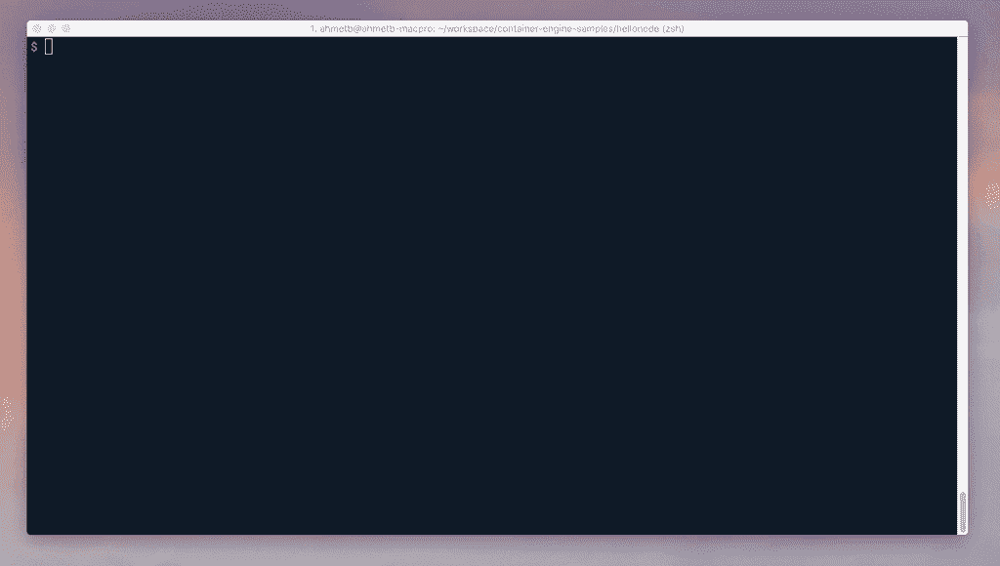

# Google Cloud Build 最酷的特性

> 原文：<https://medium.com/google-cloud/container-builder-797c0dc2c991?source=collection_archive---------1----------------------->


[Google Cloud Build](https://cloud.google.com/container-builder/) (又名容器构建器)是上个月[发布的](https://cloudplatform.googleblog.com/2017/03/Google-Cloud-Container-Builder-a-fast-and-flexible-way-to-package-your-software.html)，从那以后我一直在使用它。它有几个我非常喜欢但没有被强调的特性。黑客新闻出来的时候我在上面写了一篇[证词](https://news.ycombinator.com/item?id=13807495)，所以我打算在这里详细说明一下。以下是一些很酷的功能:

如果您将应用程序作为容器分发，则无需托管 Jenkins 实例或第三方 CI 服务来构建/推送您的映像。Cloud Container Builder 不仅可以做到这一点，它还可以运行任意构建步骤来部署您的应用程序。

> *免责声明:我为 Google Cloud 工作，但不在容器构建器上工作。*

# Dockerfile 文件支持

如果您的源存储库或目录有一个`Dockerfile` [(？)](https://docs.docker.com/engine/reference/builder/)，容器建造者可以建造它——句号。您有两种选择来使用[这个特性](https://cloud.google.com/container-builder/docs/docker-build):要么转到 Google Cloud Console 并使用 UI 来导入您的存储库，要么只使用`gcloud` [(？)](https://cloud.google.com/sdk/gcloud/)命令行工具。

因此，您最喜欢的命令不是:

```
docker build -t gcr.io/project-id/app:v1 .
```

您可以运行:

```
gcloud container builds submit -t gcr.io/project-id/app:v1 .
```

`gcloud` **通过执行以下步骤来打包您的源目录并在云**上构建:

*   将源目录压缩为 tarball ( `.tgz`)
*   将源包上传到 Google 云存储
*   在云容器构建器上启动构建请求
*   将构建日志流式传输到用户控制台
*   标记构建的图像
*   将图像推送到 [gcr.io](https://cloud.google.com/container-registry/) 注册表

如果你不明白我刚才说的话，这意味着你的机器上不需要 Docker 来构建和推送 Docker 映像。它看起来是这样的:



这条命令在云上构建您的源代码，打包并存储它

# GitHub/BitBucket 集成

我把我所有的东西都放在 GitHub 私人仓库里，包括我的博客。我花了不到 60 秒的时间为我的 GitHub 库建立了一个版本。谷歌云控制台集成了 GitHub，因此导入您的回购文件非常简单。你只需授权应用程序访问你的回购，然后选择你的回购建立。

如果你的回购有一个`Dockerfile`，你不需要写一个`.travis.yml`或者`circle.yml`之类的东西。

# 多步可定制构建

单一的`Dockerfile`并不总能给你想要的。有时你需要执行多个步骤来建立你的形象；我怀疑这就是为什么很多人仍然使用詹金斯。

Cloud Builder 很好地解决了这个问题，它提供了一个定制构建步骤和环境的选项。

以下是你需要知道的:

1.  您可以用一个`cloudbuild.{yaml,json}`文件[(？)](https://cloud.google.com/container-builder/docs/api/custom-build-steps)
2.  每个构建步骤都在一个容器中运行
3.  你可以自带容器图片(或者使用谷歌提供的图片)
4.  您的存储库安装在`/workspace`
5.  从一个构建步骤到另一个构建步骤，`/workspace`的内容被保留。

这就像 **Jenkins 构建管道**一样，你的工件从管道的一个步骤到另一个步骤被隐藏/不被隐藏。

为了更好地说明这一点，假设您有一个示例应用程序:

*   **第一步:** `(image=golang)`编译你的 Go 应用程序
*   **步骤 2:** `(image=binary-signing)`签署您的应用程序二进制文件
*   第三步: `(image=docker)`将你的二进制文件打包成 Docker 镜像

然后，Container Builder 会自动将标记的图像推送到 GCR。你可以在[云构建者](https://github.com/GoogleCloudPlatform/cloud-builders)库中看到各种各样的例子。

但是在我结束这一部分之前，还有两件很酷的事情:

*   **你不需要用 Cloud Builder 来构建容器:**例如，我[写了一篇教程](https://cloud.google.com/community/tutorials/automated-publishing-container-builder)，讲述我如何使用容器构建器在谷歌云存储上发布这篇博客。我没有为此构建任何容器。我的定制构建步骤只是运行`gsutil rsync`来上传我的博客。一旦你意识到这一点，你基本上可以用它来做任何事情，比如运行测试，或者进行部署。
*   **您可以并行化构建步骤:**您在`cloudbuild.{yaml/json}`文件中列出的任何步骤都可以并行执行。我有这个 repo，我并行编译和打包了 3 个不同的 Go 二进制文件，节省了很多构建时间。
*   **可定制的构建通知:**参见[本教程](https://cloud.google.com/container-builder/docs/tutorials/configuring-third-party-notifications)了解如何使用 Google Cloud 函数和 Pub/Sub 向 Slack 通道交付构建状态。

# 集装箱建造者是 faaaast！

你需要明白谷歌拥有大量的计算和网络能力，并且[不介意](https://thehftguy.com/2016/11/18/google-cloud-is-50-cheaper-than-aws/)把这些分配给像容器构建器这样的东西。在 Container Builder 上运行构建的机器在 CPU、I/O 和网络方面真的很快。

正如你可以在我的 [CircleCI vs Container Builder 证词](https://news.ycombinator.com/item?id=13807495)中读到的，当我转到 Container Builder 时，我看到我的 3m30s 构建下降到 1m10s(也就是说**快了 3 倍**)。

以下是 Google 容器构建器更快的一些原因:

*   你的源代码已经被镜像到谷歌的云源代码库中，所以相比之下，获取源代码会更快。
*   Google 分配了大量的网络带宽来构建机器，因此你的基本 docker 映像被快速提取(除非它已经被缓存，因为像`golang`、`python`这样的流行基本映像已经被缓存在构建机器上了！)
*   谷歌分配了大量的计算能力来构建机器，因此编译速度比第三方 CI 服务的免费层(甚至是付费订阅)更快。
*   容器图像在谷歌容器注册处被更快地推回，因为谷歌内部的流量相对于外部-内部网络来说真的很快。

也就是说，目前你可以免费获得 2 小时的构建时间，额外的构建时间[需要付费](https://cloud.google.com/container-builder/pricing)。我希望大多数小项目对免费层感到满意。

容器构建器的简单构建模式给了我很大的启发。如果你只是用 Dockerfiles 构建，它可以开箱即用。然而，如果你想定制，它也提供了一个干净的模块化方法。我已经用它来构建和部署我的应用程序并发布我的博客。

当然[可以查看云容器构建器](https://cloud.google.com/container-builder/)和[阅读文档](https://cloud.google.com/container-builder/docs/)，如果你有兴趣的话。

如果你想了解更多关于 Kubernetes，Google Container Engine 和其他很酷的东西，请关注我。本文原载于[*ahmetalpbalkan.com*](https://ahmetalpbalkan.com/blog/container-builder/)*。*