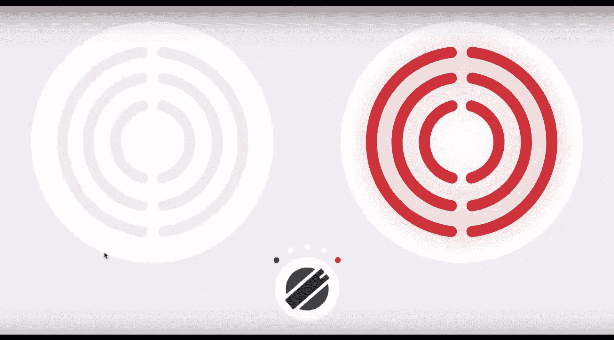
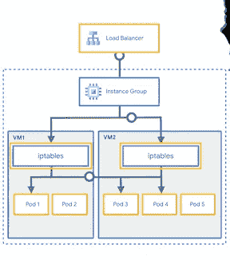
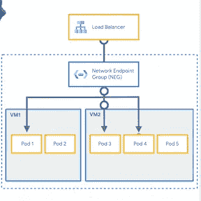
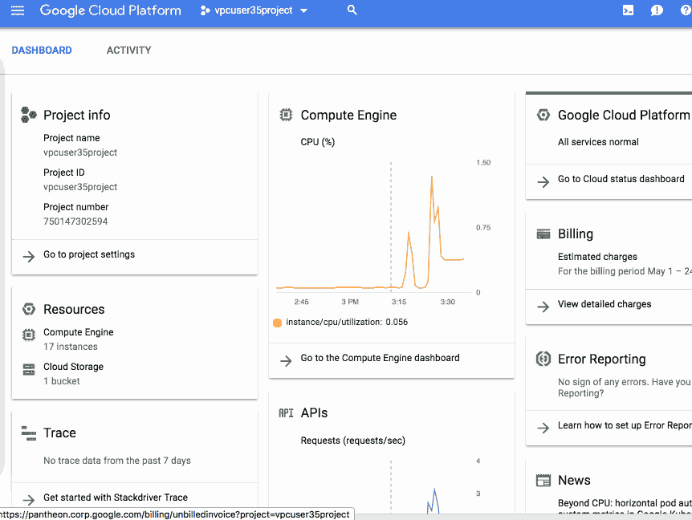

# Google Kubernetes 引擎上的容器负载平衡(GKE)

> 原文：<https://medium.com/google-cloud/container-load-balancing-on-google-kubernetes-engine-gke-4cbfaa80a6f6?source=collection_archive---------0----------------------->

## 在云中烹饪

作者:[普里扬卡·韦尔加迪亚](https://twitter.com/pvergadia)，[王从希](https://twitter.com/swongful)

# 介绍

“[在云中烹饪](/@pvergadia/get-cooking-in-cloud-an-introduction-5b3b90de534e)”是一个博客和[视频](https://www.youtube.com/playlist?list=PLIivdWyY5sqIOyeovvRapCjXCZykZMLAe)系列，帮助企业和开发者在谷歌云上构建商业解决方案。在这个系列中，我们计划确定开发人员希望在 Google cloud 上构建的特定主题。一旦确定，我们就以此为主题制作一个迷你系列。

在这个迷你系列中，我们将讨论 Google 云负载平衡。

1.  [选择正确的负载平衡器](/google-cloud/choosing-the-right-load-balancer-9ec909148a85)
2.  [通过全局负载平衡优化应用容量](/google-cloud/application-capacity-optimizations-with-global-load-balancing-e0aa079d2c25)
3.  [负载平衡的容量管理](/google-cloud/capacity-management-with-load-balancing-32bd22a716a7)
4.  GKE 网络端点组的负载平衡(本文)

在本文中，我们将介绍负载平衡如何与作为后端运行的 Google Kubernetes 集群一起工作。

# 看看这个视频

负载平衡 Google Kubernetes 容器集群

# 你会学到什么

*   为什么我们需要容器负载平衡？
*   什么是网络端点组(NEG)？
*   如何在 GKE 设置容器本地负载平衡
*   容器本地负载平衡的优势

# 回顾

在这个系列中，我们将与 **Beyond Treat，**一个素食狗零食的一站式商店合作！他们的在线业务仍在蓬勃发展。虽然他们升级到使用谷歌的全球负载均衡器，但他们也决定将他们的 web 后端迁移到一个容器化的微服务环境中。

# 负载平衡的历史和一些挑战

负载平衡器最初是为了支持虚拟机(VM)的资源分配而构建的，这有助于提高工作负载的可用性。

> 当容器和容器编排器开始起飞时，用户调整这些以 VM 为中心的负载平衡器供他们使用，即使性能不是最理想的。

传统上，以 Kubernetes 集群为目标的 HTTP(S)负载平衡器实际上会以它的**节点**为目标，因为它们没有办法识别每个 pod。由于无法将一组 pod 定义为后端，负载平衡器使用实例组将虚拟机分组为后端。GKE 的入口支持使用这些实例组，使用 HTTP(S)负载平衡器对集群中的**节点**执行负载平衡。

iptables 将流量路由到 pod

在节点上编程的 Iptables 规则将请求路由到作为负载平衡应用程序后端的 pod。节点的负载平衡是唯一的选择，因为负载平衡器不会将 pod 或 containers 识别为后端，从而导致负载不平衡和次优的数据路径，并在节点之间增加了不必要的跳跃。

# 网络端点组(NEG) —容器本地负载平衡

Google 推出了一个[网络端点组(NEG)](https://cloud.google.com/load-balancing/docs/negs) 抽象层，支持容器本地负载平衡。这意味着负载平衡器可以看到 Kubernetes 集群的 pods，因为 NEGs 与运行在 GCP 上的 Kubernetes Ingress 控制器集成在一起。

> 借助网络端点组(NEG ),负载平衡器可以了解 Kubernetes 集群的 pods。

网络端点组(NEG)如何帮助将流量路由到 pod

在 Beyond Treat 的情况下，他们有一个多层电子商务部署，并希望使用 GKE 向互联网公开一个服务。有了 NEGs，他们现在可以配置 HTTP(S)负载平衡器，允许他们配置基于路径或基于主机的路由到他们的后端 pod。

# **在 GKE 设置容器本地负载平衡**

创建一个 VPC 本地的 GKE 集群。默认情况下，Kubernetes 使用静态路由进行 pod 联网，这需要 Kubernetes 控制平面来维护这些到每个节点的路由。但是，这是以扩展成本为代价的。

在 GKE，您可以选择在 VPC 本地模式下创建集群，这提供了使用 NEG 数据模型的**容器本地**负载平衡。

建立 VPC 本土 GKE 集群

VPC 本地模式意味着您可以在 VPC 中的所有 pod 之间建立连接，而不会产生路由扩展开销，并且流量会在端点组中的可用健康后端之间均匀分布。

# **容器本地负载平衡的优势**

> NEG 和容器本地负载平衡的好处是流量均匀分布、健康检查、适度终止和最佳路径。

*   借助容器原生负载平衡，流量按照定义的负载平衡算法均匀分布在端点组中可用的健康后端之间。
*   容器本地负载平衡支持健康检查，包括 TCP、HTTP(S)或 HTTP/2 检查。NEGs 可以直接检查 pod，而不是将健康检查转发给随机 pod 的节点。因此，运行状况检查可以更准确地反映后端的运行状况。
*   您还可以从正常终止中获益—当 pod 被移除时，负载平衡器会根据为其配置的连接排出周期，自动排出到端点服务流量的连接。
*   流量到达最佳数据路径—由于能够直接对容器进行负载平衡，从负载平衡器到节点的流量跳跃消失了，因为负载平衡是在一个步骤而不是两个步骤中执行的。
*   提高可见性和安全性——容器原生负载平衡帮助他们在 pod 级别排除服务故障。它可以在 HTTP 报头中保留源 IP，以便更容易追溯到流量的来源。由于容器看到的是来自负载平衡器的数据包，而不是通过另一个节点的源 NAT 到达的数据包，因此它们现在可以使用节点级网络策略创建防火墙规则。

# 结论

好了，你有它，负载平衡解构所有的方式！在[前三篇文章](/google-cloud/choosing-the-right-load-balancer-9ec909148a85)中，我们了解了 Google Cloud 上的负载平衡选项，并证明了全局负载平衡比区域 HTTPS 负载平衡更高效、更可靠。最后，我们了解到，即使使用 GKE 集群，容器原生负载平衡也意味着它们可以直接将后端 pod 作为目标，以实现最佳流量分配和可扩展性改进。

敬请关注[云烹饪系列](/@pvergadia/get-cooking-in-cloud-an-introduction-5b3b90de534e)中的更多文章，并查看以下参考资料了解更多细节。

# 后续步骤和参考:

*   在[谷歌云平台媒体](https://medium.com/google-cloud)上关注这个博客系列。
*   参考:[容器原生负载均衡](https://cloud.google.com/kubernetes-engine/docs/how-to/container-native-load-balancing)，[博客](https://cloud.google.com/blog/products/containers-kubernetes/introducing-container-native-load-balancing-on-google-kubernetes-engine)
*   关注[获取云端烹饪](https://www.youtube.com/watch?v=pxp7uYUjH_M)视频系列，订阅谷歌云平台 YouTube 频道
*   想要更多的故事？在[媒体](/@pvergadia/)和[推特](https://twitter.com/pvergadia)上关注我。
*   请和我们一起欣赏这部迷你剧，并了解更多类似的谷歌云解决方案:)

 [## 选择正确的负载平衡器

### 在云中烹饪

medium.com](/google-cloud/choosing-the-right-load-balancer-9ec909148a85)