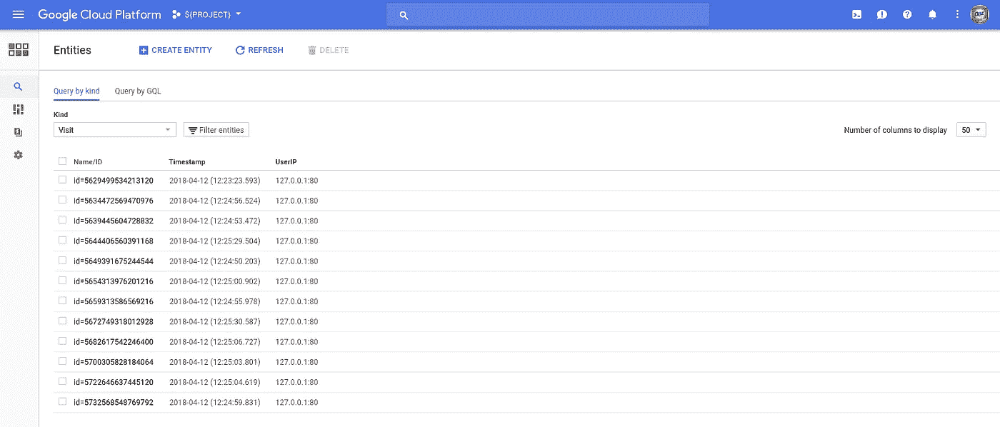

# 容器优化的操作系统

> 原文：<https://medium.com/google-cloud/container-optimized-os-d32ea15c9ef4?source=collection_archive---------0----------------------->

*感谢我的同事让我开始使用带有容器优化操作系统的挂载。*

如果你读过我最近的帖子，我会遵循一条一贯的道路:

*   `go run...`
*   `go build...`
*   `docker run ...`
*   `kubectl apply ...`

但是，有一个可能有用的替代步骤，虽然我在这里使用 Golang，但它适用于任何可以容器化的代码:

*   `gcloud compute instances create-with-container ...`

[谷歌云平台](https://cloud.google.com/) (GCP)提供了一个[容器优化的操作系统](https://cloud.google.com/container-optimized-os/)(又名“COS”)，可以在[谷歌计算引擎](https://cloud.google.com/compute/)上使用，并且是 [Kubernetes 引擎](https://cloud.google.com/kubernetes-engine/)(节点)使用的默认映像。COS 基于 Chromium OS。Chromium OS 是一款专注于安全性的小型 Linux 操作系统。Chromium OS 专注于网页浏览，而 COS 则专注于运行容器。

我没有使用 COS 的一个原因是，对我来说，专注于在 Kubernetes 引擎中建立能力以帮助我的客户更有用，但我总是面临将一些更复杂的容器环境映射到 COS 的挑战。

这篇文章旨在帮助你在不需要 Kubernetes 更强大的特性时，考虑将 COS 作为一种将容器部署到 GCP 的方式

## 设置

我比较受欢迎的一个帖子是“[App Engine Flex | | Kubernetes Engine—？？](/google-cloud/app-engine-flex-container-engine-946fbc2fe00a)”。在这个项目中，我们使用了一个 Google Golang [示例应用](https://cloud.google.com/appengine/docs/flexible/go/using-cloud-datastore)，它可以与云数据存储进行对话，我们将这个应用打包并部署到 Flex 和 Kubernetes 上。在本文中，我们将把该应用程序部署到 COS。

这很有趣，因为它演示了如何将 volume|bind 挂载转换为 COS，以及如何将[应用程序默认凭证](https://cloud.google.com/docs/authentication/production)用于 COS。

请按照上面提到的帖子中的设置下载示例应用程序。你不需要启用 Kubernetes。你*必须*！？)由于 GCP 在使用云数据存储时的限制，创建一个 App Engine 应用程序:

```
gcloud app create --region=us-central --project=${PROJECT}
```

## 本地-本地

如果你能达到这样一个点:

```
GCLOUD_DATASET_ID=${PROJECT} \
go run main.go
```

运行，并命中其服务器的端点，结果如下:

```
curl localhost:8080
Previous visits:
[2018-04-12 12:25:30.587515 -0700 PDT] 127.0.0.1:80
[2018-04-12 12:25:29.504421 -0700 PDT] 127.0.0.1:80
[2018-04-12 12:25:06.727592 -0700 PDT] 127.0.0.1:80
[2018-04-12 12:25:04.619761 -0700 PDT] 127.0.0.1:80
[2018-04-12 12:25:03.801524 -0700 PDT] 127.0.0.1:80
[2018-04-12 12:25:00.902566 -0700 PDT] 127.0.0.1:80
[2018-04-12 12:24:59.831409 -0700 PDT] 127.0.0.1:80
[2018-04-12 12:24:56.524133 -0700 PDT] 127.0.0.1:80
[2018-04-12 12:24:55.978291 -0700 PDT] 127.0.0.1:80
[2018-04-12 12:24:53.472835 -0700 PDT] 127.0.0.1:80Successfully stored an entry of the current request.
```

或者:



云数据存储:实体

我们很好。-)

> **NB** 发布的代码要求将环境变量`GCLOUD_DATASET_ID`设置为我们的 GCP 项目 ID。该设置将反映在下面这段代码的每次调用中。

## 应用程序默认凭据

认证我们代码的更好方法是使用[应用默认凭证](https://cloud.google.com/docs/authentication/production)(ADC)。ADC 使我们能够使用服务帐户进行身份验证，虽然这通常是一种好的做法，但一旦应用程序容器化，使用服务帐户将是一项要求。

下面的(样板文件)创建了一个服务帐户，为它下载了一个密钥，并授权(！idspnonenote)使用它。)使用云数据存储的帐户:

```
export ROBOT="datastore"
export EMAIL=${ROBOT}@${PROJECT}.iam.gserviceaccount.comgcloud iam service-accounts create $ROBOT \
--display-name=$ROBOT \
--project=$PROJECTgcloud iam service-accounts keys create ./${ROBOT}.key.json \
--iam-account=${ROBOT}@${PROJECT}.iam.gserviceaccount.com \
--project=$PROJECTgcloud projects add-iam-policy-binding $PROJECT \
--member=serviceAccount:${EMAIL} \
--role=roles/datastore.user
```

这些步骤以前被用作创建 Kubernetes 使用的服务帐户密钥的推荐方法的一部分。在这种情况下，我们能够将密钥作为秘密上传到 Kubernetes，然后使用卷挂载从容器中安全地引用这个密钥。

一切正常，你应该能够重新运行应用程序认证为服务帐户，它应该继续工作。如果它不能立即工作，请等待几秒钟以允许帐户及其权限传播，然后重试:

```
GCLOUD_DATASET_ID=${PROJECT} \
GOOGLE_APPLICATION_CREDENTIALS=${ROBOT}.key.json \
go run main.go
```

> 唯一的变化是我们在代码中添加了另一个环境变量`GOOGLE_APPLICATION_CREDENTIALS`,它被 Google 库(/-ies)用于应用程序默认凭证。我们不需要更改代码来更改凭据。

请确保在尝试运行 Docker 容器之前终止它。如果没有，系统会告诉您该端口已经在使用中。

## 码头工人

因此，这一步可能没什么意思，但它是一个先决条件。

我们将构建一个静态二进制文件并将其容器化。因为二进制文件现在仅限于——在本例中是 Docker 的——容器运行时，它无法访问我们的 gcloud 凭据，所以从现在开始，我们必须使用服务帐户进行身份验证。

构建您的二进制文件:

```
CGO_ENABLED=0 GOOS=linux go build -a -installsuffix cgo -o datastore
```

再次测试:

```
GCLOUD_DATASET_ID=${PROJECT} \
GOOGLE_APPLICATION_CREDENTIALS=${ROBOT}.key.json \
./datastore
```

> 这里唯一的不同是我们用二进制代码替换了我们的 T2。

Dockerfile:

```
FROM scratchLABEL maintainer="Your Name <[your@email.com](mailto:your@email.com)>"ADD ca-certificates.crt /etc/ssl/certs/ADD dumb-init /
ADD datastore /ENTRYPOINT ["/dumb-init","--"]
CMD ["/datastore"]
```

> **注意**请查看我以前的帖子，以获得关于[哑初始化](https://github.com/Yelp/dumb-init)以及为什么出现“ca-certificates.crt”的指导。

建立你的码头工人形象:

```
docker build --tag=gcr.io/${PROJECT}/datastore .
```

如果您最近没有使用它(或忽略它)，`gcloud docker -- push`现在建议返回到纯粹的`docker` cli 命令，您可能需要:

```
gcloud auth configure-docker
```

之前:

```
IMAGE=datastore
docker push gcr.io/${PROJECT}/${IMAGE}
```

当推送成功完成时，它将最终生成图像摘要，请捕获该摘要`sha256:...`(包含):

```
...
latest: digest: sha256:f70dd40d260d6c79fdf79c678e468302c0a18084b830ea2680cbb14c433c1749 size: 947
```

如果你像我一样忘记了一个步骤，你可以:

```
cloud services enable containerregistry.googleapis.com \
--project=${PROJECT}
```

并再次尝试推动；-)

OK…确保`go run main.go`命令*未*运行，并且:

```
docker run \
--interactive \
--tty \
--publish=127.0.0.1:8080:8080 \
--env=GCLOUD_DATASET_ID=${PROJECT} \
--env=GOOGLE_APPLICATION_CREDENTIALS=/tmp/${ROBOT}.key.json \
--volume=$PWD/${ROBOT}.key.json:/tmp/${ROBOT}.key.json \
gcr.io/${PROJECT}/datastore
```

> 两个`-env`标志像以前一样设置环境变量。此外，我们必须为容器提供访问存储在主机上的密钥的方法。这是通过`--volume`映射实现的。

您应该能够继续成功卷曲端点。

## 一个容器优化的操作系统虚拟机

现在让我们将这个映像部署到 COS 并在那里运行它。我们需要(1)创建配置为从 GCR 拉映像的 COS 虚拟机；(2)将密钥复制到虚拟机。如果您尚未在项目中启用计算引擎:

```
gcloud services enable compute.googleapis.com --project=${PROJECT}
```

然后:

```
DIGEST=[[ The digest from your push ]]
INSTANCE=datastore-cos
ZONE=us-west1-agcloud beta compute instances create-with-container ${INSTANCE} \
--zone=${ZONE} \
--image-family=cos-stable \
--image-project=cos-cloud \
--container-image=gcr.io/${PROJECT}/${IMAGE}@${DIGEST} \
--container-restart-policy=always \
--container-env=\
GCLOUD_DATASET_ID=${PROJECT},\
GOOGLE_APPLICATION_CREDENTIALS=/tmp/${ROBOT}.key.json \
--container-mount-host-path=\
mount-path=/tmp,\
host-path=/tmp,\
mode=rw \
--project=${PROJECT}
```

> 这是一个`gcloud beta`命令。我们将 COS VM 上的`/tmp`挂载到我们的容器实例中。如果您以前没有使用过`API [compute.googleapis.com]`，可能会提示您启用它，请接受(Y)并注意，在 COS VM 实例运行时，您将被收费。
> 
> **NB** 有更多的标志来运行这个命令，因为我们正在创建一个 COS VM 并在其上运行我们的容器映像。但是，您仍然可以看到我们的原始环境变量`GCLOUD_DATASET_ID`和`GOOGLE_APPLICATION_CREDENTIALS`反映在这个命令中。和以前一样，我们必须将我们的服务帐户映射到(远程)容器中。这是通过`--container-mount-host-path`启用的，但这不会将密钥复制到虚拟机。见下文。
> 
> NB 我们在使用 COS 时不会显式暴露端口`8080`。COS 上的容器通过`--net=host`有效运行。这呈现了容器的(多个)端口，就好像它们是由主机直接公开的一样。在我们的例子中，当我们将。)港口`8080`我们的集装箱就是通过它进入的。这样做的一个缺点是，您的 COS 容器在端口使用上可能不会冲突。

如果一切顺利，我们将从 GCP 那里得到实例已经创建并运行的确认。希望我们的容器也在运行。但是，在它正确运行之前，我们必须将服务帐户复制到 VM，以便容器可以通过卷挂载来访问它。从您的工作目录:

```
gcloud compute scp \
  ${ROBOT}.key.json \
  ${INSTANCE}:/tmp \
--project=${PROJECT}
```

怎么分辨？让我们 ssh 到图像和检查。当我们使用 ssh 时，让我们也使用 port-forward 端口`8080`,以便我们可以访问服务:

```
gcloud compute ssh ${INSTANCE} \
--ssh-flag="-L 8080:localhost:8080" \
--project=${PROJECT}
```

一旦这个命令成功，从另一个 ssh 会话(！idspnonenote)中。)，尝试使用`localhost:8080` ( `localhost`感谢端口转发)卷曲端点。

观察(COS)虚拟机状态的一个有用方法是获取串行控制台输出:

```
gcloud compute instances get-serial-port-output ${INSTANCE} \
--zone=${ZONE} \
--project=${PROJECT} \
| grep konlet-startup
```

您应该会看到成功消息，包括`pull complete`、`Create a container...`、`Starting a container...`等。

从实例的(！)ssh 会话，您可以使用 Docker CLI:

```
docker container ls
```

它应该有一个`Up..`状态:

```
CONTAINER ID    IMAGE                                   STATUS
d06da5bee1f0    gcr.io/${PROJECT}/datastore@${DIGEST}   Up 1 minutes
```

您将无法使用`docker logs...`,但是您可以使用`journalctl`来实现类似的(以及更广泛的)目的:

```
sudo journalctl --unit=konlet-startup \
| grep ${INSTANCE}
```

> **NB** 如果你想通过它过滤`journalctl`日志，你需要重新创建`${INSTANCE}`，但是除非你在 COS VM 上运行多个容器，否则这是多余的。

## 实例组:许多容器优化的操作系统虚拟机

使用 COS VMs 的一个有趣的副作用是，它们可以被模板化，然后用于创建实例组。顾名思义，这些是(克隆的)实例组。因此，我们没有直接创建 COS 虚拟机，而是创建一个模板，然后创建一个实例组来为我们清除 X 个(让我们做 3 个)克隆:

```
REGION=us-west1gcloud beta compute instance-templates create-with-container ${INSTANCE}-template \
--image-family=cos-stable \
--image-project=cos-cloud \
--container-image=gcr.io/${PROJECT}/${IMAGE}@${DIGEST} \
--container-restart-policy=always \
--container-env=\
GCLOUD_DATASET_ID=${PROJECT},\
GOOGLE_APPLICATION_CREDENTIALS=/tmp/${ROBOT}.key.json \
--container-mount-host-path=\
mount-path=/tmp,\
host-path=/tmp,\
mode=rw \
--region=${REGION} \
--project=${PROJECT}
```

> **注意**这里唯一的区别是我决定使用一个区域实例组，所以我们用`--region=${REGION}`替换`--zone=${ZONE}`，并为`REGION`添加一个设置。

带来克隆人:

```
CLONES=3gcloud compute instance-groups managed create ${INSTANCE}-group \
--base-instance-name=${INSTANCE} \
--template=${INSTANCE}-template \
--size=${CLONES} \
--region=${REGION} \
--project=${PROJECT}
```

很快地:

```
gcloud compute instance-groups managed list-instances ${INSTANCE}-group --region=$REGION --project=$PROJECTNAME                ZONE        STATUS   ACTION  LAST_ERROR
datastore-cos-qnkg  us-west1-a  RUNNING  NONE
datastore-cos-q5wd  us-west1-b  RUNNING  NONE
datastore-cos-3t60  us-west1-c  RUNNING  NONE
```

> **注意**在`us-west1`中，我不仅得到了我的模板的 3 个克隆体，而且它们被涂上了花生酱。太棒了。

但是，我给自己制造了一个问题。我现在有 x 个(其中 x 可能很大)容器实例在运行，并且每个实例都希望服务帐户密钥出现在它的主机中(映射到它的主机中)`/tmp`。我们可以作弊:

```
CLONES=$(gcloud compute instance-groups managed list-instances ${INSTANCE}-group --region=$REGION --project=$PROJECT --format="value(instance)")for CLONE in ${CLONES}
do
  gcloud compute scp \
    ${ROBOT}.key.json \
    ${CLONE}:/tmp \
--project=${PROJECT}
done
```

但是，实例组的一个好处是可以自动扩展它们，不健康的克隆将被淘汰和替换。在任一情况下，新的克隆都不能访问服务帐户密钥。

我们真正想要的是每个容器能够主动引用的密钥的单一来源。想法？持久磁盘过度使用。这里有一个使用[谷歌云存储](https://cloud.google.com/storage/) (GCS)的解决方案。

让我们创建一个(区域)桶，并将我们的密钥放入其中。该项目的任何用户都可以访问该密钥:

```
BUCKET=[[YOUR-BUCKET-NAME]]gsutil mb -c regional -l ${REGION} -p ${PROJECT} gs://${BUCKET}
gsutil cp ./${ROBOT}.key.json gs://${BUCKET}/
```

然后，我们可以修改实例模板来运行获取容器密钥的启动脚本。

启动. sh:

您需要删除现有模板(和实例组)或修改名称:

```
gcloud beta compute instance-templates create-with-container ${INSTANCE}-template \
--region=${REGION} \
--image-family=cos-stable \
--image-project=cos-cloud \
--container-image=gcr.io/${PROJECT}/${IMAGE}@${DIGEST} \
--container-env=\
GCLOUD_DATASET_ID=${PROJECT},\
GOOGLE_APPLICATION_CREDENTIALS=/tmp/${ROBOT}.key.json \
--container-mount-host-path=\
mount-path=/tmp,\
host-path=/tmp,\
mode=rw \
--project=$PROJECT \
--metadata-from-file=startup-script=./startup.sh
```

**NB** 唉。这个启动脚本比它应该的更复杂。我们必须四处寻找，为 COS VM 的服务帐户获取一个访问令牌，然后使用它从 GCS 获取服务帐户密钥，并按照容器的预期将它存储在`/tmp/${ROBOT}.key.json`中。

> **NB** 请用实际值替换`[[YOUR-BUCKET]]`和`[[YOUR-KEY-FILE]]`。

然后使用与前面相同的命令创建一个实例组:

```
gcloud compute instance-groups managed create ${INSTANCE}-group \
--base-instance-name=${INSTANCE} \
--template=${INSTANCE}-template \
--size=${CLONES} \
--region=${REGION} \
--project=${PROJECT}
```

这一次，集装箱应该可以上路了。让我们随机选择一个:

```
NODES=$(\
  gcloud compute instance-groups managed \
  list-instances ${INSTANCE}-group \
  --region=$REGION \
  --project=$PROJECT \
  --format="value(instance)")RANDOM_NODE=$(shuf -n1 -e ${NODES})gcloud compute ssh ${RANDOM_NODE} \
--project=${PROJECT} \
--ssh-flag="-L 8080:localhost:8080"
```

并且，希望你能成功卷曲【T3:-)

如果您遇到问题，我建议您确保正确复制了启动脚本。您可以检查一个实例的串行控制台，尽管它没有报告`startup-script`。从 COS 虚拟机中，您可以检查:

```
sudo journalctl | grep startup-script
```

以及 VM 的`/tmp`目录中服务账户密钥的存在。

很简单(耶！)我将让您为我们的实例组创建一个 HTTP 负载平衡器。

## 库伯内特斯

哦，那好吧；-)

这不是这篇文章的重点，但我把它放在这里是为了完整，因为我希望通过这样做，它能揭示所有这些方法的一致性。

假设您正在运行“a Kubernetes ”,我们将创建一个名称空间，上传服务密钥作为密码，运行容器将密码中的密钥转换为卷挂载。最好完全用 YAMLs 来完成，但要避免密钥的复杂性:

```
NAMESPACE=datastore
kubectl create namespace ${NAMESPACE}kubectl create secret generic ${ROBOT} \
--from-file=${ROBOT}.key.json=${PWD}/${ROBOT}.key.json \
--namespace=${NAMESPACE}
```

> Kubernetes `secrets`的 NB 是在集群中托管安全数据(在名称空间中)的一种更优雅的方式。

部署如下:

> **注意**在应用之前，不要忘记用`${PROJECT}`的值替换`${PROJECT}`的出现次数。我假设您使用了`datastore`作为`${ROBOT}`的值，但是，如果您没有使用，请更改`datastore.key.json`以反映正确的值。
> 
> **NB** 在第 27–31 行你会看到我们的环境变量`GCLOUD_DATASET_ID`和`GOOGLE_APPLICATION_CREDENTIALS`被反映出来。我们使用和以前一样的服务帐户和密钥，尽管按照惯例，我们要在这里安装一个`/var/secrets/google`的挂载点。与 Docker 本地使用不同，我们需要显式公开端口`8080`。否则，这应该看起来与其他方法非常一致。

然后:

```
kubectl apply --filename=deployment.yaml
```

与其在防火墙上打一个洞，不如让我们获取一个集群的底层节点名，确定创建服务的节点端口，并将其转发到端口。我们将保留节点端口到本地端口的映射，因此您可以在其他地方继续使用`8080`:

```
NODE_HOST=$(\
  kubectl get nodes \
  --output=jsonpath="{.items[0].metadata.name}")NODE_PORT=$(\
  kubectl get services/datastore \
  --namespace=datastore \
  --output=jsonpath="{.spec.ports[0].nodePort}")echo ${NODE_PORT}gcloud compute ssh ${NODE_HOST} \
--ssh-flag="-L ${NODE_PORT}:localhost:${NODE_PORT}" \
--project=${PROJECT}
```

然后，当 ssh 会话运行时，从您的本地机器:

```
curl http://localhost:${NODE_PORT}
```

> **NB** 您需要重新创建变量或键入`${NODE_PORT}`的值，因为它不会在单独的 ssh 会话中设置。

而且，您应该会继续看到返回给您的最后 10 次“访问”的输出(对应于创建的数据存储实体)。

## 结论

Containers 三种方式，但主要展示了如何满足需要共享卷和/或服务帐户密钥的容器的共同需求，并在本地将单个映像部署到运行 Google 的容器优化操作系统的虚拟机和 Kubernetes。一路上，我试图反映所有这些方法的一致性。

总是寻求反馈！

## 整理一下！

当您使用完图像后，请将其删除:

```
gcloud compute instances delete ${INSTANCE} \
--project=${PROJECT} \
--quiet
```

当您使用完模板和实例组后，请删除它们:

```
gcloud compute instance-groups managed delete ${INSTANCE}-group \
--region=${REGION} \
--project=${PROJECT}gcloud compute instance-templates delete ${INSTANCE}-template \
--region=${REGION} \
--project=${PROJECT}
```

如果您完全完成了项目，您可以删除虚拟机和数据存储数据，方法是不可撤销的:

```
gcloud projects delete ${PROJECT} --quiet
```

就这样*！！*