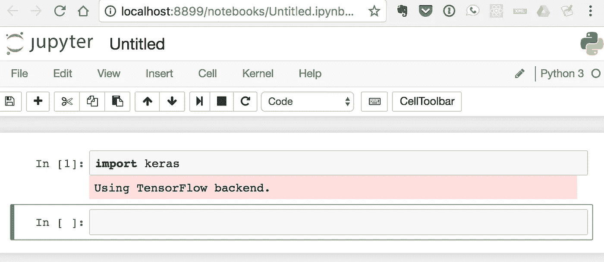
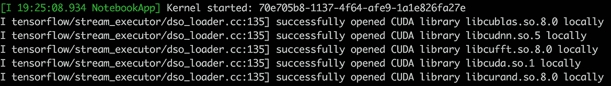

# 谷歌云 GPU 上的容器化 Jupyter 笔记本

> 原文：<https://medium.com/google-cloud/containerized-jupyter-notebooks-on-gpu-on-google-cloud-8e86ef7f31e9?source=collection_archive---------0----------------------->

在之前的[帖子](/@durgeshm/running-jupyter-notebooks-on-gpu-on-google-cloud-d44f57d22dbd)中，我列出了在 GCP 计算引擎的 GPU 实例上运行 Jupyter 笔记本的步骤。事实证明，有一种*更容易*更灵活的方式。使用*码头集装箱*。

我假设你的谷歌云平台账户允许你创建基于 GPU 的实例。如果没有，请遵循上一篇[文章](/@durgeshm/running-jupyter-notebooks-on-gpu-on-google-cloud-d44f57d22dbd)中的步骤 1。此外，确保您拥有最新的`gcloud` SDK。

```
$ gcloud components update && gcloud components install beta
```

NVIDIA 博客上的这篇文章解释了这种设置是如何工作的。GPU 实例只需要在主机上安装 NVIDIA 驱动程序(以及 Docker 周围一个名为`nvidia-docker`的薄包装)。所有其他软件，如 CUDA toolkit、cuDNN、Python、Jupyter 和任何深度学习库，都可以简单地封装成可重用的 Docker 映像。NVIDIA 和大多数深度学习框架的作者(如 TensorFlow、Keras、PyTorch)提供了现成的 Docker 图像，您可以直接使用或作为基础图像。

**第一步:创建 GPU 实例**

当然，您可以使用云控制台来创建基于 GPU 的实例。但是，我将使用`gcloud`命令行工具。

```
$ gcloud beta compute instances create **gpu-docker-host** --machine-type n1-standard-2 --zone **us-east1-d** --accelerator type=**nvidia-tesla-k80,count=1** --image-family ubuntu-1604-lts --image-project ubuntu-os-cloud --boot-disk-size 50GB --maintenance-policy TERMINATE --restart-on-failure 
```

这将在`us-east1-d`区域中创建一个名为`gpu-docker-host`的实例，使用 1 个 GPU 和 Ubuntu 16.04(持久磁盘大小为 50GB)。

一旦您的 GPU 实例准备就绪，您就可以通过 ssh 客户端或`gcloud compute ssh gpu-docker-host --zone us-east1-d`命令连接到它。

**第二步:安装 NVIDIA 驱动，docker 和 nvidia-docker**

在服务器上，下载该脚本以安装依赖项:

```
$ curl -O -s [https://gist.githubusercontent.com/durgeshm/b149e7baec4d4508eb4b2914d63018c7/raw/798aadbb54b451abcaba9bfeb833327fa4b3d53b/deps_nvidia_docker.sh](https://gist.githubusercontent.com/durgeshm/b149e7baec4d4508eb4b2914d63018c7/raw/798aadbb54b451abcaba9bfeb833327fa4b3d53b/deps_nvidia_docker.sh)
```

该脚本自动执行以下任务(最好看一看，而不是运行陌生人的脚本) :

1.  确认该实例具有来自 NVIDIA 的 GPU，否则退出。
2.  如有必要，检查并安装 NVIDIA 驱动程序(适用于 Tesla K80)。
3.  必要时检查并安装`docker`。
4.  如有必要，检查并安装`nvidia-docker`。

```
$ sudo sh deps_nvidia_docker.sh
```

> **注意**:如果您在本地下载脚本并通过添加`--metadata-from-file startup-script=**deps_nvidia_docker.sh**` **将其作为启动脚本传递给‘g cloud’命令，那么您可以在一个步骤中创建实例时安装这些依赖项。**但是，我在这里把步骤分开了。

**步骤 3:准备运行任何支持 CUDA 的 docker 容器！**

一旦脚本完成安装 nvidia-docker，我们就可以从 nvidia 运行一个简单的测试容器了。

```
$ sudo nvidia-docker run --rm nvidia/cuda nvidia-smi
```

如果您在控制台中看到 GPU 和驱动程序信息，那么您的设置已经就绪。(显然，第一次运行时，从 Docker hub 提取`nvidia/cuda`图像需要几秒钟的时间)。

现在，让我们尝试一个 TensorFlow/Keras/Jupyter docker 容器( [Dockerfile](https://github.com/durgeshm/dockerfiles/blob/master/jupyter-keras-gpu/Dockerfile) )。

```
$ mkdir notebooks # to persist notebooks on the host$ sudo **nvidia-docker** run -it --rm -d -v $(pwd)/notebooks:/notebooks -p 8888:8888 --name keras durgeshm/jupyter-keras-gpu
```

检查容器日志以确认 Jupyter 正在运行:

```
~$ sudo docker logs keras
```

为了将来更容易启动容器，我还添加了一个脚本`run-keras.sh`

```
~$ echo 'sudo nvidia-docker run -it --rm -d -v $(pwd)/notebooks:/notebooks -p 8888:8888 --name keras durgeshm/jupyter-keras-gpu' > run-keras.sh && chmod u+x run-keras.sh
```

**第四步:SSH 隧道转发**

从本地机器建立一个隧道，通过 ssh 访问 Jupyter。

如果您已经在服务器上启动了`keras`容器，那么在您的本地机器上运行以下命令。

```
$ ssh -i .ssh/ubuntu_gcp -L 8899:localhost:8888 -f -N ubuntu@<gpu-docker-host>
```

我为自己定义了一个方便的别名，从本地机器远程启动 keras 容器并立即打开隧道。

```
$ alias **tf-gpu**="ssh gpu-docker-host './run-keras.sh' && ssh -fNL 8899:localhost:8888 gpu-docker-host"$ **tf-gpu**
66357b10b6b4ec70e53273dc98878f1525f62fa6e6b1ee7d69995486f28bad1e# ^ that is the container id that was just started.
```

**第五步:在你的浏览器中本地使用 Jupyter**

导航到 [http://localhost:8899/](http://localhost:8899/) 并创建一个新笔记本。通过导入 keras 或 tensorflow 进行验证。`ssh gpu-docker-host "sudo docker logs keras"`可以确认 CUDA 库是否正在加载。



ssh GPU-docker-host " sudo docker logs keras "

一旦完成，请 ***记得停止你的*** 实例以节省成本。感谢阅读。

**备注:**

1.  我已经分别为 Keras/TensorFlow 和 PyTorch 创建了标记为`durgeshm/jupyter-keras-gpu` ( [Dockerfile](https://github.com/durgeshm/dockerfiles/blob/master/jupyter-keras-gpu/Dockerfile) )和`durgeshm/jupyter-pytorch-gpu` ( [Dockerfile](https://github.com/durgeshm/dockerfiles/blob/master/jupyter-pytorch-gpu/Dockerfile) )的 Docker 图像。
2.  此外，您可以随时使用[https://github . com/fchollet/keras/blob/master/docker/docker file](https://github.com/fchollet/keras/blob/master/docker/Dockerfile)、[https://github.com/pytorch/pytorch/blob/master/Dockerfile](https://github.com/pytorch/pytorch/blob/master/Dockerfile)或[https://hub.docker.com/r/tensorflow/tensorflow/](https://hub.docker.com/r/tensorflow/tensorflow/)的*官方* docker 图片作为您自己定制的基础图片。
3.  请注意，容器中的`/notebooks`卷是从主机上的`~/notebooks`装载的。这样，您总是可以删除旧容器，但您的笔记本将保留在主机上。
4.  只有*步骤 1* 是针对 Google 云平台的。其他步骤应该在其他云平台上工作(使用 GPU，特别是 Tesla K80)