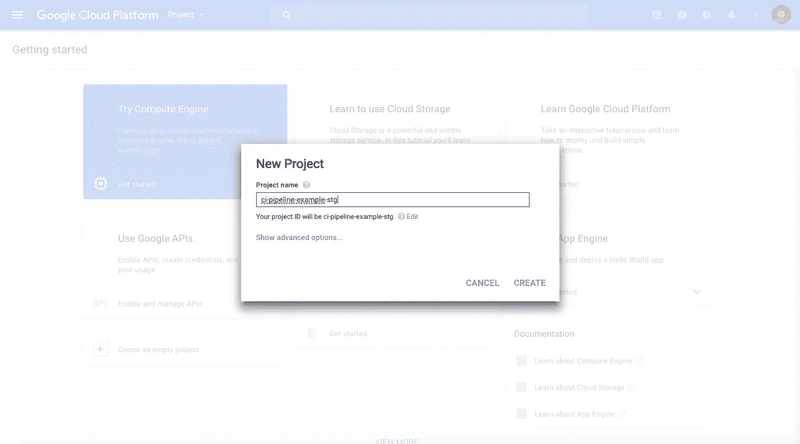
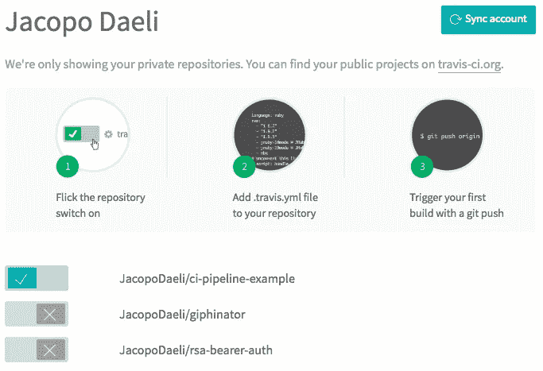
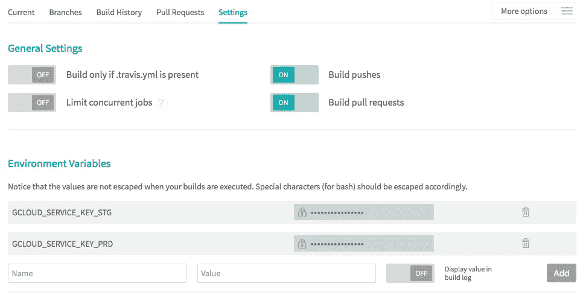

# 使用 Google 容器引擎、Docker 和 Travis 在微服务基础架构中持续交付

> 原文：<https://medium.com/google-cloud/continuous-delivery-in-a-microservice-infrastructure-with-google-container-engine-docker-and-fb9772e81da7?source=collection_archive---------0----------------------->

如今，持续集成(CI)已经成为现代科技公司和初创公司事实上的标准。从使用自己的 Jenkins 集群到 Travis 或 CircleCI 等第三方服务，您可以通过多种方式设置完美的 CI 环境。
连续交付(CD)更进了一步，它确保每个构建也可以部署到类似生产的环境中(或试运行),然后在该环境中通过集成测试。

# 介绍

在你开始建立你的 CD 管道之前，有几件事你应该考虑:需求、时间、努力和金钱。今天我想向大家展示我最近是如何使用 Docker、谷歌容器引擎(GKE)、GitHub 和 Travis 为一个项目构建管道的。如果你需要简单、实用和有效的东西，你没有很多时间，但你有一点钱💰你绝对应该考虑这个设计。

Travis 与 GitHub 集成得非常好。它独立运行测试。由于这是一项托管服务，您不必管理自己的基础架构。GKE 是一个运行 Docker 容器的集群管理器和编排系统，由 Kubernetes (K8S)提供支持。GKE 也是谷歌云平台(GCP)中的托管服务。GCP 还提供了一个完全管理的 Docker 私人注册表，称为谷歌容器注册表(GCR)，这使得存储和访问您的私人 Docker 图像变得容易。如果你不想使用 GitHub、Travis 和 GKE，你可以很容易地修改本文所说的内容，使其与其他托管服务或你自己的自托管解决方案一起工作。

## 关于这篇文章

简而言之，本文解释了 Travis 如何在 Google 容器引擎上将应用程序作为 Docker 容器进行测试和部署。它指的是将代码部署在 GitHub 私有存储库上的项目，因此需要一个 Travis Pro 帐户(计划从 69 美元开始)。

## 这个概念

管道有四个环境:开发、测试、试运行和生产。开发指的是本地开发人员，测试是 CI 环境(在我们的用例中是 TravisCI)，试运行是我第一次部署新特性的地方，这些新特性需要在投入生产之前进行手动测试。试运行和生产都建立在 Kubernetes 集群之上。我还使用了简化版的 [git-flow](http://danielkummer.github.io/git-flow-cheatsheet/) :特性、开发、生产和补丁分支。没有发布分支。

这个想法很简单。对于新特征，您总是直接在特征分支上工作。您经常在 git 服务器上提交和推送代码。每次在 GitHub 上推送，Travis 都会测试新代码。如果测试通过，您将能够打开并合并(如果没有发现冲突)一个 pull 请求到开发。这一次，Travis 将对合并后的代码运行测试，如果测试通过，它还将在 K8S staging 集群中构建、推送和部署 Docker 映像。部署到生产，它只需要打开并合并从开发到生产分支的拉请求。这将表现为当您将来自一个特性分支的拉请求合并到开发中时。修补程序也非常类似。在这种情况下，您也可以直接从热修复分支向主服务器打开一个“拉”请求。使用这种设计，开发分支包含在阶段环境中部署的代码，而主分支则部署在生产环境中。根据您的需要，您可以设计没有开发分支的管道。但这绝对是另一篇文章的主题。

# Google 云平台设置

如果你以前没有做过，在你的机器上安装 [gcloud](https://cloud.google.com/sdk/downloads) SDK。使用 GCP 控制台创建两个项目，一个用于试运行，一个用于生产。您可以将同一个项目用于试运行和生产，但是我鼓励您将它们分开。



GCP 控制台—创建新项目

创建项目后，为每个项目创建一个 JSON 格式的 [Kubernetes 集群](https://cloud.google.com/container-engine/docs/clusters/operations)和一个[服务账户密钥](https://cloud.google.com/storage/docs/authentication#service_accounts)。下一步是以 base64 格式编码 JSON 键。为此，在 Linux 或 OS X 上，键入:

```
base64 <your-service-account.json>
```

# 特拉维斯设置

在 [Travis 网站](https://travis-ci.com/)上，进入您的用户或组织档案，点击右上角的用户名，轻触您想要部署的存储库，如下图所示。



travis-ci.com/profile

## 环境变量

虽然大多数环境变量可以直接在. travis.yml 文件中设置，但 secret envars 需要通过 travis 项目设置接口来设置。使用之前生成的服务帐户 base64 编码的 JSON 密钥作为值，在 Travis 项目中创建两个名为“GCLOUD_SERVICE_KEY_STG”和“GCLOUD_SERVICE_KEY_PRD”的新 envars。



## **. Travis . yml 文件**

下一步是将. travis.yml 添加到您的 repo 中。下面这个. travis.yml 适合一个非常基础的 Node.js app。前 44 行代码提供测试环境并运行测试。更具体地说，Travis 将在基于容器的基础设施中构建测试环境(快速启动，sudo 命令不可用)，安装 Node.js 和 docker。如果测试通过，它还将安装 gcloud (GCP 命令行)和 kubectl (Kubernetes 命令行)。有了 Travis，你可以做得更多，更多信息请阅读他们的[文档](https://docs.travis-ci.com/user/getting-started/)。

文件的其余部分指定了如果测试通过并且当前分支是开发或主分支时该做什么:它将运行 *deploy-{env}。sh* 文件。

## 部署-{env}。sh 文件

部署脚本包括使用推送的代码构建 Docker 映像，通过 GCP 进行认证，将新创建的 Docker 映像推送到注册中心，然后更新 K8S 部署以使用新的映像。

# 其他考虑

在本文中，代码在 Travis Node.js 运行时中进行测试，一旦测试通过，就会构建一个 Docker 映像，并将其推送到注册表中进行部署。通过这种方式，我可以在运行时添加第三方依赖项，如数据库、消息代理等，例如使用. Travis . yml*before _ install*指令，并轻松地将我的应用程序/服务连接到它们。另一种选择是首先构建 Docker 映像，只有在测试通过后才将其推送到 GCR(在这种情况下，Travis 将测试容器，而不仅仅是代码)。对于第二个选项，您应该使用第三方依赖项作为容器，并使用 [Docker 链接](https://docs.docker.com/engine/userguide/networking/default_network/dockerlinks/)将您的应用程序容器连接到它们，并使用 Docker Compose 来配置和引导所有容器。
在基于微服务的场景中，您可以结合使用这两个选项，但这是另一篇文章的主题。