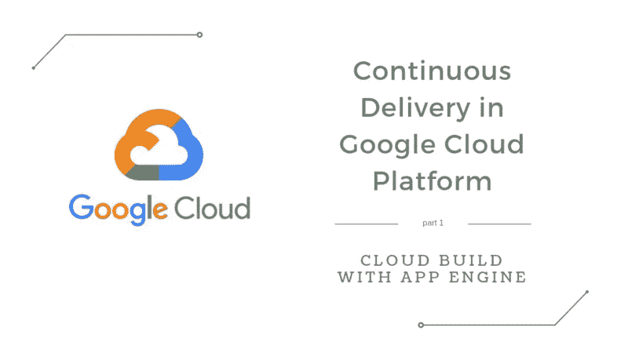
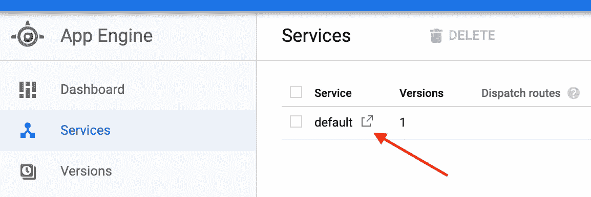
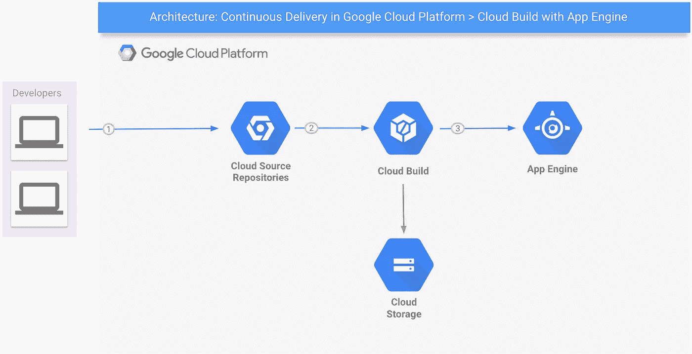

# Google 云平台中的持续交付—使用应用引擎的云构建

> 原文：<https://medium.com/google-cloud/continuous-delivery-in-google-cloud-platform-cloud-build-with-app-engine-8355d3a11ff5?source=collection_archive---------1----------------------->

敏捷和 DevOps 继续在 IT 项目中传播——我要说:以我们从未见过的速度！随着对这些事情兴趣的增加，使得交付更好的软件成为可能的过程和工具的集合也增加了。

在软件开发生命周期的末尾是**交付**“阶段”。而如果交付不快，整个敏捷开发过程就可能被打破。现代软件应该被设计成使用合适的自动化工具快速交付。在这种背景下，我将写关于在[谷歌云平台](https://cloud.google.com/)中的持续交付。这是一个由 3 篇文章组成的系列，涵盖了应用引擎、[计算引擎](/google-cloud/continuous-delivery-in-google-cloud-platform-cloud-build-with-compute-engine-a95bf4fd1821)和 [Kubernetes 引擎](/google-cloud/continuous-delivery-in-google-cloud-platform-cloud-run-with-kubernetes-engine-49b73577ef0f)的部署。

从 GCP 完全托管的无服务器应用平台 [App Engine](https://cloud.google.com/appengine/) 开始，我将展示建立**开发+自动化构建+持续交付**管道的步骤。为了保持实用性，我们将创建一个简单的前端应用程序，并将其部署到 App Engine 标准环境中。*请记住，我们将专注于交付，而不是应用开发本身*。

> **在继续之前，如果您希望运行示例，请确保您已经创建了一个 GCP 项目，并在您的机器上安装了**[**Google Cloud SDK**](https://cloud.google.com/sdk/install)**。不要忘记运行** `**gcloud auth login**` **和** `**gcloud config set project <your-project-id>**` **来正确使用 gcloud CLI。**

创建前端 web 应用程序的一个简单方法是使用 Angular CLI。安装该工具的步骤超出了本文的范围，可以在这里找到。安装完成后，转到您喜欢的文件夹并输入`ng new <app-name>`。等待几秒钟。创建好应用后，输入`cd <app-name>`和`ng serve`。将浏览器指向`http://localhost:4200`，确保应用程序正在运行。由于我们有一个完全运行的应用程序，我们在这里停止开发；).是时候考虑分娩了！

Angular app 由 HTML、CSS、JS、图片和其他 web 相关的静态文件组成。因此，我们现在需要做的是构建应用程序，并将其部署到 HTTP 服务器上，以供用户使用。为了构建 Angular 应用程序，我们运行`<app-name>`文件夹中的`npm install`和`npm run build --prod`。然后，Angular CLI 创建一个新的`dist`文件夹，在其中放置准备部署的内容。我们可以想出很多方法将这些文件复制到 web 服务器上，但是沿着这条路走下去，我们会增加构建过程的复杂性，你不同意吗？由于我们渴望简单和自动化，而不是复杂和手动任务，我们将学习如何使用[云构建](https://cloud.google.com/cloud-build/)。

Cloud Build 是 Google Cloud Platform 完全托管的服务，让您可以快速构建跨所有语言的软件，依靠容器来完成工作。话虽如此，让我们准备使用云构建的项目。将名为`cloudbuild.yaml`的文件添加到项目的根文件夹中，内容如下:

这个简单的文件指导 Cloud Build 如何构建和部署应用程序，类似于 Docker 的多阶段构建。当我们使用命令`gcloud builds submit --config cloudbuild.yaml .`调用 Cloud Build 时，它将压缩项目的源文件(一个`.gitignore`文件，如果存在，将被考虑以确定哪些文件应该被跳过)，并将 tarball 复制到一个托管的[云存储](https://cloud.google.com/storage/)桶。*发生在你的开发机器上*。

然后，在 GCP 服务器上运行，Cloud Build 将解压缩源代码，并在 Cloud Build 内置映像`gcr.io/cloud-builders/npm`的容器中执行`npm install`。第二步将使用另一个 *npm* 容器来运行`npm run build --prod`。第三个将运行另一个云构建的内置映像的容器，名为`gcr.io/cloud-builders/gcloud`，以执行一个`gcloud app deploy`命令。

我已经讲了第一步和第二步，但没有讲第三步，`gcloud app deploy`，所以让我来做。该命令负责将构建的内容部署到 App Engine，并完成整个交付过程。为了成功，它需要在项目的根文件夹中有一个`app.yaml`文件(参见下面的示例内容)，`<your-project-number>@cloudbuild.gserviceaccount.com`服务帐户必须具有**应用引擎管理**角色，并且必须为将要部署应用的 GCP 项目启用**应用引擎管理 API** 。这一步取代了将构建的文件复制到 HTTP 服务器(前面提到过),而是将它们复制到 GAE Python 2.7 标准环境，在那里它们可以作为静态内容。

将浏览器指向`https://<your-project-id>.appspot.com`或点击云控制台中的服务名称，查看应用引擎上运行的应用！另外，访问`https://console.cloud.google.com/cloud-build/builds?project=<your-project-id>`来检查你的项目的构建历史。

应用引擎服务页面(云控制台>计算>应用引擎>服务)

好了，现在我们有了一个**几乎全自动的**部署流程。

> —嘿，里卡多，你说的“几乎全自动”是什么意思？
> 
> —我的意思是 GCP 可以帮助我们做得更好:)

我们已经看到了云构建如何与云存储和应用引擎进行互操作，但是还缺少一块:[源存储库](https://cloud.google.com/source-repositories/)。

Git 现在被广泛用作一个源代码控制管理工具。源存储库允许您使用 GCP 作为 Git 远程存储库，或者从 Github 或 Bitbucket 自动镜像存储库。访问`https://console.cloud.google.com/code/develop/repo?project=<your-project-id>`，点击*创建存储库，*并按照步骤操作——这非常简单。

一旦存储库被设置，导航到云构建的触发器页面:`https://console.cloud.google.com/cloud-build/triggers?project=<your-project-id>`。点击*添加触发器*，选择一个源，一个存储库，继续进行触发器设置。给触发器命名，比如说`Push to master branch`，选择`Branch`作为**触发器类型**，选择`master`作为**分支(regex)** ，选择`cloudbuild.yaml`作为**构建配置**。为 **cloudbuild.yaml 位置**键入`/cloudbuild.yaml`并保存。开始了。每当一个新的提交被推送到 master 时，就会自动触发构建过程。我们不再需要手动执行`gcloud builds submit …`来开始构建。部署**过程现在完全自动化了！**

本文描述的步骤可以用来或定制来部署 Google 云平台的 App Engine **标准**环境支持的任何种类的应用。[部署到**灵活**的环境需要改变文件夹的结构](https://github.com/ricardolsmendes/gcp-cloudbuild-gae-flex-angular)。

Github 上提供了示例代码:[https://Github . com/ricardolsmendes/GCP-cloud build-gae-angular](https://github.com/ricardolsmendes/gcp-cloudbuild-gae-angular)。随便叉一下玩玩。

部署愉快:)

# 更新

2019–08–04:我创建了一个 GitHub 存储库来演示如何对 App Engine 灵活的环境进行类似的部署。详情请参见[GCP-cloud build-gae-flex-angular](https://github.com/ricardolsmendes/)。

这是关于谷歌云平台中**持续交付的 3 篇文章系列的第 1 篇:**

**App 引擎** | [计算引擎](/google-cloud/continuous-delivery-in-google-cloud-platform-cloud-build-with-compute-engine-a95bf4fd1821) | [Kubernetes 引擎](/google-cloud/continuous-delivery-in-google-cloud-platform-cloud-run-with-kubernetes-engine-49b73577ef0f)