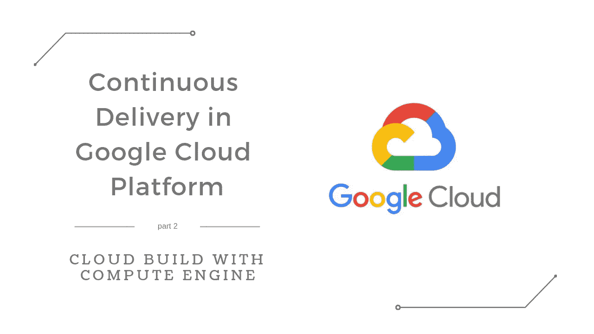
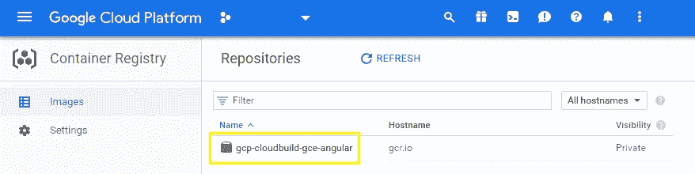
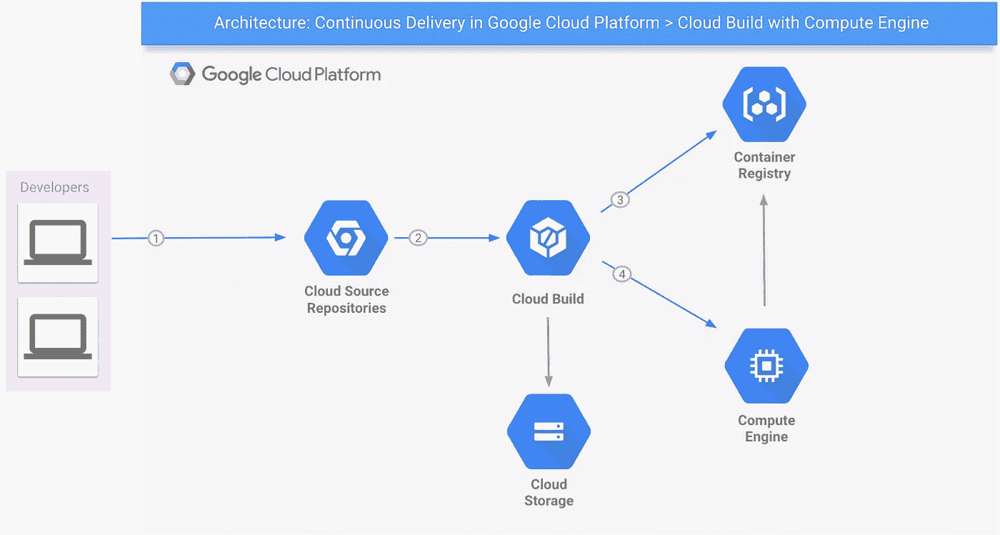

# Google 云平台中的持续交付—使用计算引擎构建云

> 原文：<https://medium.com/google-cloud/continuous-delivery-in-google-cloud-platform-cloud-build-with-compute-engine-a95bf4fd1821?source=collection_archive---------0----------------------->

本文是解决 Google 云平台中持续交付的系列文章的第二部分。[在第一篇文章中，Google App Engine 是主角](/google-cloud/continuous-delivery-in-google-cloud-platform-cloud-build-with-app-engine-8355d3a11ff5)。在这一次，谷歌计算引擎——或简称 GCE——将会登场。GCE 是 GCP 的基础设施即服务组件，它建立在谷歌的全球基础设施之上，允许其用户按需启动虚拟机。

正如我们已经看到的，GAE 非常适合持续交付项目。然而，使用该平台有一些限制:代码必须用特定的语言/版本编写，主要是如果你的团队旨在使用标准环境，这种环境更便宜(更多信息请访问[https://cloud . Google . com/app engine/docs/the-app engine-environments](https://cloud.google.com/appengine/docs/the-appengine-environments))；如果该项目被设计为在 GAE 上运行，那么肯定会完全兼容，但是如果试图将遗留代码迁移到该平台，即使选择灵活的环境，也可能会遇到麻烦。

经过利弊分析后，您的团队可能会得出结论，GAE 不是项目的最佳选择。可能是因为项目使用了一些平台不支持的语言或工具；也许是因为他们希望对执行环境有更多的控制或可定制性；可能是因为他们只想将工作负载从现有服务器迁移到 GCP，以便在不改变太多代码的情况下立即利用应用程序的扩展。对于所有这些情况，考虑一下 [**谷歌计算引擎**](https://cloud.google.com/compute/) 。

我们将在接下来的内容中看到如何使用一套在 GCP 可用的工具，允许您的团队使用 GCE 建立一个**开发+自动化构建+连续交付**管道。此外，通过使用示例 Angular app，可以将该解决方案与使用 GAE 的解决方案进行比较，如第[篇文章](/google-cloud/continuous-delivery-in-google-cloud-platform-cloud-build-with-app-engine-8355d3a11ff5)所述。这里的关键点是应用程序**必须**作为 Docker 映像发布。如果您能够在您的项目中做到这一点，您就有很大的机会像本文中描述的那样自动化整个部署过程。

> **在继续之前，如果您希望运行示例，请确保您已经创建了一个 GCP 项目，并在您的机器上安装了**[**Google Cloud SDK**](https://cloud.google.com/sdk/install)**。不要忘记运行** `***gcloud auth login***` **和** `***gcloud config set project <your-project-id>***` **来正确使用 gcloud CLI。**

为了简单起见，Angular app 将由 Nginx 提供服务。所以，创建你的新 Angular 应用程序(遵循这里的和`cd <app-name>`描述的步骤)。为了将应用程序和 Nginx 服务器打包成 Docker 映像，让我们在其根文件夹中创建一个名为`Dockerfile`的文件，内容如下:

基本上，它是一个多阶段的容器构建。第 1 行到第 5 行(第 1 阶段)使用 NodeJS 8 映像来构建应用程序。第 7 行到第 11 行(第 2 阶段)将构建过程的结果(一组 HTML、CSS 和 JS 文件)复制到 Nginx 映像，并用应用程序的内容替换默认服务器的主页。最后，第 12 行启动服务器。

让我们在同一个文件夹中创建第二个文件`.dockerignore`，内容如下。它将防止 Docker 将不必要的文件复制到构建的映像中，从而减小它们的大小。

如果你触发了一个`docker build -t <app-name> .`命令，然后是`docker run -d --name <app-name>-container -p 80:80 <app-name>`，将你的浏览器指向`http://localhost:4200`，你会看到 Docker 正在运行这个应用程序。

> 到目前为止，我们所看到的只是角度和 Docker 设置的东西。从现在开始，GCP 将会行动起来，让事情变得更有趣！

在典型的非自动化或半自动部署场景中，工程师可以(1)设置一个 CI 工具(如 Jenkins)来监控 Git 存储库的新推送，(2)在推送新内容时触发构建过程，以及(3)找到一种*神秘的*方式来更新所有运行 Docker 容器的虚拟机，以更新新版本。步骤 1 和 2 很简单。也许不是...在这一点上，GCP 提供了一种更复杂的方法:与其创建虚拟机，在其上安装 Docker，并手动管理容器，不如创建专门运行特定容器的虚拟机，并在发布新版本的映像时自动更新自己。听起来不错，对吧？所以，我们来看看怎么做。

首先，我们需要在项目根文件夹中再添加一个小文件，名为`cloudbuild.yaml`，如下:

这个文件将由[云构建](https://cloud.google.com/cloud-build/)使用指定的名称来构建 Docker 映像并创建一个存储库以将其存储在容器注册表中——在构建时，云构建会自动用您的项目 ID 替换`$PROJECT_ID`。

Ops…前一段提到了一个新的 GCP 组件:[容器注册表](https://cloud.google.com/container-registry/)。根据官方文档，它不仅仅是一个私有的容器存储库:是您的团队管理容器映像、执行漏洞分析以及通过细粒度访问控制决定谁可以访问什么的单一位置。

回到代码:添加文件后，运行项目根文件夹中的`gcloud builds submit --config cloudbuild.yaml .`,稍等片刻，在构建完成后访问`https://console.cloud.google.com/gcr/images/<your-project-id>`。您将在那里看到新的存储库(类似于下图)。这个手动步骤只需要一次。您可以复制完整的存储库名称，我们以后会需要它；).

容器注册表中的 Docker 图像— Google 云平台

我们几乎完成了 Docker 的形象建设。只需要设置一个触发器，它将在每次新代码被推送到受监控的 Git 库时自动启动构建过程，这是一个[源库](https://cloud.google.com/source-repositories/)的工作，正如我们在本系列的[第一篇文章](/google-cloud/continuous-delivery-in-google-cloud-platform-cloud-build-with-app-engine-8355d3a11ff5)中看到的。它的设置将与 GAE 交付时完全一样。请记住，主要的区别将是云构建处理的结果:对于 GAE，它发布了一个新版本的应用程序；对于当前进程，它只推送容器注册表中的一个图像。

现在，让我们创建一些虚拟机来运行容器。在 GCP 导航菜单中，点击*计算引擎>实例模板*。点击*创建实例模板*。在下一个屏幕中，选择**将一个容器映像部署到这个虚拟机实例**，键入(或粘贴)完整的**容器映像** —也称为存储库—名称，选择**允许 HTTP 流量，**并单击*创建*。

在导航菜单中，选择*计算引擎>实例组*。点击*创建实例组*。在下一个屏幕中，选择您刚刚创建的**实例模板**，并将**最小实例数**设置为`3`。点击*创建*。

创建实例组后，在导航菜单中选择*计算引擎>虚拟机实例*。单击实例的**外部 IP** 链接，确保应用程序正在每个实例中运行。第一次返回主页可能需要一段时间…

最后，将**计算实例管理员(v1)** 和**服务帐户用户**角色授予`<your-project-number>@cloudbuild.gserviceaccount.com`服务帐户(*导航菜单> IAM &管理员> IAM* )。

那么，如果我们将新的应用程序版本推送到 Git 存储库会怎么样呢？为了让它在生产中运行，我们需要重复哪些步骤？只需重启虚拟机！在 GCP 有许多方法可以做到这一点，包括向某个 PubSub 主题发布消息以调用重启虚拟机的云功能，或者使用高级选项来更新托管实例组([https://Cloud . Google . com/compute/docs/instance-groups/updating-managed-instance-groups](https://cloud.google.com/compute/docs/instance-groups/updating-managed-instance-groups))。但是，为了展示一个简单的例子，我们只需在`cloudbuild.yaml`中添加以下几行:

他们将在我们的构建过程中包含一个新的步骤，即运行`gcloud compute instance-groups managed rolling-action restart`命令。属于我们在前面几个步骤中创建的组的实例将在构建后一个接一个地重新启动，这个过程确保在任何给定的时间都有可用的机器。这可能需要几分钟的时间，具体取决于该组有多少个实例，但可以完美地工作。要看到它的运行，改变你代码中的一些东西，例如`app.component.ts`中的标题，并将新代码推送到由云构建监控的 Git 存储库。等待几分钟，刷新每个实例提供的 HTML 页面(重启后外部 IP 可能会改变)。

好了，这个话题就讲到这里。正如这里所演示的，为 GCE 设置 CI 环境通常比为 GAE 设置 CI 环境更复杂，但是如果您的项目需求不适合 GAE，这是一个有效的选择。当然，这是一种解决方案，但还有其他的。

下图显示了文章中提到的主要 GCP 组件:

Github 上有示例代码:[https://Github . com/ricardolsmendes/GCP-cloud build-GCE-angular](https://github.com/ricardolsmendes/gcp-cloudbuild-gce-angular)。随便叉一下玩玩。

希望有帮助！

这是关于谷歌云平台中**持续交付的 3 篇文章系列的第 2 篇:**

[App 引擎](/google-cloud/continuous-delivery-in-google-cloud-platform-cloud-build-with-app-engine-8355d3a11ff5) | **计算引擎** | [Kubernetes 引擎](/google-cloud/continuous-delivery-in-google-cloud-platform-cloud-run-with-kubernetes-engine-49b73577ef0f)