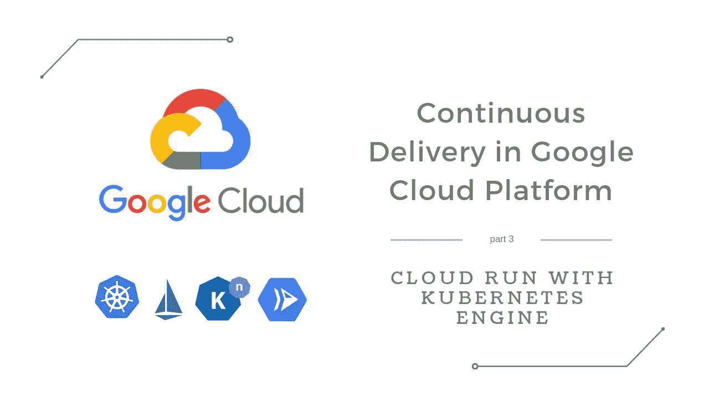
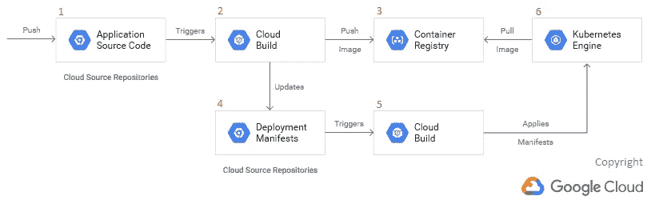
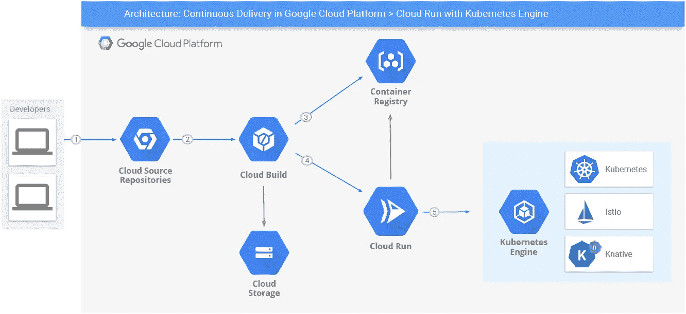

# Google 云平台中的持续交付—使用 Kubernetes 引擎的云运行

> 原文：<https://medium.com/google-cloud/continuous-delivery-in-google-cloud-platform-cloud-run-with-kubernetes-engine-49b73577ef0f?source=collection_archive---------0----------------------->

这是我正在撰写的关于 GCP 持续交付系列的第三篇文章(参见[第一部分:应用引擎](/google-cloud/continuous-delivery-in-google-cloud-platform-cloud-build-with-app-engine-8355d3a11ff5) & [第二部分:计算引擎](/google-cloud/continuous-delivery-in-google-cloud-platform-cloud-build-with-compute-engine-a95bf4fd1821))，我必须说:最难写的。不是因为这个主题不有趣、过时或者已经被广泛探索过。相反，Kubernetes 周围有一个伟大的氛围！此外，新工具经常发布，概念和更好的实践发展很快，这使得在 Kubernetes 上讲述一个引人注目而又简明的持续交付历史变得特别具有挑战性。



也就是说，我将像在以前的文章中一样描述一个简单的逐步连续交付设置，在本例中由最近推出的[云运行](https://cloud.google.com/run/)提供支持。给点脉络，我给你讲个(非常！)缩短了在 Kubernetes 上建造的贵重工具的历史。相信我:Kubernetes 在微服务架构方面给人留下了深刻的印象，但将其付诸实施并不是一件容易的事情。

# **Kubernetes 上的经典 CD**

让我们从 Kelsey Hightower 在[Google Cloud Next’17](https://www.youtube.com/watch?v=XL9CQobFB8I)和[Google Kubernetes 引擎文档](https://cloud.google.com/kubernetes-engine/docs/tutorials/gitops-cloud-build)中详细介绍的已知 Kubernetes 连续交付流程开始。它使用 2 个 git 存储库:一个保存应用程序代码；另一个保存环境配置。这种模型被称为 **GitOps** 并以代码的形式启用**环境，这是一种部署模型，允许 DevOps 团队自动部署并在需要时安全地回滚更改。下图总结了其在 GKE 的实施情况:**



组件 2 和 4 负责跟踪所有候选版本和成功部署的版本。基本上，当新代码被推送到 Git 存储库(1)时， [Cloud Build](https://cloud.google.com/cloud-build/) 生成一个新映像并将其推送到(2)容器注册表(3)，**标记有触发构建的提交的 SHA 指纹**。之后，它通过设置一个新的容器映像来更新第二个 Git 存储库(4)中的部署清单——顺便说一下，这个 repo 没有人工交互。它导致第二个云构建(5)向集群部署新版本。

**优点**:完整/可靠的部署历史和简单的回滚策略(强烈推荐阅读 GKE 文档中的[分步指南)。](https://cloud.google.com/kubernetes-engine/docs/tutorials/gitops-cloud-build)

**缺点**:复杂性:2 个存储库，3 个分支……许多人声称有一种更直接的方式从代码推进到产品，[正如在这个帖子](https://github.com/kubernetes/kubernetes/issues/33664)中可以看到的。虽然有可能通过[解决方案](https://stackoverflow.com/questions/40366192/kubernetes-how-to-make-deployment-to-update-image)实现，但没有达成共识。

# **集群管理演进:走向无服务器**

上面的工作流只暴露了集群管理的复杂性之一。还有其他一些，比如网络、安全和监控，不在本文的讨论范围之内。它们降低了 Kubernetes 的用户体验，并掩盖了该平台提供的其他好处。

为了最小化这样的负面影响，最近在 K8s 之上开发了两个相关的开源项目: [Istio](https://istio.io/) 和 [Knative](https://knative.dev/) 。Istio 让人们可以连接、保护、控制和观察服务，从而轻松创建一个部署了负载平衡、服务对服务认证、监控等服务的网络，只需很少或不需要修改服务代码。Knative 使用 Istio，抽象出复杂的细节，让开发者专注于重要的事情。Knative 通过将成功的现实世界实施中共享的最佳实践进行整理而构建，解决了构建、部署和管理云原生服务的“枯燥而困难”的部分，实现了真正的无服务器方法。

正如第一段所提到的，围绕 Kubernetes 的新工具经常发布。从 2019 年 3 月开始，谷歌云 Kubernetes 引擎用户可以利用[云运行](https://cloud.google.com/run/)来无缝集成 Kubernetes+Istio+Knative。利用其中的精华，Cloud Run 使得从代码到工作集群变得不费力。

以下部分描述了如何将其用于连续交付管道。下图总结了建议的架构:



# **集群、容器和构建设置**

云控制台或 *gcloud* CLI 工具可以遵循以下说明。我会用 *gcloud* 让事情变得更简单。

> **在继续之前，如果您希望运行示例，请确保您已经创建了一个 GCP 项目，并在您的机器上安装了**[**Google Cloud SDK**](https://cloud.google.com/sdk/install)**。不要忘记运行** `**gcloud auth login**` **、** `**gcloud config set project <your-project-id>**` **、** `***gcloud components install kubectl***` **和** `**gcloud services enable container.googleapis.com containerregistry.googleapis.com cloudbuild.googleapis.com**` **来正确使用 gcloud CLI。**

首先，创建您的 Kubernetes 引擎集群:

```
gcloud beta container clusters create <cluster-name> \
--addons=HorizontalPodAutoscaling,HttpLoadBalancing,Istio,CloudRun \
--machine-type=n1-standard-2 \
--cluster-version=latest \
--zone=<your-preferred-gcp-zone> \
--enable-stackdriver-kubernetes --enable-ip-alias \
--scopes cloud-platform
```

注意集群中安装了 4 个附加组件，包括 **Istio** 和**云运行**—**Knative Serving**组件也被安装，因为云运行依赖于它。它们使节点变得更重，因此生产环境可能需要更高的 CPU 和网络资源。

一旦集群可用，就应该创建一个应用程序来部署在其上。由于 Cloud Run 是一个托管计算平台，使您能够运行可通过 HTTP 请求调用的无状态容器，因此 Nginx 提供的 Angular 应用程序似乎是一个合适的选择——与本系列之前的文章非常相似。

> 可以使用一个更简单的例子，但是我通常喜欢超越“Hello world ”,演示稍微复杂一点的情况。他们更接近我们真正的挑战！

Angular CLI 提供了一种创建前端 web 应用程序的简单方法。安装该工具的步骤超出了本文的范围，可以在这里找到。安装完成后，`cd`到您的首选文件夹，然后输入`ng new <app-name>`。等待几秒钟。创建好 app 后，输入`cd <app-name>`和`ng serve`。将你的浏览器指向`http://localhost:4200`，确保应用程序正在运行。

我们将使用[云构建](https://cloud.google.com/cloud-build/)来部署应用程序，因此向应用程序的根文件夹添加一个`cloudbuild.yaml`文件，其内容如下:

特别注意最后一步:它负责部署一个**云运行服务**，该服务将运行 Nginx+Angular App 容器。注意命令`gcloud beta run deploy…`带有一个`--cluster`参数。在前面的步骤中创建集群时，我们添加了**云运行**插件，还记得吗？这个桥梁允许我们使用 Cloud Run 的无服务器抽象将服务部署到您自己的集群中。

需要创建一个容器映像，因此还需要一个`Dockerfile`。详情请参考[https://github.com/ricardolsmendes/gcp-cloudrun-gke-angular](https://github.com/ricardolsmendes/gcp-cloudrun-gke-angular)。请注意 Nginx 端口被设置为 8080——根据其[容器运行时合同](https://cloud.google.com/run/docs/reference/container-contract)，这是一个云运行需求。此外，服务器的错误和访问日志文件需要存储在自定义文件夹中。这是使 Nginx 与 Knative Serving 兼容的一个棘手的解决方法。

为了使云构建能够部署应用，向`<your-project-number>@cloudbuild.gserviceaccount.com`服务帐户授予**云运行管理员**和 **Kubernetes 引擎开发人员**角色。

# **云运行:无痛部署到 Kubernetes**

部署时间到了！从你的本地机器运行`gcloud builds submit --config cloudbuild.yaml .`(确保你在应用的根文件夹中)。

当构建完成时，`gke-angular`服务应该在集群中启动并运行。发出 HTTP 请求是确保这一点的简单方法。但是，等等，我们应该把请求发送到什么地址呢？Istio 提供了一种`LoadBalancer`类型的`istio-ingressgateway`服务。这种服务在正确设置后，允许我们从互联网访问集群服务。要获得它的地址，运行`kubectl get svc istio-ingressgateway --namespace istio-system`。复制`external-ip`值。现在运行`curl -v -H "Host: gke-angular.example.com" <external-ip>`。如果一切按预期运行，下面的内容将是响应的一部分:

```
StatusCode        : 200
StatusDescription : OK
Content           : <!doctype html>
                    <html lang="en">
                    <head>
                      <meta charset="utf-8">
                      <title>app-name</title>
                      <base href="/">
                      <meta name="viewport" ...
```

然而，如果你试图从浏览器访问`external-ip`，你会收到一个`HTTP 404 ERROR`。浏览器的请求缺少`Host`报头，因此入口网关无法将请求路由到`gke-angular`服务。 **Knative Serving** 附带了一个名为`knative-ingress-gateway`的入口网关(运行`kubectl get gateway --namespace knative-service`了解更多信息)，可以帮助我们解决这个问题。使用以下内容在应用程序的根文件夹中创建一个`knative/gke-angular-routing.yaml`文件[1]并运行`kubectl apply -f ./knative/gke-angular-routing.yaml`。

输出应该如下框所示，现在可以从浏览器访问该应用程序。

```
virtualservice.networking.istio.io/gke-angular-route created
```

> 阅读关于 [Istio 交通管理](https://istio.io/docs/concepts/traffic-management/)的内容，以便更好地了解幕后发生的事情！

# 自动部署新版本

让我们**自动**部署新版本的应用程序。因为我们在根文件夹中有一个`cloudbuild.yaml`文件，所以只需设置一个触发器，在每次新代码发布到受监控的 Git 存储库时启动构建过程。这是一项[源代码库](https://cloud.google.com/source-repositories/)的工作，正如我们在本系列的第一篇文章[中看到的。源存储库的设置应该与 GAE 完全一样。](/google-cloud/continuous-delivery-in-google-cloud-platform-cloud-build-with-app-engine-8355d3a11ff5)

修改代码中的一些东西，例如`app.component.ts`中的标题，并将新代码推送到由云构建监控的 Git 存储库。等待几分钟并刷新浏览器，以确保新版本已经部署。

运行`kubectl get revisions.serving.knative.dev`。输出应该类似于:

```
NAME                SERVICE NAME                GENERATION   READY
gke-angular-2bfpn   gke-angular-2bfpn-service   1            True
gke-angular-8pdtp   gke-angular-8pdtp-service   5            True
gke-angular-l4vm9   gke-angular-l4vm9-service   4            True
gke-angular-lkxrx   gke-angular-lkxrx-service   3            True
gke-angular-r82gx   gke-angular-r82gx-service   2            True
**gke-angular-rm2vj   gke-angular-rm2vj-service   6            True**
```

上面的列表是所有已部署版本(或修订版)的历史记录。最后一个是当前/活动的。要获得更多细节，包括用于创建它的容器图像摘要，运行`kubectl get revisions.serving.knative.dev gke-angular-rm2vj --output yaml`。

# **结论**

Kubernetes 对于基于微服务的架构来说是一个极好的平台，但是它有一个陡峭的学习曲线。幸运的是，最近在此基础上构建的新工具，比如 Istio 和 Knative，使得处理集群管理负担变得更加容易。Google Cloud Run 允许其用户通过提供一个无服务器环境来利用所有这些工具，该环境能够以很少的步骤在集群中运行代码，使开发人员专注于重要的事情:价值交付。

在 GKE 上运行云允许工程师构建可靠、安全和可定制的解决方案。我希望这篇文章作为实用的入门指南有所帮助。实际的挑战需要更多，但是随着业务需要和团队经验的增加，可以按需进行改进。

Github 上有示例代码:[https://github.com/ricardolsmendes/gcp-cloudrun-gke-angular](https://github.com/ricardolsmendes/gcp-cloudrun-gke-angular)。随便叉一下玩玩。

# 打扫

由于集群基础架构会增加您项目的成本，请不要忘记在测试此解决方案后将其删除。仔细检查**负载平衡器**和**防火墙规则**，这些规则在删除集群时可能不会自动删除。**如果他们还活着，手动删除，避免额外费用！**

# **参考文献**

1.  跨多个 Knative 服务路由[Go]:[https://Knative . dev/docs/serving/samples/Knative-routing-Go/](https://knative.dev/docs/serving/samples/knative-routing-go/)

这是关于谷歌云平台**持续交付的 3 篇文章系列的第 3 篇**:

[App 引擎](/google-cloud/continuous-delivery-in-google-cloud-platform-cloud-build-with-app-engine-8355d3a11ff5) | [计算引擎](/google-cloud/continuous-delivery-in-google-cloud-platform-cloud-build-with-compute-engine-a95bf4fd1821) | **Kubernetes 引擎**